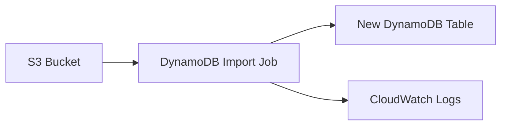

# How to Import Data from S3 to DynamoDB

Author: [nawazdhandala](https://github.com/nawazdhandala)

Tags: AWS, DynamoDB, S3, Data Migration, Serverless

Description: Learn how to import data from Amazon S3 into DynamoDB using the native import feature, AWS Data Pipeline, and custom Lambda-based solutions for bulk data loading.

---

Moving data from S3 into DynamoDB is something you'll run into sooner or later. Maybe you've got a CSV export from another system, a JSON dump from a migration, or you're setting up a data pipeline that needs to hydrate a DynamoDB table regularly. Whatever the reason, there are several approaches - and picking the right one depends on your data size, format, and how often you need to do it.

Let's walk through the main methods and when each one makes sense.

## The Native DynamoDB Import from S3 Feature

AWS introduced a native import feature for DynamoDB that lets you load data directly from S3 without writing a single line of code. It's the simplest option by far and handles tables up to several terabytes.

Here's how it works at a high level:



The import feature creates a brand-new table from the data in S3. You can't import into an existing table with this method - that's an important limitation to keep in mind.

### Setting Up the Import via AWS CLI

Before running the import, make sure your data is in one of the supported formats: DynamoDB JSON, standard JSON, or CSV. Here's how to kick off an import using the CLI.

```bash
# Start a DynamoDB import from S3
# The table will be created automatically with the specified key schema
aws dynamodb import-table \
  --s3-bucket-source S3Bucket=my-data-bucket,S3KeyPrefix=exports/users/ \
  --input-format CSV \
  --input-format-options '{"Delimiter": ",", "HeaderList": ["user_id", "email", "name", "created_at"]}' \
  --table-creation-parameters '{
    "TableName": "Users",
    "KeySchema": [{"AttributeName": "user_id", "KeyType": "HASH"}],
    "AttributeDefinitions": [{"AttributeName": "user_id", "AttributeType": "S"}],
    "BillingMode": "PAY_PER_REQUEST"
  }'
```

You can check the status of the import with this command.

```bash
# Check the import status using the ARN returned from the previous command
aws dynamodb describe-import \
  --import-arn arn:aws:dynamodb:us-east-1:123456789012:table/Users/import/01234567890123
```

### Preparing CSV Data in S3

Your CSV files need to be properly formatted. Each row becomes one DynamoDB item. Here's a sample CSV that would work with the import above.

```csv
user_id,email,name,created_at
u-001,alice@example.com,Alice Johnson,2025-01-15
u-002,bob@example.com,Bob Smith,2025-02-20
u-003,carol@example.com,Carol Williams,2025-03-10
```

One thing to watch out for: the import job reads every file under the specified S3 prefix. If you've got other files in that path, move them out first or use a dedicated prefix.

## Using AWS Lambda for Custom Imports

When you need to import into an existing table, or when you need to transform data during the import, a Lambda-based approach gives you the most flexibility. You can process files as they land in S3 using an S3 event trigger.

Here's a Lambda function that reads a JSON file from S3 and batch-writes to DynamoDB.

```python
import json
import boto3

# Initialize clients outside the handler for connection reuse
s3_client = boto3.client('s3')
dynamodb = boto3.resource('dynamodb')
table = dynamodb.Table('Users')

def handler(event, context):
    # Extract bucket and key from the S3 event notification
    bucket = event['Records'][0]['s3']['bucket']['name']
    key = event['Records'][0]['s3']['object']['key']

    # Download and parse the JSON file from S3
    response = s3_client.get_object(Bucket=bucket, Key=key)
    data = json.loads(response['Body'].read().decode('utf-8'))

    # Use batch_writer for efficient bulk writes
    # It automatically handles batching into groups of 25
    with table.batch_writer() as batch:
        for item in data:
            batch.put_item(Item=item)

    return {
        'statusCode': 200,
        'body': f'Imported {len(data)} items from {key}'
    }
```

The `batch_writer` is doing heavy lifting here. It automatically chunks your writes into batches of 25 (DynamoDB's limit per BatchWriteItem call) and handles retries for unprocessed items.

### Handling Large Files with Chunked Processing

For files larger than what Lambda can handle in a single invocation (remember the 15-minute timeout), you'll want to split the work. A Step Functions workflow can orchestrate multiple Lambda invocations.

```python
import json
import boto3

s3_client = boto3.client('s3')
dynamodb = boto3.resource('dynamodb')

def handler(event, context):
    bucket = event['bucket']
    key = event['key']
    start_byte = event.get('start_byte', 0)
    chunk_size = event.get('chunk_size', 50 * 1024 * 1024)  # 50MB chunks

    # Read a specific byte range from S3
    byte_range = f'bytes={start_byte}-{start_byte + chunk_size - 1}'
    response = s3_client.get_object(
        Bucket=bucket,
        Key=key,
        Range=byte_range
    )

    content = response['Body'].read().decode('utf-8')

    # Parse lines (assuming newline-delimited JSON)
    table = dynamodb.Table(event['table_name'])
    items_written = 0

    with table.batch_writer() as batch:
        for line in content.strip().split('\n'):
            if line:
                item = json.loads(line)
                batch.put_item(Item=item)
                items_written += 1

    return {
        'items_written': items_written,
        'next_byte': start_byte + chunk_size
    }
```

## Using AWS Glue for Complex Transformations

If your data needs heavy transformation - joining multiple files, type conversions, deduplication - AWS Glue is a solid choice. It gives you a Spark environment where you can wrangle data before writing to DynamoDB.

```python
import sys
from awsglue.transforms import *
from awsglue.utils import getResolvedOptions
from awsglue.context import GlueContext
from pyspark.context import SparkContext

# Initialize Glue context
sc = SparkContext()
glueContext = GlueContext(sc)

# Read data from S3 - Glue handles schema inference automatically
datasource = glueContext.create_dynamic_frame.from_options(
    connection_type="s3",
    connection_options={"paths": ["s3://my-data-bucket/exports/users/"]},
    format="csv",
    format_options={"withHeader": True}
)

# Apply any transformations you need
# This example maps CSV column names to DynamoDB attribute names
mapped = ApplyMapping.apply(
    frame=datasource,
    mappings=[
        ("user_id", "string", "user_id", "string"),
        ("email", "string", "email", "string"),
        ("name", "string", "full_name", "string"),
        ("created_at", "string", "created_at", "string")
    ]
)

# Write directly to DynamoDB
glueContext.write_dynamic_frame_from_options(
    frame=mapped,
    connection_type="dynamodb",
    connection_options={"dynamodb.output.tableName": "Users"}
)
```

## Performance Tips and Cost Considerations

No matter which approach you use, there are a few things to keep in mind for performance and cost.

**Provisioned capacity vs on-demand**: If you're doing a one-time bulk import, switch the table to on-demand billing mode first. This avoids throttling and you won't have to guess the right provisioned capacity. You can always switch back afterward.

**The native import feature doesn't consume write capacity**: This is a big deal. The S3 import feature creates the table offline and doesn't use your WCU allocation at all. For large datasets, this can save significant money.

**Compression matters**: The native import supports gzip-compressed files. Compressing your S3 data before importing reduces transfer time and storage costs.

```bash
# Compress your data files before uploading to S3
gzip users-export.csv
aws s3 cp users-export.csv.gz s3://my-data-bucket/exports/users/
```

**Monitor your imports**: Whichever approach you use, keep an eye on CloudWatch metrics. For Lambda-based imports, watch for throttling on the DynamoDB side. For the native import, check the import job status periodically.

For more on DynamoDB monitoring, check out our guide on [monitoring DynamoDB with CloudWatch alarms](https://oneuptime.com/blog/post/2026-02-12-monitor-dynamodb-with-cloudwatch-alarms/view).

## Which Method Should You Pick?

Here's the quick decision guide:

- **Native import**: Best for creating new tables from S3 data. No code required, handles terabytes, doesn't consume WCUs.
- **Lambda + batch_writer**: Best for importing into existing tables, small to medium datasets, or when you need S3 event triggers.
- **Glue**: Best for complex transformations, joining multiple data sources, or recurring ETL jobs.
- **Step Functions + Lambda**: Best for very large files that need chunked processing with existing tables.

Pick the simplest approach that meets your requirements. The native import feature covers most use cases now, so start there unless you have a specific reason to go custom.
