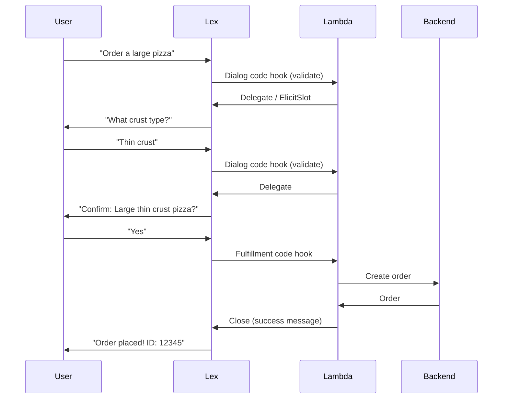

# How to Integrate Amazon Lex with Lambda for Fulfillment

Author: [nawazdhandala](https://github.com/nawazdhandala)

Tags: AWS, Amazon Lex, Lambda, Serverless, Chatbot

Description: Step-by-step guide to connecting Amazon Lex with AWS Lambda functions for dialog validation and order fulfillment in your chatbot.

---

A chatbot that can understand what you're saying but can't actually do anything about it isn't very useful. That's where Lambda fulfillment comes in. Amazon Lex handles the conversation - understanding intents, collecting slots, managing the dialog flow - but when it's time to actually process an order, look something up, or make a change, you need Lambda.

This guide covers everything you need to know about wiring up Lambda functions to your Lex bots. We'll handle both dialog code hooks (validation during the conversation) and fulfillment code hooks (processing after the conversation is complete).

## How Lex and Lambda Work Together

There are two points where Lambda can get involved in a Lex conversation:

1. **Dialog code hook** - Called after each turn of the conversation. Use this for slot validation, dynamic prompts, or conditional logic during the dialog.
2. **Fulfillment code hook** - Called when all required slots are filled and the user has confirmed (if confirmation is enabled). This is where your business logic lives.



## Setting Up the Lambda Function

Let's create a Lambda function that handles both hooks for a pizza ordering bot. Start by creating the function in the AWS console or via CLI.

Using the CLI:

```bash
# Create an IAM role for the Lambda function
aws iam create-role \
  --role-name LexFulfillmentRole \
  --assume-role-policy-document '{
    "Version": "2012-10-17",
    "Statement": [{
      "Effect": "Allow",
      "Principal": {"Service": "lambda.amazonaws.com"},
      "Action": "sts:AssumeRole"
    }]
  }'

# Attach the basic execution policy
aws iam attach-role-policy \
  --role-name LexFulfillmentRole \
  --policy-arn arn:aws:iam::aws:policy/service-role/AWSLambdaBasicExecutionRole
```

Now create the Lambda function itself:

```bash
# Create the Lambda function for Lex fulfillment
aws lambda create-function \
  --function-name PizzaOrderBot \
  --runtime python3.12 \
  --role arn:aws:iam::YOUR_ACCOUNT_ID:role/LexFulfillmentRole \
  --handler lambda_function.lambda_handler \
  --zip-file fileb://function.zip
```

## The Lambda Event Structure

When Lex invokes your Lambda function, it sends an event with this structure:

```json
// Example Lex V2 event sent to Lambda
{
  "messageVersion": "1.0",
  "invocationSource": "DialogCodeHook",
  "inputMode": "Text",
  "responseContentType": "text/plain",
  "sessionId": "session-123",
  "bot": {
    "id": "BOTID123",
    "name": "PizzaBot",
    "aliasId": "TSTALIASID",
    "localeId": "en_US",
    "version": "DRAFT"
  },
  "sessionState": {
    "intent": {
      "name": "OrderPizza",
      "slots": {
        "PizzaSize": {
          "value": {
            "originalValue": "large",
            "interpretedValue": "large",
            "resolvedValues": ["large"]
          }
        },
        "CrustType": null
      },
      "state": "InProgress",
      "confirmationState": "None"
    }
  },
  "inputTranscript": "I want a large pizza"
}
```

The key fields are `invocationSource` (tells you which hook called this), `sessionState.intent.slots` (current slot values), and `sessionState.intent.confirmationState`.

## Building the Handler

Here's a complete Lambda function that handles both dialog validation and fulfillment:

```python
# Complete Lambda handler for Lex pizza ordering bot
import json
import logging

logger = logging.getLogger()
logger.setLevel(logging.INFO)

# Valid pizza options
VALID_SIZES = ['small', 'medium', 'large', 'extra large']
VALID_CRUSTS = ['thin', 'thick', 'stuffed', 'gluten free']
VALID_TOPPINGS = ['pepperoni', 'mushroom', 'onion', 'sausage', 'bacon',
                   'olive', 'pepper', 'pineapple', 'cheese']


def get_slot_value(slots, slot_name):
    """Safely extract the interpreted value from a slot."""
    slot = slots.get(slot_name)
    if slot and slot.get('value'):
        return slot['value'].get('interpretedValue')
    return None


def elicit_slot(intent, slot_to_elicit, message):
    """Return a response that asks the user for a specific slot."""
    return {
        'sessionState': {
            'dialogAction': {
                'type': 'ElicitSlot',
                'slotToElicit': slot_to_elicit
            },
            'intent': intent
        },
        'messages': [{
            'contentType': 'PlainText',
            'content': message
        }]
    }


def delegate(intent):
    """Hand control back to Lex to continue the dialog."""
    return {
        'sessionState': {
            'dialogAction': {
                'type': 'Delegate'
            },
            'intent': intent
        }
    }


def close(intent, message, state='Fulfilled'):
    """Close the conversation with a final message."""
    intent['state'] = state
    return {
        'sessionState': {
            'dialogAction': {
                'type': 'Close'
            },
            'intent': intent
        },
        'messages': [{
            'contentType': 'PlainText',
            'content': message
        }]
    }


def validate_order(slots):
    """Validate pizza order slot values. Returns (is_valid, slot_name, message)."""
    size = get_slot_value(slots, 'PizzaSize')
    if size and size.lower() not in VALID_SIZES:
        return False, 'PizzaSize', f"Sorry, {size} isn't a valid size. Choose from: {', '.join(VALID_SIZES)}"

    crust = get_slot_value(slots, 'CrustType')
    if crust and crust.lower() not in VALID_CRUSTS:
        return False, 'CrustType', f"We don't have {crust} crust. Options are: {', '.join(VALID_CRUSTS)}"

    return True, None, None


def handle_dialog(event):
    """Handle dialog code hook - validate slots during conversation."""
    intent = event['sessionState']['intent']
    slots = intent['slots']

    is_valid, invalid_slot, message = validate_order(slots)

    if not is_valid:
        # Clear the invalid slot and re-elicit
        slots[invalid_slot] = None
        return elicit_slot(intent, invalid_slot, message)

    return delegate(intent)


def handle_fulfillment(event):
    """Handle fulfillment - process the completed order."""
    intent = event['sessionState']['intent']
    slots = intent['slots']

    size = get_slot_value(slots, 'PizzaSize')
    crust = get_slot_value(slots, 'CrustType')

    # Here you'd typically save to a database or call an API
    order_id = "PZA-" + event['sessionId'][-6:]

    logger.info(f"Order placed: {size} {crust} pizza, ID: {order_id}")

    return close(
        intent,
        f"Your {size} pizza with {crust} crust has been ordered! "
        f"Order ID: {order_id}. It'll be ready in about 30 minutes."
    )


def lambda_handler(event, context):
    """Main entry point for the Lambda function."""
    logger.info(f"Event: {json.dumps(event)}")

    invocation_source = event.get('invocationSource')

    if invocation_source == 'DialogCodeHook':
        return handle_dialog(event)
    elif invocation_source == 'FulfillmentCodeHook':
        return handle_fulfillment(event)
    else:
        raise ValueError(f"Unknown invocation source: {invocation_source}")
```

## Connecting Lambda to Your Lex Bot

You need to give Lex permission to invoke your Lambda function:

```bash
# Grant Lex permission to invoke the Lambda function
aws lambda add-permission \
  --function-name PizzaOrderBot \
  --statement-id lex-invoke \
  --action lambda:InvokeFunction \
  --principal lexv2.amazonaws.com \
  --source-arn "arn:aws:lex:us-east-1:YOUR_ACCOUNT_ID:bot-alias/BOTID/ALIASID"
```

Then in the Lex console, go to your intent's settings:

1. Under "Code hooks," enable "Use a Lambda function for initialization and validation" (dialog code hook)
2. Under "Fulfillment," enable "Active" and select your Lambda function

Alternatively, use the CLI:

```bash
# Update the intent to use Lambda for dialog and fulfillment hooks
aws lexv2-models update-intent \
  --bot-id YOUR_BOT_ID \
  --bot-version DRAFT \
  --locale-id en_US \
  --intent-id YOUR_INTENT_ID \
  --intent-name OrderPizza \
  --dialog-code-hook '{"enabled": true}' \
  --fulfillment-code-hook '{"enabled": true}'
```

You also need to set the Lambda function at the bot alias level:

```bash
# Associate the Lambda function with the bot alias
aws lexv2-models update-bot-alias \
  --bot-id YOUR_BOT_ID \
  --bot-alias-id YOUR_ALIAS_ID \
  --bot-alias-name "TestAlias" \
  --bot-alias-locale-settings '{
    "en_US": {
      "enabled": true,
      "codeHookSpecification": {
        "lambdaCodeHook": {
          "lambdaARN": "arn:aws:lambda:us-east-1:YOUR_ACCOUNT_ID:function:PizzaOrderBot",
          "codeHookInterfaceVersion": "1.0"
        }
      }
    }
  }'
```

## Handling Multiple Intents

If your bot has several intents, your Lambda function needs to route between them:

```python
# Route different intents to their respective handlers
def lambda_handler(event, context):
    intent_name = event['sessionState']['intent']['name']
    invocation_source = event['invocationSource']

    handlers = {
        'OrderPizza': {
            'DialogCodeHook': handle_pizza_dialog,
            'FulfillmentCodeHook': handle_pizza_fulfillment
        },
        'CheckOrderStatus': {
            'DialogCodeHook': handle_status_dialog,
            'FulfillmentCodeHook': handle_status_fulfillment
        },
        'CancelOrder': {
            'DialogCodeHook': handle_cancel_dialog,
            'FulfillmentCodeHook': handle_cancel_fulfillment
        }
    }

    handler = handlers.get(intent_name, {}).get(invocation_source)

    if handler:
        return handler(event)

    # Default: delegate to Lex
    return delegate(event['sessionState']['intent'])
```

## Session Attributes

Sometimes you need to pass data between turns of the conversation. Session attributes let you do this:

```python
# Using session attributes to track conversation state
def handle_dialog(event):
    intent = event['sessionState']['intent']
    session_attrs = event['sessionState'].get('sessionAttributes', {})

    # Track how many times the user has changed their mind
    changes = int(session_attrs.get('slotChanges', '0'))

    if changes > 3:
        return close(
            intent,
            "It seems like you're having trouble deciding. "
            "Feel free to come back when you're ready!",
            state='Failed'
        )

    session_attrs['slotChanges'] = str(changes + 1)

    response = delegate(intent)
    response['sessionState']['sessionAttributes'] = session_attrs
    return response
```

## Error Handling

Always add proper error handling. If your Lambda function throws an unhandled exception, Lex will show a generic error to the user.

```python
# Wrap handler with error handling
def lambda_handler(event, context):
    try:
        invocation_source = event['invocationSource']
        if invocation_source == 'DialogCodeHook':
            return handle_dialog(event)
        elif invocation_source == 'FulfillmentCodeHook':
            return handle_fulfillment(event)
    except Exception as e:
        logger.error(f"Error: {str(e)}", exc_info=True)
        return close(
            event['sessionState']['intent'],
            "I'm sorry, something went wrong on our end. Please try again later.",
            state='Failed'
        )
```

## Testing the Integration

After connecting everything, rebuild your bot and test. In the Lex test window, try:

1. A normal flow - provide all valid inputs
2. Invalid inputs - see if validation catches them
3. Edge cases - what happens if the user changes their mind halfway through

Check your Lambda function's CloudWatch logs for debugging. Every invocation is logged there, and you can see the full event payload and any errors.

For production bots, set up proper monitoring. Track Lambda invocation errors, Lex missed utterances, and conversation completion rates. Tools like [OneUptime](https://oneuptime.com/blog/post/2026-02-12-use-amazon-devops-guru-for-operational-insights/view) can help you monitor the full stack from Lex through Lambda to your backend services.

## Wrapping Up

Lambda fulfillment is what turns your Lex bot from a conversation demo into a real product. The pattern is straightforward - validate during dialog, process during fulfillment, handle errors gracefully. Once you've got this working, you can build increasingly complex bots that integrate with databases, APIs, and other AWS services.

If you haven't set up your intents and slots yet, check out our guide on [configuring Amazon Lex intents and slots](https://oneuptime.com/blog/post/2026-02-12-configure-amazon-lex-intents-and-slots/view) to get the foundation right before adding Lambda.
