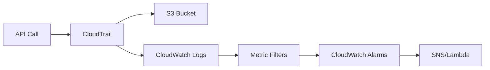

# How to Integrate CloudTrail with CloudWatch Logs

Author: [nawazdhandala](https://github.com/nawazdhandala)

Tags: AWS, CloudTrail, CloudWatch, Monitoring, Security

Description: Learn how to send CloudTrail events to CloudWatch Logs for real-time monitoring, metric filters, and automated alerting on API activity in your AWS accounts.

---

CloudTrail logs are great for after-the-fact investigations, but they've got a problem - they're delivered to S3 with a delay of up to 15 minutes. When someone deletes a production database or creates a new IAM admin user, you don't want to find out 15 minutes later. You want to know right now.

That's where the CloudTrail-to-CloudWatch Logs integration comes in. It streams your CloudTrail events to a CloudWatch log group in near real-time, which means you can set up metric filters, alarms, and automated responses that trigger within seconds of an event occurring.

## How It Works

The flow is straightforward:



CloudTrail delivers events to both S3 and CloudWatch Logs simultaneously. The S3 delivery is for long-term storage and querying. The CloudWatch Logs delivery is for real-time monitoring.

## Setting Up the IAM Role

CloudTrail needs permission to write to CloudWatch Logs. You'll create an IAM role that CloudTrail assumes.

First, create the trust policy.

```json
{
  "Version": "2012-10-17",
  "Statement": [
    {
      "Effect": "Allow",
      "Principal": {
        "Service": "cloudtrail.amazonaws.com"
      },
      "Action": "sts:AssumeRole"
    }
  ]
}
```

Save that as `trust-policy.json` and create the role.

```bash
# Create the IAM role for CloudTrail
aws iam create-role \
  --role-name CloudTrailToCloudWatch \
  --assume-role-policy-document file://trust-policy.json
```

Now attach the permissions policy. CloudTrail needs to create log streams and put log events.

```json
{
  "Version": "2012-10-17",
  "Statement": [
    {
      "Effect": "Allow",
      "Action": [
        "logs:CreateLogStream",
        "logs:PutLogEvents"
      ],
      "Resource": [
        "arn:aws:logs:us-east-1:111111111111:log-group:CloudTrail/DefaultLogGroup:log-stream:111111111111_CloudTrail_us-east-1*"
      ]
    }
  ]
}
```

```bash
# Attach the CloudWatch Logs permissions
aws iam put-role-policy \
  --role-name CloudTrailToCloudWatch \
  --policy-name CloudTrailCloudWatchPolicy \
  --policy-document file://cloudwatch-policy.json
```

## Creating the Log Group

Create a CloudWatch log group to receive the events. Set a retention period so you're not paying to store these logs forever - the long-term copy lives in S3 anyway.

```bash
# Create the log group
aws logs create-log-group \
  --log-group-name CloudTrail/DefaultLogGroup

# Set 90-day retention (adjust as needed)
aws logs put-retention-policy \
  --log-group-name CloudTrail/DefaultLogGroup \
  --retention-in-days 90
```

## Configuring the Trail

Now update your trail to send events to CloudWatch Logs.

```bash
# Update the trail with CloudWatch Logs configuration
aws cloudtrail update-trail \
  --name my-trail \
  --cloud-watch-logs-log-group-arn arn:aws:logs:us-east-1:111111111111:log-group:CloudTrail/DefaultLogGroup:* \
  --cloud-watch-logs-role-arn arn:aws:iam::111111111111:role/CloudTrailToCloudWatch
```

Give it a few minutes, then verify events are flowing.

```bash
# Check for recent log streams
aws logs describe-log-streams \
  --log-group-name CloudTrail/DefaultLogGroup \
  --order-by LastEventTime \
  --descending \
  --limit 5
```

## Terraform Setup

If you're managing infrastructure as code, here's the complete Terraform configuration.

```hcl
# CloudWatch Log Group
resource "aws_cloudwatch_log_group" "cloudtrail" {
  name              = "CloudTrail/DefaultLogGroup"
  retention_in_days = 90
}

# IAM Role for CloudTrail
resource "aws_iam_role" "cloudtrail_cloudwatch" {
  name = "CloudTrailToCloudWatch"

  assume_role_policy = jsonencode({
    Version = "2012-10-17"
    Statement = [{
      Effect = "Allow"
      Principal = {
        Service = "cloudtrail.amazonaws.com"
      }
      Action = "sts:AssumeRole"
    }]
  })
}

resource "aws_iam_role_policy" "cloudtrail_cloudwatch" {
  name = "CloudTrailCloudWatchPolicy"
  role = aws_iam_role.cloudtrail_cloudwatch.id

  policy = jsonencode({
    Version = "2012-10-17"
    Statement = [{
      Effect   = "Allow"
      Action   = ["logs:CreateLogStream", "logs:PutLogEvents"]
      Resource = "${aws_cloudwatch_log_group.cloudtrail.arn}:*"
    }]
  })
}

# Trail with CloudWatch Logs integration
resource "aws_cloudtrail" "main" {
  name                          = "main-trail"
  s3_bucket_name                = aws_s3_bucket.cloudtrail.id
  is_multi_region_trail         = true
  enable_log_file_validation    = true
  include_global_service_events = true

  cloud_watch_logs_group_arn = "${aws_cloudwatch_log_group.cloudtrail.arn}:*"
  cloud_watch_logs_role_arn  = aws_iam_role.cloudtrail_cloudwatch.arn
}
```

## Setting Up Metric Filters

This is where the integration really pays off. Metric filters let you watch for specific patterns in your CloudTrail events and create CloudWatch metrics from them.

### Detect Root Account Usage

Root account activity should trigger an immediate alert.

```bash
# Create a metric filter for root account usage
aws logs put-metric-filter \
  --log-group-name CloudTrail/DefaultLogGroup \
  --filter-name RootAccountUsage \
  --filter-pattern '{ $.userIdentity.type = "Root" && $.userIdentity.invokedBy NOT EXISTS && $.eventType != "AwsServiceEvent" }' \
  --metric-transformations \
    metricName=RootAccountUsageCount,metricNamespace=CloudTrailMetrics,metricValue=1,defaultValue=0
```

### Detect Console Logins Without MFA

```bash
# Metric filter for console logins without MFA
aws logs put-metric-filter \
  --log-group-name CloudTrail/DefaultLogGroup \
  --filter-name ConsoleLoginWithoutMFA \
  --filter-pattern '{ $.eventName = "ConsoleLogin" && $.additionalEventData.MFAUsed != "Yes" && $.responseElements.ConsoleLogin = "Success" }' \
  --metric-transformations \
    metricName=ConsoleLoginWithoutMFA,metricNamespace=CloudTrailMetrics,metricValue=1,defaultValue=0
```

### Detect IAM Policy Changes

```bash
# Metric filter for IAM policy modifications
aws logs put-metric-filter \
  --log-group-name CloudTrail/DefaultLogGroup \
  --filter-name IAMPolicyChanges \
  --filter-pattern '{ ($.eventName = "DeleteGroupPolicy") || ($.eventName = "DeleteRolePolicy") || ($.eventName = "DeleteUserPolicy") || ($.eventName = "PutGroupPolicy") || ($.eventName = "PutRolePolicy") || ($.eventName = "PutUserPolicy") || ($.eventName = "CreatePolicy") || ($.eventName = "DeletePolicy") || ($.eventName = "AttachRolePolicy") || ($.eventName = "DetachRolePolicy") || ($.eventName = "AttachUserPolicy") || ($.eventName = "DetachUserPolicy") || ($.eventName = "AttachGroupPolicy") || ($.eventName = "DetachGroupPolicy") }' \
  --metric-transformations \
    metricName=IAMPolicyChanges,metricNamespace=CloudTrailMetrics,metricValue=1,defaultValue=0
```

### Detect Security Group Changes

```bash
# Metric filter for security group modifications
aws logs put-metric-filter \
  --log-group-name CloudTrail/DefaultLogGroup \
  --filter-name SecurityGroupChanges \
  --filter-pattern '{ ($.eventName = "AuthorizeSecurityGroupIngress") || ($.eventName = "AuthorizeSecurityGroupEgress") || ($.eventName = "RevokeSecurityGroupIngress") || ($.eventName = "RevokeSecurityGroupEgress") || ($.eventName = "CreateSecurityGroup") || ($.eventName = "DeleteSecurityGroup") }' \
  --metric-transformations \
    metricName=SecurityGroupChanges,metricNamespace=CloudTrailMetrics,metricValue=1,defaultValue=0
```

## Creating CloudWatch Alarms

Once you've got metric filters, create alarms that fire when the metrics exceed a threshold.

```bash
# Alarm for any root account usage
aws cloudwatch put-metric-alarm \
  --alarm-name RootAccountUsage \
  --metric-name RootAccountUsageCount \
  --namespace CloudTrailMetrics \
  --statistic Sum \
  --period 300 \
  --threshold 1 \
  --comparison-operator GreaterThanOrEqualToThreshold \
  --evaluation-periods 1 \
  --alarm-actions arn:aws:sns:us-east-1:111111111111:security-alerts \
  --alarm-description "Alert when the root account is used"

# Alarm for console logins without MFA
aws cloudwatch put-metric-alarm \
  --alarm-name ConsoleLoginWithoutMFA \
  --metric-name ConsoleLoginWithoutMFA \
  --namespace CloudTrailMetrics \
  --statistic Sum \
  --period 300 \
  --threshold 1 \
  --comparison-operator GreaterThanOrEqualToThreshold \
  --evaluation-periods 1 \
  --alarm-actions arn:aws:sns:us-east-1:111111111111:security-alerts \
  --alarm-description "Alert on console login without MFA"
```

## Testing the Integration

To verify everything works end-to-end, perform an action that your metric filters should catch, then check for the metric.

```bash
# Wait a few minutes after performing a test action, then query
aws cloudwatch get-metric-statistics \
  --namespace CloudTrailMetrics \
  --metric-name SecurityGroupChanges \
  --start-time 2026-02-12T00:00:00Z \
  --end-time 2026-02-12T23:59:59Z \
  --period 3600 \
  --statistics Sum
```

## Cost Considerations

CloudWatch Logs charges for data ingestion and storage. CloudTrail can generate a lot of data, especially in busy accounts. A few tips to manage costs:

- Set a reasonable retention period (30-90 days is usually enough for real-time monitoring)
- Use metric filters selectively rather than trying to filter everything
- The S3 logs are your long-term archive - CloudWatch Logs are just for real-time alerts
- Consider using [CloudTrail Insights](https://oneuptime.com/blog/post/2026-02-12-cloudtrail-insights-anomaly-detection/view) for anomaly detection instead of building complex metric filters for every possible scenario

## Next Steps

With CloudTrail streaming to CloudWatch Logs, you've got the foundation for real-time security monitoring. To build on this, check out [setting up alerts for specific CloudTrail events](https://oneuptime.com/blog/post/2026-02-12-alerts-specific-cloudtrail-events/view) for more detailed alerting patterns, and consider [enabling GuardDuty](https://oneuptime.com/blog/post/2026-02-12-enable-guardduty-threat-detection/view) which uses CloudTrail data (among other sources) for advanced threat detection.
