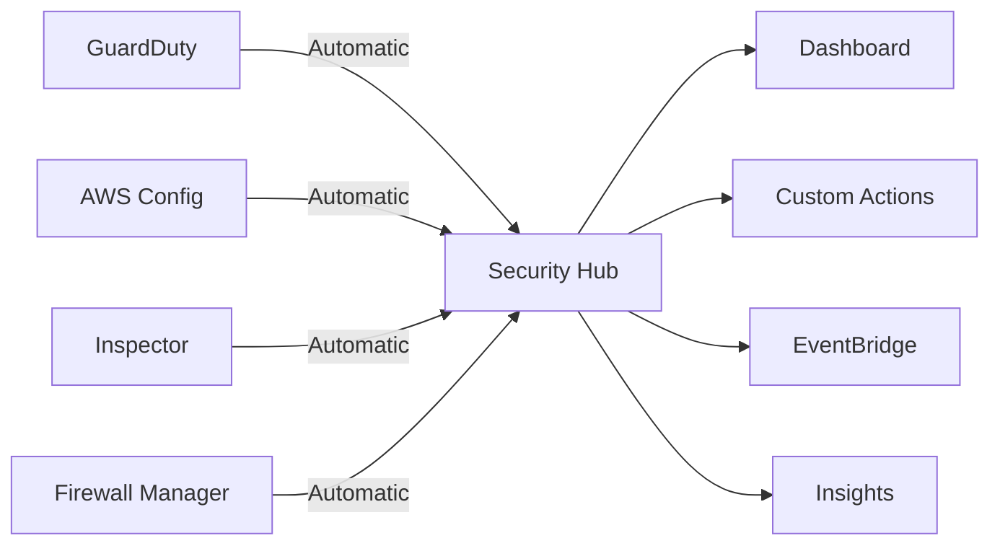

# How to Integrate GuardDuty with Security Hub

Author: [nawazdhandala](https://github.com/nawazdhandala)

Tags: AWS, GuardDuty, Security Hub, Integration, Security

Description: Learn how to integrate Amazon GuardDuty with AWS Security Hub to centralize threat detection findings alongside compliance data for unified security visibility.

---

GuardDuty finds threats. Config finds compliance violations. Inspector finds vulnerabilities. Firewall Manager flags policy issues. Each service has its own console, its own finding format, and its own notification mechanism. If your security team has to check five different dashboards, they're going to miss things.

AWS Security Hub solves this by pulling findings from all these services into a single place with a normalized format called AWS Security Finding Format (ASFF). The GuardDuty integration is one of the most important because threat detection findings are the ones that need the fastest response.

## Why Integrate GuardDuty with Security Hub

Without integration, you're managing GuardDuty findings in the GuardDuty console and everything else in Security Hub. That means two dashboards, two sets of notifications, and two workflows. By sending GuardDuty findings to Security Hub, you get:

- **Single pane of glass** - All security findings in one dashboard
- **Normalized format** - GuardDuty findings converted to ASFF so they can be correlated with findings from other services
- **Custom insights** - Build aggregated views that combine GuardDuty findings with Config or Inspector data
- **Automated workflows** - Use Security Hub custom actions to trigger remediation
- **Cross-account visibility** - If you've set up Security Hub aggregation, GuardDuty findings from all accounts appear in one place

## Prerequisites

Both services need to be enabled first:

1. [Enable GuardDuty](https://oneuptime.com/blog/post/2026-02-12-enable-guardduty-threat-detection/view) in your account
2. [Enable Security Hub](https://oneuptime.com/blog/post/2026-02-12-enable-aws-security-hub/view) in the same account and region

## Enabling the Integration

The integration is enabled by default when both services are active in the same account and region. But if it's been disabled or you want to verify, here's how to check and enable it.

```bash
# Check which product integrations are enabled in Security Hub
aws securityhub list-enabled-products-for-import \
  --query 'ProductSubscriptions[?contains(@, `guardduty`)]'
```

If GuardDuty isn't in the list, enable the integration.

```bash
# Enable GuardDuty integration with Security Hub
aws securityhub enable-import-findings-for-product \
  --product-arn "arn:aws:securityhub:us-east-1::product/aws/guardduty"
```

You can also disable it if needed (though I wouldn't recommend it).

```bash
# Disable the integration (not recommended)
aws securityhub disable-import-findings-for-product \
  --product-subscription-arn "arn:aws:securityhub:us-east-1:111111111111:product-subscription/aws/guardduty"
```

## How Findings Flow

Once integrated, the flow looks like this:



GuardDuty findings are automatically imported into Security Hub within minutes of being generated. Each GuardDuty finding becomes a Security Hub finding with a standardized format that includes:

- Severity normalized to a 0-100 scale
- Resource details in a consistent format
- Workflow status (NEW, NOTIFIED, SUPPRESSED, RESOLVED)
- Product-specific fields under `ProductFields`

## Viewing GuardDuty Findings in Security Hub

Once the integration is active, GuardDuty findings appear in the Security Hub findings list. You can filter specifically for GuardDuty findings.

```bash
# Get all GuardDuty findings in Security Hub
aws securityhub get-findings \
  --filters '{
    "ProductName": [{"Value": "GuardDuty", "Comparison": "EQUALS"}]
  }' \
  --max-items 10

# Get high-severity GuardDuty findings
aws securityhub get-findings \
  --filters '{
    "ProductName": [{"Value": "GuardDuty", "Comparison": "EQUALS"}],
    "SeverityLabel": [{"Value": "HIGH", "Comparison": "EQUALS"}]
  }'

# Get GuardDuty findings for a specific account
aws securityhub get-findings \
  --filters '{
    "ProductName": [{"Value": "GuardDuty", "Comparison": "EQUALS"}],
    "AwsAccountId": [{"Value": "222222222222", "Comparison": "EQUALS"}]
  }'
```

## Creating Security Hub Insights for GuardDuty

Insights are saved filters that give you aggregated views of your findings. Here are some useful GuardDuty-specific insights.

### Most Active Threat Types

```bash
aws securityhub create-insight \
  --name "Top GuardDuty Finding Types" \
  --filters '{
    "ProductName": [{"Value": "GuardDuty", "Comparison": "EQUALS"}],
    "WorkflowStatus": [{"Value": "NEW", "Comparison": "EQUALS"}]
  }' \
  --group-by-attribute "Type"
```

### Accounts with Most GuardDuty Findings

```bash
aws securityhub create-insight \
  --name "Accounts with Most GuardDuty Findings" \
  --filters '{
    "ProductName": [{"Value": "GuardDuty", "Comparison": "EQUALS"}],
    "SeverityLabel": [
      {"Value": "HIGH", "Comparison": "EQUALS"},
      {"Value": "CRITICAL", "Comparison": "EQUALS"}
    ]
  }' \
  --group-by-attribute "AwsAccountId"
```

### GuardDuty Findings by Region

```bash
aws securityhub create-insight \
  --name "GuardDuty Findings by Region" \
  --filters '{
    "ProductName": [{"Value": "GuardDuty", "Comparison": "EQUALS"}],
    "RecordState": [{"Value": "ACTIVE", "Comparison": "EQUALS"}]
  }' \
  --group-by-attribute "Region"
```

## Setting Up Automated Workflows

Security Hub custom actions let you trigger automated responses to findings. Create a custom action, then link it to a Lambda function via EventBridge.

```bash
# Create a custom action for isolating compromised instances
aws securityhub create-action-target \
  --name "IsolateInstance" \
  --description "Isolate a compromised EC2 instance by removing its security groups" \
  --id "IsolateInstance"
```

Now create an EventBridge rule that triggers when this custom action is used.

```bash
aws events put-rule \
  --name security-hub-isolate-instance \
  --event-pattern '{
    "source": ["aws.securityhub"],
    "detail-type": ["Security Hub Findings - Custom Action"],
    "detail": {
      "actionName": ["IsolateInstance"]
    }
  }'
```

Here's the Lambda function that performs the isolation.

```python
import boto3
import json

ec2 = boto3.client('ec2')

def handler(event, context):
    """Isolate an EC2 instance by replacing its security groups
    with a quarantine group that blocks all traffic."""

    findings = event['detail']['findings']

    for finding in findings:
        # Get the instance ID from the finding
        resources = finding.get('Resources', [])
        for resource in resources:
            if resource['Type'] == 'AwsEc2Instance':
                instance_id = resource['Id'].split('/')[-1]

                # Get the VPC ID for the instance
                response = ec2.describe_instances(InstanceIds=[instance_id])
                vpc_id = response['Reservations'][0]['Instances'][0]['VpcId']

                # Create or find the quarantine security group
                quarantine_sg = get_or_create_quarantine_sg(vpc_id)

                # Replace all security groups with the quarantine group
                ec2.modify_instance_attribute(
                    InstanceId=instance_id,
                    Groups=[quarantine_sg]
                )

                print(f"Isolated instance {instance_id} with quarantine SG {quarantine_sg}")

def get_or_create_quarantine_sg(vpc_id):
    """Get or create a quarantine security group with no rules."""
    try:
        response = ec2.describe_security_groups(
            Filters=[
                {'Name': 'group-name', 'Values': ['quarantine-isolated']},
                {'Name': 'vpc-id', 'Values': [vpc_id]}
            ]
        )
        if response['SecurityGroups']:
            return response['SecurityGroups'][0]['GroupId']
    except Exception:
        pass

    # Create the quarantine group
    response = ec2.create_security_group(
        GroupName='quarantine-isolated',
        Description='Quarantine SG for isolated instances - no inbound or outbound',
        VpcId=vpc_id
    )
    sg_id = response['GroupId']

    # Remove the default outbound rule
    ec2.revoke_security_group_egress(
        GroupId=sg_id,
        IpPermissions=[{
            'IpProtocol': '-1',
            'IpRanges': [{'CidrIp': '0.0.0.0/0'}]
        }]
    )

    return sg_id
```

## Terraform Configuration

```hcl
# Enable GuardDuty to Security Hub integration
resource "aws_securityhub_product_subscription" "guardduty" {
  product_arn = "arn:aws:securityhub:${data.aws_region.current.name}::product/aws/guardduty"
  depends_on  = [aws_securityhub_account.main]
}

# Custom action for instance isolation
resource "aws_securityhub_action_target" "isolate_instance" {
  name        = "IsolateInstance"
  identifier  = "IsolateInstance"
  description = "Isolate a compromised EC2 instance"
}
```

## Finding Correlation

One of the biggest advantages of the integration is correlating GuardDuty findings with other services. For example, you can create an insight that shows resources with both GuardDuty threats and Config compliance violations.

```bash
# Resources flagged by both GuardDuty and Config
aws securityhub get-findings \
  --filters '{
    "ResourceId": [{"Value": "i-0abc123def456", "Comparison": "EQUALS"}]
  }' \
  --sort-criteria '{
    "Field": "ProductName",
    "SortOrder": "asc"
  }'
```

This lets you ask questions like "Are the instances with security threats also the ones that are non-compliant?" - which often reveals systemic security issues.

## Updating Finding Status

As your team investigates findings, update their workflow status in Security Hub to track progress.

```bash
# Mark a finding as being investigated
aws securityhub batch-update-findings \
  --finding-identifiers '[{
    "Id": "arn:aws:guardduty:us-east-1:111111111111:detector/abc123/finding/def456",
    "ProductArn": "arn:aws:securityhub:us-east-1::product/aws/guardduty"
  }]' \
  --workflow '{"Status": "NOTIFIED"}' \
  --note '{"Text": "Assigned to security team for investigation", "UpdatedBy": "security-automation"}'
```

## What's Next

With GuardDuty and Security Hub integrated, you've got centralized threat visibility. Build on this by adding [Security Hub compliance standards](https://oneuptime.com/blog/post/2026-02-12-security-hub-compliance-standards-cis-pci/view) to track regulatory compliance alongside threats. For custom dashboards, create [Security Hub insights](https://oneuptime.com/blog/post/2026-02-12-custom-security-hub-insights/view). And for multi-account environments, set up [Security Hub finding aggregation](https://oneuptime.com/blog/post/2026-02-12-aggregate-security-hub-findings-across-accounts/view).
