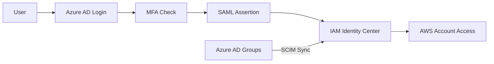

# How to Integrate IAM Identity Center with Azure AD

Author: [nawazdhandala](https://github.com/nawazdhandala)

Tags: AWS, IAM, Azure AD, SSO, Security

Description: Step-by-step guide to integrating AWS IAM Identity Center with Microsoft Azure Active Directory for federated single sign-on and automated user provisioning.

---

If your organization uses Azure AD (now called Microsoft Entra ID) for identity management, integrating it with AWS IAM Identity Center means your users can access AWS accounts using their existing Microsoft credentials. No separate AWS passwords, no duplicate accounts, and when someone leaves the company, disabling their Azure AD account automatically revokes their AWS access.

This guide covers the full integration - SAML federation for authentication and SCIM for automatic user provisioning.

## What You Get

After this integration:

- Users sign into AWS using their Azure AD credentials
- Azure AD MFA applies to AWS access automatically
- Users and groups sync automatically from Azure AD to Identity Center
- Disabling a user in Azure AD disables their AWS access
- Conditional Access policies from Azure AD apply to AWS logins



## Prerequisites

- AWS IAM Identity Center enabled (see our [setup guide](https://oneuptime.com/blog/post/set-up-aws-iam-identity-center-sso/view))
- Azure AD Premium P1 or P2 license (required for enterprise application provisioning)
- Global Administrator or Application Administrator role in Azure AD
- Admin access to the AWS management account

## Step 1: Add AWS IAM Identity Center as an Enterprise Application in Azure AD

1. Go to the Azure Portal > Azure Active Directory > Enterprise applications
2. Click "New application"
3. Search for "AWS IAM Identity Center" (it's in the gallery)
4. Click "Create"

This creates a placeholder application that you'll configure for SAML and SCIM.

## Step 2: Configure SAML Single Sign-On

In the Azure AD enterprise application:

1. Go to "Single sign-on" in the left menu
2. Select "SAML"
3. Edit the "Basic SAML Configuration":
   - **Identifier (Entity ID)**: `https://us-east-1.signin.aws.amazon.com/saml` (replace region)
   - **Reply URL (ACS URL)**: Get this from IAM Identity Center settings
   - **Sign on URL**: Your IAM Identity Center portal URL (e.g., `https://my-company.awsapps.com/start`)

4. Under "Attributes & Claims", configure:
   - Required claim: `Subject` -> `user.userprincipalname`
   - Add claim: `https://aws.amazon.com/SAML/Attributes/SessionDuration` -> `28800`

5. Download the **Federation Metadata XML** file from the SAML Signing Certificate section

## Step 3: Configure IAM Identity Center to Use Azure AD

In the AWS Console:

1. Go to IAM Identity Center > Settings
2. Click "Actions" > "Change identity source"
3. Select "External identity provider"
4. Download the IAM Identity Center SAML metadata file
5. Upload the Azure AD Federation Metadata XML you downloaded in Step 2
6. Copy the IAM Identity Center ACS URL and Issuer URL back to Azure AD

Update the Azure AD SAML configuration with these values:

```
# Values to copy from IAM Identity Center to Azure AD
ACS URL:    https://us-east-1.signin.aws.amazon.com/saml (from Identity Center)
Issuer:     https://us-east-1.signin.aws.amazon.com/saml (from Identity Center)
```

## Step 4: Test SAML Sign-On

Before setting up provisioning, verify that SAML authentication works:

1. In Azure AD, go to the enterprise application > Single sign-on
2. Click "Test this application"
3. Sign in with an Azure AD user
4. You should be redirected to the IAM Identity Center portal

If the test fails, check:
- The ACS URL matches exactly
- The Entity ID matches
- The SAML certificate hasn't expired
- Clock skew between Azure AD and AWS is minimal

## Step 5: Enable SCIM Provisioning

SCIM (System for Cross-domain Identity Management) automatically syncs users and groups from Azure AD to IAM Identity Center.

In IAM Identity Center:

1. Go to Settings > Identity source
2. Under "Automatic provisioning", click "Enable"
3. Copy the **SCIM endpoint** and **Access token**

In Azure AD:

1. Go to the enterprise application > Provisioning
2. Set Provisioning Mode to "Automatic"
3. Enter the SCIM endpoint as the "Tenant URL"
4. Enter the access token as the "Secret Token"
5. Click "Test Connection" to verify

Then configure the attribute mappings:

```
# Required attribute mappings for Azure AD to IAM Identity Center
Azure AD Attribute          -> IAM Identity Center Attribute
---------------------------------------------------------------
userPrincipalName          -> userName
Switch([IsSoftDeleted]...) -> active
displayName                -> displayName
surname                    -> name.familyName
givenName                  -> name.givenName
mail                       -> emails[type eq "work"].value
```

## Step 6: Configure Provisioning Scope

Decide which users and groups to sync:

1. In the enterprise application > Provisioning > Settings
2. Set "Scope" to "Sync only assigned users and groups"
3. Go to "Users and groups" in the enterprise application
4. Add the Azure AD groups you want to sync to AWS

This approach gives you explicit control over who gets AWS access. Only users in the assigned groups will be provisioned.

```bash
# After provisioning syncs, verify users exist in Identity Center
IDENTITY_STORE_ID=$(aws sso-admin list-instances \
  --query 'Instances[0].IdentityStoreId' --output text)

# List provisioned users
aws identitystore list-users \
  --identity-store-id "$IDENTITY_STORE_ID" \
  --query 'Users[*].{Name:DisplayName,Username:UserName}' \
  --output table
```

## Step 7: Map Azure AD Groups to Permission Sets

Now assign the synced groups to AWS accounts with appropriate permissions:

```bash
SSO_INSTANCE_ARN=$(aws sso-admin list-instances \
  --query 'Instances[0].InstanceArn' --output text)

# Get the group ID for a synced Azure AD group
IDENTITY_STORE_ID=$(aws sso-admin list-instances \
  --query 'Instances[0].IdentityStoreId' --output text)

# List groups to find the synced group ID
aws identitystore list-groups \
  --identity-store-id "$IDENTITY_STORE_ID" \
  --query 'Groups[*].{Name:DisplayName,Id:GroupId}' \
  --output table

# Assign the synced group to an account with a permission set
aws sso-admin create-account-assignment \
  --instance-arn "$SSO_INSTANCE_ARN" \
  --target-id "111111111111" \
  --target-type AWS_ACCOUNT \
  --permission-set-arn "arn:aws:sso:::permissionSet/ssoins-xxx/ps-yyy" \
  --principal-type GROUP \
  --principal-id "synced-group-id"
```

## Step 8: Configure Azure AD Conditional Access

One major benefit of Azure AD integration is Conditional Access. You can add policies that apply to AWS logins:

- Require MFA for all AWS access
- Block access from untrusted locations
- Require compliant devices
- Block legacy authentication protocols

In Azure AD:

1. Go to Security > Conditional Access
2. Create a new policy
3. Under "Cloud apps", select the AWS IAM Identity Center enterprise application
4. Configure your conditions and grant controls
5. Enable the policy

Example policy: require MFA and a compliant device for any AWS access:

```
Policy Name: Require MFA for AWS Access
Assignments:
  Users: All users
  Cloud apps: AWS IAM Identity Center
Conditions:
  Client apps: Browser, Mobile apps and desktop clients
Grant:
  Require multi-factor authentication
  Require device to be marked as compliant
  Require all selected controls
```

## Troubleshooting Common Issues

### Users Not Syncing

Check the provisioning logs in Azure AD:

1. Enterprise application > Provisioning > Provisioning logs
2. Filter by status "Failure"
3. Common issues:
   - Missing required attributes (displayName, email)
   - Duplicate usernames
   - SCIM token expired (regenerate in Identity Center)

### SAML Errors

If users see "Request not valid" or similar errors:

- Verify the clock on both sides is accurate
- Check that the SAML certificate hasn't expired
- Ensure the ACS URL has no trailing slashes
- Compare the Entity ID exactly (case-sensitive)

### Group Membership Not Updating

SCIM provisioning runs on a schedule (roughly every 40 minutes). Force a sync:

1. Go to Provisioning > Overview
2. Click "Restart provisioning"

## Monitoring the Integration

Set up monitoring for authentication failures:

```bash
# Search CloudTrail for failed SSO authentications
aws cloudtrail lookup-events \
  --lookup-attributes AttributeKey=EventName,AttributeValue=Federate \
  --max-items 20 \
  --query 'Events[*].{Time:EventTime,User:Username,Error:Resources[0].ResourceName}'
```

Also monitor the Azure AD sign-in logs for failed AWS access attempts. If you're using OneUptime for monitoring, you can set up alerts on both the Azure AD and AWS sides to catch authentication issues before users report them.

The Azure AD integration transforms AWS access management from a per-account chore into a centralized, policy-driven workflow. Once it's running, onboarding a new team member is as simple as adding them to the right Azure AD group.
