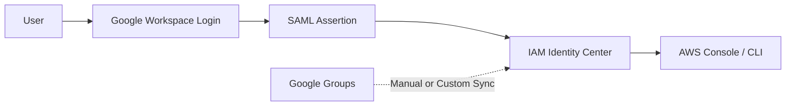

# How to Integrate IAM Identity Center with Google Workspace

Author: [nawazdhandala](https://github.com/nawazdhandala)

Tags: AWS, IAM, Google Workspace, SSO, Security

Description: Learn how to connect AWS IAM Identity Center with Google Workspace for single sign-on authentication and automated user provisioning via SAML and SCIM.

---

Google Workspace is the identity provider for a huge number of startups and small-to-mid-sized companies. If your team already uses Google for email, calendar, and docs, it makes sense to use those same Google accounts for AWS access. No more separate passwords, no more forgotten credentials, and deprovisioning is as simple as suspending the Google account.

This guide covers integrating Google Workspace with AWS IAM Identity Center using SAML for authentication and SCIM for user provisioning.

## How It Works



One thing to know upfront: Google Workspace's SCIM support for AWS is more limited than what you get with Okta or Azure AD. Google supports SAML perfectly, but automatic group provisioning requires some extra work. We'll cover the workarounds.

## Prerequisites

- AWS IAM Identity Center enabled (see the [setup guide](https://oneuptime.com/blog/post/set-up-aws-iam-identity-center-sso/view))
- Google Workspace Super Admin access
- Google Workspace Business, Enterprise, or Education edition

## Step 1: Create a Custom SAML Application in Google Workspace

1. Go to the Google Admin Console (admin.google.com)
2. Navigate to Apps > Web and mobile apps
3. Click "Add app" > "Add custom SAML app"
4. Enter a name: "AWS IAM Identity Center"
5. Optionally upload a logo

On the Google IdP information page, download the **IdP metadata** (XML file). You'll need this for IAM Identity Center. Also note:
- SSO URL
- Entity ID
- Certificate

## Step 2: Configure IAM Identity Center

1. Go to IAM Identity Center in the AWS Console
2. Click Settings > Identity source > Actions > Change identity source
3. Select "External identity provider"
4. Download the **IAM Identity Center SAML metadata**
5. Note the **Assertion Consumer Service (ACS) URL** and **Issuer URL**
6. Upload the Google IdP metadata XML

## Step 3: Complete Google SAML Configuration

Back in Google Admin Console, on the "Service provider details" page:

- **ACS URL**: Paste the ACS URL from Identity Center
- **Entity ID**: Paste the Issuer URL from Identity Center
- **Start URL**: Your Identity Center portal URL (e.g., `https://your-company.awsapps.com/start`)
- **Name ID format**: EMAIL
- **Name ID**: Basic Information > Primary email

Add attribute mappings:

```
Google Directory Attribute     -> App Attribute
----------------------------------------------
Basic Information: First name -> firstName
Basic Information: Last name  -> lastName
Basic Information: Primary email -> email
```

## Step 4: Enable the Application for Users

In Google Admin Console:

1. Go back to the SAML app you created
2. Click "User access"
3. Set it to "ON for everyone" or select specific organizational units
4. Click "Save"

## Step 5: Test SAML Sign-On

Have a user try to access the Identity Center portal URL. They should be redirected to Google's login page. After authenticating with Google, they should land in the Identity Center portal.

If it doesn't work, common issues include:

- **ACS URL mismatch**: Double-check for trailing slashes or HTTP vs HTTPS differences
- **Name ID format**: Must be EMAIL, not UNSPECIFIED
- **App not enabled**: Make sure the app is turned on for the user's organizational unit

## Step 6: Set Up User Provisioning

This is where Google Workspace gets tricky. Unlike Okta and Azure AD, Google doesn't have a native SCIM integration with IAM Identity Center through the admin console. You have a few options:

### Option A: Manual User Creation

For small teams, create users manually in Identity Center:

```bash
IDENTITY_STORE_ID=$(aws sso-admin list-instances \
  --query 'Instances[0].IdentityStoreId' --output text)

# Create a user that matches their Google Workspace email
aws identitystore create-user \
  --identity-store-id "$IDENTITY_STORE_ID" \
  --user-name "jane@company.com" \
  --name '{"GivenName": "Jane", "FamilyName": "Doe"}' \
  --emails '[{"Value": "jane@company.com", "Type": "work", "Primary": true}]' \
  --display-name "Jane Doe"
```

The username must match the Google Workspace email exactly for SAML to work.

### Option B: Automated Sync with a Lambda Function

For larger teams, build a Lambda function that syncs users from Google Workspace to Identity Center:

```python
import boto3
from google.oauth2 import service_account
from googleapiclient.discovery import build

# Google Workspace API credentials
SCOPES = ["https://www.googleapis.com/auth/admin.directory.user.readonly",
           "https://www.googleapis.com/auth/admin.directory.group.readonly"]
SERVICE_ACCOUNT_FILE = "service-account-key.json"
ADMIN_EMAIL = "admin@company.com"

def get_google_users():
    """Fetch all users from Google Workspace."""
    creds = service_account.Credentials.from_service_account_file(
        SERVICE_ACCOUNT_FILE, scopes=SCOPES
    )
    delegated = creds.with_subject(ADMIN_EMAIL)
    service = build("admin", "directory_v1", credentials=delegated)

    users = []
    request = service.users().list(
        customer="my_customer",
        orderBy="email",
        maxResults=500
    )

    while request:
        response = request.execute()
        users.extend(response.get("users", []))
        request = service.users().list_next(request, response)

    return users

def sync_to_identity_center(google_users):
    """Create or update users in IAM Identity Center."""
    identity_store = boto3.client("identitystore")
    store_id = boto3.client("sso-admin").list_instances()[
        "Instances"
    ][0]["IdentityStoreId"]

    # Get existing Identity Center users
    existing = {}
    paginator = identity_store.get_paginator("list_users")
    for page in paginator.paginate(IdentityStoreId=store_id):
        for user in page["Users"]:
            existing[user["UserName"]] = user["UserId"]

    created = 0
    skipped = 0

    for guser in google_users:
        email = guser["primaryEmail"]
        first_name = guser["name"]["givenName"]
        last_name = guser["name"]["familyName"]

        if guser.get("suspended", False):
            # If user is suspended in Google, deactivate in Identity Center
            if email in existing:
                print(f"User {email} is suspended in Google - consider removing")
            continue

        if email in existing:
            skipped += 1
            continue

        try:
            identity_store.create_user(
                IdentityStoreId=store_id,
                UserName=email,
                Name={"GivenName": first_name, "FamilyName": last_name},
                DisplayName=f"{first_name} {last_name}",
                Emails=[{"Value": email, "Type": "work", "Primary": True}]
            )
            created += 1
            print(f"Created user: {email}")
        except identity_store.exceptions.ConflictException:
            skipped += 1

    print(f"\nSync complete: {created} created, {skipped} skipped")

def lambda_handler(event, context):
    google_users = get_google_users()
    sync_to_identity_center(google_users)
```

Schedule this Lambda to run daily with EventBridge:

```bash
# Create a scheduled rule to run the sync daily at 2 AM UTC
aws events put-rule \
  --name "google-workspace-identity-sync" \
  --schedule-expression "cron(0 2 * * ? *)" \
  --description "Daily sync of Google Workspace users to IAM Identity Center"
```

### Option C: Use a Third-Party Tool

Tools like SSOSYNC (an open-source project) can bridge Google Workspace and IAM Identity Center. It handles both user and group synchronization.

## Step 7: Create Groups and Assignments

Since Google Groups don't sync automatically, create groups in Identity Center and manage memberships:

```bash
IDENTITY_STORE_ID=$(aws sso-admin list-instances \
  --query 'Instances[0].IdentityStoreId' --output text)

# Create groups
aws identitystore create-group \
  --identity-store-id "$IDENTITY_STORE_ID" \
  --display-name "Engineering" \
  --description "Engineering team members"

# Add a user to the group
aws identitystore create-group-membership \
  --identity-store-id "$IDENTITY_STORE_ID" \
  --group-id "group-id-here" \
  --member-id '{"UserId": "user-id-here"}'
```

Then assign groups to accounts:

```bash
SSO_INSTANCE_ARN=$(aws sso-admin list-instances \
  --query 'Instances[0].InstanceArn' --output text)

# Assign Engineering group to dev account with PowerUser access
aws sso-admin create-account-assignment \
  --instance-arn "$SSO_INSTANCE_ARN" \
  --target-id "222222222222" \
  --target-type AWS_ACCOUNT \
  --permission-set-arn "$PERMISSION_SET_ARN" \
  --principal-type GROUP \
  --principal-id "engineering-group-id"
```

## Step 8: Configure Google Workspace 2-Step Verification

Make sure 2-Step Verification (Google's MFA) is enforced:

1. Google Admin Console > Security > 2-Step Verification
2. Click "Allow users to turn on 2-Step Verification"
3. Set enforcement: "On" with "Enforcement date" set to today
4. Choose allowed methods (security key is most secure)

This means every AWS login goes through Google's MFA automatically.

## CLI Access

Users authenticate through the browser via Google:

```bash
# Configure AWS CLI for SSO
aws configure sso
# Enter your Identity Center portal URL
# It will open the browser, authenticate through Google
# Select your account and role

# Subsequent logins
aws sso login --profile my-google-profile
aws s3 ls --profile my-google-profile
```

## Offboarding a User

When someone leaves:

1. Suspend or delete their Google Workspace account
2. Their SAML authentication immediately stops working
3. Remove or deactivate them in Identity Center (if not using automated sync)

```bash
# Deactivate the user in Identity Center
# First find the user ID
USER_ID=$(aws identitystore list-users \
  --identity-store-id "$IDENTITY_STORE_ID" \
  --filters '[{"AttributePath": "UserName", "AttributeValue": "departed@company.com"}]' \
  --query 'Users[0].UserId' --output text)

# Delete the user
aws identitystore delete-user \
  --identity-store-id "$IDENTITY_STORE_ID" \
  --user-id "$USER_ID"
```

The Google Workspace integration isn't as polished as Okta or Azure AD when it comes to automatic provisioning, but for teams already invested in the Google ecosystem, it's a practical choice. The SAML authentication works flawlessly, and the user sync gap can be bridged with a simple Lambda function.
