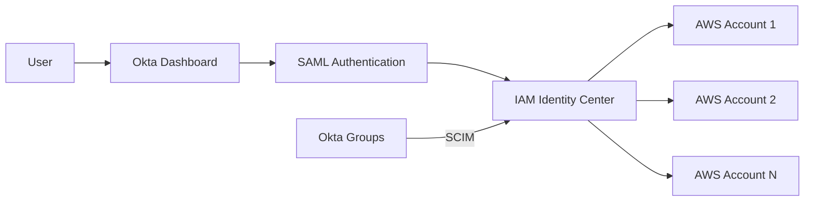

# How to Integrate IAM Identity Center with Okta

Author: [nawazdhandala](https://github.com/nawazdhandala)

Tags: AWS, IAM, Okta, SSO, Security

Description: Complete walkthrough for integrating AWS IAM Identity Center with Okta for federated authentication, automatic user provisioning, and centralized access control.

---

Okta is one of the most popular identity providers for cloud-first organizations, and its integration with AWS IAM Identity Center is mature and well-supported. Once connected, your team authenticates through Okta to access any AWS account in your organization. No separate AWS credentials, no manual user creation, and offboarding is instant.

This guide covers the full setup: SAML configuration for authentication and SCIM provisioning for automatic user and group sync.

## Architecture Overview



The flow is straightforward: users click the AWS tile in their Okta dashboard, Okta sends a SAML assertion to Identity Center, and Identity Center grants access based on group memberships and permission sets.

## Prerequisites

- AWS IAM Identity Center enabled (see our [setup guide](https://oneuptime.com/blog/post/set-up-aws-iam-identity-center-sso/view))
- Okta account with admin access
- An Okta plan that supports SCIM provisioning (Okta Lifecycle Management)

## Step 1: Add the AWS IAM Identity Center Application in Okta

1. Log into the Okta Admin Console
2. Go to Applications > Applications
3. Click "Browse App Catalog"
4. Search for "AWS IAM Identity Center"
5. Click "Add Integration"
6. Give it a label (e.g., "AWS Accounts")
7. Click "Next"

## Step 2: Configure SAML in Okta

On the "Sign-On Options" tab:

1. Select "SAML 2.0"
2. You'll need values from IAM Identity Center. Open a new tab and go to IAM Identity Center > Settings
3. Under "Identity source", click "Actions" > "Change identity source"
4. Select "External identity provider"
5. Copy these values to Okta:
   - **IAM Identity Center Assertion Consumer Service (ACS) URL** -> paste as "ACS URL" in Okta
   - **IAM Identity Center Issuer URL** -> paste as "Audience URI" in Okta

6. In IAM Identity Center, you need to upload the Okta metadata. In Okta, download the "Identity Provider metadata" (it's an XML file)

7. Back in IAM Identity Center, upload that metadata file as the "IdP SAML metadata"

8. Complete the identity source change in IAM Identity Center

## Step 3: Configure Attribute Statements in Okta

In the Okta application's SAML settings, add these attribute statements:

```
Name                                            Value
----                                            -----
Subject (NameID)                                user.email
https://aws.amazon.com/SAML/Attributes/email    user.email
```

The Subject/NameID format should be set to "EmailAddress".

## Step 4: Enable SCIM Provisioning

SCIM syncs users and groups from Okta to IAM Identity Center automatically.

In IAM Identity Center:

1. Go to Settings > Identity source
2. Under "Automatic provisioning", click "Enable"
3. Save the **SCIM endpoint URL** and **Access token**

In Okta:

1. Go to the AWS IAM Identity Center application
2. Click the "Provisioning" tab
3. Click "Configure API Integration"
4. Check "Enable API Integration"
5. Enter:
   - **Base URL**: The SCIM endpoint from Identity Center
   - **API Token**: The access token from Identity Center
6. Click "Test API Credentials" - it should succeed
7. Click "Save"

## Step 5: Configure Provisioning Settings

Under Provisioning > To App:

Enable these features:

- **Create Users**: Yes
- **Update User Attributes**: Yes
- **Deactivate Users**: Yes

The attribute mappings should be pre-configured, but verify them:

```
Okta Attribute              -> Identity Center Attribute
---------------------------------------------------------
userName                    -> userName
givenName                   -> givenName
familyName                  -> familyName
email                       -> email
displayName                 -> displayName
```

## Step 6: Assign Users and Groups

In Okta, assign users or groups to the application:

1. Go to the AWS IAM Identity Center application in Okta
2. Click the "Assignments" tab
3. Click "Assign" > "Assign to Groups"
4. Select the groups you want to sync (e.g., "Engineering", "Platform", "Security")
5. Click "Save and Go Back"

Push groups to Identity Center:

1. Click the "Push Groups" tab
2. Click "Push Groups" > "Find groups by name"
3. Search for and select each group
4. Click "Save"

This creates matching groups in IAM Identity Center with the same members.

## Step 7: Verify the Sync

After a few minutes, check that users and groups have synced:

```bash
# Get the Identity Store ID
IDENTITY_STORE_ID=$(aws sso-admin list-instances \
  --query 'Instances[0].IdentityStoreId' --output text)

# List synced users
aws identitystore list-users \
  --identity-store-id "$IDENTITY_STORE_ID" \
  --query 'Users[*].{Name:DisplayName,Username:UserName,Email:Emails[0].Value}' \
  --output table

# List synced groups
aws identitystore list-groups \
  --identity-store-id "$IDENTITY_STORE_ID" \
  --query 'Groups[*].{Name:DisplayName,Id:GroupId}' \
  --output table
```

## Step 8: Create Permission Sets and Assignments

Now map the Okta groups to AWS account access:

```bash
SSO_INSTANCE_ARN=$(aws sso-admin list-instances \
  --query 'Instances[0].InstanceArn' --output text)

# Create a permission set for engineers
aws sso-admin create-permission-set \
  --instance-arn "$SSO_INSTANCE_ARN" \
  --name "EngineerAccess" \
  --description "Engineer access for dev and staging" \
  --session-duration "PT8H"

# Attach PowerUserAccess policy
aws sso-admin attach-managed-policy-to-permission-set \
  --instance-arn "$SSO_INSTANCE_ARN" \
  --permission-set-arn "$PERMISSION_SET_ARN" \
  --managed-policy-arn "arn:aws:iam::aws:policy/PowerUserAccess"

# Assign the Engineering group to the dev account
aws sso-admin create-account-assignment \
  --instance-arn "$SSO_INSTANCE_ARN" \
  --target-id "222222222222" \
  --target-type AWS_ACCOUNT \
  --permission-set-arn "$PERMISSION_SET_ARN" \
  --principal-type GROUP \
  --principal-id "engineering-group-id-from-identity-store"
```

## Step 9: Configure Okta MFA Policies

One of the biggest advantages of the Okta integration is leveraging Okta's MFA policies for AWS access:

1. In Okta Admin Console, go to Security > Authentication Policies
2. Create or edit a policy
3. Add a rule for the AWS IAM Identity Center application
4. Set "User must authenticate with" to your preferred MFA method:
   - Okta Verify (push notification)
   - WebAuthn/FIDO2 (security keys)
   - Phone (SMS or voice)

You can create different MFA requirements for different groups:

```
Rule: Platform team AWS access
  IF: Group is "Platform-Admins"
  THEN: Require Okta Verify + biometric
  AND: Re-authenticate every 1 hour

Rule: Developer AWS access
  IF: Group is "Engineering"
  THEN: Require any MFA factor
  AND: Re-authenticate every 8 hours
```

## Step 10: Test the Integration

1. Log into Okta as a synced user
2. Click the AWS IAM Identity Center tile
3. You should see the IAM Identity Center portal with available accounts
4. Select an account and role
5. You should be logged into the AWS Console

For CLI access:

```bash
# Configure AWS CLI for SSO with Okta
aws configure sso
# SSO start URL: https://your-company.awsapps.com/start
# SSO Region: us-east-1
# When prompted, it will open a browser - authenticate through Okta

# Use the configured profile
aws s3 ls --profile my-okta-profile
```

## Automating with Terraform

For teams using infrastructure as code, manage the Identity Center assignments in Terraform:

```hcl
# Look up the synced Okta group
data "aws_identitystore_group" "engineering" {
  identity_store_id = tolist(data.aws_ssoadmin_instances.main.identity_store_ids)[0]

  alternate_identifier {
    unique_attribute {
      attribute_path  = "DisplayName"
      attribute_value = "Engineering"
    }
  }
}

# Create account assignment
resource "aws_ssoadmin_account_assignment" "eng_dev" {
  instance_arn       = tolist(data.aws_ssoadmin_instances.main.arns)[0]
  permission_set_arn = aws_ssoadmin_permission_set.engineer.arn
  principal_id       = data.aws_identitystore_group.engineering.group_id
  principal_type     = "GROUP"
  target_id          = "222222222222"
  target_type        = "AWS_ACCOUNT"
}
```

## Troubleshooting

### SCIM Provisioning Failures

Check the provisioning logs in Okta:

1. Go to the application > Provisioning > Import Logs
2. Look for errors like:
   - "Duplicate userName" - user already exists in Identity Center
   - "Invalid SCIM token" - regenerate in Identity Center
   - "Attribute mapping error" - check required fields

### SAML Authentication Errors

Common issues and fixes:

- **"Response is not valid"**: Check that the ACS URL matches exactly
- **"Issuer mismatch"**: Verify the Audience URI in Okta matches the Identity Center issuer
- **"Signature validation failed"**: Re-download and re-upload the Okta metadata

### Token Expiration

The SCIM access token from Identity Center expires. When provisioning stops working:

1. Go to IAM Identity Center > Settings > Automatic provisioning
2. Click "Regenerate token"
3. Update the token in Okta's provisioning configuration

Set a calendar reminder to rotate this token before it expires.

## Monitoring

Track authentication events in both Okta and AWS:

```bash
# Check recent SSO authentication events in CloudTrail
aws cloudtrail lookup-events \
  --lookup-attributes AttributeKey=EventSource,AttributeValue=sso.amazonaws.com \
  --max-items 10 \
  --query 'Events[*].{Time:EventTime,Event:EventName}'
```

In Okta, review the System Log for AWS-related events. You can also set up Okta log streaming to a SIEM or monitoring tool to correlate AWS access patterns with Okta authentication events.

The Okta integration gives you enterprise-grade identity management for AWS without maintaining a separate user directory. Combined with Okta's conditional access policies and adaptive MFA, it's one of the most secure ways to manage AWS access at scale.
