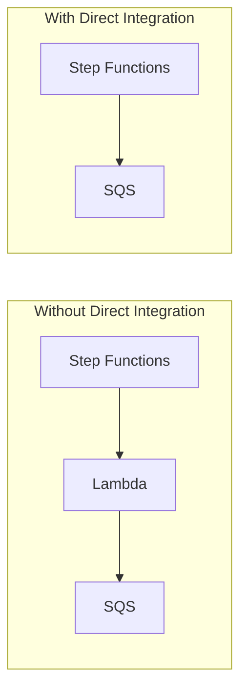

# Integrate Step Functions with AWS Services Directly

Author: [nawazdhandala](https://github.com/nawazdhandala)

Tags: AWS, Step Functions, Serverless, Integration

Description: Learn how to call AWS services directly from Step Functions without writing Lambda functions using SDK integrations and optimized integrations.

---

Here's something that trips up a lot of Step Functions beginners: you don't always need Lambda. Step Functions can call over 200 AWS services directly. Instead of writing a Lambda function that sends an SQS message, you can have Step Functions send the message itself. Instead of a Lambda that starts a Glue job, Step Functions can do it natively.

This is called SDK integration, and it's one of the most underused features of Step Functions.

## Why Skip Lambda?

Every Lambda function you add to a workflow is code you have to write, test, maintain, and monitor. If your Lambda does nothing but forward a call to another AWS service, you're adding complexity for no reason. Direct integrations eliminate that middleman.

You also save on Lambda invocation costs and avoid cold start latency. For workflows with many service calls, the savings add up quickly.



## Integration Types

Step Functions offers three types of service integrations:

**Request-Response** - Calls the service and moves to the next state immediately. Doesn't wait for the work to complete.

**Run a Job (.sync)** - Calls the service and waits until the job completes. Step Functions polls the service for you.

**Wait for a Callback (.waitForTaskToken)** - Sends a task token to a service and pauses until something calls back with that token.

## Direct DynamoDB Integration

Instead of a Lambda function that reads from DynamoDB, you can query DynamoDB directly.

This state gets an item from DynamoDB without any Lambda code:

```json
{
  "GetUserProfile": {
    "Type": "Task",
    "Resource": "arn:aws:states:::dynamodb:getItem",
    "Parameters": {
      "TableName": "UserProfiles",
      "Key": {
        "userId": {
          "S.$": "$.userId"
        }
      }
    },
    "ResultSelector": {
      "name.$": "$.Item.name.S",
      "email.$": "$.Item.email.S",
      "tier.$": "$.Item.tier.S"
    },
    "ResultPath": "$.userProfile",
    "Next": "ProcessUser"
  }
}
```

`ResultSelector` is important here - DynamoDB returns items in its native format with type descriptors (S for string, N for number). ResultSelector lets you reshape the response into something cleaner.

Writing to DynamoDB works the same way:

```json
{
  "SaveAuditLog": {
    "Type": "Task",
    "Resource": "arn:aws:states:::dynamodb:putItem",
    "Parameters": {
      "TableName": "AuditLogs",
      "Item": {
        "id": {
          "S.$": "$.executionId"
        },
        "action": {
          "S.$": "$.action"
        },
        "userId": {
          "S.$": "$.userId"
        },
        "timestamp": {
          "S.$": "$$.State.EnteredTime"
        }
      }
    },
    "ResultPath": null,
    "Next": "Continue"
  }
}
```

Setting `ResultPath` to null discards the DynamoDB response and passes the original input unchanged to the next state.

## Direct SQS Integration

Sending messages to SQS queues is another common pattern that doesn't need Lambda.

This sends a message to an SQS queue with attributes:

```json
{
  "SendToProcessingQueue": {
    "Type": "Task",
    "Resource": "arn:aws:states:::sqs:sendMessage",
    "Parameters": {
      "QueueUrl": "https://sqs.us-east-1.amazonaws.com/123456789/processing-queue",
      "MessageBody": {
        "orderId.$": "$.orderId",
        "items.$": "$.items",
        "priority.$": "$.priority"
      },
      "MessageAttributes": {
        "orderType": {
          "DataType": "String",
          "StringValue.$": "$.orderType"
        }
      }
    },
    "Next": "WaitForProcessing"
  }
}
```

For the callback pattern, you can pause the workflow until a consumer processes the message and sends back the task token:

```json
{
  "SendAndWaitForProcessing": {
    "Type": "Task",
    "Resource": "arn:aws:states:::sqs:sendMessage.waitForTaskToken",
    "Parameters": {
      "QueueUrl": "https://sqs.us-east-1.amazonaws.com/123456789/processing-queue",
      "MessageBody": {
        "taskToken.$": "$$.Task.Token",
        "orderId.$": "$.orderId"
      }
    },
    "TimeoutSeconds": 3600,
    "Next": "ProcessingComplete"
  }
}
```

The consumer reads the message, does the work, then sends the result back:

```javascript
// Consumer that processes SQS messages and reports back to Step Functions
const { SFNClient, SendTaskSuccessCommand, SendTaskFailureCommand }
  = require('@aws-sdk/client-sfn');

const sfnClient = new SFNClient({});

exports.handler = async (event) => {
  for (const record of event.Records) {
    const body = JSON.parse(record.body);
    const { taskToken, orderId } = body;

    try {
      const result = await processOrder(orderId);

      // Report success back to Step Functions
      await sfnClient.send(new SendTaskSuccessCommand({
        taskToken: taskToken,
        output: JSON.stringify(result)
      }));
    } catch (error) {
      // Report failure back to Step Functions
      await sfnClient.send(new SendTaskFailureCommand({
        taskToken: taskToken,
        error: error.name,
        cause: error.message
      }));
    }
  }
};
```

## Direct SNS Integration

Publishing to SNS topics is another one-liner in Step Functions.

This publishes a notification without needing a Lambda function:

```json
{
  "NotifyAdmin": {
    "Type": "Task",
    "Resource": "arn:aws:states:::sns:publish",
    "Parameters": {
      "TopicArn": "arn:aws:sns:us-east-1:123456789:admin-notifications",
      "Subject": "Order Processing Alert",
      "Message": {
        "orderId.$": "$.orderId",
        "status.$": "$.status",
        "timestamp.$": "$$.State.EnteredTime"
      }
    },
    "ResultPath": null,
    "Next": "Continue"
  }
}
```

## Direct EventBridge Integration

You can put events directly onto an EventBridge bus.

This publishes a custom event to EventBridge:

```json
{
  "EmitOrderEvent": {
    "Type": "Task",
    "Resource": "arn:aws:states:::events:putEvents",
    "Parameters": {
      "Entries": [
        {
          "Source": "order.service",
          "DetailType": "OrderCompleted",
          "Detail": {
            "orderId.$": "$.orderId",
            "customerId.$": "$.customerId",
            "total.$": "$.orderTotal"
          },
          "EventBusName": "orders-bus"
        }
      ]
    },
    "Next": "Done"
  }
}
```

For more on EventBridge, check out our post on [setting up EventBridge rules for event-driven architecture](https://oneuptime.com/blog/post/2026-02-12-eventbridge-rules-event-driven-architecture/view).

## SDK Integrations for Any Service

Beyond the optimized integrations above, Step Functions supports generic SDK integrations for almost any AWS service. The resource ARN follows a pattern.

This starts a Glue ETL job and waits for it to complete:

```json
{
  "RunETLJob": {
    "Type": "Task",
    "Resource": "arn:aws:states:::aws-sdk:glue:startJobRun.sync",
    "Parameters": {
      "JobName": "transform-data",
      "Arguments": {
        "--input-path.$": "$.inputPath",
        "--output-path.$": "$.outputPath"
      }
    },
    "Next": "VerifyResults"
  }
}
```

This invokes an ECS Fargate task and waits for it to finish:

```json
{
  "RunContainerTask": {
    "Type": "Task",
    "Resource": "arn:aws:states:::ecs:runTask.sync",
    "Parameters": {
      "LaunchType": "FARGATE",
      "Cluster": "arn:aws:ecs:us-east-1:123456789:cluster/my-cluster",
      "TaskDefinition": "arn:aws:ecs:us-east-1:123456789:task-definition/processor:1",
      "Overrides": {
        "ContainerOverrides": [
          {
            "Name": "processor",
            "Environment": [
              {
                "Name": "INPUT_KEY",
                "Value.$": "$.inputKey"
              }
            ]
          }
        ]
      },
      "NetworkConfiguration": {
        "AwsvpcConfiguration": {
          "Subnets": ["subnet-abc123"],
          "SecurityGroups": ["sg-abc123"],
          "AssignPublicIp": "ENABLED"
        }
      }
    },
    "Next": "ProcessResults"
  }
}
```

## A Complete Workflow Without Lambda

Here's an entire workflow that processes an order using only direct service integrations - no Lambda functions at all:

```json
{
  "Comment": "Order processing with zero Lambda functions",
  "StartAt": "SaveOrder",
  "States": {
    "SaveOrder": {
      "Type": "Task",
      "Resource": "arn:aws:states:::dynamodb:putItem",
      "Parameters": {
        "TableName": "Orders",
        "Item": {
          "orderId": { "S.$": "$.orderId" },
          "status": { "S": "received" },
          "items": { "S.$": "States.JsonToString($.items)" }
        }
      },
      "ResultPath": null,
      "Next": "NotifyWarehouse"
    },
    "NotifyWarehouse": {
      "Type": "Task",
      "Resource": "arn:aws:states:::sqs:sendMessage",
      "Parameters": {
        "QueueUrl": "https://sqs.us-east-1.amazonaws.com/123456789/warehouse",
        "MessageBody.$": "$"
      },
      "ResultPath": null,
      "Next": "NotifyCustomer"
    },
    "NotifyCustomer": {
      "Type": "Task",
      "Resource": "arn:aws:states:::sns:publish",
      "Parameters": {
        "TopicArn": "arn:aws:sns:us-east-1:123456789:order-confirmations",
        "Message.$": "States.Format('Your order {} has been received', $.orderId)"
      },
      "ResultPath": null,
      "Next": "EmitEvent"
    },
    "EmitEvent": {
      "Type": "Task",
      "Resource": "arn:aws:states:::events:putEvents",
      "Parameters": {
        "Entries": [{
          "Source": "order.service",
          "DetailType": "OrderReceived",
          "Detail.$": "$"
        }]
      },
      "End": true
    }
  }
}
```

Four AWS service calls, zero Lambda functions. That's fewer things to deploy, test, and monitor.

## IAM Permissions

Direct integrations need the right IAM permissions on the state machine's execution role. Grant only what the workflow needs.

This IAM policy covers the services used in the workflow above:

```json
{
  "Version": "2012-10-17",
  "Statement": [
    {
      "Effect": "Allow",
      "Action": ["dynamodb:PutItem", "dynamodb:GetItem"],
      "Resource": "arn:aws:dynamodb:us-east-1:123456789:table/Orders"
    },
    {
      "Effect": "Allow",
      "Action": "sqs:SendMessage",
      "Resource": "arn:aws:sqs:us-east-1:123456789:warehouse"
    },
    {
      "Effect": "Allow",
      "Action": "sns:Publish",
      "Resource": "arn:aws:sns:us-east-1:123456789:order-confirmations"
    },
    {
      "Effect": "Allow",
      "Action": "events:PutEvents",
      "Resource": "*"
    }
  ]
}
```

## Wrapping Up

Direct service integrations turn Step Functions from a Lambda orchestrator into a general-purpose AWS orchestrator. Every service call you can make directly is one less Lambda function to maintain. Start by looking at your existing workflows and identifying Lambda functions that just forward calls to other services - those are prime candidates for replacement with direct integrations.
