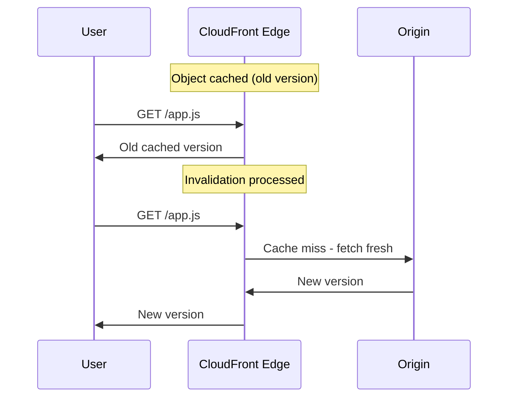

# How to Invalidate CloudFront Cache

Author: [nawazdhandala](https://github.com/nawazdhandala)

Tags: AWS, CloudFront, Caching, CDN

Description: Learn how to invalidate CloudFront cached objects using the CLI, console, and automation, plus strategies to minimize the need for invalidations.

---

You just deployed a fix, but users are still seeing the old version because CloudFront has it cached at edge locations worldwide. Cache invalidation tells CloudFront to discard cached copies so the next request fetches fresh content from the origin. It's straightforward, but there are costs, timing, and strategy considerations you should know about.

## How Invalidation Works

When you create an invalidation, CloudFront marks the specified objects as invalid across all edge locations. The next time an edge location receives a request for an invalidated object, it goes back to the origin to fetch the current version. This happens per-edge-location, on the next request - CloudFront doesn't proactively push new content to edges.



Invalidations typically complete in under 2 minutes, but can take up to 10-15 minutes for global propagation.

## Basic Invalidation with the CLI

Invalidate a single file:

```bash
# Invalidate a single file
aws cloudfront create-invalidation \
  --distribution-id E1234567890 \
  --paths "/index.html"
```

Invalidate multiple specific files:

```bash
# Invalidate multiple specific files
aws cloudfront create-invalidation \
  --distribution-id E1234567890 \
  --paths "/index.html" "/css/styles.css" "/js/app.js"
```

Invalidate everything under a path using wildcards:

```bash
# Invalidate all files under /static/
aws cloudfront create-invalidation \
  --distribution-id E1234567890 \
  --paths "/static/*"
```

Invalidate everything in the distribution:

```bash
# Invalidate the entire distribution cache
aws cloudfront create-invalidation \
  --distribution-id E1234567890 \
  --paths "/*"
```

## Using an Invalidation Batch File

For large invalidations, use a JSON file:

```json
{
  "Paths": {
    "Quantity": 5,
    "Items": [
      "/index.html",
      "/about/index.html",
      "/blog/index.html",
      "/css/*",
      "/js/*"
    ]
  },
  "CallerReference": "deploy-20260212-001"
}
```

```bash
# Create invalidation from a batch file
aws cloudfront create-invalidation \
  --distribution-id E1234567890 \
  --invalidation-batch file://invalidation-batch.json
```

The `CallerReference` must be unique per invalidation request. A timestamp or deploy ID works well.

## Checking Invalidation Status

```bash
# List recent invalidations
aws cloudfront list-invalidations \
  --distribution-id E1234567890 \
  --query 'InvalidationList.Items[*].{Id:Id,Status:Status,Created:CreateTime}'

# Check a specific invalidation's status
aws cloudfront get-invalidation \
  --distribution-id E1234567890 \
  --id I1234567890

# Wait for an invalidation to complete
aws cloudfront wait invalidation-completed \
  --distribution-id E1234567890 \
  --id I1234567890
```

The `wait` command is useful in deployment scripts where you need to ensure the invalidation is done before continuing.

## Cost Considerations

The first 1,000 invalidation paths per month are free. After that, it's $0.005 per path. A wildcard like `/*` counts as one path, which is why many people just invalidate everything.

However, there's a catch - you can only have 3,000 paths in progress at once (or 15 wildcard invalidations). If you're hitting that limit, you're probably invalidating too often and should rethink your caching strategy.

```bash
# Count invalidation paths used this month (rough check)
aws cloudfront list-invalidations \
  --distribution-id E1234567890 \
  --query 'InvalidationList.Items | length(@)'
```

## Automating Invalidation in CI/CD

Here's a deployment script that deploys to S3 and invalidates CloudFront:

```bash
#!/bin/bash
# deploy.sh - Deploy to S3 and invalidate CloudFront cache

DISTRIBUTION_ID="E1234567890"
S3_BUCKET="my-website-bucket"
BUILD_DIR="./build"

# Sync files to S3
echo "Deploying to S3..."
aws s3 sync "$BUILD_DIR" "s3://$S3_BUCKET" \
  --delete \
  --cache-control "public, max-age=31536000" \
  --exclude "index.html" \
  --exclude "*.json"

# Upload HTML and JSON with short cache
aws s3 sync "$BUILD_DIR" "s3://$S3_BUCKET" \
  --cache-control "public, max-age=60" \
  --include "index.html" \
  --include "*.json" \
  --exclude "*"

# Invalidate CloudFront cache for HTML and JSON files
echo "Invalidating CloudFront cache..."
INVALIDATION_ID=$(aws cloudfront create-invalidation \
  --distribution-id "$DISTRIBUTION_ID" \
  --paths "/index.html" "/manifest.json" "/*.html" \
  --query 'Invalidation.Id' \
  --output text)

echo "Invalidation ID: $INVALIDATION_ID"

# Wait for invalidation to complete
echo "Waiting for invalidation to complete..."
aws cloudfront wait invalidation-completed \
  --distribution-id "$DISTRIBUTION_ID" \
  --id "$INVALIDATION_ID"

echo "Deployment complete."
```

For GitHub Actions:

```yaml
# .github/workflows/deploy.yml
name: Deploy
on:
  push:
    branches: [main]

jobs:
  deploy:
    runs-on: ubuntu-latest
    steps:
      - uses: actions/checkout@v4

      - name: Build
        run: npm run build

      - name: Deploy to S3
        run: |
          aws s3 sync ./build s3://${{ secrets.S3_BUCKET }} --delete

      - name: Invalidate CloudFront
        run: |
          aws cloudfront create-invalidation \
            --distribution-id ${{ secrets.CF_DISTRIBUTION_ID }} \
            --paths "/*"
```

## Better Strategies: Avoid Invalidation Entirely

The best invalidation is the one you never have to do. Here are strategies that reduce or eliminate the need for cache invalidation:

### Versioned File Names

Include a hash or version in your file names:

```
/static/app.a1b2c3d4.js
/static/styles.e5f6g7h8.css
/images/logo.v2.png
```

When you deploy a new version, the file name changes, so CloudFront fetches the new version automatically. Old versions naturally expire from the cache. Most build tools (webpack, Vite, Next.js) do this automatically.

### Short TTL for HTML, Long TTL for Assets

Set different Cache-Control headers:

```bash
# Upload versioned assets with a 1-year cache
aws s3 sync ./build/static s3://my-bucket/static \
  --cache-control "public, max-age=31536000, immutable"

# Upload HTML with a 60-second cache
aws s3 cp ./build/index.html s3://my-bucket/index.html \
  --cache-control "public, max-age=60"
```

Since HTML files reference versioned assets, a 60-second cache on HTML means users get the new version within a minute without any invalidation.

### Use ETags

If your origin supports ETags, CloudFront can do conditional requests to check if content has changed. This is automatic for S3 origins. When the ETag matches, the edge serves the cached version; when it doesn't, it fetches the new version.

## Invalidation for Specific Query Strings

If your cache key includes query strings, you need to include them in the invalidation path:

```bash
# Invalidate a specific query string variant
aws cloudfront create-invalidation \
  --distribution-id E1234567890 \
  --paths "/api/data?version=1"
```

But if your cache policy doesn't include query strings in the cache key, then `/api/data?version=1` and `/api/data?version=2` are cached as the same object. In that case, just invalidate `/api/data`.

## Monitoring Cache Behavior

After invalidation, verify that your content is being served fresh:

```bash
# Check cache status headers
curl -sI https://d1234abcdef.cloudfront.net/index.html | grep -i 'x-cache\|age\|last-modified'

# X-Cache: Miss from cloudfront  (fresh fetch after invalidation)
# Age: 0                          (just fetched)
```

Subsequent requests should show `Hit from cloudfront` with an increasing `Age` value.

## Summary

CloudFront cache invalidation is your escape hatch when cached content needs to be refreshed immediately. Use the CLI for manual invalidations, automate it in your CI/CD pipeline for deployments, and lean on versioned file names to avoid most invalidations entirely. Remember that the first 1,000 paths per month are free, and a single `/*` wildcard counts as one path. For production workflows, combine short HTML TTLs with long versioned-asset TTLs, and you'll rarely need to invalidate anything.
