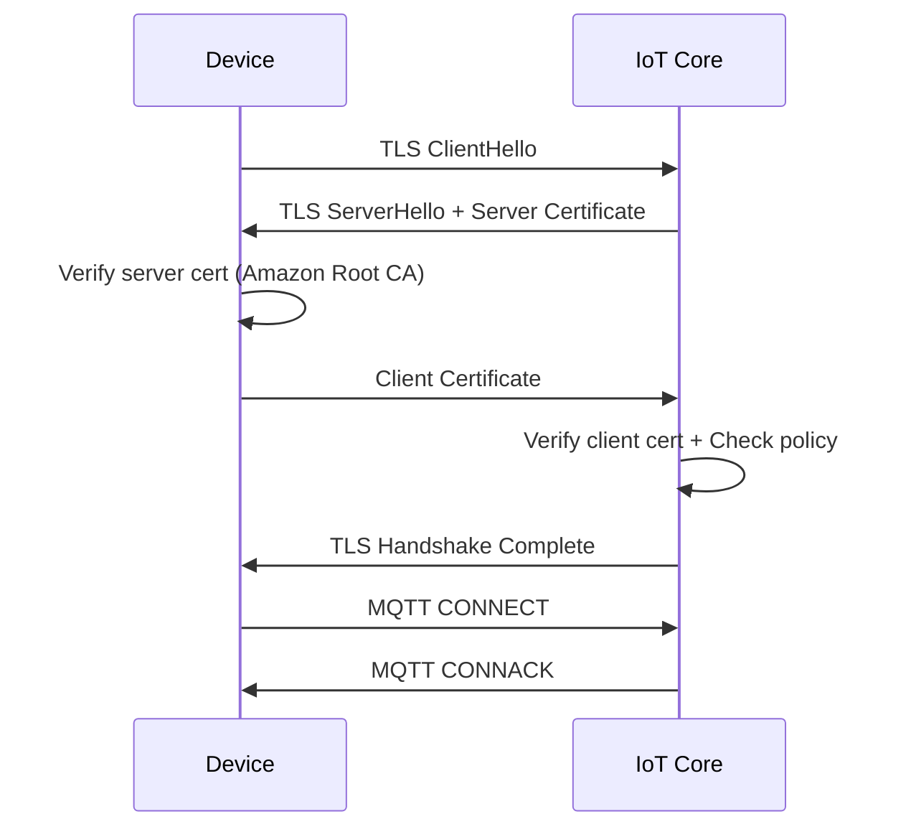

# How to Configure IoT Core Certificate-Based Authentication

Author: [nawazdhandala](https://github.com/nawazdhandala)

Tags: AWS, IoT Core, Certificates, Authentication, Security, TLS

Description: Configure certificate-based authentication for AWS IoT Core devices using X.509 certificates for mutual TLS authentication and secure device identity

---

Certificate-based authentication is the gold standard for IoT device security. Unlike passwords or tokens that can be easily intercepted or shared, X.509 certificates provide cryptographic proof of device identity through mutual TLS (mTLS). When a device connects to AWS IoT Core, both sides authenticate each other - the device verifies it is talking to AWS, and AWS verifies the device is who it claims to be.

This guide walks through setting up certificate-based authentication from scratch, including creating certificates, managing certificate authorities, and handling the full lifecycle.

## How Certificate Authentication Works in IoT Core

When a device connects to IoT Core using MQTT over TLS:



The device needs three files:
- **Device certificate** (public) - Proves the device identity
- **Device private key** - Signs the TLS handshake (never leaves the device)
- **Amazon Root CA certificate** - Verifies IoT Core's identity

## Option 1: AWS-Generated Certificates

The simplest approach is letting AWS generate the certificates for you.

```bash
# Generate a certificate and key pair
aws iot create-keys-and-certificate \
  --set-as-active \
  --certificate-pem-outfile device-cert.pem \
  --public-key-outfile device-public.key \
  --private-key-outfile device-private.key
```

This creates:
- A 2048-bit RSA key pair
- An X.509 certificate signed by the AWS IoT CA
- The certificate is immediately active

Save the output - it includes the certificate ARN and certificate ID that you will need later.

```bash
# Download the Amazon Root CA (needed by all devices)
curl -o AmazonRootCA1.pem \
  https://www.amazontrust.com/repository/AmazonRootCA1.pem
```

## Option 2: Bring Your Own Certificate Authority

For production deployments, you typically want to use your own CA. This gives you more control over the certificate lifecycle and is required for Just-in-Time Provisioning.

### Create Your Own CA

```bash
# Generate the CA private key (keep this extremely secure)
openssl genrsa -out myCA.key 4096

# Create the CA certificate (valid for 10 years)
openssl req -x509 -new -nodes \
  -key myCA.key \
  -sha256 -days 3650 \
  -out myCA.pem \
  -subj "/C=US/ST=California/O=MyCompany/CN=MyCompany IoT CA"
```

### Register the CA with IoT Core

```bash
# Get the registration code
REG_CODE=$(aws iot get-registration-code \
  --query 'registrationCode' --output text)

# Create a verification CSR using the registration code as CN
openssl genrsa -out verificationCert.key 2048
openssl req -new \
  -key verificationCert.key \
  -out verificationCert.csr \
  -subj "/CN=$REG_CODE"

# Sign the verification CSR with your CA
openssl x509 -req \
  -in verificationCert.csr \
  -CA myCA.pem \
  -CAkey myCA.key \
  -CAcreateserial \
  -out verificationCert.pem \
  -days 365 -sha256

# Register your CA with IoT Core
aws iot register-ca-certificate \
  --ca-certificate file://myCA.pem \
  --verification-certificate file://verificationCert.pem \
  --set-as-active \
  --allow-auto-registration
```

### Sign Device Certificates with Your CA

```bash
# Generate a device key pair
openssl genrsa -out device.key 2048

# Create a certificate signing request (CSR)
openssl req -new \
  -key device.key \
  -out device.csr \
  -subj "/CN=sensor-042"

# Sign the CSR with your CA
openssl x509 -req \
  -in device.csr \
  -CA myCA.pem \
  -CAkey myCA.key \
  -CAcreateserial \
  -out device.pem \
  -days 365 -sha256

# Register the device certificate with IoT Core
aws iot register-certificate \
  --certificate-pem file://device.pem \
  --ca-certificate-pem file://myCA.pem \
  --set-as-active
```

## Option 3: Certificate Signing Request (CSR) Approach

You can also have the device generate a key pair and send a CSR to IoT Core.

```bash
# On the device: generate key and CSR
openssl genrsa -out device.key 2048
openssl req -new -key device.key -out device.csr \
  -subj "/CN=device-serial-12345"

# Upload the CSR to IoT Core (from your provisioning server)
aws iot create-certificate-from-csr \
  --certificate-signing-request file://device.csr \
  --set-as-active \
  --certificate-pem-outfile device-cert.pem
```

This approach is more secure because the private key never leaves the device. Only the CSR (which contains only the public key) is transmitted.

## Attaching Certificates to Things and Policies

After creating a certificate, attach it to a thing and a policy.

```bash
CERT_ARN="arn:aws:iot:us-east-1:123456789:cert/abc123def456..."

# Attach the certificate to the IoT thing
aws iot attach-thing-principal \
  --thing-name "sensor-042" \
  --principal "$CERT_ARN"

# Attach an IoT policy to the certificate
aws iot attach-policy \
  --policy-name "SensorDevicePolicy" \
  --target "$CERT_ARN"
```

A certificate must have at least one policy attached to it for the device to perform any actions beyond connecting.

## Testing Device Connection

Verify the certificate works by making an MQTT connection.

```bash
# Install the mosquitto MQTT client
# On macOS: brew install mosquitto
# On Ubuntu: sudo apt install mosquitto-clients

# Get your IoT endpoint
ENDPOINT=$(aws iot describe-endpoint \
  --endpoint-type iot:Data-ATS \
  --query 'endpointAddress' --output text)

# Test the connection with a publish
mosquitto_pub \
  --cafile AmazonRootCA1.pem \
  --cert device-cert.pem \
  --key device-private.key \
  -h "$ENDPOINT" \
  -p 8883 \
  -t "test/sensor-042" \
  -m '{"temperature": 22.5}' \
  -d
```

If the connection succeeds, you will see the TLS handshake complete and the message published.

## Certificate Lifecycle Management

### Rotating Certificates

Certificates should be rotated before they expire. Here is a rotation pattern.

```bash
# Create a new certificate for the device
NEW_CERT=$(aws iot create-keys-and-certificate \
  --set-as-active \
  --certificate-pem-outfile new-cert.pem \
  --public-key-outfile new-public.key \
  --private-key-outfile new-private.key)

NEW_CERT_ARN=$(echo "$NEW_CERT" | jq -r '.certificateArn')

# Attach the new certificate to the same thing and policy
aws iot attach-thing-principal \
  --thing-name "sensor-042" \
  --principal "$NEW_CERT_ARN"

aws iot attach-policy \
  --policy-name "SensorDevicePolicy" \
  --target "$NEW_CERT_ARN"

# After the device has switched to the new cert,
# deactivate and delete the old one
aws iot update-certificate \
  --certificate-id "old-cert-id" \
  --new-status INACTIVE

# Detach from thing and policy before deleting
aws iot detach-thing-principal \
  --thing-name "sensor-042" \
  --principal "arn:aws:iot:us-east-1:123456789:cert/old-cert-id"

aws iot detach-policy \
  --policy-name "SensorDevicePolicy" \
  --target "arn:aws:iot:us-east-1:123456789:cert/old-cert-id"

aws iot delete-certificate --certificate-id "old-cert-id"
```

### Revoking Certificates

If a device is compromised, revoke its certificate immediately.

```bash
# Deactivate the certificate (immediate effect)
aws iot update-certificate \
  --certificate-id "compromised-cert-id" \
  --new-status REVOKED

# The device will be disconnected on its next connection attempt
```

### Monitoring Certificate Expiration

```bash
# List all certificates with their expiration dates
aws iot list-certificates \
  --query 'certificates[].{Id:certificateId,Status:status,Created:creationDate}' \
  --output table

# Check a specific certificate's details
aws iot describe-certificate \
  --certificate-id "abc123" \
  --query 'certificateDescription.{Status:status,NotBefore:validity.notBefore,NotAfter:validity.notAfter}'
```

## Security Best Practices

1. **Never share private keys**: Each device should have a unique key pair
2. **Use your own CA for production**: Gives you control over certificate issuance
3. **Store private keys in secure elements**: Hardware security modules (HSMs) on the device when possible
4. **Set short certificate lifetimes**: 1-2 years for production devices, with a rotation plan
5. **Monitor certificate usage**: Set up CloudWatch alarms for authentication failures
6. **Use IoT Device Defender**: Audit your certificates and policies regularly

For more on IoT security auditing, see our guide on [using IoT Core Device Defender for security audits](https://oneuptime.com/blog/post/2026-02-12-iot-core-device-defender-security-audits/view).

## Wrapping Up

Certificate-based authentication is the most secure way to authenticate IoT devices with AWS IoT Core. Whether you use AWS-generated certificates for simplicity or bring your own CA for production control, the underlying mechanism is the same: mutual TLS with X.509 certificates. Get the certificate lifecycle management right from the start - automate issuance, plan for rotation, and have a revocation process ready - and your IoT fleet will be secure by default.

For setting up what comes next after authentication, see our guide on [creating IoT Core policies for device permissions](https://oneuptime.com/blog/post/2026-02-12-iot-core-policies-device-permissions/view).
