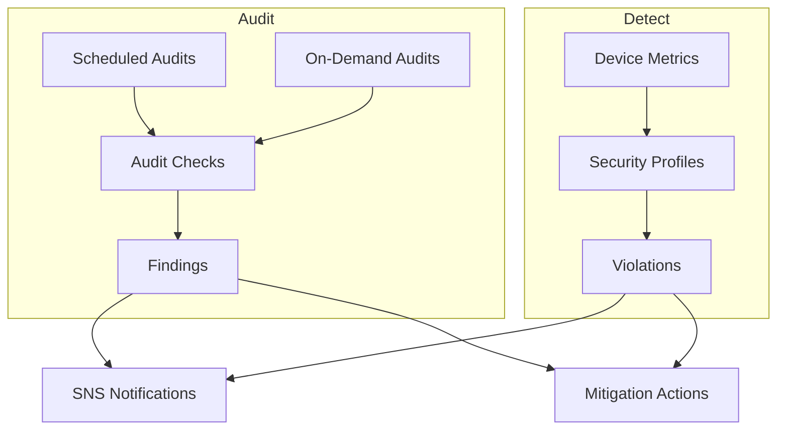

# How to Use IoT Core Device Defender for Security Audits

Author: [nawazdhandala](https://github.com/nawazdhandala)

Tags: AWS, IoT Core, Device Defender, Security, Auditing, IoT

Description: Set up AWS IoT Device Defender to audit your IoT configuration, detect security vulnerabilities, and monitor device behavior for anomalies

---

IoT security is not something you set up once and forget about. Certificates expire, policies get misconfigured, devices start behaving strangely, and new vulnerabilities emerge. AWS IoT Device Defender provides two security capabilities: audit checks that find misconfigurations in your IoT setup, and detect rules that monitor device behavior for anomalies. Together, they give you continuous security monitoring for your IoT fleet.

This guide covers both the audit and detect features, including how to set them up, what they check, and how to respond to findings.

## Device Defender Overview



**Audit** checks your IoT configuration against security best practices. It looks at things like overly permissive policies, shared certificates, and logging configuration.

**Detect** monitors the runtime behavior of your devices. It establishes baselines for metrics like message size, connection patterns, and data transfer, then alerts you when devices deviate from normal behavior.

## Part 1: Setting Up Audits

### Enable Audit Checks

First, create an IAM role for Device Defender.

```bash
# Create the Device Defender role
cat > defender-trust.json << 'EOF'
{
  "Version": "2012-10-17",
  "Statement": [
    {
      "Effect": "Allow",
      "Principal": {
        "Service": "iot.amazonaws.com"
      },
      "Action": "sts:AssumeRole"
    }
  ]
}
EOF

aws iam create-role \
  --role-name IoTDefenderAuditRole \
  --assume-role-policy-document file://defender-trust.json

aws iam attach-role-policy \
  --role-name IoTDefenderAuditRole \
  --policy-arn arn:aws:iam::aws:policy/service-role/AWSIoTDeviceDefenderAudit
```

### Configure Audit Settings

Enable the audit checks you want to run.

```bash
# Enable audit checks
aws iot update-account-audit-configuration \
  --role-arn "arn:aws:iam::123456789:role/IoTDefenderAuditRole" \
  --audit-notification-target-configurations '{
    "SNS": {
      "targetArn": "arn:aws:sns:us-east-1:123456789:iot-security-alerts",
      "roleArn": "arn:aws:iam::123456789:role/IoTDefenderAuditRole",
      "enabled": true
    }
  }' \
  --audit-check-configurations '{
    "DEVICE_CERTIFICATE_EXPIRING_CHECK": {"enabled": true},
    "REVOKED_CA_CERTIFICATE_STILL_ACTIVE_CHECK": {"enabled": true},
    "CA_CERTIFICATE_EXPIRING_CHECK": {"enabled": true},
    "IOT_POLICY_OVERLY_PERMISSIVE_CHECK": {"enabled": true},
    "LOGGING_DISABLED_CHECK": {"enabled": true},
    "UNAUTHENTICATED_COGNITO_ROLE_OVERLY_PERMISSIVE_CHECK": {"enabled": true},
    "AUTHENTICATED_COGNITO_ROLE_OVERLY_PERMISSIVE_CHECK": {"enabled": true},
    "CONFLICTING_CLIENT_IDS_CHECK": {"enabled": true},
    "DEVICE_CERTIFICATE_SHARED_CHECK": {"enabled": true},
    "IOT_ROLE_ALIAS_OVERLY_PERMISSIVE_CHECK": {"enabled": true},
    "IOT_ROLE_ALIAS_ALLOWS_ACCESS_TO_UNUSED_SERVICES_CHECK": {"enabled": true},
    "CA_CERTIFICATE_KEY_QUALITY_CHECK": {"enabled": true},
    "DEVICE_CERTIFICATE_KEY_QUALITY_CHECK": {"enabled": true},
    "REVOKED_DEVICE_CERTIFICATE_STILL_ACTIVE_CHECK": {"enabled": true}
  }'
```

### Understanding Audit Checks

Here are the most important audit checks:

| Check | What It Finds |
|-------|--------------|
| `DEVICE_CERTIFICATE_EXPIRING_CHECK` | Certificates expiring within 30 days |
| `IOT_POLICY_OVERLY_PERMISSIVE_CHECK` | Policies using wildcards too broadly |
| `DEVICE_CERTIFICATE_SHARED_CHECK` | Same certificate used by multiple devices |
| `LOGGING_DISABLED_CHECK` | IoT Core logging not enabled |
| `CONFLICTING_CLIENT_IDS_CHECK` | Multiple devices using the same MQTT client ID |
| `CA_CERTIFICATE_EXPIRING_CHECK` | CA certificates nearing expiration |
| `REVOKED_DEVICE_CERTIFICATE_STILL_ACTIVE_CHECK` | Revoked certs that are still active |

### Schedule Regular Audits

```bash
# Schedule a daily audit
aws iot create-scheduled-audit \
  --scheduled-audit-name "DailySecurityAudit" \
  --frequency DAILY \
  --target-check-names \
    "DEVICE_CERTIFICATE_EXPIRING_CHECK" \
    "IOT_POLICY_OVERLY_PERMISSIVE_CHECK" \
    "DEVICE_CERTIFICATE_SHARED_CHECK" \
    "LOGGING_DISABLED_CHECK" \
    "CONFLICTING_CLIENT_IDS_CHECK" \
    "REVOKED_DEVICE_CERTIFICATE_STILL_ACTIVE_CHECK"

# Schedule a weekly comprehensive audit
aws iot create-scheduled-audit \
  --scheduled-audit-name "WeeklyFullAudit" \
  --frequency WEEKLY \
  --day-of-week MON \
  --target-check-names \
    "DEVICE_CERTIFICATE_EXPIRING_CHECK" \
    "CA_CERTIFICATE_EXPIRING_CHECK" \
    "IOT_POLICY_OVERLY_PERMISSIVE_CHECK" \
    "DEVICE_CERTIFICATE_SHARED_CHECK" \
    "LOGGING_DISABLED_CHECK" \
    "CONFLICTING_CLIENT_IDS_CHECK" \
    "REVOKED_CA_CERTIFICATE_STILL_ACTIVE_CHECK" \
    "REVOKED_DEVICE_CERTIFICATE_STILL_ACTIVE_CHECK" \
    "IOT_ROLE_ALIAS_OVERLY_PERMISSIVE_CHECK" \
    "CA_CERTIFICATE_KEY_QUALITY_CHECK" \
    "DEVICE_CERTIFICATE_KEY_QUALITY_CHECK"
```

### Run an On-Demand Audit

```bash
# Run an audit immediately
aws iot start-on-demand-audit-task \
  --target-check-names \
    "IOT_POLICY_OVERLY_PERMISSIVE_CHECK" \
    "DEVICE_CERTIFICATE_EXPIRING_CHECK"
```

### Review Audit Findings

```bash
# List recent audit tasks
aws iot list-audit-tasks \
  --start-time $(date -u -d '7 days ago' +%Y-%m-%dT%H:%M:%SZ) \
  --end-time $(date -u +%Y-%m-%dT%H:%M:%SZ) \
  --query 'tasks[].{TaskId:taskId,Status:taskStatus,Type:taskType}'

# Get details of a specific audit
aws iot describe-audit-task \
  --task-id "audit-task-id-here"

# List findings from an audit
aws iot list-audit-findings \
  --task-id "audit-task-id-here" \
  --query 'findings[].{Check:checkName,Severity:severity,Reason:reasonForNonCompliance}'

# List all non-compliant findings for a specific check
aws iot list-audit-findings \
  --check-name "IOT_POLICY_OVERLY_PERMISSIVE_CHECK" \
  --start-time $(date -u -d '7 days ago' +%Y-%m-%dT%H:%M:%SZ) \
  --end-time $(date -u +%Y-%m-%dT%H:%M:%SZ)
```

## Part 2: Setting Up Detect

Detect monitors device behavior at runtime by collecting metrics from devices and comparing them against security profiles.

### Create a Security Profile

A security profile defines the expected behavior for a group of devices.

```bash
# Create a security profile with expected behaviors
aws iot create-security-profile \
  --security-profile-name "SensorSecurityProfile" \
  --security-profile-description "Security profile for temperature sensors" \
  --behaviors '[
    {
      "name": "MessageSize",
      "metric": "aws:message-byte-size",
      "criteria": {
        "comparisonOperator": "less-than",
        "value": {"count": 5120},
        "consecutiveDatapointsToAlarm": 3,
        "consecutiveDatapointsToClear": 3
      }
    },
    {
      "name": "MessagesOut",
      "metric": "aws:num-messages-sent",
      "criteria": {
        "comparisonOperator": "less-than",
        "value": {"count": 100},
        "durationSeconds": 300,
        "consecutiveDatapointsToAlarm": 2,
        "consecutiveDatapointsToClear": 2
      }
    },
    {
      "name": "AuthFailures",
      "metric": "aws:num-authorization-failures",
      "criteria": {
        "comparisonOperator": "less-than",
        "value": {"count": 5},
        "durationSeconds": 300,
        "consecutiveDatapointsToAlarm": 1,
        "consecutiveDatapointsToClear": 3
      }
    },
    {
      "name": "ConnectionAttempts",
      "metric": "aws:num-connection-attempts",
      "criteria": {
        "comparisonOperator": "less-than",
        "value": {"count": 10},
        "durationSeconds": 300,
        "consecutiveDatapointsToAlarm": 2,
        "consecutiveDatapointsToClear": 3
      }
    },
    {
      "name": "DisconnectCount",
      "metric": "aws:num-disconnects",
      "criteria": {
        "comparisonOperator": "less-than",
        "value": {"count": 5},
        "durationSeconds": 300,
        "consecutiveDatapointsToAlarm": 2,
        "consecutiveDatapointsToClear": 3
      }
    }
  ]' \
  --alert-targets '{
    "SNS": {
      "alertTargetArn": "arn:aws:sns:us-east-1:123456789:iot-security-alerts",
      "roleArn": "arn:aws:iam::123456789:role/IoTDefenderAuditRole"
    }
  }'
```

### Attach the Security Profile to a Target

```bash
# Attach to all things in the account
aws iot attach-security-profile \
  --security-profile-name "SensorSecurityProfile" \
  --security-profile-target-arn "arn:aws:iot:us-east-1:123456789:all/things"

# Or attach to a specific thing group
aws iot attach-security-profile \
  --security-profile-name "SensorSecurityProfile" \
  --security-profile-target-arn "arn:aws:iot:us-east-1:123456789:thinggroup/production-sensors"
```

### ML-Based Anomaly Detection

Instead of defining static thresholds, you can use ML-based detect which learns normal behavior automatically.

```bash
# Create an ML-based security profile
aws iot create-security-profile \
  --security-profile-name "MLSensorProfile" \
  --behaviors '[
    {
      "name": "MessageSizeAnomaly",
      "metric": "aws:message-byte-size",
      "criteria": {
        "mlDetectionConfig": {
          "confidenceLevel": "HIGH"
        }
      }
    },
    {
      "name": "MessageRateAnomaly",
      "metric": "aws:num-messages-sent",
      "criteria": {
        "mlDetectionConfig": {
          "confidenceLevel": "MEDIUM"
        }
      }
    }
  ]'
```

ML detect needs about 14 days of data to build an initial model. After that, it automatically detects deviations from learned patterns.

### Monitor Violations

```bash
# List active violations
aws iot list-active-violations \
  --security-profile-name "SensorSecurityProfile" \
  --query 'activeViolations[].{Thing:thingName,Behavior:violationId,Metric:behavior.name}'

# List violation events in the last 24 hours
aws iot list-violation-events \
  --start-time $(date -u -d '24 hours ago' +%Y-%m-%dT%H:%M:%SZ) \
  --end-time $(date -u +%Y-%m-%dT%H:%M:%SZ) \
  --query 'violationEvents[].{Thing:thingName,Behavior:behavior.name,Type:violationEventType}'
```

## Part 3: Mitigation Actions

When audit findings or detect violations occur, you can trigger automated responses.

```bash
# Create a mitigation action to add device to quarantine group
aws iot create-mitigation-action \
  --action-name "QuarantineDevice" \
  --role-arn "arn:aws:iam::123456789:role/IoTDefenderMitigationRole" \
  --action-params '{
    "addThingsToThingGroupParams": {
      "thingGroupNames": ["quarantine"],
      "overrideDynamicGroups": true
    }
  }'

# Create a mitigation action to disable the device certificate
aws iot create-mitigation-action \
  --action-name "DisableCertificate" \
  --role-arn "arn:aws:iam::123456789:role/IoTDefenderMitigationRole" \
  --action-params '{
    "updateDeviceCertificateParams": {
      "action": "DEACTIVATE"
    }
  }'

# Apply mitigation to audit findings
aws iot start-audit-mitigation-actions-task \
  --task-id "mitigation-$(date +%s)" \
  --target '{
    "auditTaskId": "audit-task-id",
    "findingIds": ["finding-id-1", "finding-id-2"]
  }' \
  --audit-check-to-actions-mapping '{
    "DEVICE_CERTIFICATE_EXPIRING_CHECK": ["QuarantineDevice"]
  }'
```

## Setting Up Notifications

Configure EventBridge rules for automated responses.

```bash
# EventBridge rule for audit findings
aws events put-rule \
  --name iot-defender-audit-findings \
  --event-pattern '{
    "source": ["aws.iot"],
    "detail-type": ["IoT Device Defender Audit Finding"]
  }'

# EventBridge rule for detect violations
aws events put-rule \
  --name iot-defender-violations \
  --event-pattern '{
    "source": ["aws.iot"],
    "detail-type": ["IoT Device Defender Detect Violation"]
  }'
```

## Wrapping Up

Device Defender is essential for maintaining IoT security at scale. The audit feature catches configuration drift and policy mistakes before they become vulnerabilities. The detect feature monitors runtime behavior to catch compromised or malfunctioning devices. Set up daily audits, create security profiles that match your device behavior patterns, and configure automated mitigation actions for common findings. Security is not a one-time setup - it is an ongoing process.

For more on IoT Core security, see our guides on [IoT Core certificate-based authentication](https://oneuptime.com/blog/post/iot-core-certificate-based-authentication/view) and [creating IoT Core policies for device permissions](https://oneuptime.com/blog/post/iot-core-policies-device-permissions/view).
