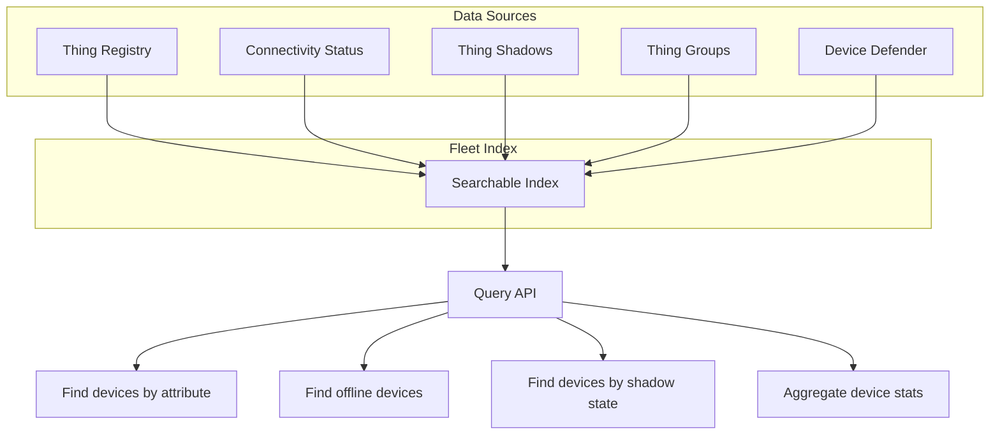

# How to Set Up IoT Core Fleet Indexing for Device Search

Author: [nawazdhandala](https://github.com/nawazdhandala)

Tags: AWS, IoT Core, Fleet Indexing, Device Management, IoT, Search

Description: Enable AWS IoT Core fleet indexing to search and query your IoT device fleet by attributes, connectivity status, and shadow state in real time

---

When you have thousands of IoT devices, finding specific ones becomes a real challenge. Which devices are running firmware version 1.2? Which ones are in warehouse B? Which sensors have battery levels below 20%? Without fleet indexing, you would need to query each device individually or maintain your own database of device metadata. Fleet indexing solves this by creating a searchable index of all your things, their attributes, connectivity status, and shadow state.

This guide covers how to enable fleet indexing, build queries, and use it for operational tasks.

## What Fleet Indexing Does

Fleet indexing maintains a continuously updated search index of your IoT devices. It indexes:

- **Thing registry data**: Thing names, types, groups, and attributes
- **Thing connectivity**: Whether a device is currently connected
- **Thing shadows**: Named and classic shadow states
- **Thing group memberships**: Which groups a device belongs to
- **Violations**: Device Defender audit violations



## Step 1: Enable Fleet Indexing

```bash
# Enable fleet indexing with thing connectivity and shadow indexing
aws iot update-indexing-configuration \
  --thing-indexing-configuration '{
    "thingIndexingMode": "REGISTRY_AND_SHADOW",
    "thingConnectivityIndexingMode": "STATUS",
    "deviceDefenderIndexingMode": "VIOLATIONS",
    "namedShadowIndexingMode": "ON",
    "managedFields": [
      {"name": "registry.version", "type": "Number"},
      {"name": "shadow.desired.firmware", "type": "String"},
      {"name": "shadow.reported.firmware", "type": "String"},
      {"name": "shadow.reported.battery_level", "type": "Number"},
      {"name": "shadow.reported.temperature", "type": "Number"}
    ],
    "customFields": [
      {"name": "attributes.location", "type": "String"},
      {"name": "attributes.device_type", "type": "String"},
      {"name": "attributes.firmware_version", "type": "String"}
    ]
  }'
```

The indexing modes:

- `REGISTRY` - Index only thing registry data (names, types, attributes)
- `REGISTRY_AND_SHADOW` - Also index thing shadow state
- `OFF` - Disable indexing

Enable `thingConnectivityIndexingMode: STATUS` to track which devices are online.

## Step 2: Enable Thing Group Indexing

If you organize devices into groups, enable group indexing too.

```bash
# Enable thing group indexing
aws iot update-indexing-configuration \
  --thing-group-indexing-configuration '{
    "thingGroupIndexingMode": "ON"
  }'
```

## Step 3: Verify Indexing Status

After enabling, check the indexing status.

```bash
# Check the indexing configuration
aws iot get-indexing-configuration

# Check the index status (may take minutes to build initially)
aws iot describe-index --index-name "AWS_Things"
```

The initial index build can take minutes to hours depending on how many devices you have.

## Step 4: Search for Devices

### Basic Queries

```bash
# Find all devices with a specific attribute
aws iot search-index \
  --query-string "attributes.location:warehouse-a"

# Find all connected devices
aws iot search-index \
  --query-string "connectivity.connected:true"

# Find all disconnected devices
aws iot search-index \
  --query-string "connectivity.connected:false"

# Find devices of a specific type
aws iot search-index \
  --query-string "thingTypeName:TemperatureSensor"
```

### Shadow-Based Queries

Search for devices based on their reported or desired shadow state.

```bash
# Find devices running a specific firmware version
aws iot search-index \
  --query-string "shadow.reported.firmware:1.2.0"

# Find devices with low battery (below 20%)
aws iot search-index \
  --query-string "shadow.reported.battery_level<20"

# Find devices where desired and reported firmware differ
# (firmware update pending)
aws iot search-index \
  --query-string "shadow.desired.firmware:2.0.0 AND NOT shadow.reported.firmware:2.0.0"
```

### Compound Queries

Combine multiple conditions with AND, OR, and NOT.

```bash
# Find connected devices in warehouse-a with low battery
aws iot search-index \
  --query-string "connectivity.connected:true AND attributes.location:warehouse-a AND shadow.reported.battery_level<20"

# Find devices that are either in warehouse-a or warehouse-b
aws iot search-index \
  --query-string "attributes.location:warehouse-a OR attributes.location:warehouse-b"

# Find all temperature sensors NOT in production group
aws iot search-index \
  --query-string "thingTypeName:TemperatureSensor AND NOT thingGroupNames:production"
```

### Wildcard Queries

```bash
# Find all devices with names starting with "sensor-"
aws iot search-index \
  --query-string "thingName:sensor-*"

# Find devices with firmware versions starting with "1."
aws iot search-index \
  --query-string "shadow.reported.firmware:1.*"
```

### Range Queries

```bash
# Find devices with temperature between 20 and 30
aws iot search-index \
  --query-string "shadow.reported.temperature:[20 TO 30]"

# Find devices connected in the last hour
aws iot search-index \
  --query-string "connectivity.timestamp>[$(date -u -d '1 hour ago' +%s)000]"
```

## Step 5: Aggregate Queries

Fleet indexing supports aggregation for getting statistics about your fleet.

```bash
# Count devices by connectivity status
aws iot get-buckets-aggregation \
  --query-string "*" \
  --aggregation-field "connectivity.connected" \
  --buckets-aggregation-type '{
    "termsAggregation": {
      "maxBuckets": 10
    }
  }'

# Count devices by location
aws iot get-buckets-aggregation \
  --query-string "*" \
  --aggregation-field "attributes.location" \
  --buckets-aggregation-type '{
    "termsAggregation": {
      "maxBuckets": 25
    }
  }'

# Get statistics on battery levels across the fleet
aws iot get-statistics \
  --query-string "*" \
  --aggregation-field "shadow.reported.battery_level"

# Get percentile distribution of temperature readings
aws iot get-percentiles \
  --query-string "thingTypeName:TemperatureSensor" \
  --aggregation-field "shadow.reported.temperature" \
  --percents 10 25 50 75 90 99

# Count total number of connected devices
aws iot get-cardinality \
  --query-string "connectivity.connected:true"
```

## Step 6: Use Fleet Indexing for Operations

### Finding Devices for Firmware Updates

```bash
# Find all devices that need a firmware update
OUTDATED=$(aws iot search-index \
  --query-string "NOT shadow.reported.firmware:2.0.0 AND connectivity.connected:true" \
  --query 'things[].thingName' --output text)

# Create a dynamic thing group for targeting
aws iot create-dynamic-thing-group \
  --thing-group-name "firmware-update-needed" \
  --query-string "NOT shadow.reported.firmware:2.0.0"
```

### Creating Dynamic Thing Groups

Dynamic thing groups automatically include devices that match a query. This is powerful for targeting OTA updates and policies.

```bash
# Dynamic group: all devices with low battery
aws iot create-dynamic-thing-group \
  --thing-group-name "low-battery-devices" \
  --query-string "shadow.reported.battery_level<20"

# Dynamic group: all offline devices
aws iot create-dynamic-thing-group \
  --thing-group-name "offline-devices" \
  --query-string "connectivity.connected:false"

# Dynamic group: devices in a specific location
aws iot create-dynamic-thing-group \
  --thing-group-name "warehouse-a-devices" \
  --query-string "attributes.location:warehouse-a"
```

### Building a Fleet Dashboard

Use aggregation queries to build a real-time fleet dashboard.

```bash
#!/bin/bash
# Fleet health dashboard script

echo "=== IoT Fleet Dashboard ==="
echo ""

# Total device count
TOTAL=$(aws iot get-cardinality --query-string "*" --query 'numberOfThings' --output text)
echo "Total devices: $TOTAL"

# Connected vs disconnected
CONNECTED=$(aws iot get-cardinality --query-string "connectivity.connected:true" --query 'numberOfThings' --output text)
echo "Connected: $CONNECTED / $TOTAL"

# Battery statistics
echo ""
echo "Battery Level Statistics:"
aws iot get-statistics \
  --query-string "*" \
  --aggregation-field "shadow.reported.battery_level" \
  --query 'statistics.{Min:minimum,Max:maximum,Avg:average,Count:count}' \
  --output table

# Low battery count
LOW_BATT=$(aws iot get-cardinality --query-string "shadow.reported.battery_level<20" --query 'numberOfThings' --output text)
echo "Low battery devices (<20%): $LOW_BATT"

# Firmware distribution
echo ""
echo "Firmware Distribution:"
aws iot get-buckets-aggregation \
  --query-string "*" \
  --aggregation-field "shadow.reported.firmware" \
  --buckets-aggregation-type '{"termsAggregation":{"maxBuckets":10}}' \
  --query 'buckets[].{Version:keyValue,Count:count}' \
  --output table
```

## Costs and Limits

Fleet indexing has costs beyond the standard IoT Core pricing:

- **Indexing**: Charged per thing-month (registry only is cheaper than registry+shadow)
- **Query**: Charged per query
- **Aggregation**: Charged per aggregation query

Limits to be aware of:

- Maximum 100 custom fields in the index
- Query result pages limited to 500 things
- Aggregation queries limited to 500 buckets
- Index updates have a propagation delay (typically seconds, but can be longer during high load)

## Wrapping Up

Fleet indexing turns your IoT device registry into a searchable database. Combined with dynamic thing groups, it gives you powerful fleet management capabilities - from finding specific devices to building operational dashboards to targeting firmware updates. Enable it early in your IoT deployment, define useful custom fields, and build your operational workflows around the query capabilities.

For more on IoT device management, see our guides on [AWS IoT Core device provisioning](https://oneuptime.com/blog/post/2026-02-12-aws-iot-core-device-provisioning/view) and [using IoT Core Device Defender for security audits](https://oneuptime.com/blog/post/2026-02-12-iot-core-device-defender-security-audits/view).
