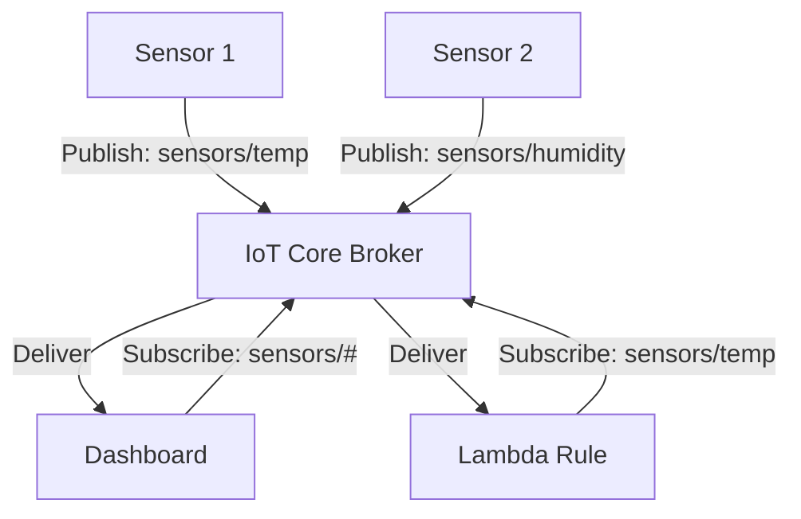

# How to Use IoT Core Message Broker with MQTT

Author: [nawazdhandala](https://github.com/nawazdhandala)

Tags: AWS, IoT Core, MQTT, Message Broker, IoT, Messaging

Description: Use the AWS IoT Core message broker with MQTT protocol for reliable device communication including topics, QoS levels, and retained messages

---

The AWS IoT Core message broker is the central hub for all device communication. It implements the MQTT protocol, which is the de facto standard for IoT messaging - lightweight, efficient, and designed for unreliable networks. Whether your devices are sending temperature readings, receiving firmware commands, or synchronizing state, they all go through the message broker.

This guide covers how to use the IoT Core message broker effectively, including MQTT topics, quality of service levels, retained messages, and last will messages.

## MQTT Basics in IoT Core

MQTT (Message Queuing Telemetry Transport) is a publish-subscribe messaging protocol. Devices do not talk to each other directly - they publish messages to topics and subscribe to topics they care about. The broker handles routing messages from publishers to subscribers.



## Connecting to the Broker

Every device connects to the broker using its IoT Core endpoint with TLS mutual authentication.

```bash
# Get your account's IoT endpoint
ENDPOINT=$(aws iot describe-endpoint \
  --endpoint-type iot:Data-ATS \
  --query 'endpointAddress' --output text)

echo "Endpoint: $ENDPOINT"
# Output: abc123-ats.iot.us-east-1.amazonaws.com
```

### Python Connection Example

```python
# Python MQTT client using paho-mqtt
import paho.mqtt.client as mqtt
import ssl
import json
import time

# Connection parameters
ENDPOINT = "abc123-ats.iot.us-east-1.amazonaws.com"
CLIENT_ID = "sensor-042"
CERT_PATH = "./certs/device-cert.pem"
KEY_PATH = "./certs/device-private.key"
CA_PATH = "./certs/AmazonRootCA1.pem"

def on_connect(client, userdata, flags, rc):
    """Callback when connected to the broker."""
    if rc == 0:
        print(f"Connected to IoT Core as {CLIENT_ID}")
        # Subscribe to command topics after connecting
        client.subscribe(f"devices/{CLIENT_ID}/commands/#", qos=1)
    else:
        print(f"Connection failed with code {rc}")

def on_message(client, userdata, msg):
    """Callback when a message is received."""
    print(f"Received on {msg.topic}: {msg.payload.decode()}")

def on_disconnect(client, userdata, rc):
    """Callback when disconnected."""
    if rc != 0:
        print(f"Unexpected disconnect (rc={rc}), will auto-reconnect")

# Set up the MQTT client
client = mqtt.Client(client_id=CLIENT_ID, protocol=mqtt.MQTTv311)
client.on_connect = on_connect
client.on_message = on_message
client.on_disconnect = on_disconnect

# Configure TLS with device certificates
client.tls_set(
    ca_certs=CA_PATH,
    certfile=CERT_PATH,
    keyfile=KEY_PATH,
    tls_version=ssl.PROTOCOL_TLSv1_2
)

# Connect to IoT Core
client.connect(ENDPOINT, port=8883, keepalive=60)

# Start the network loop in a background thread
client.loop_start()

# Publish telemetry data
while True:
    payload = json.dumps({
        "device_id": CLIENT_ID,
        "temperature": 22.5,
        "humidity": 45.2,
        "timestamp": int(time.time())
    })
    client.publish(
        topic=f"devices/{CLIENT_ID}/telemetry",
        payload=payload,
        qos=1
    )
    print(f"Published: {payload}")
    time.sleep(10)
```

### Node.js Connection Example

```javascript
// Node.js MQTT client using aws-iot-device-sdk-v2
const { mqtt, iot } = require('aws-iot-device-sdk-v2');

const ENDPOINT = 'abc123-ats.iot.us-east-1.amazonaws.com';
const CLIENT_ID = 'sensor-042';

async function connectAndPublish() {
  // Build the MQTT connection configuration
  const config = iot.AwsIotMqttConnectionConfigBuilder.new_mtls_builder_from_path(
    './certs/device-cert.pem',
    './certs/device-private.key'
  )
    .with_certificate_authority_from_path(undefined, './certs/AmazonRootCA1.pem')
    .with_clean_session(true)
    .with_client_id(CLIENT_ID)
    .with_endpoint(ENDPOINT)
    .build();

  // Create and connect the MQTT client
  const client = new mqtt.MqttClient();
  const connection = client.new_connection(config);

  await connection.connect();
  console.log(`Connected as ${CLIENT_ID}`);

  // Subscribe to commands
  await connection.subscribe(
    `devices/${CLIENT_ID}/commands/#`,
    mqtt.QoS.AtLeastOnce,
    (topic, payload) => {
      console.log(`Received on ${topic}: ${new TextDecoder().decode(payload)}`);
    }
  );

  // Publish telemetry every 10 seconds
  setInterval(async () => {
    const payload = JSON.stringify({
      device_id: CLIENT_ID,
      temperature: 22.5 + Math.random() * 2,
      timestamp: Date.now()
    });

    await connection.publish(
      `devices/${CLIENT_ID}/telemetry`,
      payload,
      mqtt.QoS.AtLeastOnce
    );
    console.log(`Published: ${payload}`);
  }, 10000);
}

connectAndPublish().catch(console.error);
```

## MQTT Topics

Topics in IoT Core are UTF-8 strings with forward-slash hierarchy. There is no need to pre-create topics - they exist when something publishes to them.

### Topic Design Best Practices

Structure your topics in a consistent hierarchy:

```
{category}/{device_id}/{data_type}

# Examples:
devices/sensor-042/telemetry
devices/sensor-042/status
devices/sensor-042/commands/reboot
devices/sensor-042/commands/update-config
fleet/warehouse-a/alerts
system/firmware/updates
```

### Topic Wildcards

Subscribers can use two wildcards:

- **`+`** (single-level) - Matches exactly one topic level
- **`#`** (multi-level) - Matches zero or more levels, must be the last character

```bash
# Subscribe to telemetry from all devices
devices/+/telemetry

# Subscribe to everything from sensor-042
devices/sensor-042/#

# Subscribe to all commands for all devices
devices/+/commands/#

# Subscribe to everything (use with caution)
#
```

## Quality of Service (QoS) Levels

IoT Core supports QoS 0 and QoS 1.

### QoS 0 - At Most Once

Fire and forget. The message is sent once with no confirmation. It may be lost if the network connection drops at the wrong moment.

```python
# QoS 0 - best for frequent, non-critical telemetry
client.publish("sensors/temp", payload, qos=0)
```

Use QoS 0 for:
- High-frequency telemetry where losing one reading is acceptable
- Status updates that are quickly superseded by the next one
- Reducing bandwidth usage on constrained networks

### QoS 1 - At Least Once

The message is guaranteed to arrive at least once. The broker acknowledges receipt, and the sender retries if no acknowledgment is received. This can result in duplicate messages.

```python
# QoS 1 - guaranteed delivery, may have duplicates
client.publish("devices/sensor-042/alerts", payload, qos=1)
```

Use QoS 1 for:
- Critical alerts and alarms
- Commands sent to devices
- Any message where loss is unacceptable
- Messages your application must process (make handlers idempotent)

IoT Core does not support QoS 2 (exactly once delivery).

## Retained Messages

A retained message is stored by the broker and immediately delivered to any future subscriber. This is useful for "last known state" scenarios.

```python
# Publish a retained message with the device's current state
client.publish(
    topic=f"devices/{CLIENT_ID}/state",
    payload=json.dumps({"online": True, "firmware": "1.2.0"}),
    qos=1,
    retain=True
)
```

When a new subscriber connects and subscribes to `devices/sensor-042/state`, it immediately receives the last retained message without waiting for the device to publish again.

```bash
# Clear a retained message by publishing an empty payload with retain flag
mosquitto_pub --cafile AmazonRootCA1.pem --cert cert.pem --key key.pem \
  -h $ENDPOINT -p 8883 \
  -t "devices/sensor-042/state" \
  -n -r
```

IoT Core supports up to 4,000 retained messages per account (configurable).

## Last Will and Testament (LWT)

A last will message is published by the broker when a device disconnects unexpectedly (without sending a graceful DISCONNECT packet).

```python
# Set a last will message when creating the client
client = mqtt.Client(client_id=CLIENT_ID)

# Configure LWT before connecting
client.will_set(
    topic=f"devices/{CLIENT_ID}/status",
    payload=json.dumps({"online": False, "reason": "unexpected_disconnect"}),
    qos=1,
    retain=True
)

# Connect to the broker
client.connect(ENDPOINT, port=8883, keepalive=60)
```

When the device connects, publish a "device online" message:

```python
# Publish online status after connecting
client.publish(
    f"devices/{CLIENT_ID}/status",
    json.dumps({"online": True}),
    qos=1,
    retain=True
)
```

Now you have automatic online/offline detection: the retained "online" message is set when the device connects, and the LWT "offline" message replaces it if the device disconnects unexpectedly.

## Shared Subscriptions

IoT Core supports shared subscriptions, which distribute messages across multiple subscribers. This is useful for load balancing backend consumers.

```python
# Shared subscription - messages are distributed among subscribers
# Only one subscriber in the group receives each message
client.subscribe("$share/my-group/devices/+/telemetry", qos=1)
```

## IoT Core MQTT Limits

Be aware of these limits:

| Resource | Limit |
|----------|-------|
| Maximum message size | 128 KB |
| Topic levels | 7 levels deep |
| Subscriptions per connection | 50 |
| Publish rate (per connection) | 100 messages/sec |
| Inbound publish rate (per account) | 20,000 messages/sec |
| Keep-alive interval | 30 to 1200 seconds |
| Connection duration | Up to 24 hours |

## Testing with the MQTT Test Client

IoT Core has a built-in test client, but you can also use the command line.

```bash
# Subscribe to a topic
mosquitto_sub \
  --cafile AmazonRootCA1.pem \
  --cert device-cert.pem \
  --key device-private.key \
  -h "$ENDPOINT" -p 8883 \
  -t "devices/+/telemetry" -v

# Publish to a topic
mosquitto_pub \
  --cafile AmazonRootCA1.pem \
  --cert device-cert.pem \
  --key device-private.key \
  -h "$ENDPOINT" -p 8883 \
  -t "devices/sensor-042/telemetry" \
  -m '{"temperature": 22.5}'
```

## Wrapping Up

The IoT Core message broker gives you a fully managed MQTT infrastructure that scales to millions of devices. Design your topic hierarchy carefully from the start, use QoS 1 for critical messages and QoS 0 for frequent telemetry, and take advantage of retained messages and LWT for device presence tracking. Once your devices are publishing messages, you can use the IoT Core Rules Engine to route them to other AWS services for processing and storage.

For next steps, see our guides on [routing messages to S3 with the Rules Engine](https://oneuptime.com/blog/post/2026-02-12-iot-core-rules-engine-route-messages-s3/view) and [routing messages to DynamoDB](https://oneuptime.com/blog/post/2026-02-12-iot-core-rules-engine-route-messages-dynamodb/view).
