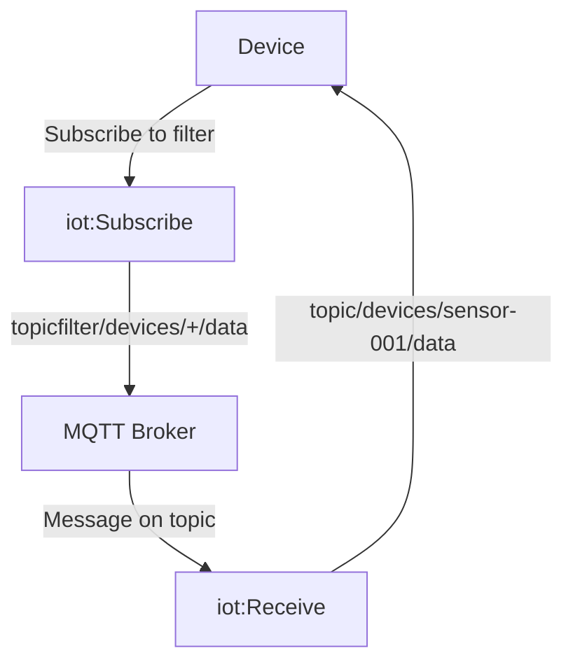

# How to Create IoT Core Policies for Device Permissions

Author: [nawazdhandala](https://github.com/nawazdhandala)

Tags: AWS, IoT Core, Policies, Security, MQTT, Permissions

Description: Create fine-grained AWS IoT Core policies to control device permissions for connecting, publishing, subscribing, and receiving MQTT messages

---

Authentication proves who a device is. Authorization controls what it can do. In AWS IoT Core, policies are the authorization mechanism - they define which MQTT topics a device can publish to, subscribe to, and receive messages from. Getting policies right is critical because an overly permissive policy on a compromised device could give an attacker access to your entire IoT data pipeline.

This guide covers how to write IoT Core policies from simple to advanced, including policy variables for dynamic per-device permissions.

## IoT Core Policy Basics

An IoT Core policy is a JSON document similar to IAM policies, but with IoT-specific actions and resources. Policies are attached to certificates (not things), and a device's permissions are the union of all policies attached to its certificate.

The four IoT actions you control are:

- **iot:Connect** - Permission to connect to the MQTT broker
- **iot:Publish** - Permission to publish to MQTT topics
- **iot:Subscribe** - Permission to subscribe to topic filters
- **iot:Receive** - Permission to receive messages from topics

## A Simple Starting Policy

Here is a basic policy that lets a device connect and communicate on its own topics.

```json
{
  "Version": "2012-10-17",
  "Statement": [
    {
      "Effect": "Allow",
      "Action": "iot:Connect",
      "Resource": "arn:aws:iot:us-east-1:123456789:client/sensor-001"
    },
    {
      "Effect": "Allow",
      "Action": "iot:Publish",
      "Resource": "arn:aws:iot:us-east-1:123456789:topic/devices/sensor-001/telemetry"
    },
    {
      "Effect": "Allow",
      "Action": "iot:Subscribe",
      "Resource": "arn:aws:iot:us-east-1:123456789:topicfilter/devices/sensor-001/commands"
    },
    {
      "Effect": "Allow",
      "Action": "iot:Receive",
      "Resource": "arn:aws:iot:us-east-1:123456789:topic/devices/sensor-001/commands"
    }
  ]
}
```

Create and attach this policy:

```bash
# Create the policy
aws iot create-policy \
  --policy-name "Sensor001Policy" \
  --policy-document file://sensor-policy.json

# Attach it to the device's certificate
aws iot attach-policy \
  --policy-name "Sensor001Policy" \
  --target "arn:aws:iot:us-east-1:123456789:cert/abc123..."
```

## Understanding Subscribe vs Receive

This is the most confusing part of IoT Core policies. Subscribe and Receive are two separate permissions:

- **Subscribe** controls whether a device can subscribe to a topic filter. The resource uses `topicfilter/`.
- **Receive** controls whether a device can receive messages on a specific topic. The resource uses `topic/`.

You need both for a device to actually get messages. Subscribe lets the device register interest, and Receive lets the messages flow.



## Using Policy Variables for Dynamic Permissions

Hardcoding device names in policies does not scale. Policy variables let you write a single policy that works for all devices by referencing the connecting device's identity.

### Thing Name Variable

The most useful variable is `${iot:Connection.Thing.ThingName}`, which resolves to the name of the thing associated with the connecting certificate.

```json
{
  "Version": "2012-10-17",
  "Statement": [
    {
      "Effect": "Allow",
      "Action": "iot:Connect",
      "Resource": "arn:aws:iot:us-east-1:123456789:client/${iot:Connection.Thing.ThingName}"
    },
    {
      "Effect": "Allow",
      "Action": "iot:Publish",
      "Resource": [
        "arn:aws:iot:us-east-1:123456789:topic/devices/${iot:Connection.Thing.ThingName}/telemetry",
        "arn:aws:iot:us-east-1:123456789:topic/devices/${iot:Connection.Thing.ThingName}/status"
      ]
    },
    {
      "Effect": "Allow",
      "Action": "iot:Subscribe",
      "Resource": [
        "arn:aws:iot:us-east-1:123456789:topicfilter/devices/${iot:Connection.Thing.ThingName}/commands/*",
        "arn:aws:iot:us-east-1:123456789:topicfilter/devices/${iot:Connection.Thing.ThingName}/config"
      ]
    },
    {
      "Effect": "Allow",
      "Action": "iot:Receive",
      "Resource": [
        "arn:aws:iot:us-east-1:123456789:topic/devices/${iot:Connection.Thing.ThingName}/commands/*",
        "arn:aws:iot:us-east-1:123456789:topic/devices/${iot:Connection.Thing.ThingName}/config"
      ]
    }
  ]
}
```

This single policy, when attached to any device's certificate, automatically scopes permissions to that device's topic namespace. Sensor-001 can only publish to `devices/sensor-001/...` and sensor-042 can only publish to `devices/sensor-042/...`.

### Client ID Variable

If you do not use thing names as client IDs, you can use the client ID variable instead.

```json
{
  "Effect": "Allow",
  "Action": "iot:Connect",
  "Resource": "arn:aws:iot:us-east-1:123456789:client/${iot:ClientId}"
}
```

### Certificate Variable

For scenarios where you want to scope based on the certificate itself:

```json
{
  "Effect": "Allow",
  "Action": "iot:Publish",
  "Resource": "arn:aws:iot:us-east-1:123456789:topic/certs/${iot:Certificate.Subject.CommonName}/*"
}
```

## Common Policy Patterns

### Pattern 1: Telemetry-Only Device

A device that only sends data upstream.

```json
{
  "Version": "2012-10-17",
  "Statement": [
    {
      "Effect": "Allow",
      "Action": "iot:Connect",
      "Resource": "*"
    },
    {
      "Effect": "Allow",
      "Action": "iot:Publish",
      "Resource": "arn:aws:iot:us-east-1:123456789:topic/telemetry/${iot:Connection.Thing.ThingName}"
    }
  ]
}
```

### Pattern 2: Bidirectional Command and Control

A device that sends telemetry and receives commands.

```json
{
  "Version": "2012-10-17",
  "Statement": [
    {
      "Effect": "Allow",
      "Action": "iot:Connect",
      "Resource": "arn:aws:iot:us-east-1:123456789:client/${iot:Connection.Thing.ThingName}"
    },
    {
      "Effect": "Allow",
      "Action": "iot:Publish",
      "Resource": [
        "arn:aws:iot:us-east-1:123456789:topic/dt/${iot:Connection.Thing.ThingName}/*",
        "arn:aws:iot:us-east-1:123456789:topic/$aws/things/${iot:Connection.Thing.ThingName}/shadow/*"
      ]
    },
    {
      "Effect": "Allow",
      "Action": "iot:Subscribe",
      "Resource": [
        "arn:aws:iot:us-east-1:123456789:topicfilter/cmd/${iot:Connection.Thing.ThingName}/*",
        "arn:aws:iot:us-east-1:123456789:topicfilter/$aws/things/${iot:Connection.Thing.ThingName}/shadow/*"
      ]
    },
    {
      "Effect": "Allow",
      "Action": "iot:Receive",
      "Resource": [
        "arn:aws:iot:us-east-1:123456789:topic/cmd/${iot:Connection.Thing.ThingName}/*",
        "arn:aws:iot:us-east-1:123456789:topic/$aws/things/${iot:Connection.Thing.ThingName}/shadow/*"
      ]
    }
  ]
}
```

### Pattern 3: Device with Thing Shadow Access

Allow a device to use Thing Shadows for state synchronization.

```json
{
  "Version": "2012-10-17",
  "Statement": [
    {
      "Effect": "Allow",
      "Action": "iot:Connect",
      "Resource": "*"
    },
    {
      "Effect": "Allow",
      "Action": ["iot:Publish", "iot:Receive"],
      "Resource": [
        "arn:aws:iot:us-east-1:123456789:topic/$aws/things/${iot:Connection.Thing.ThingName}/shadow/get",
        "arn:aws:iot:us-east-1:123456789:topic/$aws/things/${iot:Connection.Thing.ThingName}/shadow/get/*",
        "arn:aws:iot:us-east-1:123456789:topic/$aws/things/${iot:Connection.Thing.ThingName}/shadow/update",
        "arn:aws:iot:us-east-1:123456789:topic/$aws/things/${iot:Connection.Thing.ThingName}/shadow/update/*"
      ]
    },
    {
      "Effect": "Allow",
      "Action": "iot:Subscribe",
      "Resource": [
        "arn:aws:iot:us-east-1:123456789:topicfilter/$aws/things/${iot:Connection.Thing.ThingName}/shadow/get/*",
        "arn:aws:iot:us-east-1:123456789:topicfilter/$aws/things/${iot:Connection.Thing.ThingName}/shadow/update/*"
      ]
    }
  ]
}
```

### Pattern 4: Shared Topic Access

Allow devices in a group to publish to a shared topic while maintaining individual topics.

```json
{
  "Version": "2012-10-17",
  "Statement": [
    {
      "Effect": "Allow",
      "Action": "iot:Connect",
      "Resource": "*"
    },
    {
      "Effect": "Allow",
      "Action": "iot:Publish",
      "Resource": [
        "arn:aws:iot:us-east-1:123456789:topic/devices/${iot:Connection.Thing.ThingName}/*",
        "arn:aws:iot:us-east-1:123456789:topic/groups/warehouse-a/alerts"
      ]
    }
  ]
}
```

## Policy Versioning

IoT policies support versioning, so you can update a policy without affecting devices until you are ready.

```bash
# Create a new version of an existing policy
aws iot create-policy-version \
  --policy-name "SensorDevicePolicy" \
  --policy-document file://updated-policy.json \
  --set-as-default

# List all versions
aws iot list-policy-versions --policy-name "SensorDevicePolicy"

# Roll back to a previous version
aws iot set-default-policy-version \
  --policy-name "SensorDevicePolicy" \
  --policy-version-id "1"
```

## Testing Policies

Before deploying a policy to production devices, test it.

```bash
# Test if a specific action would be allowed
aws iot test-authorization \
  --auth-infos '[{
    "actionType": "PUBLISH",
    "resources": ["arn:aws:iot:us-east-1:123456789:topic/devices/sensor-042/telemetry"]
  }]' \
  --principal "arn:aws:iot:us-east-1:123456789:cert/abc123..."
```

## Wrapping Up

IoT Core policies are how you enforce the principle of least privilege for your device fleet. Use policy variables to write scalable policies that automatically scope permissions to each device, separate Subscribe and Receive actions carefully, and test your policies before deployment. Start restrictive and add permissions as needed - it is much easier to grant access than to revoke it after a security incident.

For more on IoT Core security, see our guides on [IoT Core certificate-based authentication](https://oneuptime.com/blog/post/2026-02-12-iot-core-certificate-based-authentication/view) and [IoT Core Device Defender for security audits](https://oneuptime.com/blog/post/2026-02-12-iot-core-device-defender-security-audits/view).
