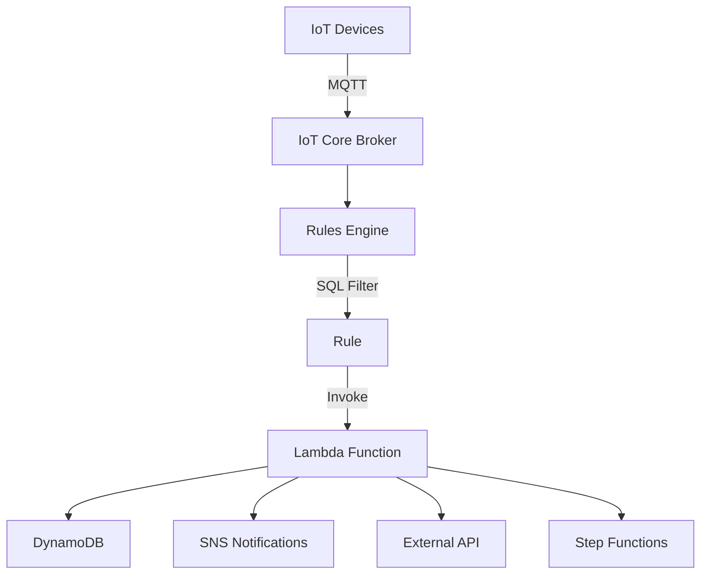

# How to Use IoT Core Rules Engine to Route Messages to Lambda

Author: [nawazdhandala](https://github.com/nawazdhandala)

Tags: AWS, IoT Core, Rules Engine, Lambda, Serverless, IoT

Description: Route IoT device messages to AWS Lambda functions using the IoT Core Rules Engine for custom processing, transformation, and integration logic

---

Sometimes routing messages directly to S3 or DynamoDB is not enough. You need custom logic - data validation, complex transformations, third-party API calls, conditional routing, or triggering multi-step workflows. That is where Lambda comes in. The IoT Core Rules Engine can invoke Lambda functions for every matching message, giving you full programmatic control over how IoT data gets processed.

This guide shows you how to set up IoT Rules that trigger Lambda functions, including function design patterns for IoT workloads.

## When to Use Lambda with IoT Rules

Route to Lambda when you need to:

- Validate or enrich incoming data before storing it
- Call external APIs based on device events
- Implement complex business logic (threshold alerts, anomaly detection)
- Fan out to multiple destinations based on message content
- Transform data formats (e.g., binary to JSON, unit conversions)
- Trigger Step Functions workflows for multi-step processing

For simple store-and-forward, use direct S3 or DynamoDB actions instead - they have lower latency and no Lambda costs.

## Architecture



## Step 1: Create the Lambda Function

Here is a Lambda function that processes IoT telemetry, checks for anomalies, and stores results.

```python
# lambda_function.py - IoT telemetry processor
import json
import boto3
import os
from datetime import datetime

dynamodb = boto3.resource('dynamodb')
sns = boto3.client('sns')

TELEMETRY_TABLE = os.environ.get('TELEMETRY_TABLE', 'DeviceTelemetry')
ALERT_TOPIC_ARN = os.environ.get('ALERT_TOPIC_ARN')
TEMP_THRESHOLD = float(os.environ.get('TEMP_THRESHOLD', '40'))

def lambda_handler(event, context):
    """
    Process IoT device telemetry messages.

    The event is the output of the IoT Rule SQL statement.
    It contains the fields selected by the SQL query.
    """
    print(f"Received event: {json.dumps(event)}")

    device_id = event.get('device_id')
    temperature = event.get('temperature')
    humidity = event.get('humidity')
    timestamp = event.get('timestamp', int(datetime.now().timestamp() * 1000))

    # Validate the data
    if not device_id or temperature is None:
        print(f"Invalid message - missing required fields")
        return {'statusCode': 400, 'body': 'Invalid message'}

    # Enrich with computed fields
    event['processed_at'] = int(datetime.now().timestamp() * 1000)
    event['heat_index'] = calculate_heat_index(temperature, humidity or 50)
    event['status'] = 'normal' if temperature < TEMP_THRESHOLD else 'alert'

    # Store in DynamoDB
    table = dynamodb.Table(TELEMETRY_TABLE)
    table.put_item(Item={
        'device_id': device_id,
        'timestamp': timestamp,
        'temperature': str(temperature),
        'humidity': str(humidity) if humidity else 'N/A',
        'heat_index': str(event['heat_index']),
        'status': event['status'],
        'ttl': int(datetime.now().timestamp()) + 2592000  # 30 days
    })

    # Send alert if threshold exceeded
    if temperature >= TEMP_THRESHOLD and ALERT_TOPIC_ARN:
        sns.publish(
            TopicArn=ALERT_TOPIC_ARN,
            Subject=f"High Temperature Alert: {device_id}",
            Message=json.dumps({
                'device_id': device_id,
                'temperature': temperature,
                'threshold': TEMP_THRESHOLD,
                'timestamp': timestamp
            }, indent=2)
        )
        print(f"Alert sent for {device_id}: {temperature} degrees")

    return {'statusCode': 200, 'processed': device_id}


def calculate_heat_index(temp_c, humidity):
    """Calculate heat index from temperature (Celsius) and humidity."""
    temp_f = temp_c * 9/5 + 32
    hi = 0.5 * (temp_f + 61.0 + ((temp_f - 68.0) * 1.2) + (humidity * 0.094))
    return round((hi - 32) * 5/9, 1)
```

Deploy the function:

```bash
# Package and create the Lambda function
zip function.zip lambda_function.py

aws lambda create-function \
  --function-name IoTTelemetryProcessor \
  --runtime python3.12 \
  --handler lambda_function.lambda_handler \
  --zip-file fileb://function.zip \
  --role arn:aws:iam::123456789:role/IoTLambdaRole \
  --timeout 30 \
  --memory-size 256 \
  --environment "Variables={
    TELEMETRY_TABLE=DeviceTelemetry,
    ALERT_TOPIC_ARN=arn:aws:sns:us-east-1:123456789:iot-alerts,
    TEMP_THRESHOLD=40
  }"
```

## Step 2: Grant IoT Permission to Invoke Lambda

```bash
# Allow IoT Core to invoke the Lambda function
aws lambda add-permission \
  --function-name IoTTelemetryProcessor \
  --statement-id iot-invoke \
  --action lambda:InvokeFunction \
  --principal iot.amazonaws.com \
  --source-arn "arn:aws:iot:us-east-1:123456789:rule/ProcessTelemetry"
```

## Step 3: Create the IoT Rule

```bash
# Create the rule that triggers the Lambda function
aws iot create-topic-rule \
  --rule-name ProcessTelemetry \
  --topic-rule-payload '{
    "sql": "SELECT topic(2) as device_id, temperature, humidity, timestamp() as timestamp FROM '\''devices/+/telemetry'\''",
    "description": "Process telemetry through Lambda for enrichment and alerting",
    "ruleDisabled": false,
    "actions": [
      {
        "lambda": {
          "functionArn": "arn:aws:lambda:us-east-1:123456789:function:IoTTelemetryProcessor"
        }
      }
    ],
    "errorAction": {
      "cloudwatchLogs": {
        "roleArn": "arn:aws:iam::123456789:role/IoTRuleCloudWatchRole",
        "logGroupName": "/iot/rules/errors"
      }
    }
  }'
```

The SQL statement transforms the MQTT message before passing it to Lambda. Only the selected fields appear in the Lambda event.

## Step 4: Handle Different Message Types

You can create multiple rules for different message types, each triggering different Lambda functions or the same function with different inputs.

```bash
# Rule for alert messages - trigger a different handler
aws iot create-topic-rule \
  --rule-name ProcessAlerts \
  --topic-rule-payload '{
    "sql": "SELECT topic(2) as device_id, alert_type, severity, message, timestamp() as timestamp FROM '\''devices/+/alerts'\'' WHERE severity >= 3",
    "actions": [
      {
        "lambda": {
          "functionArn": "arn:aws:lambda:us-east-1:123456789:function:IoTAlertProcessor"
        }
      }
    ]
  }'

# Rule for device status updates
aws iot create-topic-rule \
  --rule-name ProcessStatusUpdates \
  --topic-rule-payload '{
    "sql": "SELECT topic(2) as device_id, status, firmware_version, uptime, timestamp() as timestamp FROM '\''devices/+/status'\''",
    "actions": [
      {
        "lambda": {
          "functionArn": "arn:aws:lambda:us-east-1:123456789:function:IoTStatusProcessor"
        }
      }
    ]
  }'
```

## Node.js Lambda Example

Here is the same processor in Node.js:

```javascript
// index.js - IoT telemetry processor
const { DynamoDBClient, PutItemCommand } = require('@aws-sdk/client-dynamodb');
const { SNSClient, PublishCommand } = require('@aws-sdk/client-sns');
const { marshall } = require('@aws-sdk/util-dynamodb');

const dynamodb = new DynamoDBClient();
const sns = new SNSClient();

const TABLE_NAME = process.env.TELEMETRY_TABLE || 'DeviceTelemetry';
const ALERT_TOPIC = process.env.ALERT_TOPIC_ARN;
const THRESHOLD = parseFloat(process.env.TEMP_THRESHOLD || '40');

exports.handler = async (event) => {
  console.log('Received:', JSON.stringify(event));

  const { device_id, temperature, humidity, timestamp } = event;

  if (!device_id || temperature === undefined) {
    console.error('Invalid message - missing required fields');
    return { statusCode: 400 };
  }

  // Store enriched data in DynamoDB
  const item = {
    device_id,
    timestamp: timestamp || Date.now(),
    temperature,
    humidity: humidity || null,
    status: temperature >= THRESHOLD ? 'alert' : 'normal',
    processed_at: Date.now(),
    ttl: Math.floor(Date.now() / 1000) + 2592000,
  };

  await dynamodb.send(new PutItemCommand({
    TableName: TABLE_NAME,
    Item: marshall(item, { removeUndefinedValues: true }),
  }));

  // Send alert if needed
  if (temperature >= THRESHOLD && ALERT_TOPIC) {
    await sns.send(new PublishCommand({
      TopicArn: ALERT_TOPIC,
      Subject: `High Temperature: ${device_id}`,
      Message: JSON.stringify({ device_id, temperature, threshold: THRESHOLD }),
    }));
    console.log(`Alert sent for ${device_id}`);
  }

  return { statusCode: 200, processed: device_id };
};
```

## CloudFormation Configuration

```yaml
AWSTemplateFormatVersion: '2010-09-09'
Transform: AWS::Serverless-2016-10-31

Resources:
  TelemetryProcessor:
    Type: AWS::Serverless::Function
    Properties:
      FunctionName: IoTTelemetryProcessor
      Runtime: python3.12
      Handler: lambda_function.lambda_handler
      Timeout: 30
      MemorySize: 256
      Environment:
        Variables:
          TELEMETRY_TABLE: !Ref TelemetryTable
          ALERT_TOPIC_ARN: !Ref AlertTopic
          TEMP_THRESHOLD: '40'
      Policies:
        - DynamoDBCrudPolicy:
            TableName: !Ref TelemetryTable
        - SNSPublishMessagePolicy:
            TopicArn: !Ref AlertTopic

  LambdaInvokePermission:
    Type: AWS::Lambda::Permission
    Properties:
      FunctionName: !Ref TelemetryProcessor
      Action: lambda:InvokeFunction
      Principal: iot.amazonaws.com
      SourceArn: !Sub 'arn:aws:iot:${AWS::Region}:${AWS::AccountId}:rule/ProcessTelemetry'

  ProcessTelemetryRule:
    Type: AWS::IoT::TopicRule
    Properties:
      RuleName: ProcessTelemetry
      TopicRulePayload:
        Sql: >-
          SELECT topic(2) as device_id, temperature, humidity,
          timestamp() as timestamp FROM 'devices/+/telemetry'
        Actions:
          - Lambda:
              FunctionArn: !GetAtt TelemetryProcessor.Arn
        RuleDisabled: false

  TelemetryTable:
    Type: AWS::DynamoDB::Table
    Properties:
      TableName: DeviceTelemetry
      BillingMode: PAY_PER_REQUEST
      AttributeDefinitions:
        - AttributeName: device_id
          AttributeType: S
        - AttributeName: timestamp
          AttributeType: N
      KeySchema:
        - AttributeName: device_id
          KeyType: HASH
        - AttributeName: timestamp
          KeyType: RANGE

  AlertTopic:
    Type: AWS::SNS::Topic
    Properties:
      TopicName: iot-alerts
```

## Error Handling Best Practices

Lambda invocations from IoT Rules can fail. Handle errors properly.

**Retries**: IoT Core does not retry failed Lambda invocations. If the function fails, the message is lost (unless you have an error action).

**Error actions**: Always configure an error action on your rule to capture failed messages.

**Async invocation**: IoT Rules invoke Lambda synchronously, so your function has 15 minutes max, but keep it fast - the Rules Engine has its own timeout.

**Dead letter queues**: Configure a DLQ on the Lambda function to capture unprocessed events.

```bash
# Add a dead letter queue to the Lambda function
aws lambda update-function-configuration \
  --function-name IoTTelemetryProcessor \
  --dead-letter-config "TargetArn=arn:aws:sqs:us-east-1:123456789:iot-lambda-dlq"
```

## Performance Considerations

- Lambda cold starts can add latency. Use provisioned concurrency for latency-sensitive rules
- Each IoT Rule invocation creates a separate Lambda invocation - there is no batching
- For high-throughput topics (1000+ messages/sec), consider routing to Kinesis or SQS first, then process in batches with Lambda

## Wrapping Up

Lambda gives you unlimited flexibility for processing IoT messages. Use it when you need custom logic that goes beyond simple store-and-forward. Design your Lambda functions to be fast, idempotent, and error-tolerant. Always configure error actions on your rules and DLQs on your functions so no messages get silently dropped.

For simpler routing patterns, see our guides on [routing messages to S3](https://oneuptime.com/blog/post/2026-02-12-iot-core-rules-engine-route-messages-s3/view) and [routing messages to DynamoDB](https://oneuptime.com/blog/post/2026-02-12-iot-core-rules-engine-route-messages-dynamodb/view).
