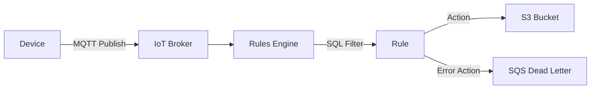

# How to Use IoT Core Rules Engine to Route Messages to S3

Author: [nawazdhandala](https://github.com/nawazdhandala)

Tags: AWS, IoT Core, Rules Engine, S3, Data Storage, IoT

Description: Route IoT device messages to Amazon S3 using the IoT Core Rules Engine for long-term storage, analytics, and data lake integration

---

IoT devices generate enormous amounts of data. Storing all of it in a database is expensive and often unnecessary for real-time querying. Amazon S3 is the natural choice for long-term IoT data storage - it is cheap, durable, and integrates with analytics tools like Athena, Glue, and QuickSight. The IoT Core Rules Engine lets you route messages directly from the MQTT broker to S3 without writing any server-side code.

This guide shows you how to set up rules to route IoT messages to S3, including partitioning strategies for efficient querying later.

## How the Rules Engine Works

The IoT Core Rules Engine evaluates incoming MQTT messages against rules you define. Each rule has:

1. **A SQL statement** that filters and transforms messages
2. **One or more actions** that specify where to send the results
3. **An error action** for handling failures



## Step 1: Create the S3 Bucket

Create a bucket for your IoT data with appropriate settings.

```bash
# Create the S3 bucket for IoT data
aws s3 mb s3://my-iot-data-lake --region us-east-1

# Enable versioning (recommended for data protection)
aws s3api put-bucket-versioning \
  --bucket my-iot-data-lake \
  --versioning-configuration Status=Enabled

# Set up lifecycle rules to manage storage costs
aws s3api put-bucket-lifecycle-configuration \
  --bucket my-iot-data-lake \
  --lifecycle-configuration '{
    "Rules": [
      {
        "ID": "TransitionToIA",
        "Status": "Enabled",
        "Filter": {"Prefix": "raw/"},
        "Transitions": [
          {
            "Days": 30,
            "StorageClass": "STANDARD_IA"
          },
          {
            "Days": 90,
            "StorageClass": "GLACIER"
          }
        ]
      }
    ]
  }'
```

## Step 2: Create the IAM Role

The Rules Engine needs an IAM role to write to S3.

```bash
# Create the trust policy
cat > iot-s3-trust.json << 'EOF'
{
  "Version": "2012-10-17",
  "Statement": [
    {
      "Effect": "Allow",
      "Principal": {
        "Service": "iot.amazonaws.com"
      },
      "Action": "sts:AssumeRole"
    }
  ]
}
EOF

# Create the role
aws iam create-role \
  --role-name IoTRuleS3Role \
  --assume-role-policy-document file://iot-s3-trust.json

# Create the S3 write policy
cat > iot-s3-policy.json << 'EOF'
{
  "Version": "2012-10-17",
  "Statement": [
    {
      "Effect": "Allow",
      "Action": [
        "s3:PutObject"
      ],
      "Resource": "arn:aws:s3:::my-iot-data-lake/*"
    }
  ]
}
EOF

# Attach the policy
aws iam put-role-policy \
  --role-name IoTRuleS3Role \
  --policy-name S3WriteAccess \
  --policy-document file://iot-s3-policy.json
```

## Step 3: Create the IoT Rule

Now create the rule that routes messages to S3.

### Basic Rule - Store All Telemetry

```bash
# Create a rule that routes all telemetry to S3
aws iot create-topic-rule \
  --rule-name StoreTelemetryToS3 \
  --topic-rule-payload '{
    "sql": "SELECT *, topic() as mqtt_topic, timestamp() as received_at FROM '\''devices/+/telemetry'\''",
    "description": "Route device telemetry to S3 for long-term storage",
    "ruleDisabled": false,
    "actions": [
      {
        "s3": {
          "roleArn": "arn:aws:iam::123456789:role/IoTRuleS3Role",
          "bucketName": "my-iot-data-lake",
          "key": "raw/telemetry/${topic(2)}/${parse_time(\"yyyy/MM/dd/HH\", timestamp())}/${timestamp()}-${newuuid()}.json",
          "cannedAcl": "bucket-owner-full-control"
        }
      }
    ],
    "errorAction": {
      "s3": {
        "roleArn": "arn:aws:iam::123456789:role/IoTRuleS3Role",
        "bucketName": "my-iot-data-lake",
        "key": "errors/${parse_time(\"yyyy/MM/dd\", timestamp())}/${timestamp()}-${newuuid()}.json"
      }
    }
  }'
```

The S3 key uses IoT SQL functions to create a well-organized path:

```
raw/telemetry/{device_id}/{year}/{month}/{day}/{hour}/{timestamp}-{uuid}.json
```

For example: `raw/telemetry/sensor-042/2026/02/12/14/1739366400-abc123.json`

This partitioning scheme is critical for query performance with Athena.

### Advanced Rule - Filter and Transform

You can filter messages and reshape the data before storing.

```bash
# Only store high-temperature readings, with transformed payload
aws iot create-topic-rule \
  --rule-name StoreHighTempReadings \
  --topic-rule-payload '{
    "sql": "SELECT device_id, temperature, humidity, timestamp() as server_time, topic(2) as source_device FROM '\''devices/+/telemetry'\'' WHERE temperature > 30",
    "description": "Store only high-temperature readings",
    "ruleDisabled": false,
    "actions": [
      {
        "s3": {
          "roleArn": "arn:aws:iam::123456789:role/IoTRuleS3Role",
          "bucketName": "my-iot-data-lake",
          "key": "alerts/high-temp/${topic(2)}/${parse_time(\"yyyy/MM/dd\", timestamp())}/${timestamp()}.json"
        }
      }
    ]
  }'
```

### Batch Multiple Devices to Partitioned Paths

For efficient analytics, partition by both device type and time.

```bash
# Route different device types to different prefixes
aws iot create-topic-rule \
  --rule-name RouteSensorsByType \
  --topic-rule-payload '{
    "sql": "SELECT * FROM '\''devices/+/telemetry'\''",
    "ruleDisabled": false,
    "actions": [
      {
        "s3": {
          "roleArn": "arn:aws:iam::123456789:role/IoTRuleS3Role",
          "bucketName": "my-iot-data-lake",
          "key": "data/device=${topic(2)}/year=${parse_time(\"yyyy\", timestamp())}/month=${parse_time(\"MM\", timestamp())}/day=${parse_time(\"dd\", timestamp())}/${timestamp()}-${newuuid()}.json"
        }
      }
    ]
  }'
```

The Hive-style partitioning (`key=value/`) makes this data immediately queryable with Athena partition projection.

## Step 4: Configure with CloudFormation

```yaml
AWSTemplateFormatVersion: '2010-09-09'

Resources:
  IoTDataBucket:
    Type: AWS::S3::Bucket
    Properties:
      BucketName: my-iot-data-lake
      VersioningConfiguration:
        Status: Enabled

  IoTRuleRole:
    Type: AWS::IAM::Role
    Properties:
      RoleName: IoTRuleS3Role
      AssumeRolePolicyDocument:
        Version: '2012-10-17'
        Statement:
          - Effect: Allow
            Principal:
              Service: iot.amazonaws.com
            Action: sts:AssumeRole
      Policies:
        - PolicyName: S3WriteAccess
          PolicyDocument:
            Version: '2012-10-17'
            Statement:
              - Effect: Allow
                Action: s3:PutObject
                Resource: !Sub '${IoTDataBucket.Arn}/*'

  TelemetryRule:
    Type: AWS::IoT::TopicRule
    Properties:
      RuleName: StoreTelemetryToS3
      TopicRulePayload:
        Sql: >-
          SELECT *, topic() as mqtt_topic, timestamp() as received_at
          FROM 'devices/+/telemetry'
        Actions:
          - S3:
              RoleArn: !GetAtt IoTRuleRole.Arn
              BucketName: !Ref IoTDataBucket
              Key: >-
                raw/${topic(2)}/${parse_time("yyyy/MM/dd/HH",
                timestamp())}/${timestamp()}-${newuuid()}.json
        ErrorAction:
          S3:
            RoleArn: !GetAtt IoTRuleRole.Arn
            BucketName: !Ref IoTDataBucket
            Key: >-
              errors/${parse_time("yyyy/MM/dd",
              timestamp())}/${timestamp()}-${newuuid()}.json
        RuleDisabled: false
```

## Step 5: Query the Data with Athena

Once data is flowing to S3, you can query it with Athena.

```sql
-- Create an Athena table over the IoT data
CREATE EXTERNAL TABLE iot_telemetry (
  device_id STRING,
  temperature DOUBLE,
  humidity DOUBLE,
  mqtt_topic STRING,
  received_at BIGINT
)
PARTITIONED BY (
  device STRING,
  year STRING,
  month STRING,
  day STRING
)
ROW FORMAT SERDE 'org.openx.data.jsonserde.JsonSerDe'
LOCATION 's3://my-iot-data-lake/data/'
TBLPROPERTIES (
  'projection.enabled' = 'true',
  'projection.device.type' = 'injected',
  'projection.year.type' = 'date',
  'projection.year.range' = '2024,NOW',
  'projection.year.format' = 'yyyy',
  'projection.month.type' = 'date',
  'projection.month.range' = '2024/01,NOW',
  'projection.month.format' = 'yyyy/MM',
  'projection.day.type' = 'date',
  'projection.day.range' = '2024/01/01,NOW',
  'projection.day.format' = 'yyyy/MM/dd',
  'storage.location.template' = 's3://my-iot-data-lake/data/device=${device}/year=${year}/month=${month}/day=${day}/'
);

-- Query average temperature by device for today
SELECT device_id, AVG(temperature) as avg_temp, COUNT(*) as readings
FROM iot_telemetry
WHERE year = '2026' AND month = '02' AND day = '12'
GROUP BY device_id
ORDER BY avg_temp DESC;
```

## IoT SQL Functions Reference

Useful functions for S3 key generation:

| Function | Description | Example Output |
|----------|-------------|----------------|
| `topic()` | Full topic string | `devices/sensor-042/telemetry` |
| `topic(n)` | Nth topic level (0-indexed) | `sensor-042` |
| `timestamp()` | Current epoch ms | `1739366400000` |
| `parse_time(fmt, ts)` | Format a timestamp | `2026/02/12` |
| `newuuid()` | Generate a UUID | `a1b2c3d4-...` |
| `clientid()` | MQTT client ID | `sensor-042` |

## Handling Large Message Volumes

For high-throughput scenarios (thousands of messages per second), individual S3 objects per message can create too many small files. Consider using Kinesis Data Firehose as an intermediary to batch messages.

```bash
# Alternative: Route to Firehose, which batches to S3
aws iot create-topic-rule \
  --rule-name BatchTelemetryViaFirehose \
  --topic-rule-payload '{
    "sql": "SELECT * FROM '\''devices/+/telemetry'\''",
    "actions": [
      {
        "firehose": {
          "roleArn": "arn:aws:iam::123456789:role/IoTRuleFirehoseRole",
          "deliveryStreamName": "iot-telemetry-stream",
          "separator": "\n",
          "batchMode": true
        }
      }
    ]
  }'
```

Firehose buffers messages and writes them to S3 in larger batches (configurable by size or time interval), which is more efficient for analytics queries.

## Wrapping Up

Routing IoT messages to S3 through the Rules Engine gives you a serverless, scalable data pipeline for IoT telemetry. The key is getting the S3 key partitioning right from the start - use time-based and device-based partitions that align with how you plan to query the data. For high-volume deployments, add Kinesis Data Firehose as a batching layer to avoid creating millions of tiny S3 objects.

For routing to other destinations, see our guides on [routing messages to DynamoDB](https://oneuptime.com/blog/post/2026-02-12-iot-core-rules-engine-route-messages-dynamodb/view) and [routing messages to Lambda](https://oneuptime.com/blog/post/2026-02-12-iot-core-rules-engine-route-messages-lambda/view).
