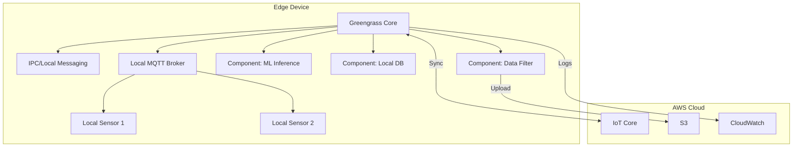

# How to Set Up IoT Greengrass v2 on Edge Devices

Author: [nawazdhandala](https://github.com/nawazdhandala)

Tags: AWS, IoT Greengrass, Edge Computing, IoT, Lambda, Containers

Description: Install and configure AWS IoT Greengrass v2 on edge devices to run local compute, messaging, and machine learning inference at the edge

---

Not every IoT workload can afford the latency of a round trip to the cloud. Real-time control systems, local data filtering, intermittent connectivity scenarios, and privacy-sensitive applications all need compute at the edge. AWS IoT Greengrass v2 lets you run AWS Lambda functions, Docker containers, and custom components directly on your edge devices while maintaining a managed connection to the cloud.

This guide walks through installing Greengrass v2 on an edge device, deploying components, and managing your edge fleet.

## What Is Greengrass v2?

Greengrass v2 is the next generation of the Greengrass edge runtime. It is a complete rewrite from v1, with a modular architecture based on components.



Key improvements over v1:
- **Component-based**: Everything is a component, including the core runtime
- **Open source**: The core SDK is open source
- **Docker support**: Run Docker containers as components
- **Smaller footprint**: Runs on devices with as little as 256MB RAM
- **Fleet deployment**: Deploy to thousands of devices at once

## Prerequisites

Your edge device needs:

- Linux OS (Amazon Linux 2, Ubuntu 18.04+, Raspberry Pi OS, etc.)
- Java 8 or higher (Amazon Corretto recommended)
- Python 3.6+ (for some components)
- At least 256MB RAM and 256MB disk space
- An AWS IoT thing registered for this device
- Network access to AWS endpoints

## Step 1: Provision the Device in IoT Core

Create a thing, certificate, and policy for the Greengrass core device.

```bash
# Create the IoT thing for the Greengrass core
aws iot create-thing \
  --thing-name "my-greengrass-core"

# Create a certificate
aws iot create-keys-and-certificate \
  --set-as-active \
  --certificate-pem-outfile gg-cert.pem \
  --public-key-outfile gg-public.key \
  --private-key-outfile gg-private.key

CERT_ARN=$(aws iot describe-certificate \
  --certificate-id "YOUR_CERT_ID" \
  --query 'certificateDescription.certificateArn' --output text)

# Create a policy for Greengrass
aws iot create-policy \
  --policy-name "GreengrassV2Policy" \
  --policy-document '{
    "Version": "2012-10-17",
    "Statement": [
      {
        "Effect": "Allow",
        "Action": [
          "iot:Publish",
          "iot:Subscribe",
          "iot:Receive",
          "iot:Connect"
        ],
        "Resource": "*"
      },
      {
        "Effect": "Allow",
        "Action": [
          "greengrass:*"
        ],
        "Resource": "*"
      },
      {
        "Effect": "Allow",
        "Action": [
          "iot:GetThingShadow",
          "iot:UpdateThingShadow",
          "iot:DeleteThingShadow"
        ],
        "Resource": "*"
      }
    ]
  }'

# Attach certificate and policy
aws iot attach-policy \
  --policy-name "GreengrassV2Policy" \
  --target "$CERT_ARN"

aws iot attach-thing-principal \
  --thing-name "my-greengrass-core" \
  --principal "$CERT_ARN"
```

## Step 2: Install Greengrass v2 on the Device

SSH into your edge device and install the Greengrass core software.

```bash
# Download the Greengrass v2 installer
curl -s https://d2s8p88vqu9w66.cloudfront.net/releases/greengrass-nucleus-latest.zip \
  -o greengrass-nucleus-latest.zip

# Unzip the installer
unzip greengrass-nucleus-latest.zip -d GreengrassInstaller

# Install Java if not present
sudo apt install -y default-jdk  # Ubuntu/Debian
# Or: sudo yum install -y java-11-amazon-corretto  # Amazon Linux

# Run the installer
sudo java -Droot="/greengrass/v2" \
  -Dlog.store=FILE \
  -jar ./GreengrassInstaller/lib/Greengrass.jar \
  --aws-region us-east-1 \
  --thing-name my-greengrass-core \
  --thing-group-name MyGreengrassCoreGroup \
  --thing-policy-name GreengrassV2Policy \
  --tes-role-name GreengrassV2TokenExchangeRole \
  --tes-role-alias-name GreengrassCoreTokenExchangeRoleAlias \
  --component-default-user ggc_user:ggc_group \
  --provision true \
  --setup-system-service true \
  --deploy-dev-tools true
```

The `--provision true` flag tells the installer to automatically create the IAM roles and policies needed by Greengrass. The `--setup-system-service true` flag registers Greengrass as a systemd service.

## Step 3: Verify the Installation

```bash
# Check that the Greengrass service is running
sudo systemctl status greengrass

# Check the Greengrass logs
sudo tail -f /greengrass/v2/logs/greengrass.log

# Verify the device shows up in the cloud
aws greengrassv2 list-core-devices \
  --query 'coreDevices[?coreDeviceThingName==`my-greengrass-core`]'
```

## Step 4: Create a Custom Component

Components are the building blocks of Greengrass deployments. Let us create a simple component that reads sensor data and publishes it to IoT Core.

### Component Recipe

The recipe defines the component metadata, dependencies, and lifecycle.

```yaml
# recipe.yaml
---
RecipeFormatVersion: "2020-01-25"
ComponentName: com.example.SensorReader
ComponentVersion: "1.0.0"
ComponentDescription: Reads local sensor data and publishes to IoT Core
ComponentPublisher: MyCompany

ComponentDependencies:
  aws.greengrass.Nucleus:
    VersionRequirement: ">=2.0.0"
  aws.greengrass.TokenExchangeService:
    VersionRequirement: ">=2.0.0"

ComponentConfiguration:
  DefaultConfiguration:
    readIntervalSeconds: 10
    topic: "devices/{iot:thingName}/telemetry"

Manifests:
  - Platform:
      os: linux
    Lifecycle:
      install:
        script: "pip3 install awsiotsdk"
      run:
        script: "python3 {artifacts:path}/sensor_reader.py"
        Setenv:
          READ_INTERVAL: "{configuration:/readIntervalSeconds}"
          PUBLISH_TOPIC: "{configuration:/topic}"
    Artifacts:
      - URI: "s3://my-greengrass-components/com.example.SensorReader/1.0.0/sensor_reader.py"
```

### Component Code

```python
# sensor_reader.py - Edge component that reads sensor data
import time
import json
import os
import random
import awsiot.greengrasscoreipc
from awsiot.greengrasscoreipc.model import (
    PublishToIoTCoreRequest,
    QOS
)

# Configuration from the component recipe
READ_INTERVAL = int(os.environ.get('READ_INTERVAL', '10'))
PUBLISH_TOPIC = os.environ.get('PUBLISH_TOPIC', 'devices/unknown/telemetry')

def read_sensor():
    """Read from a local sensor (simulated here)."""
    return {
        'temperature': round(20 + random.uniform(-5, 15), 1),
        'humidity': round(40 + random.uniform(-10, 30), 1),
        'pressure': round(1013 + random.uniform(-10, 10), 1)
    }

def main():
    # Connect to the Greengrass IPC
    ipc_client = awsiot.greengrasscoreipc.connect()

    print(f"Sensor reader started. Publishing to {PUBLISH_TOPIC} every {READ_INTERVAL}s")

    while True:
        try:
            # Read sensor data
            data = read_sensor()
            data['timestamp'] = int(time.time() * 1000)

            payload = json.dumps(data)

            # Publish to IoT Core via Greengrass
            request = PublishToIoTCoreRequest(
                topic_name=PUBLISH_TOPIC,
                qos=QOS.AT_LEAST_ONCE,
                payload=payload.encode()
            )
            ipc_client.new_publish_to_iot_core().activate(request).result(timeout=5)

            print(f"Published: {payload}")

        except Exception as e:
            print(f"Error: {e}")

        time.sleep(READ_INTERVAL)

if __name__ == '__main__':
    main()
```

### Upload and Register the Component

```bash
# Upload the artifact to S3
aws s3 cp sensor_reader.py \
  s3://my-greengrass-components/com.example.SensorReader/1.0.0/sensor_reader.py

# Create the component in Greengrass
aws greengrassv2 create-component-version \
  --inline-recipe fileb://recipe.yaml
```

## Step 5: Deploy Components to Devices

Create a deployment that targets your core device or a group of devices.

```bash
# Deploy the sensor reader component to a specific device
aws greengrassv2 create-deployment \
  --target-arn "arn:aws:iot:us-east-1:123456789:thing/my-greengrass-core" \
  --deployment-name "SensorReaderDeployment" \
  --components '{
    "com.example.SensorReader": {
      "componentVersion": "1.0.0",
      "configurationUpdate": {
        "merge": "{\"readIntervalSeconds\": 5, \"topic\": \"devices/my-greengrass-core/telemetry\"}"
      }
    },
    "aws.greengrass.Cli": {
      "componentVersion": "2.12.0"
    }
  }'
```

### Deploy to a Thing Group

For fleet deployments, target a thing group.

```bash
# Deploy to all devices in a group
aws greengrassv2 create-deployment \
  --target-arn "arn:aws:iot:us-east-1:123456789:thinggroup/production-edge-devices" \
  --deployment-name "FleetSensorDeployment" \
  --components '{
    "com.example.SensorReader": {
      "componentVersion": "1.0.0"
    }
  }' \
  --deployment-policies '{
    "failureHandlingPolicy": "ROLLBACK",
    "componentUpdatePolicy": {
      "timeoutInSeconds": 60,
      "action": "NOTIFY_COMPONENTS"
    }
  }'
```

## Step 6: Monitor the Deployment

```bash
# Check deployment status
aws greengrassv2 get-deployment \
  --deployment-id "deployment-id-here" \
  --query '{Status:deploymentStatus,Components:components}'

# List component installations on a device
aws greengrassv2 list-installed-components \
  --core-device-thing-name "my-greengrass-core"

# Check effective deployment on a device
aws greengrassv2 list-effective-deployments \
  --core-device-thing-name "my-greengrass-core"
```

On the device itself:

```bash
# Check component status via the Greengrass CLI
sudo /greengrass/v2/bin/greengrass-cli component list

# View component logs
sudo tail -f /greengrass/v2/logs/com.example.SensorReader.log
```

## Running Docker Containers as Components

Greengrass v2 can run Docker containers as components.

```yaml
# recipe for a Docker-based component
---
RecipeFormatVersion: "2020-01-25"
ComponentName: com.example.DockerApp
ComponentVersion: "1.0.0"
ComponentDescription: Docker-based edge application

ComponentDependencies:
  aws.greengrass.DockerApplicationManager:
    VersionRequirement: ">=2.0.0"
  aws.greengrass.TokenExchangeService:
    VersionRequirement: ">=2.0.0"

Manifests:
  - Platform:
      os: linux
    Lifecycle:
      run:
        script: |
          docker run --rm \
            -e MQTT_HOST=localhost \
            -e MQTT_PORT=8883 \
            123456789.dkr.ecr.us-east-1.amazonaws.com/my-edge-app:latest
    Artifacts:
      - URI: "docker:123456789.dkr.ecr.us-east-1.amazonaws.com/my-edge-app:latest"
```

## Local Messaging Between Components

Components on the same device can communicate through the local pub/sub IPC.

```python
# Subscribe to local messages from another component
from awsiot.greengrasscoreipc.model import (
    SubscribeToTopicRequest
)

def on_message(event):
    """Handle local messages from other components."""
    message = event.message
    print(f"Received local message on {message.topic}: {message.payload}")

# Subscribe to a local topic
request = SubscribeToTopicRequest(topic="local/sensor/data")
handler = StreamHandler()
handler.on_stream_event = on_message
ipc_client.new_subscribe_to_topic(handler).activate(request)
```

## Managing Greengrass at Scale

For large edge deployments, use thing groups for targeted deployments and rollback policies for safety.

```bash
# Create a thing group for edge devices
aws iot create-thing-group \
  --thing-group-name "edge-devices-us-east" \
  --thing-group-properties '{
    "thingGroupDescription": "Edge devices in US East region"
  }'

# Add devices to the group
aws iot add-thing-to-thing-group \
  --thing-group-name "edge-devices-us-east" \
  --thing-name "my-greengrass-core"
```

## Wrapping Up

Greengrass v2 brings cloud-like component deployment to edge devices. The component model gives you flexibility to run Lambda functions, Docker containers, or custom processes, all managed from the cloud. Start with the Greengrass installer for a quick setup, create custom components for your edge logic, and use thing groups for fleet-wide deployments. The local messaging system lets components communicate efficiently without cloud round-trips.

For deploying Lambda functions to the edge specifically, see our guide on [deploying Lambda functions to edge with IoT Greengrass](https://oneuptime.com/blog/post/deploy-lambda-functions-edge-iot-greengrass/view). For the IoT Core side of things, see our guide on [setting up AWS IoT Core for device connectivity](https://oneuptime.com/blog/post/set-up-aws-iot-core-for-device-connectivity/view).
