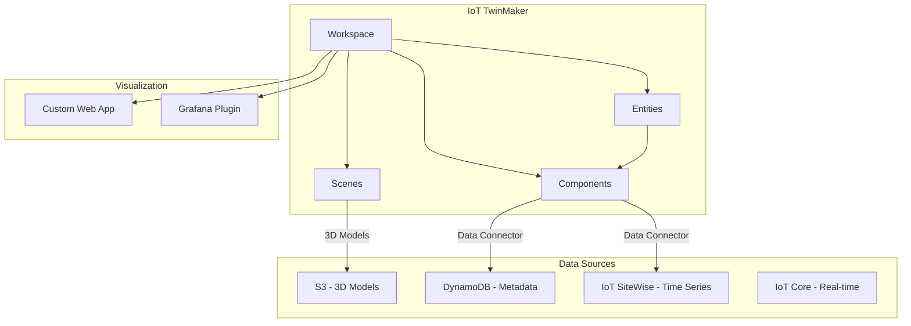
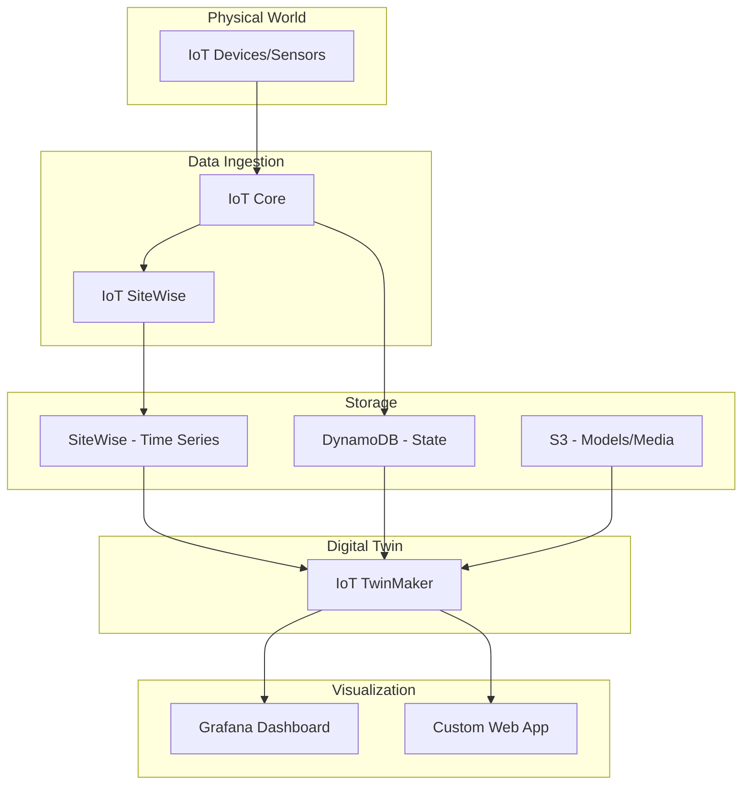

# How to Use IoT TwinMaker for Digital Twins

Author: [nawazdhandala](https://github.com/nawazdhandala)

Tags: AWS, IoT TwinMaker, Digital Twins, IoT, 3D Visualization, Monitoring

Description: Build digital twins of physical systems using AWS IoT TwinMaker to visualize real-time IoT data in 3D models and composite dashboards

---

A digital twin is a virtual replica of a physical system - a factory floor, a building, a wind farm, or any complex environment. It combines real-time sensor data with 3D models and contextual information to give operators a unified view of what is happening in the physical world. AWS IoT TwinMaker is the service that makes building digital twins practical, connecting your IoT data sources with spatial models and visualization tools.

This guide walks through creating a digital twin from scratch, from defining your workspace to connecting live IoT data.

## What Is IoT TwinMaker?

TwinMaker is a data and model orchestration layer. It does not store your IoT data or host your 3D models - instead, it connects to where that data already lives and provides a unified API for querying it.



Key concepts:

- **Workspace**: The top-level container for a digital twin
- **Entity**: Represents a physical thing (a machine, a room, a sensor)
- **Component**: Connects an entity to a data source (time series, metadata, alarms)
- **Scene**: A 3D visualization combining entities with spatial models
- **Data Connector**: Lambda function that fetches data from external sources

## Step 1: Create a TwinMaker Workspace

```bash
# Create an S3 bucket for workspace resources (3D models, scenes)
aws s3 mb s3://my-twinmaker-workspace --region us-east-1

# Create the IAM role for TwinMaker
cat > twinmaker-trust.json << 'EOF'
{
  "Version": "2012-10-17",
  "Statement": [
    {
      "Effect": "Allow",
      "Principal": {
        "Service": "iottwinmaker.amazonaws.com"
      },
      "Action": "sts:AssumeRole"
    }
  ]
}
EOF

aws iam create-role \
  --role-name IoTTwinMakerRole \
  --assume-role-policy-document file://twinmaker-trust.json

# Attach required policies
cat > twinmaker-policy.json << 'EOF'
{
  "Version": "2012-10-17",
  "Statement": [
    {
      "Effect": "Allow",
      "Action": [
        "s3:GetObject",
        "s3:PutObject",
        "s3:ListBucket"
      ],
      "Resource": [
        "arn:aws:s3:::my-twinmaker-workspace",
        "arn:aws:s3:::my-twinmaker-workspace/*"
      ]
    },
    {
      "Effect": "Allow",
      "Action": [
        "lambda:InvokeFunction"
      ],
      "Resource": "arn:aws:lambda:us-east-1:123456789:function:twinmaker-*"
    },
    {
      "Effect": "Allow",
      "Action": [
        "iotsitewise:GetAssetPropertyValue",
        "iotsitewise:GetAssetPropertyValueHistory",
        "iotsitewise:BatchGetAssetPropertyValue"
      ],
      "Resource": "*"
    }
  ]
}
EOF

aws iam put-role-policy \
  --role-name IoTTwinMakerRole \
  --policy-name TwinMakerAccess \
  --policy-document file://twinmaker-policy.json

# Create the workspace
aws iottwinmaker create-workspace \
  --workspace-id "my-factory-twin" \
  --s3-location "s3://my-twinmaker-workspace" \
  --role "arn:aws:iam::123456789:role/IoTTwinMakerRole" \
  --description "Digital twin of the factory floor"
```

## Step 2: Define Component Types

Component types define the shape of data that entities can have. Think of them as schemas.

### Time Series Component Type (IoT SiteWise)

```bash
# Create a component type for temperature sensors using SiteWise
aws iottwinmaker create-component-type \
  --workspace-id "my-factory-twin" \
  --component-type-id "com.example.TemperatureSensor" \
  --description "Temperature sensor with SiteWise time series data" \
  --property-definitions '{
    "temperature": {
      "dataType": {"type": "DOUBLE"},
      "isTimeSeries": true,
      "isRequiredInEntity": false
    },
    "humidity": {
      "dataType": {"type": "DOUBLE"},
      "isTimeSeries": true,
      "isRequiredInEntity": false
    },
    "sensorModel": {
      "dataType": {"type": "STRING"},
      "isTimeSeries": false,
      "isRequiredInEntity": false
    },
    "installDate": {
      "dataType": {"type": "STRING"},
      "isTimeSeries": false,
      "isRequiredInEntity": false
    }
  }' \
  --functions '{
    "dataReader": {
      "implementedBy": {
        "type": "DATA_CONNECTOR",
        "lambda": {
          "arn": "arn:aws:lambda:us-east-1:123456789:function:twinmaker-sitewise-reader"
        }
      }
    }
  }'
```

### Alarm Component Type

```bash
# Create a component type for equipment alarms
aws iottwinmaker create-component-type \
  --workspace-id "my-factory-twin" \
  --component-type-id "com.example.EquipmentAlarm" \
  --description "Equipment alarm status" \
  --property-definitions '{
    "alarmStatus": {
      "dataType": {
        "type": "STRING",
        "allowedValues": [
          {"stringValue": "NORMAL"},
          {"stringValue": "WARNING"},
          {"stringValue": "CRITICAL"},
          {"stringValue": "ACKNOWLEDGED"}
        ]
      },
      "isTimeSeries": true
    },
    "alarmMessage": {
      "dataType": {"type": "STRING"},
      "isTimeSeries": true
    }
  }'
```

## Step 3: Create Entities

Entities represent the physical things in your digital twin.

```bash
# Create an entity for a machine on the factory floor
aws iottwinmaker create-entity \
  --workspace-id "my-factory-twin" \
  --entity-id "machine-001" \
  --entity-name "CNC Machine 1" \
  --description "CNC milling machine in Zone A" \
  --components '{
    "temperatureSensor": {
      "componentTypeId": "com.example.TemperatureSensor",
      "properties": {
        "sensorModel": {
          "value": {"stringValue": "TMP-117"}
        },
        "installDate": {
          "value": {"stringValue": "2025-06-15"}
        }
      }
    },
    "alarm": {
      "componentTypeId": "com.example.EquipmentAlarm"
    }
  }'

# Create a parent entity for the factory zone
aws iottwinmaker create-entity \
  --workspace-id "my-factory-twin" \
  --entity-id "zone-a" \
  --entity-name "Manufacturing Zone A" \
  --description "Primary manufacturing zone"

# Create child entities with parent relationship
aws iottwinmaker create-entity \
  --workspace-id "my-factory-twin" \
  --entity-id "machine-002" \
  --entity-name "Assembly Robot 1" \
  --parent-entity-id "zone-a" \
  --components '{
    "temperatureSensor": {
      "componentTypeId": "com.example.TemperatureSensor"
    }
  }'
```

## Step 4: Create a Data Connector

Data connectors are Lambda functions that TwinMaker calls to fetch data from your sources.

```python
# twinmaker_data_connector.py - Fetches data from DynamoDB
import json
import boto3
from datetime import datetime

dynamodb = boto3.resource('dynamodb')
table = dynamodb.Table('DeviceTelemetry')

def lambda_handler(event, context):
    """
    TwinMaker data connector for fetching device telemetry.

    TwinMaker sends a request with entity info and time range.
    We return the data in TwinMaker's expected format.
    """
    print(f"Request: {json.dumps(event)}")

    # Extract request parameters
    entity_id = event.get('entityId')
    component_name = event.get('componentName')
    selected_properties = event.get('selectedProperties', [])
    start_time = event.get('startTime')
    end_time = event.get('endTime')

    # Query DynamoDB for the device's telemetry
    response = table.query(
        KeyConditionExpression='device_id = :did AND #ts BETWEEN :start AND :end',
        ExpressionAttributeNames={'#ts': 'timestamp'},
        ExpressionAttributeValues={
            ':did': entity_id,
            ':start': int(datetime.fromisoformat(start_time).timestamp() * 1000),
            ':end': int(datetime.fromisoformat(end_time).timestamp() * 1000)
        },
        ScanIndexForward=True,
        Limit=1000
    )

    # Format response for TwinMaker
    property_values = {}
    for prop in selected_properties:
        values = []
        for item in response.get('Items', []):
            if prop in item:
                values.append({
                    'time': datetime.fromtimestamp(
                        int(item['timestamp']) / 1000
                    ).isoformat() + 'Z',
                    'value': {
                        'doubleValue': float(item[prop])
                    }
                })
        property_values[prop] = {'propertyReference': {
            'propertyName': prop,
            'entityId': entity_id,
            'componentName': component_name
        }, 'propertyValue': values}

    return {
        'propertyValues': list(property_values.values())
    }
```

Deploy and connect the connector:

```bash
# Deploy the data connector Lambda
zip -j connector.zip twinmaker_data_connector.py
aws lambda create-function \
  --function-name twinmaker-dynamodb-reader \
  --runtime python3.12 \
  --handler twinmaker_data_connector.lambda_handler \
  --zip-file fileb://connector.zip \
  --role arn:aws:iam::123456789:role/TwinMakerConnectorRole \
  --timeout 30

# Allow TwinMaker to invoke the Lambda
aws lambda add-permission \
  --function-name twinmaker-dynamodb-reader \
  --statement-id twinmaker-invoke \
  --action lambda:InvokeFunction \
  --principal iottwinmaker.amazonaws.com
```

## Step 5: Create a Scene

Scenes are 3D visualizations of your digital twin. Upload a 3D model first, then create the scene.

```bash
# Upload a 3D model (glTF format) to S3
aws s3 cp factory-floor.gltf s3://my-twinmaker-workspace/models/factory-floor.gltf

# Create a scene
aws iottwinmaker create-scene \
  --workspace-id "my-factory-twin" \
  --scene-id "factory-overview" \
  --content-location "s3://my-twinmaker-workspace/scenes/factory-overview.json" \
  --description "3D overview of the factory floor"
```

The scene definition file is a JSON document that maps entities to positions in 3D space, applies data overlays, and configures interactive elements. You typically create these through the TwinMaker console's scene editor.

## Step 6: Query the Digital Twin

Use the TwinMaker API to query entity data programmatically.

```bash
# Get the current state of an entity
aws iottwinmaker get-entity \
  --workspace-id "my-factory-twin" \
  --entity-id "machine-001"

# Query property values (current and historical)
aws iottwinmaker get-property-value-history \
  --workspace-id "my-factory-twin" \
  --entity-id "machine-001" \
  --component-name "temperatureSensor" \
  --selected-properties '["temperature", "humidity"]' \
  --start-time "2026-02-12T00:00:00Z" \
  --end-time "2026-02-12T23:59:59Z"

# Get the current property value
aws iottwinmaker get-property-value \
  --workspace-id "my-factory-twin" \
  --entity-id "machine-001" \
  --component-name "temperatureSensor" \
  --selected-properties '["temperature"]'
```

## Step 7: Visualize with Grafana

TwinMaker has a Grafana plugin for building dashboards.

```bash
# Install the TwinMaker Grafana plugin
grafana-cli plugins install grafana-iot-twinmaker-app

# Or if using Docker
docker run -d \
  -p 3000:3000 \
  -e GF_INSTALL_PLUGINS=grafana-iot-twinmaker-app \
  grafana/grafana
```

In Grafana, add TwinMaker as a data source and configure it with your workspace ID and region. Then you can create panels that show:

- 3D scene views with live data overlays
- Time-series charts from entity properties
- Alarm status dashboards
- Entity relationship diagrams

## Real-World Use Cases

### Manufacturing Floor Monitoring

Map CNC machines, robots, and conveyors to entities. Attach temperature, vibration, and throughput sensors. Visualize the entire production line in 3D with real-time status indicators.

### Building Management

Create entities for HVAC systems, lighting zones, and occupancy sensors. Monitor energy usage, temperature comfort, and air quality across floors.

### Energy Infrastructure

Model wind turbines or solar panels with performance data. Track power output, maintenance schedules, and weather conditions.

## Architecture for a Complete Digital Twin



## Wrapping Up

IoT TwinMaker gives you the orchestration layer to build digital twins without reinventing the data plumbing. Define your physical world as entities and components, connect them to your existing data sources through data connectors, and visualize everything in 3D scenes or Grafana dashboards. Start simple - model a single room or machine - and expand from there. The entity hierarchy and component model scale to thousands of connected things.

For getting IoT data into TwinMaker, see our guides on [setting up AWS IoT Core for device connectivity](https://oneuptime.com/blog/post/set-up-aws-iot-core-for-device-connectivity/view) and [routing IoT messages to DynamoDB](https://oneuptime.com/blog/post/iot-core-rules-engine-route-messages-dynamodb/view).
