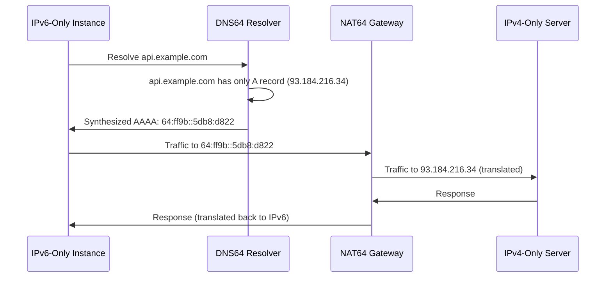

# How to Set Up IPv6-Only Subnets in VPC

Author: [nawazdhandala](https://github.com/nawazdhandala)

Tags: AWS, VPC, IPv6, Networking

Description: A practical guide to creating and configuring IPv6-only subnets in AWS VPC, including NAT64, DNS64, and how to handle IPv4-only dependencies.

---

IPv4 address exhaustion is real. AWS charges for public IPv4 addresses now, and the cost adds up fast when you're running hundreds or thousands of instances. IPv6-only subnets offer a way out. Your instances get IPv6 addresses (which are free and abundant) and can still reach IPv4 services through NAT64 and DNS64 translation.

This isn't just about saving money, though. IPv6-only subnets simplify network design - no more NAT gateways for outbound IPv4 traffic, no more worrying about overlapping private IPv4 ranges, and no more CIDR planning headaches. Let's set it up.

## Prerequisites

Your VPC needs an IPv6 CIDR block before you can create IPv6-only subnets.

Add an IPv6 CIDR to your VPC:

```bash
# Associate an Amazon-provided IPv6 CIDR block
aws ec2 associate-vpc-cidr-block \
  --vpc-id vpc-abc123 \
  --amazon-provided-ipv6-cidr-block

# Check the assigned CIDR
aws ec2 describe-vpcs \
  --vpc-ids vpc-abc123 \
  --query 'Vpcs[0].Ipv6CidrBlockAssociationSet'
```

AWS assigns a /56 IPv6 CIDR block. You'll carve /64 subnets out of this.

## Creating IPv6-Only Subnets

Create subnets with only IPv6 addressing - no IPv4 CIDR.

Create IPv6-only subnets:

```bash
# Create an IPv6-only subnet in AZ 1
aws ec2 create-subnet \
  --vpc-id vpc-abc123 \
  --ipv6-native \
  --ipv6-cidr-block 2600:1f18:abc:100::/64 \
  --availability-zone us-east-1a \
  --tag-specifications 'ResourceType=subnet,Tags=[{Key=Name,Value=ipv6-only-az1}]'

# Create an IPv6-only subnet in AZ 2
aws ec2 create-subnet \
  --vpc-id vpc-abc123 \
  --ipv6-native \
  --ipv6-cidr-block 2600:1f18:abc:200::/64 \
  --availability-zone us-east-1b \
  --tag-specifications 'ResourceType=subnet,Tags=[{Key=Name,Value=ipv6-only-az2}]'

# Enable auto-assign IPv6 addresses
aws ec2 modify-subnet-attribute \
  --subnet-id subnet-ipv6-az1 \
  --assign-ipv6-address-on-creation
```

The `--ipv6-native` flag is key - it tells AWS this subnet is IPv6-only. Instances launched here won't get IPv4 addresses.

## Setting Up DNS64 and NAT64

IPv6-only instances can't reach IPv4 services directly. DNS64 translates IPv4 DNS responses into IPv6-compatible addresses, and NAT64 (provided by the NAT gateway) handles the actual packet translation.

Enable DNS64 and create a NAT gateway with IPv6:

```bash
# Enable DNS64 on the subnet
aws ec2 modify-subnet-attribute \
  --subnet-id subnet-ipv6-az1 \
  --enable-dns64

aws ec2 modify-subnet-attribute \
  --subnet-id subnet-ipv6-az2 \
  --enable-dns64

# Create a NAT gateway with NAT64 support in a dual-stack public subnet
# First, allocate an Elastic IP for the NAT gateway
aws ec2 allocate-address --domain vpc

# Create the NAT gateway (must be in a dual-stack public subnet)
aws ec2 create-nat-gateway \
  --subnet-id subnet-public-az1 \
  --allocation-id eipalloc-abc123 \
  --connectivity-type public \
  --tag-specifications 'ResourceType=natgateway,Tags=[{Key=Name,Value=nat64-gw}]'
```

Here's how DNS64 + NAT64 works:



## Configuring Route Tables

Set up routing for IPv6-only subnets:

```bash
# Create a route table for the IPv6-only subnets
aws ec2 create-route-table \
  --vpc-id vpc-abc123 \
  --tag-specifications 'ResourceType=route-table,Tags=[{Key=Name,Value=ipv6-only-rtb}]'

# Route IPv6 internet traffic through the egress-only internet gateway
aws ec2 create-egress-only-internet-gateway --vpc-id vpc-abc123

aws ec2 create-route \
  --route-table-id rtb-ipv6only \
  --destination-ipv6-cidr-block ::/0 \
  --egress-only-internet-gateway-id eigw-abc123

# Route IPv4 traffic (via NAT64) through the NAT gateway
# The 64:ff9b::/96 prefix is the well-known NAT64 prefix
aws ec2 create-route \
  --route-table-id rtb-ipv6only \
  --destination-ipv6-cidr-block 64:ff9b::/96 \
  --nat-gateway-id nat-abc123

# Associate route table with the IPv6-only subnets
aws ec2 associate-route-table \
  --route-table-id rtb-ipv6only \
  --subnet-id subnet-ipv6-az1

aws ec2 associate-route-table \
  --route-table-id rtb-ipv6only \
  --subnet-id subnet-ipv6-az2
```

## CloudFormation Template

Here's the complete setup:

```yaml
AWSTemplateFormatVersion: '2010-09-09'
Description: IPv6-Only Subnet Configuration

Parameters:
  VpcId:
    Type: AWS::EC2::VPC::Id
  VpcIpv6Cidr:
    Type: String
    Description: VPC IPv6 CIDR (e.g., 2600:1f18:abc::/56)
  PublicSubnetId:
    Type: AWS::EC2::Subnet::Id
    Description: Dual-stack public subnet for NAT gateway

Resources:
  IPv6OnlySubnetAZ1:
    Type: AWS::EC2::Subnet
    Properties:
      VpcId: !Ref VpcId
      Ipv6Native: true
      Ipv6CidrBlock: !Select [1, !Cidr [!Ref VpcIpv6Cidr, 8, 64]]
      AvailabilityZone: !Select [0, !GetAZs ""]
      EnableDns64: true
      Tags:
        - Key: Name
          Value: ipv6-only-az1

  IPv6OnlySubnetAZ2:
    Type: AWS::EC2::Subnet
    Properties:
      VpcId: !Ref VpcId
      Ipv6Native: true
      Ipv6CidrBlock: !Select [2, !Cidr [!Ref VpcIpv6Cidr, 8, 64]]
      AvailabilityZone: !Select [1, !GetAZs ""]
      EnableDns64: true
      Tags:
        - Key: Name
          Value: ipv6-only-az2

  EgressOnlyIGW:
    Type: AWS::EC2::EgressOnlyInternetGateway
    Properties:
      VpcId: !Ref VpcId

  NatEIP:
    Type: AWS::EC2::EIP
    Properties:
      Domain: vpc

  NatGateway:
    Type: AWS::EC2::NatGateway
    Properties:
      AllocationId: !GetAtt NatEIP.AllocationId
      SubnetId: !Ref PublicSubnetId
      ConnectivityType: public
      Tags:
        - Key: Name
          Value: nat64-gateway

  IPv6RouteTable:
    Type: AWS::EC2::RouteTable
    Properties:
      VpcId: !Ref VpcId
      Tags:
        - Key: Name
          Value: ipv6-only-rtb

  IPv6DefaultRoute:
    Type: AWS::EC2::Route
    Properties:
      RouteTableId: !Ref IPv6RouteTable
      DestinationIpv6CidrBlock: ::/0
      EgressOnlyInternetGatewayId: !Ref EgressOnlyIGW

  NAT64Route:
    Type: AWS::EC2::Route
    Properties:
      RouteTableId: !Ref IPv6RouteTable
      DestinationIpv6CidrBlock: 64:ff9b::/96
      NatGatewayId: !Ref NatGateway

  SubnetRouteTableAssociation1:
    Type: AWS::EC2::SubnetRouteTableAssociation
    Properties:
      SubnetId: !Ref IPv6OnlySubnetAZ1
      RouteTableId: !Ref IPv6RouteTable

  SubnetRouteTableAssociation2:
    Type: AWS::EC2::SubnetRouteTableAssociation
    Properties:
      SubnetId: !Ref IPv6OnlySubnetAZ2
      RouteTableId: !Ref IPv6RouteTable
```

## Security Groups for IPv6

Security groups need IPv6 rules. IPv4 rules won't apply to IPv6-only instances.

Configure security groups:

```bash
# Allow SSH from a specific IPv6 address
aws ec2 authorize-security-group-ingress \
  --group-id sg-abc123 \
  --ip-permissions '{
    "IpProtocol": "tcp",
    "FromPort": 22,
    "ToPort": 22,
    "Ipv6Ranges": [{"CidrIpv6": "2001:db8:1::/48", "Description": "Office IPv6"}]
  }'

# Allow HTTP/HTTPS from anywhere (IPv6)
aws ec2 authorize-security-group-ingress \
  --group-id sg-abc123 \
  --ip-permissions '[
    {"IpProtocol": "tcp", "FromPort": 80, "ToPort": 80, "Ipv6Ranges": [{"CidrIpv6": "::/0"}]},
    {"IpProtocol": "tcp", "FromPort": 443, "ToPort": 443, "Ipv6Ranges": [{"CidrIpv6": "::/0"}]}
  ]'
```

## Launching Instances

When launching instances in IPv6-only subnets, they automatically get IPv6 addresses. No configuration needed.

Launch an instance:

```bash
aws ec2 run-instances \
  --image-id ami-0abcdef1234567890 \
  --instance-type t3.micro \
  --subnet-id subnet-ipv6-az1 \
  --security-group-ids sg-abc123 \
  --tag-specifications 'ResourceType=instance,Tags=[{Key=Name,Value=ipv6-test}]'

# Verify the instance has only IPv6
aws ec2 describe-instances \
  --instance-ids i-test123 \
  --query 'Reservations[0].Instances[0].NetworkInterfaces[0].Ipv6Addresses'
```

## Gotchas and Compatibility

Not everything works with IPv6-only subnets yet. Here are things to watch for:

**Instance metadata service**: IMDSv2 works fine on IPv6-only instances. The metadata endpoint uses a link-local address that's available regardless of the subnet's IP version.

**AWS services**: Most AWS services support IPv6, but some endpoints are still IPv4-only. DNS64 handles this transparently for most cases.

**AMI compatibility**: Make sure your AMI supports IPv6-only networking. Amazon Linux 2023 and Ubuntu 22.04+ work out of the box. Older AMIs might need configuration.

**Application dependencies**: Some applications hardcode IPv4 addresses or don't handle IPv6 sockets correctly. Test thoroughly before migrating production workloads.

**SSM Agent**: Systems Manager Agent works on IPv6-only instances, so you can still use Session Manager for shell access.

## Cost Savings

The primary cost benefit is eliminating public IPv4 addresses. As of 2024, AWS charges $0.005 per public IPv4 address per hour, which is about $3.60 per month per address. If you've got 100 instances, that's $360/month just for public IPs. IPv6 addresses are free.

Additionally, IPv6-only subnets can reduce NAT gateway costs since IPv6 traffic to the internet goes through the egress-only internet gateway (free) rather than a NAT gateway ($0.045/hour + data processing fees).

For more on VPC networking, see our guide on [VPC IP Address Manager](https://oneuptime.com/blog/post/vpc-ip-address-manager-ipam/view).
