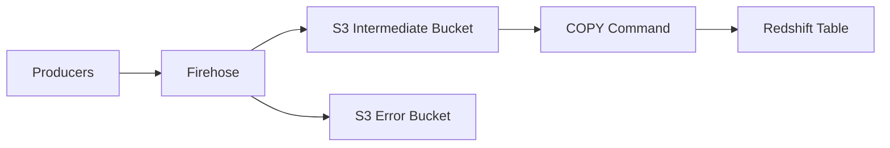

# How to Use Kinesis Firehose for Data Delivery to Redshift

Author: [nawazdhandala](https://github.com/nawazdhandala)

Tags: AWS, Kinesis, Firehose, Redshift, Data Warehousing

Description: Learn how to set up Kinesis Data Firehose to deliver streaming data directly to Amazon Redshift including COPY configuration, error handling, and schema management.

---

Getting streaming data into Redshift usually means landing it in S3 first and then running COPY commands on a schedule. Kinesis Data Firehose automates that entire flow. It buffers incoming records, writes them to an intermediate S3 location, and issues COPY commands to load the data into your Redshift tables - all without any code on your end.

Here's how to set it up and keep it running smoothly.

## How Firehose-to-Redshift Works

The data flow looks like this:



Firehose doesn't insert records one at a time. It batches records into S3 files, then uses Redshift's COPY command to bulk-load them. This is exactly how you'd want to load data into Redshift - COPY is orders of magnitude faster than individual INSERTs.

## Prerequisites

Before creating the delivery stream, you need:

1. A Redshift cluster that's accessible from Firehose (public or in the same VPC)
2. A Redshift table that matches your data schema
3. An S3 bucket for intermediate storage
4. An S3 bucket (or prefix) for error records
5. IAM roles with appropriate permissions

Create the target table in Redshift.

```sql
-- Connect to your Redshift cluster and create the target table
CREATE TABLE public.user_events (
    event_id VARCHAR(64),
    user_id VARCHAR(64),
    event_type VARCHAR(32),
    page_url VARCHAR(512),
    event_timestamp TIMESTAMP,
    user_agent VARCHAR(512),
    loaded_at TIMESTAMP DEFAULT GETDATE()
);
```

## Creating the Delivery Stream

This creates a Firehose delivery stream that delivers JSON data to Redshift via S3 intermediate storage.

```bash
aws firehose create-delivery-stream \
  --delivery-stream-name events-to-redshift \
  --delivery-stream-type DirectPut \
  --redshift-destination-configuration '{
    "RoleARN": "arn:aws:iam::123456789:role/FirehoseRedshiftRole",
    "ClusterJDBCURL": "jdbc:redshift://my-cluster.xxxxx.us-east-1.redshift.amazonaws.com:5439/analytics",
    "CopyCommand": {
      "DataTableName": "public.user_events",
      "DataTableColumns": "event_id,user_id,event_type,page_url,event_timestamp,user_agent",
      "CopyOptions": "json '\''auto'\'' TIMEFORMAT '\''auto'\'' TRUNCATECOLUMNS BLANKSASNULL EMPTYASNULL"
    },
    "Username": "firehose_user",
    "Password": "YourSecurePassword123!",
    "S3Configuration": {
      "RoleARN": "arn:aws:iam::123456789:role/FirehoseRedshiftRole",
      "BucketARN": "arn:aws:s3:::my-firehose-intermediate",
      "Prefix": "redshift-staging/user-events/",
      "BufferingHints": {
        "SizeInMBs": 5,
        "IntervalInSeconds": 300
      },
      "CompressionFormat": "UNCOMPRESSED",
      "CloudWatchLoggingOptions": {
        "Enabled": true,
        "LogGroupName": "/aws/firehose/events-to-redshift",
        "LogStreamName": "RedshiftDelivery"
      }
    },
    "S3BackupMode": "Enabled",
    "S3BackupConfiguration": {
      "RoleARN": "arn:aws:iam::123456789:role/FirehoseRedshiftRole",
      "BucketARN": "arn:aws:s3:::my-firehose-backup",
      "Prefix": "backup/user-events/",
      "BufferingHints": {
        "SizeInMBs": 128,
        "IntervalInSeconds": 900
      },
      "CompressionFormat": "GZIP"
    },
    "RetryOptions": {
      "DurationInSeconds": 3600
    },
    "CloudWatchLoggingOptions": {
      "Enabled": true,
      "LogGroupName": "/aws/firehose/events-to-redshift",
      "LogStreamName": "RedshiftDelivery"
    }
  }'
```

Let me break down the important parts:

- **CopyCommand** - Controls how Redshift's COPY works. The `json 'auto'` option handles JSON column mapping. `TRUNCATECOLUMNS` prevents errors from oversized strings.
- **S3BackupMode** - When enabled, Firehose keeps a copy of all delivered data in S3. Essential for replay scenarios.
- **RetryOptions** - How long Firehose retries a failed COPY before giving up. 3600 seconds (1 hour) is a good default.

## IAM Role Configuration

The Firehose role needs permissions for S3, Redshift, and CloudWatch.

This IAM policy gives Firehose access to S3, Redshift COPY, and CloudWatch logging.

```json
{
  "Version": "2012-10-17",
  "Statement": [
    {
      "Effect": "Allow",
      "Action": [
        "s3:AbortMultipartUpload",
        "s3:GetBucketLocation",
        "s3:GetObject",
        "s3:ListBucket",
        "s3:ListBucketMultipartUploads",
        "s3:PutObject"
      ],
      "Resource": [
        "arn:aws:s3:::my-firehose-intermediate",
        "arn:aws:s3:::my-firehose-intermediate/*",
        "arn:aws:s3:::my-firehose-backup",
        "arn:aws:s3:::my-firehose-backup/*"
      ]
    },
    {
      "Effect": "Allow",
      "Action": [
        "redshift:DescribeClusters",
        "redshift:GetClusterCredentials"
      ],
      "Resource": "*"
    },
    {
      "Effect": "Allow",
      "Action": [
        "logs:PutLogEvents",
        "logs:CreateLogStream"
      ],
      "Resource": "*"
    }
  ]
}
```

You also need to grant the Firehose user access in Redshift.

```sql
-- Create a user for Firehose in Redshift
CREATE USER firehose_user PASSWORD 'YourSecurePassword123!';

-- Grant INSERT permissions on the target table
GRANT INSERT ON public.user_events TO firehose_user;

-- Grant usage on the schema
GRANT USAGE ON SCHEMA public TO firehose_user;
```

## Sending Data to the Stream

Once the delivery stream is active, send data to it just like any other Firehose stream.

This Python script sends user event records to the Firehose delivery stream for Redshift.

```python
import boto3
import json
import time
import uuid

firehose = boto3.client('firehose', region_name='us-east-1')

def send_events(events):
    """Send events to Firehose for Redshift delivery."""
    records = []
    for event in events:
        # Add a newline delimiter - Redshift COPY expects one JSON per line
        records.append({
            'Data': json.dumps(event) + '\n'
        })

    # Batch send
    for i in range(0, len(records), 500):
        batch = records[i:i+500]
        response = firehose.put_record_batch(
            DeliveryStreamName='events-to-redshift',
            Records=batch
        )

        if response['FailedPutCount'] > 0:
            print(f"Failed records: {response['FailedPutCount']}")

# Sample events
events = [
    {
        "event_id": str(uuid.uuid4()),
        "user_id": f"user-{i % 100}",
        "event_type": "page_view",
        "page_url": f"/products/{i % 50}",
        "event_timestamp": "2026-02-12T10:30:00Z",
        "user_agent": "Mozilla/5.0"
    }
    for i in range(500)
]

send_events(events)
```

## Handling COPY Errors

When the COPY command fails, Firehose logs the error and retries. Common failure reasons:

1. **Schema mismatch** - The JSON fields don't match the table columns
2. **Data type errors** - A string value where Redshift expects a number
3. **Column overflow** - A value exceeds the VARCHAR length
4. **Connection issues** - Firehose can't reach the Redshift cluster

Check the STL_LOAD_ERRORS table in Redshift for details on failed COPY operations.

```sql
-- Check recent COPY errors
SELECT
    starttime,
    filename,
    line_number,
    colname,
    type,
    raw_field_value,
    err_reason
FROM stl_load_errors
ORDER BY starttime DESC
LIMIT 20;
```

Also check the Firehose CloudWatch logs for delivery failures.

```bash
aws logs get-log-events \
  --log-group-name /aws/firehose/events-to-redshift \
  --log-stream-name RedshiftDelivery \
  --limit 20
```

## Using a Manifest File

For better reliability, configure Firehose to use a manifest file. The manifest lists all the S3 files that should be loaded, making the COPY operation more predictable.

```bash
# The COPY command with manifest support
# Firehose can generate manifests automatically with certain configurations
COPY public.user_events
FROM 's3://my-firehose-intermediate/redshift-staging/manifest.json'
IAM_ROLE 'arn:aws:iam::123456789:role/RedshiftCopyRole'
MANIFEST
JSON 'auto'
TIMEFORMAT 'auto';
```

## Optimizing Redshift Ingestion

A few tips to make the Firehose-to-Redshift pipeline perform well:

**Buffer sizing matters.** Smaller buffers mean more frequent COPY operations, which puts more load on Redshift. Larger buffers mean higher latency but better COPY performance.

```python
# Recommended buffer settings for Redshift
# Larger batches = fewer COPY operations = better performance
buffer_config = {
    "SizeInMBs": 100,       # Up from default 5 MB
    "IntervalInSeconds": 900  # 15 minutes
}
```

**Use appropriate COPY options.** The options you pass to COPY affect both performance and error handling.

```sql
-- Optimized COPY options for JSON data
COPY public.user_events
FROM 's3://my-firehose-intermediate/redshift-staging/'
IAM_ROLE 'arn:aws:iam::123456789:role/RedshiftCopyRole'
JSON 'auto'
TIMEFORMAT 'auto'
TRUNCATECOLUMNS          -- Truncate instead of failing on long strings
BLANKSASNULL             -- Treat blank fields as NULL
EMPTYASNULL              -- Treat empty fields as NULL
MAXERROR 100             -- Allow up to 100 errors before failing
COMPUPDATE OFF           -- Skip compression analysis for faster loads
STATUPDATE OFF;          -- Skip statistics update for faster loads
```

**Run VACUUM and ANALYZE periodically.** Firehose loads append-only, which means Redshift's sort order degrades over time.

```sql
-- Run after large loads to re-sort and reclaim space
VACUUM FULL public.user_events;
ANALYZE public.user_events;
```

## Monitoring the Pipeline

Set up CloudWatch alarms on these Firehose metrics.

```bash
# Alert when Redshift delivery fails
aws cloudwatch put-metric-alarm \
  --alarm-name firehose-redshift-delivery-failure \
  --metric-name DeliveryToRedshift.Success \
  --namespace AWS/Firehose \
  --statistic Sum \
  --period 300 \
  --threshold 0 \
  --comparison-operator LessThanOrEqualToThreshold \
  --evaluation-periods 3 \
  --dimensions Name=DeliveryStreamName,Value=events-to-redshift \
  --alarm-actions arn:aws:sns:us-east-1:123456789:alerts
```

Track `DeliveryToRedshift.DataFreshness` to see how far behind your data is. If it's growing, your Redshift cluster might be struggling with the COPY load.

For end-to-end pipeline monitoring, you can integrate these metrics with OneUptime to get alerts alongside your application monitoring. If you're also delivering data to S3, check out our guide on [Firehose delivery to S3](https://oneuptime.com/blog/post/2026-02-12-kinesis-data-firehose-data-delivery-to-s3/view).

## VPC Configuration

If your Redshift cluster is in a VPC, Firehose needs a route to reach it. You have two options:

1. **Public Redshift endpoint** - The cluster has a public IP. Simpler but less secure.
2. **VPC configuration on Firehose** - Firehose launches ENIs in your VPC subnets to reach the private cluster.

For the VPC option, add VPC configuration to your delivery stream.

```bash
aws firehose update-destination \
  --delivery-stream-name events-to-redshift \
  --current-delivery-stream-version-id 1 \
  --destination-id destinationId-000000000001 \
  --redshift-destination-update '{
    "CloudWatchLoggingOptions": {"Enabled": true},
    "S3Update": {
      "RoleARN": "arn:aws:iam::123456789:role/FirehoseRedshiftRole"
    }
  }'
```

Firehose to Redshift is a solid approach for near-real-time data warehouse ingestion. The main thing to watch is your buffer configuration and COPY frequency - too many small COPYs will slow down your cluster, while too-large buffers increase your data latency. Find the balance that works for your query freshness requirements.
