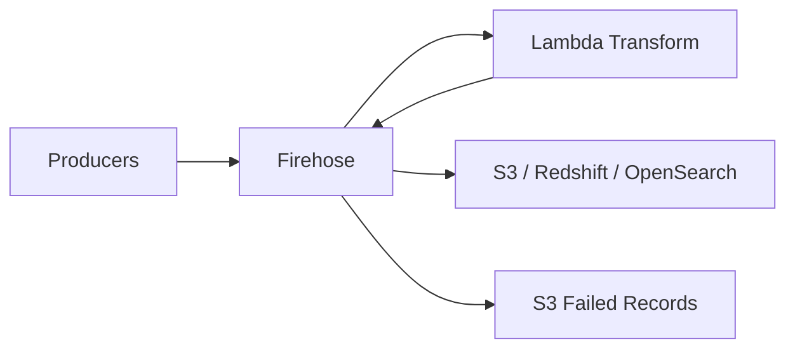

# How to Use Kinesis Firehose Data Transformation with Lambda

Author: [nawazdhandala](https://github.com/nawazdhandala)

Tags: AWS, Kinesis, Firehose, Lambda, Data Transformation

Description: Learn how to transform streaming data in Kinesis Data Firehose using AWS Lambda for enrichment, filtering, format conversion, and data cleansing.

---

Firehose is great for moving data from point A to point B. But what happens when your raw data isn't in the format your destination needs? Maybe you need to filter out certain records, enrich events with additional context, or convert between data formats. That's where Lambda data transformation comes in.

Firehose can invoke a Lambda function on each batch of records before delivering them. The Lambda function transforms the data, and Firehose takes care of the rest - buffering, compression, and delivery. Let's build some real transformation pipelines.

## How It Works

The data flow with Lambda transformation looks like this:



Firehose sends batches of records to your Lambda function. The function returns each record with one of three statuses:

- **Ok** - Record is transformed and ready for delivery
- **Dropped** - Record should be discarded (filtered out)
- **ProcessingFailed** - Something went wrong; send to the error output

## Creating the Lambda Transformation Function

Here's a Lambda function that transforms raw event data - it enriches records with geo information, normalizes field names, and filters out test events.

This Lambda function processes Firehose records, performing enrichment, normalization, and filtering.

```python
import json
import base64
from datetime import datetime

def handler(event, context):
    output_records = []

    for record in event['records']:
        # Decode the incoming data
        payload = base64.b64decode(record['data']).decode('utf-8')

        try:
            data = json.loads(payload)

            # Filter: drop test events
            if data.get('environment') == 'test' or data.get('userId', '').startswith('test-'):
                output_records.append({
                    'recordId': record['recordId'],
                    'result': 'Dropped',
                    'data': record['data']
                })
                continue

            # Transform: normalize field names
            transformed = {
                'event_id': data.get('eventId', data.get('event_id', '')),
                'user_id': data.get('userId', data.get('user_id', '')),
                'event_type': data.get('eventType', data.get('event_type', '')),
                'timestamp': data.get('timestamp', int(datetime.utcnow().timestamp())),
                'page_url': data.get('page', data.get('pageUrl', data.get('page_url', ''))),
                'user_agent': data.get('userAgent', data.get('user_agent', '')),
                'ip_address': data.get('ip', data.get('ipAddress', ''))
            }

            # Enrich: add processing metadata
            transformed['processed_at'] = datetime.utcnow().isoformat()
            transformed['source'] = 'firehose-transform'

            # Enrich: categorize event type
            transformed['event_category'] = categorize_event(transformed['event_type'])

            # Encode the transformed record
            output_data = json.dumps(transformed) + '\n'
            encoded = base64.b64encode(output_data.encode('utf-8')).decode('utf-8')

            output_records.append({
                'recordId': record['recordId'],
                'result': 'Ok',
                'data': encoded
            })

        except Exception as e:
            print(f"Error processing record {record['recordId']}: {e}")
            output_records.append({
                'recordId': record['recordId'],
                'result': 'ProcessingFailed',
                'data': record['data']
            })

    print(f"Processed {len(event['records'])} records: "
          f"{sum(1 for r in output_records if r['result'] == 'Ok')} ok, "
          f"{sum(1 for r in output_records if r['result'] == 'Dropped')} dropped, "
          f"{sum(1 for r in output_records if r['result'] == 'ProcessingFailed')} failed")

    return {'records': output_records}

def categorize_event(event_type):
    """Categorize events into broader groups."""
    navigation_events = ['page_view', 'page_exit', 'tab_switch']
    engagement_events = ['click', 'scroll', 'hover', 'form_fill']
    conversion_events = ['purchase', 'signup', 'subscribe', 'download']

    if event_type in navigation_events:
        return 'navigation'
    elif event_type in engagement_events:
        return 'engagement'
    elif event_type in conversion_events:
        return 'conversion'
    return 'other'
```

## Creating the Lambda Function

Deploy the function with appropriate memory and timeout settings.

```bash
# Create a deployment package
zip function.zip lambda_function.py

# Create the Lambda function
aws lambda create-function \
  --function-name firehose-transform \
  --runtime python3.12 \
  --handler lambda_function.handler \
  --role arn:aws:iam::123456789:role/LambdaFirehoseRole \
  --zip-file fileb://function.zip \
  --timeout 300 \
  --memory-size 256
```

The timeout is important. Firehose has a limit on how long it waits for the Lambda response. Set the Lambda timeout to at most 5 minutes (300 seconds), which is the Firehose limit.

## Configuring Firehose with the Transform

Now create the delivery stream with Lambda transformation enabled.

This creates a Firehose delivery stream with Lambda transformation before S3 delivery.

```bash
aws firehose create-delivery-stream \
  --delivery-stream-name transformed-events-to-s3 \
  --delivery-stream-type DirectPut \
  --extended-s3-destination-configuration '{
    "RoleARN": "arn:aws:iam::123456789:role/FirehoseS3Role",
    "BucketARN": "arn:aws:s3:::my-data-lake",
    "Prefix": "processed/events/year=!{timestamp:yyyy}/month=!{timestamp:MM}/day=!{timestamp:dd}/",
    "ErrorOutputPrefix": "errors/events/!{firehose:error-output-type}/",
    "BufferingHints": {
      "SizeInMBs": 128,
      "IntervalInSeconds": 300
    },
    "CompressionFormat": "GZIP",
    "ProcessingConfiguration": {
      "Enabled": true,
      "Processors": [
        {
          "Type": "Lambda",
          "Parameters": [
            {
              "ParameterName": "LambdaArn",
              "ParameterValue": "arn:aws:lambda:us-east-1:123456789:function:firehose-transform"
            },
            {
              "ParameterName": "BufferSizeInMBs",
              "ParameterValue": "3"
            },
            {
              "ParameterName": "BufferIntervalInSeconds",
              "ParameterValue": "60"
            },
            {
              "ParameterName": "NumberOfRetries",
              "ParameterValue": "3"
            }
          ]
        }
      ]
    }
  }'
```

The Lambda buffer settings (BufferSizeInMBs and BufferIntervalInSeconds) control how much data Firehose sends to Lambda at once. These are separate from the S3 buffer settings.

## Data Enrichment from External Sources

Sometimes you need to enrich records with data from DynamoDB, an API, or another data store. Here's a pattern for that.

This Lambda function enriches events with user profile data from DynamoDB.

```python
import json
import base64
import boto3
from functools import lru_cache

dynamodb = boto3.resource('dynamodb')
users_table = dynamodb.Table('user-profiles')

# Cache user lookups to avoid hitting DynamoDB for every record
@lru_cache(maxsize=10000)
def get_user_profile(user_id):
    """Fetch user profile from DynamoDB with caching."""
    try:
        response = users_table.get_item(Key={'userId': user_id})
        return response.get('Item', {})
    except Exception:
        return {}

def handler(event, context):
    output_records = []

    for record in event['records']:
        payload = base64.b64decode(record['data']).decode('utf-8')

        try:
            data = json.loads(payload)

            # Enrich with user profile data
            user_id = data.get('user_id', '')
            if user_id:
                profile = get_user_profile(user_id)
                data['user_country'] = profile.get('country', 'unknown')
                data['user_plan'] = profile.get('plan', 'free')
                data['user_segment'] = profile.get('segment', 'unclassified')

            output_data = json.dumps(data) + '\n'
            encoded = base64.b64encode(output_data.encode('utf-8')).decode('utf-8')

            output_records.append({
                'recordId': record['recordId'],
                'result': 'Ok',
                'data': encoded
            })

        except Exception as e:
            print(f"Error: {e}")
            output_records.append({
                'recordId': record['recordId'],
                'result': 'ProcessingFailed',
                'data': record['data']
            })

    return {'records': output_records}
```

The `@lru_cache` decorator is crucial here. Without it, you'd make a DynamoDB call for every single record. With it, repeated lookups for the same user are instant.

## Multi-Format Transformation

Here's a common scenario: your producers send data in different formats, and you need to normalize everything before delivery.

This Lambda handles multiple input formats (CSV, JSON, plain text) and normalizes to JSON.

```python
import json
import base64
import csv
import io

def handler(event, context):
    output_records = []

    for record in event['records']:
        raw = base64.b64decode(record['data']).decode('utf-8').strip()

        try:
            # Try JSON first
            try:
                data = json.loads(raw)
            except json.JSONDecodeError:
                # Try CSV
                if ',' in raw and not raw.startswith('{'):
                    reader = csv.reader(io.StringIO(raw))
                    fields = next(reader)
                    data = {
                        'field1': fields[0] if len(fields) > 0 else '',
                        'field2': fields[1] if len(fields) > 1 else '',
                        'field3': fields[2] if len(fields) > 2 else '',
                        'raw_format': 'csv'
                    }
                else:
                    # Treat as plain text log line
                    data = {
                        'message': raw,
                        'raw_format': 'text'
                    }

            # Standardize output
            output_data = json.dumps(data) + '\n'
            encoded = base64.b64encode(output_data.encode('utf-8')).decode('utf-8')

            output_records.append({
                'recordId': record['recordId'],
                'result': 'Ok',
                'data': encoded
            })

        except Exception as e:
            output_records.append({
                'recordId': record['recordId'],
                'result': 'ProcessingFailed',
                'data': record['data']
            })

    return {'records': output_records}
```

## Important Constraints

There are some limits you need to be aware of:

1. **Lambda payload size** - Firehose sends up to 6 MB per Lambda invocation. If your records are large, the batch will be smaller.
2. **Lambda timeout** - Maximum 5 minutes. If your transformation involves slow external calls, you could hit this.
3. **Response size** - Your Lambda response must not exceed 6 MB. Be careful with enrichment that significantly increases record size.
4. **Record ID matching** - Every record in the response must have the same recordId as in the request. Missing or mismatched IDs cause delivery failures.

## Monitoring Transformation

Track Lambda-specific metrics alongside Firehose metrics.

```bash
# Alert on Lambda invocation errors
aws cloudwatch put-metric-alarm \
  --alarm-name firehose-transform-errors \
  --metric-name Errors \
  --namespace AWS/Lambda \
  --statistic Sum \
  --period 300 \
  --threshold 10 \
  --comparison-operator GreaterThanThreshold \
  --dimensions Name=FunctionName,Value=firehose-transform \
  --alarm-actions arn:aws:sns:us-east-1:123456789:alerts
```

Also monitor the `ExecuteProcessing.Duration` and `ExecuteProcessing.Success` metrics on the Firehose delivery stream to see how the transformation is performing.

For more on delivering transformed data to different destinations, check out our guides on [Firehose delivery to S3](https://oneuptime.com/blog/post/kinesis-data-firehose-data-delivery-to-s3/view) and [Firehose delivery to OpenSearch](https://oneuptime.com/blog/post/kinesis-firehose-data-delivery-to-opensearch/view).

Lambda transformation turns Firehose from a simple pipe into a flexible data processing pipeline. The key is keeping your transformations fast and handling errors gracefully - a slow or buggy Lambda function can back up your entire delivery stream.
