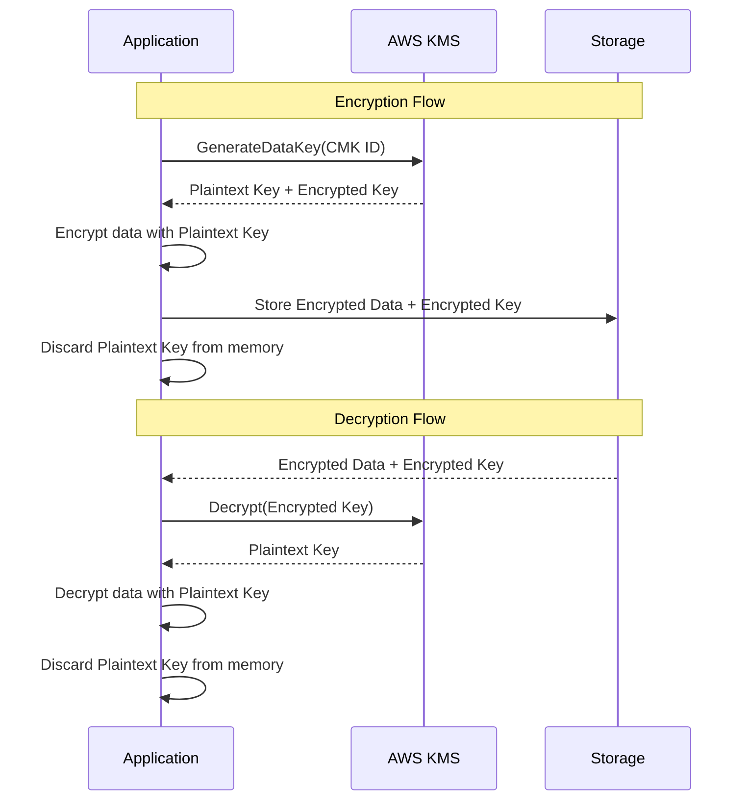

# How to Use KMS for Envelope Encryption

Author: [nawazdhandala](https://github.com/nawazdhandala)

Tags: AWS, KMS, Encryption, Security

Description: Learn how envelope encryption works with AWS KMS, why it matters for performance and security, and how to implement it in your applications with practical code examples.

---

If you're encrypting data with KMS by sending it directly to the KMS API, you're doing it wrong - at least for anything larger than 4KB. KMS has a hard limit of 4,096 bytes per Encrypt API call. For real-world data like files, database records, or messages, you need envelope encryption.

Envelope encryption is a two-tier approach where KMS generates a data key, you use that data key to encrypt your actual data locally, and then store the encrypted data key alongside the ciphertext. It's faster, cheaper, and more scalable than direct encryption. Let's dig into how it works and how to implement it.

## How Envelope Encryption Works

The concept is straightforward. Think of it like putting a letter in an envelope and then locking the envelope in a safe.

1. You ask KMS to generate a data key (the envelope key)
2. KMS returns two versions: a plaintext data key and an encrypted data key
3. You use the plaintext data key to encrypt your data locally
4. You store the encrypted data key alongside the encrypted data
5. You immediately discard the plaintext data key from memory

To decrypt, you reverse the process:

1. Send the encrypted data key to KMS for decryption
2. KMS returns the plaintext data key
3. Use the plaintext data key to decrypt your data locally
4. Discard the plaintext data key



## Why Not Just Use KMS Directly?

Three reasons:

**Performance.** Every direct KMS call adds network latency. Envelope encryption lets you encrypt/decrypt locally at memory speed. For a 100MB file, you'd need 25,000+ KMS calls with direct encryption vs. a single call with envelope encryption.

**Cost.** KMS charges per API request. At $0.03 per 10,000 requests, encrypting a 1GB file directly would cost around $7.50. With envelope encryption, it costs $0.000003 - one request.

**Data size.** KMS can only handle 4KB payloads directly. Envelope encryption has no size limit.

## Generating Data Keys

KMS provides two API calls for generating data keys.

`GenerateDataKey` returns both the plaintext and encrypted versions. Use this when you're about to encrypt data immediately.

```bash
# Generate a data key - returns both plaintext and encrypted versions
aws kms generate-data-key \
  --key-id alias/production-data \
  --key-spec AES_256 \
  --encryption-context '{"purpose":"file-encryption","file-id":"doc-12345"}'
```

`GenerateDataKeyWithoutPlaintext` returns only the encrypted version. Use this when you want to pre-generate keys for later use without exposing the plaintext.

```bash
# Generate only the encrypted data key (for later use)
aws kms generate-data-key-without-plaintext \
  --key-id alias/production-data \
  --key-spec AES_256 \
  --encryption-context '{"purpose":"file-encryption","file-id":"doc-12345"}'
```

## Python Implementation

Here's a complete implementation of envelope encryption in Python using boto3 and the cryptography library.

This function handles the encryption side - generating a data key and using it to encrypt your data.

```python
import boto3
import base64
import os
from cryptography.hazmat.primitives.ciphers.aead import AESGCM

kms_client = boto3.client('kms', region_name='us-east-1')

def envelope_encrypt(plaintext_data, kms_key_id, encryption_context=None):
    """
    Encrypt data using envelope encryption with KMS.
    Returns a dict with the encrypted data key, nonce, and ciphertext.
    """
    if encryption_context is None:
        encryption_context = {}

    # Step 1: Ask KMS for a data key
    response = kms_client.generate_data_key(
        KeyId=kms_key_id,
        KeySpec='AES_256',
        EncryptionContext=encryption_context
    )

    plaintext_key = response['Plaintext']       # 32 bytes for AES-256
    encrypted_key = response['CiphertextBlob']   # Encrypted version

    # Step 2: Use the plaintext key to encrypt locally
    nonce = os.urandom(12)  # 96-bit nonce for AES-GCM
    aesgcm = AESGCM(plaintext_key)
    ciphertext = aesgcm.encrypt(nonce, plaintext_data, None)

    # Step 3: Immediately zero out the plaintext key
    plaintext_key = b'\x00' * len(plaintext_key)

    # Step 4: Return the encrypted data key + encrypted data
    return {
        'encrypted_data_key': base64.b64encode(encrypted_key).decode('utf-8'),
        'nonce': base64.b64encode(nonce).decode('utf-8'),
        'ciphertext': base64.b64encode(ciphertext).decode('utf-8'),
        'encryption_context': encryption_context
    }
```

And this function handles decryption - asking KMS to decrypt the data key, then using it locally.

```python
def envelope_decrypt(encrypted_payload, encryption_context=None):
    """
    Decrypt data that was encrypted with envelope_encrypt.
    """
    if encryption_context is None:
        encryption_context = encrypted_payload.get('encryption_context', {})

    encrypted_key = base64.b64decode(encrypted_payload['encrypted_data_key'])
    nonce = base64.b64decode(encrypted_payload['nonce'])
    ciphertext = base64.b64decode(encrypted_payload['ciphertext'])

    # Step 1: Ask KMS to decrypt the data key
    response = kms_client.decrypt(
        CiphertextBlob=encrypted_key,
        EncryptionContext=encryption_context
    )

    plaintext_key = response['Plaintext']

    # Step 2: Use the plaintext key to decrypt locally
    aesgcm = AESGCM(plaintext_key)
    plaintext_data = aesgcm.decrypt(nonce, ciphertext, None)

    # Step 3: Zero out the plaintext key
    plaintext_key = b'\x00' * len(plaintext_key)

    return plaintext_data
```

Here's how you'd use these functions together.

```python
# Encrypt a file
kms_key_id = 'alias/production-data'
context = {'file-type': 'report', 'department': 'finance'}

with open('sensitive-report.pdf', 'rb') as f:
    data = f.read()

encrypted = envelope_encrypt(data, kms_key_id, context)

# Store the encrypted payload (e.g., in S3 or a database)
import json
with open('sensitive-report.encrypted', 'w') as f:
    json.dump(encrypted, f)

# Later, decrypt it
with open('sensitive-report.encrypted', 'r') as f:
    encrypted_payload = json.load(f)

decrypted_data = envelope_decrypt(encrypted_payload)

with open('sensitive-report-decrypted.pdf', 'wb') as f:
    f.write(decrypted_data)
```

## Encryption Context

You probably noticed the `encryption_context` parameter. This is an optional but strongly recommended feature. The encryption context is a set of key-value pairs that are cryptographically bound to the ciphertext. The same context must be provided during decryption, or it fails.

This serves two purposes:

1. **Integrity** - prevents someone from swapping encrypted data keys between different resources
2. **Audit trail** - the context is logged in CloudTrail, so you can see exactly what was encrypted/decrypted

```python
# Good encryption context examples
context = {
    'tenant_id': 'tenant-123',
    'resource_type': 'user-profile',
    'resource_id': 'user-456'
}

# Encrypt with context
encrypted = envelope_encrypt(data, key_id, context)

# This will succeed - same context
decrypted = envelope_decrypt(encrypted, context)

# This will FAIL - different context
wrong_context = {'tenant_id': 'tenant-999'}
decrypted = envelope_decrypt(encrypted, wrong_context)  # Raises exception
```

## Data Key Caching

Generating a new data key for every encrypt operation adds latency and cost. For high-throughput scenarios, you can cache data keys and reuse them for multiple operations.

The AWS Encryption SDK handles this automatically, but here's a simplified version.

```python
from datetime import datetime, timedelta
from threading import Lock

class DataKeyCache:
    """Simple data key cache with TTL and usage limits."""

    def __init__(self, kms_key_id, max_age_seconds=300, max_uses=1000):
        self.kms_key_id = kms_key_id
        self.max_age = timedelta(seconds=max_age_seconds)
        self.max_uses = max_uses
        self._lock = Lock()
        self._cache = {}

    def get_data_key(self, encryption_context):
        """Get a cached data key or generate a new one."""
        cache_key = str(sorted(encryption_context.items()))

        with self._lock:
            if cache_key in self._cache:
                entry = self._cache[cache_key]
                if (datetime.now() - entry['created'] < self.max_age
                        and entry['uses'] < self.max_uses):
                    entry['uses'] += 1
                    return entry['plaintext_key'], entry['encrypted_key']
                else:
                    # Expired or exhausted - remove it
                    del self._cache[cache_key]

            # Generate a fresh data key
            response = kms_client.generate_data_key(
                KeyId=self.kms_key_id,
                KeySpec='AES_256',
                EncryptionContext=encryption_context
            )

            self._cache[cache_key] = {
                'plaintext_key': response['Plaintext'],
                'encrypted_key': response['CiphertextBlob'],
                'created': datetime.now(),
                'uses': 1
            }

            return response['Plaintext'], response['CiphertextBlob']
```

Be careful with caching though. The plaintext key sits in memory, so you're trading security for performance. Keep the TTL short and the usage limit reasonable.

## AWS Encryption SDK

For production use, consider the AWS Encryption SDK instead of rolling your own. It handles envelope encryption, key caching, key commitment, and algorithm selection automatically.

```python
import aws_encryption_sdk

# Set up the KMS key provider
kms_key_provider = aws_encryption_sdk.StrictAwsKmsMasterKeyProvider(
    key_ids=['arn:aws:kms:us-east-1:123456789012:key/1234abcd-12ab-34cd-56ef-1234567890ab']
)

# Encrypt
ciphertext, encryptor_header = aws_encryption_sdk.encrypt(
    source=plaintext_data,
    key_provider=kms_key_provider,
    encryption_context={'purpose': 'user-data'}
)

# Decrypt
plaintext, decryptor_header = aws_encryption_sdk.decrypt(
    source=ciphertext,
    key_provider=kms_key_provider
)
```

The SDK is battle-tested and follows all the best practices around key derivation, algorithm selection, and message formatting.

## Wrapping Up

Envelope encryption is the standard pattern for using KMS in any real application. It removes the 4KB size limit, dramatically reduces costs and latency, and keeps your KMS master key safely in the HSM while data encryption happens locally. Whether you roll your own or use the AWS Encryption SDK, always use encryption context, always zero out plaintext keys after use, and consider data key caching for high-throughput workloads.

For more on managing the KMS keys that back your envelope encryption, see our guides on [creating CMKs](https://oneuptime.com/blog/post/2026-02-12-create-manage-kms-customer-managed-keys/view) and [key policies](https://oneuptime.com/blog/post/2026-02-12-kms-key-policies-access-control/view).
