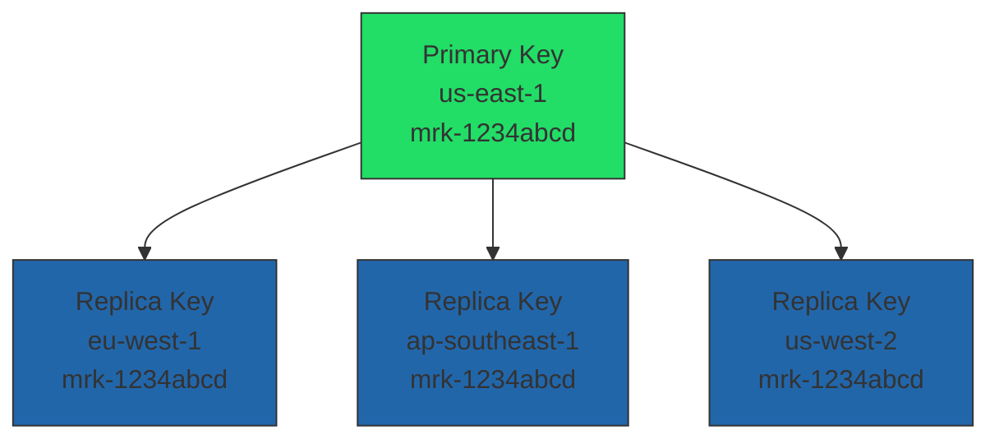

# How to Use KMS Multi-Region Keys

Author: [nawazdhandala](https://github.com/nawazdhandala)

Tags: AWS, KMS, Encryption, Multi-Region, Security

Description: Learn how to create and use AWS KMS multi-region keys for cross-region encryption, disaster recovery, and global applications with consistent key material.

---

When you encrypt data in us-east-1 and need to decrypt it in eu-west-1, you've got a problem. Standard KMS keys are region-specific - a key in one region can't decrypt data encrypted by a key in another region. Multi-region keys solve this by sharing the same key material across multiple AWS regions while maintaining separate, independently managed replicas.

This is essential for global applications, disaster recovery across regions, and any architecture where encrypted data moves between regions.

## How Multi-Region Keys Work

A multi-region key consists of a primary key in one region and replica keys in other regions. All replicas share the same key material (same key ID prefix), meaning data encrypted by the primary can be decrypted by any replica, and vice versa.

Despite sharing key material, each replica is an independent KMS key with its own ARN, key policy, grants, and aliases. You manage access separately in each region.



Multi-region keys have a distinctive `mrk-` prefix in their key ID, making them easy to identify.

## Creating a Multi-Region Primary Key

First, create the primary key in your home region. You must specify `MultiRegion: true` at creation time - you can't convert an existing single-region key.

```bash
# Create a multi-region primary key
aws kms create-key \
  --region us-east-1 \
  --description "Multi-region key for global data encryption" \
  --multi-region \
  --key-usage ENCRYPT_DECRYPT \
  --key-spec SYMMETRIC_DEFAULT \
  --tags '[
    {"TagKey": "Purpose", "TagValue": "global-encryption"},
    {"TagKey": "ManagedBy", "TagValue": "platform-team"}
  ]'
```

Save the key ID from the response. It will start with `mrk-`.

```bash
# Create an alias for easier reference
aws kms create-alias \
  --region us-east-1 \
  --alias-name alias/global-data-key \
  --target-key-id "mrk-1234abcd12ab34cd56ef1234567890ab"
```

## Replicating to Other Regions

Now replicate the key to the regions where you need it. Each replica gets its own key policy - it doesn't inherit from the primary.

```bash
# Replicate to EU
aws kms replicate-key \
  --key-id "mrk-1234abcd12ab34cd56ef1234567890ab" \
  --replica-region eu-west-1 \
  --description "Multi-region replica for EU workloads" \
  --tags '[
    {"TagKey": "Purpose", "TagValue": "global-encryption"},
    {"TagKey": "Region", "TagValue": "eu-west-1"}
  ]'

# Replicate to Asia Pacific
aws kms replicate-key \
  --key-id "mrk-1234abcd12ab34cd56ef1234567890ab" \
  --replica-region ap-southeast-1 \
  --description "Multi-region replica for APAC workloads"

# Replicate to US West for DR
aws kms replicate-key \
  --key-id "mrk-1234abcd12ab34cd56ef1234567890ab" \
  --replica-region us-west-2 \
  --description "Multi-region replica for DR"
```

Create matching aliases in each region so applications use consistent naming.

```bash
# Create the same alias in each replica region
for region in eu-west-1 ap-southeast-1 us-west-2; do
  aws kms create-alias \
    --region "$region" \
    --alias-name alias/global-data-key \
    --target-key-id "mrk-1234abcd12ab34cd56ef1234567890ab"
done
```

## Terraform Configuration

Here's how to manage multi-region keys with Terraform across multiple providers.

```hcl
# Provider for the primary region
provider "aws" {
  alias  = "primary"
  region = "us-east-1"
}

# Provider for the replica region
provider "aws" {
  alias  = "eu"
  region = "eu-west-1"
}

provider "aws" {
  alias  = "apac"
  region = "ap-southeast-1"
}

# Primary multi-region key
resource "aws_kms_key" "primary" {
  provider = aws.primary

  description         = "Multi-region primary key for global encryption"
  multi_region        = true
  enable_key_rotation = true

  policy = jsonencode({
    Version = "2012-10-17"
    Statement = [
      {
        Sid    = "EnableRootAccess"
        Effect = "Allow"
        Principal = {
          AWS = "arn:aws:iam::${data.aws_caller_identity.current.account_id}:root"
        }
        Action   = "kms:*"
        Resource = "*"
      },
      {
        Sid    = "AllowServiceUsage"
        Effect = "Allow"
        Principal = {
          AWS = "arn:aws:iam::${data.aws_caller_identity.current.account_id}:role/ApplicationRole"
        }
        Action = [
          "kms:Encrypt",
          "kms:Decrypt",
          "kms:GenerateDataKey",
          "kms:DescribeKey"
        ]
        Resource = "*"
      }
    ]
  })

  tags = {
    Purpose = "global-encryption"
  }
}

# Alias in primary region
resource "aws_kms_alias" "primary" {
  provider = aws.primary

  name          = "alias/global-data-key"
  target_key_id = aws_kms_key.primary.key_id
}

# Replica in EU
resource "aws_kms_replica_key" "eu" {
  provider = aws.eu

  description             = "Multi-region replica for EU"
  primary_key_arn         = aws_kms_key.primary.arn
  deletion_window_in_days = 30

  # Replica gets its own key policy
  policy = jsonencode({
    Version = "2012-10-17"
    Statement = [
      {
        Sid    = "EnableRootAccess"
        Effect = "Allow"
        Principal = {
          AWS = "arn:aws:iam::${data.aws_caller_identity.current.account_id}:root"
        }
        Action   = "kms:*"
        Resource = "*"
      },
      {
        Sid    = "AllowEUServiceUsage"
        Effect = "Allow"
        Principal = {
          AWS = "arn:aws:iam::${data.aws_caller_identity.current.account_id}:role/EUApplicationRole"
        }
        Action = [
          "kms:Encrypt",
          "kms:Decrypt",
          "kms:GenerateDataKey",
          "kms:DescribeKey"
        ]
        Resource = "*"
      }
    ]
  })
}

# Alias in EU region
resource "aws_kms_alias" "eu" {
  provider = aws.eu

  name          = "alias/global-data-key"
  target_key_id = aws_kms_replica_key.eu.key_id
}
```

## Cross-Region Encryption in Practice

Here's a practical example: encrypting data in us-east-1 and decrypting it in eu-west-1. The application uses the same alias in both regions.

```python
import boto3

def encrypt_in_us(data):
    """Encrypt data using the key in us-east-1."""
    kms = boto3.client('kms', region_name='us-east-1')

    response = kms.encrypt(
        KeyId='alias/global-data-key',
        Plaintext=data.encode('utf-8')
    )

    return response['CiphertextBlob']


def decrypt_in_eu(ciphertext):
    """Decrypt data using the replica key in eu-west-1."""
    kms = boto3.client('kms', region_name='eu-west-1')

    # Works because the replica has the same key material
    response = kms.decrypt(
        KeyId='alias/global-data-key',
        CiphertextBlob=ciphertext
    )

    return response['Plaintext'].decode('utf-8')


# Encrypt in US, decrypt in EU
ciphertext = encrypt_in_us("Sensitive customer data")
plaintext = decrypt_in_eu(ciphertext)
print(plaintext)  # "Sensitive customer data"
```

Note: You need to pass the KeyId when decrypting with multi-region keys. For single-region keys, KMS can figure out which key to use from the ciphertext metadata. For multi-region keys, you need to specify which replica to use.

## Disaster Recovery Scenario

Multi-region keys are critical for DR. If your primary region goes down, you can decrypt data in your DR region without any key migration.

Here's a pattern for S3 cross-region replication with encryption.

```hcl
# Source bucket with multi-region key encryption
resource "aws_s3_bucket_server_side_encryption_configuration" "source" {
  provider = aws.primary
  bucket   = aws_s3_bucket.source.id

  rule {
    apply_server_side_encryption_by_default {
      sse_algorithm     = "aws:kms"
      kms_master_key_id = aws_kms_key.primary.arn
    }
  }
}

# Destination bucket uses the replica key
resource "aws_s3_bucket_server_side_encryption_configuration" "destination" {
  provider = aws.eu
  bucket   = aws_s3_bucket.destination.id

  rule {
    apply_server_side_encryption_by_default {
      sse_algorithm     = "aws:kms"
      kms_master_key_id = aws_kms_replica_key.eu.arn
    }
  }
}
```

When S3 replicates objects, it decrypts with the source key and re-encrypts with the destination key. Since both are multi-region replicas of the same key, this is seamless.

## Key Rotation with Multi-Region Keys

Automatic rotation works with multi-region keys, but you enable it only on the primary key. The rotation automatically propagates to all replicas.

```bash
# Enable rotation on the primary (propagates to replicas)
aws kms enable-key-rotation \
  --region us-east-1 \
  --key-id "mrk-1234abcd12ab34cd56ef1234567890ab"

# Verify rotation status on a replica
aws kms get-key-rotation-status \
  --region eu-west-1 \
  --key-id "mrk-1234abcd12ab34cd56ef1234567890ab"
```

## Updating the Primary Region

If you need to change which region hosts the primary key (for example, moving your primary operations to EU), you can update the primary region.

```bash
# Make the EU replica the new primary
aws kms update-primary-region \
  --region us-east-1 \
  --key-id "mrk-1234abcd12ab34cd56ef1234567890ab" \
  --primary-region eu-west-1
```

This converts the US key to a replica and the EU key to the primary. The key material stays the same.

## Costs and Limits

Multi-region keys cost more than single-region keys. Each replica incurs the same monthly fee as a primary key ($1/month per key). API calls are billed in the region where they're made at standard KMS rates.

There's a default limit of 10 replicas per primary key. For most architectures, that's more than enough.

## When Not to Use Multi-Region Keys

Multi-region keys aren't always the right choice:

- If your data never leaves a single region, use a standard single-region key
- If you need different key material in different regions (for regulatory reasons), use separate keys
- If you're only doing cross-region backups and can tolerate a brief DR setup time, standard keys with manual re-encryption might be simpler

For managing the key policies on your multi-region keys, see our guide on [KMS key policies](https://oneuptime.com/blog/post/kms-key-policies-access-control/view).

## Wrapping Up

Multi-region keys eliminate one of the biggest headaches in cross-region architectures: encrypted data portability. They let you encrypt in one region and decrypt in another without complex key-sharing mechanisms. Just remember that while the key material is shared, the access policies are independent per region - so you maintain full control over who can use each replica.
