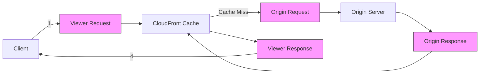

# How to Use Lambda@Edge for CloudFront Request Processing

Author: [nawazdhandala](https://github.com/nawazdhandala)

Tags: AWS, Lambda, CloudFront, Edge Computing, CDN

Description: Learn how to use Lambda@Edge to customize CloudFront request and response processing at edge locations for URL rewrites, authentication, A/B testing, and dynamic content.

---

Lambda@Edge lets you run Lambda functions at CloudFront edge locations around the world. Instead of routing requests back to your origin for every customization, your code runs at the edge location closest to the user. This means lower latency for things like URL rewrites, authentication checks, header manipulation, and dynamic content generation.

The trade-off is that Lambda@Edge has more restrictions than regular Lambda - smaller package sizes, fewer runtimes, and no environment variables. But when you need to modify requests or responses at the CDN level, nothing else comes close.

## The Four Trigger Points

Lambda@Edge can run at four points in the CloudFront request lifecycle:



1. **Viewer Request** - after CloudFront receives the request from the client. Runs on every request.
2. **Origin Request** - before CloudFront forwards the request to your origin. Only runs on cache misses.
3. **Origin Response** - after CloudFront receives the response from your origin. Only runs on cache misses.
4. **Viewer Response** - before CloudFront returns the response to the client. Runs on every request.

Choose your trigger point based on when you need to intervene and whether you want the function to run on every request or only on cache misses.

## Limits and Constraints

Lambda@Edge has stricter limits than regular Lambda:

| Limit | Viewer Triggers | Origin Triggers |
|-------|----------------|-----------------|
| Memory | 128 MB | 128 MB - 10,240 MB |
| Timeout | 5 seconds | 30 seconds |
| Package size | 1 MB | 50 MB |
| Runtime | Node.js, Python | Node.js, Python |
| Environment variables | Not supported | Not supported |
| VPC access | Not supported | Not supported |
| Layers | Not supported | Not supported |

The lack of environment variables means you need to hardcode configuration or fetch it from a parameter store at runtime (and cache it).

## Setting Up with AWS CDK

Lambda@Edge functions must be deployed in `us-east-1`. CDK handles this with the `cloudfront` module.

This CDK stack creates a CloudFront distribution with Lambda@Edge functions for URL rewriting and security headers:

```typescript
import * as cdk from 'aws-cdk-lib';
import * as cloudfront from 'aws-cdk-lib/aws-cloudfront';
import * as origins from 'aws-cdk-lib/aws-cloudfront-origins';
import * as lambda from 'aws-cdk-lib/aws-lambda';
import * as s3 from 'aws-cdk-lib/aws-s3';
import { Construct } from 'constructs';

export class LambdaEdgeStack extends cdk.Stack {
  constructor(scope: Construct, id: string, props?: cdk.StackProps) {
    super(scope, id, props);

    // S3 bucket as origin
    const websiteBucket = new s3.Bucket(this, 'WebsiteBucket');

    // Lambda@Edge function for URL rewriting
    const urlRewriter = new cloudfront.experimental.EdgeFunction(this, 'UrlRewriter', {
      runtime: lambda.Runtime.NODEJS_20_X,
      handler: 'index.handler',
      code: lambda.Code.fromAsset('lambda/url-rewriter'),
      // EdgeFunction automatically handles us-east-1 deployment
    });

    // Lambda@Edge function for security headers
    const securityHeaders = new cloudfront.experimental.EdgeFunction(this, 'SecurityHeaders', {
      runtime: lambda.Runtime.NODEJS_20_X,
      handler: 'index.handler',
      code: lambda.Code.fromAsset('lambda/security-headers'),
    });

    // CloudFront distribution with Lambda@Edge
    const distribution = new cloudfront.Distribution(this, 'Distribution', {
      defaultBehavior: {
        origin: new origins.S3Origin(websiteBucket),
        edgeLambdas: [
          {
            functionAssociation: {
              function: urlRewriter,
              eventType: cloudfront.LambdaEdgeEventType.VIEWER_REQUEST,
            },
          },
          {
            functionAssociation: {
              function: securityHeaders,
              eventType: cloudfront.LambdaEdgeEventType.VIEWER_RESPONSE,
            },
          },
        ],
        viewerProtocolPolicy: cloudfront.ViewerProtocolPolicy.REDIRECT_TO_HTTPS,
      },
    });
  }
}
```

## URL Rewriting (Viewer Request)

A common use case is rewriting URLs for single-page applications or pretty URLs.

This function rewrites clean URLs to point to the correct files on the origin:

```javascript
// lambda/url-rewriter/index.js
exports.handler = async (event) => {
  const request = event.Records[0].cf.request;
  const uri = request.uri;

  // Handle SPA routing - serve index.html for non-file paths
  if (!uri.includes('.') && uri !== '/') {
    // Path like /about or /products/123 - serve index.html
    request.uri = '/index.html';
  }

  // Add default file to directory paths
  if (uri.endsWith('/')) {
    request.uri += 'index.html';
  }

  // Rewrite API versioning
  // /v2/users -> /api/v2/users
  if (uri.startsWith('/v2/') || uri.startsWith('/v1/')) {
    request.uri = '/api' + uri;
  }

  return request;
};
```

## Authentication at the Edge (Viewer Request)

Validate JWTs before the request even reaches your origin.

This function validates JWT tokens at the edge and blocks unauthorized requests:

```javascript
// lambda/edge-auth/index.js
const crypto = require('crypto');

// Since Lambda@Edge doesn't support env vars or layers,
// you have to bundle the JWT secret or fetch from Parameter Store
const JWT_SECRET = 'your-secret-here'; // In production, fetch and cache this

exports.handler = async (event) => {
  const request = event.Records[0].cf.request;

  // Skip auth for public paths
  const publicPaths = ['/', '/login', '/public/'];
  if (publicPaths.some(path => request.uri.startsWith(path))) {
    return request;
  }

  const authHeader = request.headers.authorization;
  if (!authHeader || !authHeader[0]) {
    return unauthorizedResponse('Missing authorization header');
  }

  const token = authHeader[0].value.replace('Bearer ', '');

  try {
    // Simple JWT validation (in production, use a proper JWT library bundled in)
    const payload = verifyJwt(token);

    // Add user info as headers for the origin
    request.headers['x-user-id'] = [{ key: 'X-User-Id', value: payload.sub }];
    request.headers['x-user-role'] = [{ key: 'X-User-Role', value: payload.role }];

    return request;
  } catch (error) {
    return unauthorizedResponse('Invalid token');
  }
};

function unauthorizedResponse(message) {
  return {
    status: '401',
    statusDescription: 'Unauthorized',
    headers: {
      'content-type': [{ key: 'Content-Type', value: 'application/json' }],
      'www-authenticate': [{ key: 'WWW-Authenticate', value: 'Bearer' }],
    },
    body: JSON.stringify({ error: message }),
  };
}
```

## Security Headers (Viewer Response)

Add security headers to every response without modifying your origin.

This function adds comprehensive security headers to CloudFront responses:

```javascript
// lambda/security-headers/index.js
exports.handler = async (event) => {
  const response = event.Records[0].cf.response;
  const headers = response.headers;

  // Strict Transport Security
  headers['strict-transport-security'] = [{
    key: 'Strict-Transport-Security',
    value: 'max-age=31536000; includeSubDomains; preload',
  }];

  // Content Security Policy
  headers['content-security-policy'] = [{
    key: 'Content-Security-Policy',
    value: "default-src 'self'; script-src 'self'; style-src 'self' 'unsafe-inline';",
  }];

  // Prevent clickjacking
  headers['x-frame-options'] = [{
    key: 'X-Frame-Options',
    value: 'DENY',
  }];

  // Prevent MIME sniffing
  headers['x-content-type-options'] = [{
    key: 'X-Content-Type-Options',
    value: 'nosniff',
  }];

  // Referrer Policy
  headers['referrer-policy'] = [{
    key: 'Referrer-Policy',
    value: 'strict-origin-when-cross-origin',
  }];

  return response;
};
```

## A/B Testing (Origin Request)

Route users to different origins based on cookies or random assignment.

This function implements A/B testing by routing requests to different S3 prefixes:

```javascript
// lambda/ab-testing/index.js
exports.handler = async (event) => {
  const request = event.Records[0].cf.request;
  const headers = request.headers;

  // Check for existing experiment cookie
  let variant = getExperimentCookie(headers);

  if (!variant) {
    // Assign randomly - 50/50 split
    variant = Math.random() < 0.5 ? 'control' : 'experiment';
  }

  // Route to different S3 prefixes based on variant
  if (variant === 'experiment') {
    request.uri = '/experiment' + request.uri;
  }
  // Control group gets the default path

  // Pass variant info to origin as a header
  request.headers['x-experiment-variant'] = [{
    key: 'X-Experiment-Variant',
    value: variant,
  }];

  return request;
};

function getExperimentCookie(headers) {
  if (!headers.cookie) return null;

  for (const cookie of headers.cookie) {
    const match = cookie.value.match(/experiment=(\w+)/);
    if (match) return match[1];
  }
  return null;
}
```

## Geo-Based Routing (Viewer Request)

CloudFront adds geo headers that your Lambda@Edge function can use.

This function redirects users based on their country:

```javascript
exports.handler = async (event) => {
  const request = event.Records[0].cf.request;
  const country = request.headers['cloudfront-viewer-country'];

  if (country && country[0]) {
    const countryCode = country[0].value;

    // Redirect EU users to EU-specific content
    const euCountries = ['DE', 'FR', 'IT', 'ES', 'NL', 'BE', 'AT', 'IE'];
    if (euCountries.includes(countryCode) && !request.uri.startsWith('/eu/')) {
      return {
        status: '302',
        statusDescription: 'Found',
        headers: {
          location: [{ key: 'Location', value: `/eu${request.uri}` }],
        },
      };
    }
  }

  return request;
};
```

## Debugging Lambda@Edge

Debugging is harder than regular Lambda because logs are distributed across regions. Lambda@Edge logs appear in CloudWatch Logs in the region of the edge location that served the request.

To find your logs, check CloudWatch in the regions where your users are. Or use CloudWatch Logs Insights to query across regions:

```bash
# Check which regions have logs
aws logs describe-log-groups \
  --log-group-name-prefix '/aws/lambda/us-east-1.my-edge-function' \
  --region eu-west-1
```

For centralized logging strategies, see our post on [debugging Lambda with CloudWatch Logs](https://oneuptime.com/blog/post/2026-02-12-debug-lambda-functions-cloudwatch-logs/view).

## Lambda@Edge vs. CloudFront Functions

CloudFront Functions are a lighter-weight alternative. Check our dedicated comparison post on [CloudFront Functions vs Lambda@Edge](https://oneuptime.com/blog/post/2026-02-12-cloudfront-functions-vs-lambda-edge/view) for a detailed breakdown of when to use which.

The quick rule: use CloudFront Functions for simple, fast operations (header manipulation, URL rewrites, redirects) and Lambda@Edge for anything more complex (authentication, A/B testing, origin selection).

## Wrapping Up

Lambda@Edge puts your code at the network edge, right next to your users. It's perfect for authentication, URL rewriting, header manipulation, A/B testing, and geo-routing. The constraints are real - no environment variables, limited memory and timeout for viewer triggers, and distributed logging. But the latency reduction is significant, and for request-level customization, it's the right tool for the job.
