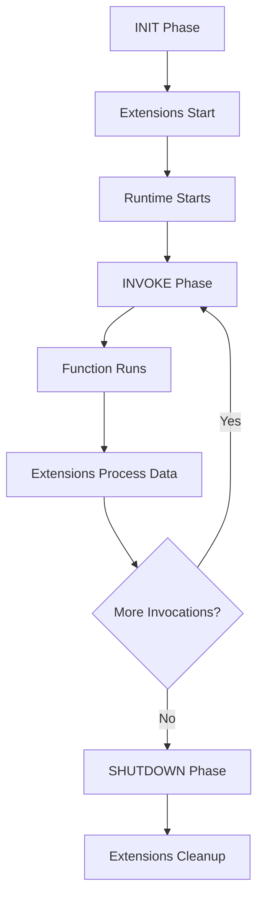

# How to Use Lambda Extensions for Monitoring

Author: [nawazdhandala](https://github.com/nawazdhandala)

Tags: AWS, Lambda, Monitoring, Observability, Extensions

Description: Learn how to use AWS Lambda Extensions to add monitoring, logging, and observability capabilities to your functions without modifying application code.

---

Lambda Extensions let you plug monitoring, security, and governance tools into the Lambda execution environment without touching your function code. They run as separate processes alongside your function, receiving lifecycle events and telemetry data. You can use them to ship logs to third-party services, collect custom metrics, cache configuration, or enforce security policies - all without modifying a single line of your handler.

This is how modern observability platforms integrate with Lambda. Let's understand how extensions work and build one from scratch.

## How Lambda Extensions Work

Extensions come in two flavors:

**Internal extensions** run as part of the function's runtime process. They're loaded as Lambda Layers and start before your handler runs. Think of them as middleware.

**External extensions** run as separate processes in the Lambda execution environment. They start during the INIT phase and can continue running after your function invocation completes (during the SHUTDOWN phase). This is how monitoring agents work - they batch and ship telemetry data asynchronously.

The lifecycle looks like this:



## Using Pre-Built Monitoring Extensions

Before building your own, check if your monitoring tool provides a Lambda extension. Most major platforms do.

### Datadog Extension

```bash
# Add the Datadog Lambda layer
aws lambda update-function-configuration \
  --function-name my-function \
  --layers arn:aws:lambda:us-east-1:464622532012:layer:Datadog-Extension:latest \
  --environment "Variables={DD_API_KEY=your-api-key,DD_SITE=datadoghq.com}"
```

### New Relic Extension

```bash
aws lambda update-function-configuration \
  --function-name my-function \
  --layers arn:aws:lambda:us-east-1:451483290750:layer:NewRelicNodeJS20X:latest \
  --environment "Variables={NEW_RELIC_LAMBDA_HANDLER=index.handler,NEW_RELIC_ACCOUNT_ID=your-account-id}"
```

### Adding Extensions with CDK

This CDK configuration adds a monitoring extension to a Lambda function:

```typescript
import * as cdk from 'aws-cdk-lib';
import * as lambda from 'aws-cdk-lib/aws-lambda';
import { Construct } from 'constructs';

export class MonitoredLambdaStack extends cdk.Stack {
  constructor(scope: Construct, id: string, props?: cdk.StackProps) {
    super(scope, id, props);

    // Reference the monitoring extension layer
    const monitoringLayer = lambda.LayerVersion.fromLayerVersionArn(
      this, 'MonitoringLayer',
      'arn:aws:lambda:us-east-1:123456789012:layer:my-monitoring-extension:1'
    );

    const fn = new lambda.Function(this, 'MonitoredFunction', {
      runtime: lambda.Runtime.NODEJS_20_X,
      handler: 'index.handler',
      code: lambda.Code.fromAsset('lambda/handler'),
      layers: [monitoringLayer],
      timeout: cdk.Duration.seconds(30),
      memorySize: 256,
      environment: {
        MONITORING_ENDPOINT: 'https://metrics.example.com/v1/ingest',
        MONITORING_API_KEY: 'your-api-key',
      },
    });
  }
}
```

## Building a Custom External Extension

Let's build a custom extension that collects invocation metrics and ships them to a custom endpoint. External extensions are standalone executables placed in the `/opt/extensions/` directory.

This Node.js script implements a basic monitoring extension:

```javascript
#!/usr/bin/env node
// extensions/metrics-collector.js

const http = require('http');
const https = require('https');

const LAMBDA_RUNTIME_API = process.env.AWS_LAMBDA_RUNTIME_API;
const EXTENSION_NAME = 'metrics-collector';
const METRICS_ENDPOINT = process.env.MONITORING_ENDPOINT || 'https://metrics.example.com';

// Buffer for collecting metrics
let metricsBuffer = [];
let extensionId;

async function main() {
  // Register the extension
  extensionId = await registerExtension();
  console.log(`[${EXTENSION_NAME}] Registered with ID: ${extensionId}`);

  // Subscribe to the Telemetry API for logs and metrics
  await subscribeTelemetryApi();

  // Main event loop
  while (true) {
    const event = await getNextEvent();
    console.log(`[${EXTENSION_NAME}] Received event: ${event.eventType}`);

    if (event.eventType === 'INVOKE') {
      // Function is being invoked - record start time
      metricsBuffer.push({
        type: 'invocation_start',
        timestamp: Date.now(),
        requestId: event.requestId,
      });
    }

    if (event.eventType === 'SHUTDOWN') {
      // Flush remaining metrics before shutdown
      await flushMetrics();
      console.log(`[${EXTENSION_NAME}] Shutdown complete`);
      break;
    }

    // Flush metrics periodically (every 10 invocations)
    if (metricsBuffer.length >= 10) {
      await flushMetrics();
    }
  }
}

async function registerExtension() {
  const res = await httpRequest({
    hostname: LAMBDA_RUNTIME_API.split(':')[0],
    port: LAMBDA_RUNTIME_API.split(':')[1],
    path: '/2020-01-01/extension/register',
    method: 'POST',
    headers: {
      'Content-Type': 'application/json',
      'Lambda-Extension-Name': EXTENSION_NAME,
    },
    body: JSON.stringify({ events: ['INVOKE', 'SHUTDOWN'] }),
  });

  return res.headers['lambda-extension-identifier'];
}

async function getNextEvent() {
  const res = await httpRequest({
    hostname: LAMBDA_RUNTIME_API.split(':')[0],
    port: LAMBDA_RUNTIME_API.split(':')[1],
    path: '/2020-01-01/extension/event/next',
    method: 'GET',
    headers: {
      'Lambda-Extension-Identifier': extensionId,
    },
  });

  return JSON.parse(res.body);
}

async function subscribeTelemetryApi() {
  // Start a local HTTP server to receive telemetry
  const server = http.createServer((req, res) => {
    let body = '';
    req.on('data', chunk => body += chunk);
    req.on('end', () => {
      try {
        const telemetryBatch = JSON.parse(body);
        processTelemetry(telemetryBatch);
      } catch (e) {
        console.error(`[${EXTENSION_NAME}] Failed to parse telemetry:`, e);
      }
      res.writeHead(200);
      res.end();
    });
  });

  server.listen(0); // random port
  const port = server.address().port;

  // Subscribe to the Telemetry API
  await httpRequest({
    hostname: LAMBDA_RUNTIME_API.split(':')[0],
    port: LAMBDA_RUNTIME_API.split(':')[1],
    path: '/2022-07-01/telemetry',
    method: 'PUT',
    headers: {
      'Content-Type': 'application/json',
      'Lambda-Extension-Identifier': extensionId,
    },
    body: JSON.stringify({
      schemaVersion: '2022-07-01',
      destination: {
        protocol: 'HTTP',
        URI: `http://sandbox.localdomain:${port}`,
      },
      types: ['platform', 'function'],
      buffering: {
        maxItems: 100,
        maxBytes: 262144,
        timeoutMs: 1000,
      },
    }),
  });
}

function processTelemetry(batch) {
  for (const entry of batch) {
    if (entry.type === 'platform.report') {
      metricsBuffer.push({
        type: 'invocation_report',
        timestamp: Date.now(),
        duration: entry.record.metrics.durationMs,
        billedDuration: entry.record.metrics.billedDurationMs,
        memoryUsed: entry.record.metrics.maxMemoryUsedMB,
        memorySize: entry.record.metrics.memorySizeMB,
        initDuration: entry.record.metrics.initDurationMs,
      });
    }
  }
}

async function flushMetrics() {
  if (metricsBuffer.length === 0) return;

  const batch = [...metricsBuffer];
  metricsBuffer = [];

  try {
    // Ship metrics to your monitoring endpoint
    console.log(`[${EXTENSION_NAME}] Flushing ${batch.length} metrics`);
    // In production, make an HTTPS request to your metrics endpoint
  } catch (error) {
    console.error(`[${EXTENSION_NAME}] Failed to flush metrics:`, error);
    // Put failed metrics back in the buffer
    metricsBuffer = [...batch, ...metricsBuffer];
  }
}

// Simple HTTP request helper
function httpRequest(options) {
  return new Promise((resolve, reject) => {
    const req = http.request(options, (res) => {
      let body = '';
      res.on('data', chunk => body += chunk);
      res.on('end', () => resolve({ statusCode: res.statusCode, headers: res.headers, body }));
    });
    req.on('error', reject);
    if (options.body) req.write(options.body);
    req.end();
  });
}

main().catch(console.error);
```

## Building an Internal Extension

Internal extensions run within the runtime process. They're simpler - just a Lambda Layer that gets loaded before your handler.

This internal extension adds request tracing to every invocation:

```javascript
// layers/tracing/wrapper.js
// This runs before the handler on every invocation

const originalHandler = process.env._HANDLER;
const [handlerModule, handlerFunction] = originalHandler.split('.');

// Override the handler
process.env._HANDLER = 'wrapper.handler';

let userHandler;

exports.handler = async (event, context) => {
  // Load the original handler lazily
  if (!userHandler) {
    const mod = require(`/var/task/${handlerModule}`);
    userHandler = mod[handlerFunction];
  }

  const startTime = Date.now();
  const traceId = `trace-${context.awsRequestId}`;

  console.log(JSON.stringify({
    type: 'trace_start',
    traceId,
    functionName: context.functionName,
    requestId: context.awsRequestId,
    timestamp: new Date().toISOString(),
  }));

  try {
    const result = await userHandler(event, context);

    console.log(JSON.stringify({
      type: 'trace_end',
      traceId,
      durationMs: Date.now() - startTime,
      status: 'success',
    }));

    return result;
  } catch (error) {
    console.log(JSON.stringify({
      type: 'trace_end',
      traceId,
      durationMs: Date.now() - startTime,
      status: 'error',
      errorType: error.name,
      errorMessage: error.message,
    }));

    throw error;
  }
};
```

## Packaging Extensions as Layers

External extensions go in `/opt/extensions/` and internal extensions go in `/opt/` (as Lambda Layers).

Package and deploy an external extension:

```bash
# Create the extension structure
mkdir -p extension-layer/extensions
cp metrics-collector.js extension-layer/extensions/metrics-collector
chmod +x extension-layer/extensions/metrics-collector

# Create the ZIP
cd extension-layer
zip -r ../metrics-extension.zip .

# Publish as a Lambda layer
aws lambda publish-layer-version \
  --layer-name metrics-extension \
  --zip-file fileb://../metrics-extension.zip \
  --compatible-runtimes nodejs20.x python3.12
```

## Lambda Telemetry API

The Telemetry API (introduced in 2022) gives extensions access to structured telemetry data including:

- **Platform events**: init, invoke, and report records with timing data
- **Function logs**: stdout/stderr output from your function code
- **Extension logs**: output from other extensions

This replaces the older Logs API and provides richer data. The key events:

- `platform.initStart` / `platform.initReport` - cold start details
- `platform.start` / `platform.report` - invocation metrics
- `function` - your function's console output
- `platform.runtimeDone` - when the runtime finishes

## Performance Impact

Extensions add overhead. External extensions increase cold start time because Lambda waits for all extensions to register before running your handler. They also consume memory from your function's allocation.

Best practices for minimal impact:
- Keep extension initialization fast
- Buffer data and flush asynchronously
- Don't make synchronous network calls during the INVOKE phase
- Use the SHUTDOWN phase for final flushes
- Test cold start impact before deploying to production

For functions where cold start matters, consider whether the monitoring data justifies the overhead. For critical latency-sensitive functions, you might prefer pushing metrics to CloudWatch Embedded Metric Format (EMF) directly from your handler code instead.

## CloudWatch Embedded Metric Format

As a lighter alternative to extensions, EMF lets you embed custom metrics directly in your log output. CloudWatch automatically extracts them as metrics.

```javascript
// No extension needed - metrics from log output
function emitMetric(metricName, value, dimensions = {}) {
  const emf = {
    _aws: {
      Timestamp: Date.now(),
      CloudWatchMetrics: [{
        Namespace: 'MyApp/Lambda',
        Dimensions: [Object.keys(dimensions)],
        Metrics: [{ Name: metricName, Unit: 'Count' }],
      }],
    },
    [metricName]: value,
    ...dimensions,
  };

  console.log(JSON.stringify(emf));
}

// Usage in your handler
emitMetric('OrderProcessed', 1, { Status: 'success', Region: 'us-east-1' });
```

For more on CloudWatch-based debugging, see our guide on [debugging Lambda functions with CloudWatch Logs](https://oneuptime.com/blog/post/2026-02-12-debug-lambda-functions-cloudwatch-logs/view).

## Wrapping Up

Lambda Extensions are the right way to add monitoring to your functions without coupling your business logic to your observability stack. Use pre-built extensions from your monitoring provider when possible. Build custom extensions when you need specific telemetry or when you're shipping to a custom monitoring backend. And remember that extensions have a performance cost - measure the cold start and memory impact before rolling them out to latency-sensitive functions.
