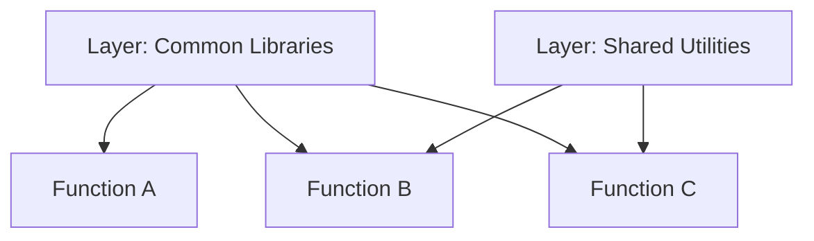

# How to Use Lambda Layers to Share Code Across Functions

Author: [nawazdhandala](https://github.com/nawazdhandala)

Tags: AWS, Lambda, Layers, Serverless

Description: Learn how to create and use AWS Lambda Layers to share libraries, utilities, and custom runtimes across multiple Lambda functions efficiently.

---

When you have 20 Lambda functions and they all use the same version of requests, boto3, or your internal utility library, bundling those dependencies into every single deployment package is wasteful. Lambda Layers solve this. A layer is a zip archive that contains libraries, a custom runtime, or other dependencies. You create it once, and any number of functions can use it.

## How Layers Work

When Lambda runs your function, it extracts the layer contents into the `/opt` directory. Your function code can then import from `/opt` like it's a normal Python or Node.js module path. Lambda automatically adds `/opt/python` (for Python) or `/opt/nodejs` (for Node.js) to the module search path.

You can attach up to 5 layers to a single function. The total unzipped size of the function code plus all layers can't exceed 250 MB.



## Creating a Python Layer

The directory structure inside the zip must follow a specific layout. For Python, dependencies must be under `python/`:

```bash
# Create the layer directory structure
mkdir -p layer/python

# Install dependencies into the correct path
pip install requests boto3 pydantic -t layer/python/

# Create the layer zip
cd layer && zip -r ../common-libs-layer.zip . && cd ..
```

The final zip structure should look like:

```
common-libs-layer.zip
  python/
    requests/
    boto3/
    pydantic/
    ...
```

Publish the layer:

```bash
# Publish the layer
LAYER_ARN=$(aws lambda publish-layer-version \
  --layer-name common-python-libs \
  --description "Common Python libraries: requests, boto3, pydantic" \
  --compatible-runtimes python3.11 python3.12 \
  --zip-file fileb://common-libs-layer.zip \
  --query "LayerVersionArn" --output text)

echo "Layer ARN: $LAYER_ARN"
```

## Creating a Node.js Layer

For Node.js, the directory structure uses `nodejs/`:

```bash
# Create the layer structure
mkdir -p layer/nodejs

# Initialize and install dependencies
cd layer/nodejs
npm init -y
npm install axios lodash dayjs

# Go back and create the zip
cd ../..
cd layer && zip -r ../node-libs-layer.zip . && cd ..

# Publish the layer
aws lambda publish-layer-version \
  --layer-name common-node-libs \
  --description "Common Node.js libraries: axios, lodash, dayjs" \
  --compatible-runtimes nodejs18.x nodejs20.x \
  --zip-file fileb://node-libs-layer.zip
```

## Attaching Layers to Functions

Once published, attach the layer to your functions:

```bash
# Attach a layer to an existing function
aws lambda update-function-configuration \
  --function-name my-function \
  --layers "arn:aws:lambda:us-east-1:123456789012:layer:common-python-libs:1"

# Attach multiple layers
aws lambda update-function-configuration \
  --function-name my-function \
  --layers \
    "arn:aws:lambda:us-east-1:123456789012:layer:common-python-libs:1" \
    "arn:aws:lambda:us-east-1:123456789012:layer:shared-utilities:3"
```

Note: The `--layers` parameter replaces all layers. If you want to add a layer, you need to include all existing layers in the list.

To create a new function with a layer from the start:

```bash
aws lambda create-function \
  --function-name my-new-function \
  --runtime python3.12 \
  --handler app.handler \
  --role arn:aws:iam::123456789012:role/lambda-role \
  --zip-file fileb://function.zip \
  --layers "arn:aws:lambda:us-east-1:123456789012:layer:common-python-libs:1"
```

## Creating a Shared Utilities Layer

Beyond third-party libraries, layers are great for sharing your own code across functions.

Let's create a utilities layer with common helpers:

```python
# layer/python/shared/db.py
import os
import boto3
from functools import lru_cache


@lru_cache(maxsize=1)
def get_dynamodb_table(table_name=None):
    """Get a DynamoDB table resource with connection reuse."""
    dynamodb = boto3.resource('dynamodb')
    name = table_name or os.environ.get('TABLE_NAME')
    return dynamodb.Table(name)


def get_item(table_name, key):
    """Get a single item from DynamoDB."""
    table = get_dynamodb_table(table_name)
    response = table.get_item(Key=key)
    return response.get('Item')


def put_item(table_name, item):
    """Put an item into DynamoDB."""
    table = get_dynamodb_table(table_name)
    table.put_item(Item=item)
```

```python
# layer/python/shared/response.py
import json


def success(body, status_code=200):
    """Create a successful API response."""
    return {
        'statusCode': status_code,
        'headers': {
            'Content-Type': 'application/json',
            'Access-Control-Allow-Origin': '*'
        },
        'body': json.dumps(body)
    }


def error(message, status_code=400):
    """Create an error API response."""
    return {
        'statusCode': status_code,
        'headers': {
            'Content-Type': 'application/json',
            'Access-Control-Allow-Origin': '*'
        },
        'body': json.dumps({'error': message})
    }
```

```python
# layer/python/shared/__init__.py
from shared.db import get_item, put_item
from shared.response import success, error
```

Package and publish:

```bash
cd layer && zip -r ../shared-utils-layer.zip . && cd ..

aws lambda publish-layer-version \
  --layer-name shared-utilities \
  --description "Shared utility functions for DynamoDB and API responses" \
  --compatible-runtimes python3.11 python3.12 \
  --zip-file fileb://shared-utils-layer.zip
```

Now any function using this layer can import these helpers:

```python
# In your Lambda function
from shared import get_item, put_item, success, error


def lambda_handler(event, context):
    order_id = event.get('pathParameters', {}).get('orderId')

    if not order_id:
        return error('Order ID is required')

    item = get_item('orders', {'orderId': order_id})

    if not item:
        return error('Order not found', 404)

    return success(item)
```

## Layer Versioning

Every time you publish a layer, it gets a new version number. Old versions stick around - they're not deleted automatically. Functions reference a specific version.

```bash
# List all versions of a layer
aws lambda list-layer-versions \
  --layer-name common-python-libs \
  --query "LayerVersions[].{Version:Version,Description:Description,Created:CreatedDate}" \
  --output table
```

To update all functions to a new layer version, you need to update each function's configuration. This is intentional - it prevents accidental breaking changes.

Here's a script that updates all functions using a specific layer:

```bash
#!/bin/bash
# update-layer.sh - Update all functions using a layer to a new version

LAYER_NAME="common-python-libs"
NEW_VERSION=5
ACCOUNT_ID="123456789012"
REGION="us-east-1"

OLD_LAYER_PREFIX="arn:aws:lambda:${REGION}:${ACCOUNT_ID}:layer:${LAYER_NAME}:"
NEW_LAYER_ARN="arn:aws:lambda:${REGION}:${ACCOUNT_ID}:layer:${LAYER_NAME}:${NEW_VERSION}"

# Find all functions
FUNCTIONS=$(aws lambda list-functions --query "Functions[].FunctionName" --output text)

for FUNC in $FUNCTIONS; do
    # Get current layers for this function
    CURRENT_LAYERS=$(aws lambda get-function-configuration \
        --function-name $FUNC \
        --query "Layers[].Arn" --output text)

    # Check if this function uses our layer
    if echo "$CURRENT_LAYERS" | grep -q "$OLD_LAYER_PREFIX"; then
        echo "Updating $FUNC..."

        # Replace the old layer version with the new one
        UPDATED_LAYERS=$(echo "$CURRENT_LAYERS" | \
            sed "s|${OLD_LAYER_PREFIX}[0-9]*|${NEW_LAYER_ARN}|g" | \
            tr '\t' ' ')

        aws lambda update-function-configuration \
            --function-name $FUNC \
            --layers $UPDATED_LAYERS

        echo "  Updated to layer version $NEW_VERSION"
    fi
done
```

## Sharing Layers Across Accounts

By default, layers are private to your account. You can grant access to other accounts or make a layer public:

```bash
# Grant access to a specific account
aws lambda add-layer-version-permission \
  --layer-name common-python-libs \
  --version-number 1 \
  --statement-id share-with-team-account \
  --action lambda:GetLayerVersion \
  --principal 987654321098

# Make a layer public (use with caution)
aws lambda add-layer-version-permission \
  --layer-name common-python-libs \
  --version-number 1 \
  --statement-id public-access \
  --action lambda:GetLayerVersion \
  --principal "*"
```

## Using Public Layers

AWS and third parties publish public layers you can use directly. Some popular ones:

- **AWS Parameters and Secrets Lambda Extension** - Cache SSM parameters and Secrets Manager secrets
- **AWS Lambda Powertools** - Logging, tracing, and middleware utilities

```bash
# Attach the AWS Lambda Powertools layer (Python)
aws lambda update-function-configuration \
  --function-name my-function \
  --layers "arn:aws:lambda:us-east-1:017000801446:layer:AWSLambdaPowertoolsPythonV2:51"
```

## SAM Template with Layers

If you use SAM, define layers right in your template:

```yaml
Resources:
  CommonLibsLayer:
    Type: AWS::Serverless::LayerVersion
    Properties:
      LayerName: common-python-libs
      Description: Shared Python libraries
      ContentUri: layers/common-libs/
      CompatibleRuntimes:
        - python3.12
    Metadata:
      BuildMethod: python3.12

  MyFunction:
    Type: AWS::Serverless::Function
    Properties:
      CodeUri: src/
      Handler: app.handler
      Runtime: python3.12
      Layers:
        - !Ref CommonLibsLayer
```

## When to Use Layers vs Bundling

Layers are great when:
- Multiple functions share the same dependencies
- Dependencies change less frequently than your function code
- You want to keep deployment packages small for faster updates

Bundling everything into the function package is better when:
- Each function has unique dependencies
- You want fully self-contained, reproducible deployments
- You're using a bundler like esbuild that produces small packages anyway

## Wrapping Up

Lambda Layers keep your deployment packages lean and your dependencies DRY. Create a layer for your common libraries, another for your shared business logic, and attach them to functions as needed. Just remember that layers are versioned separately from functions, so you'll need a process for rolling out layer updates across your functions.

For more on packaging strategies, see our guide on [packaging Lambda functions with dependencies](https://oneuptime.com/blog/post/2026-02-12-package-lambda-functions-dependencies/view).
