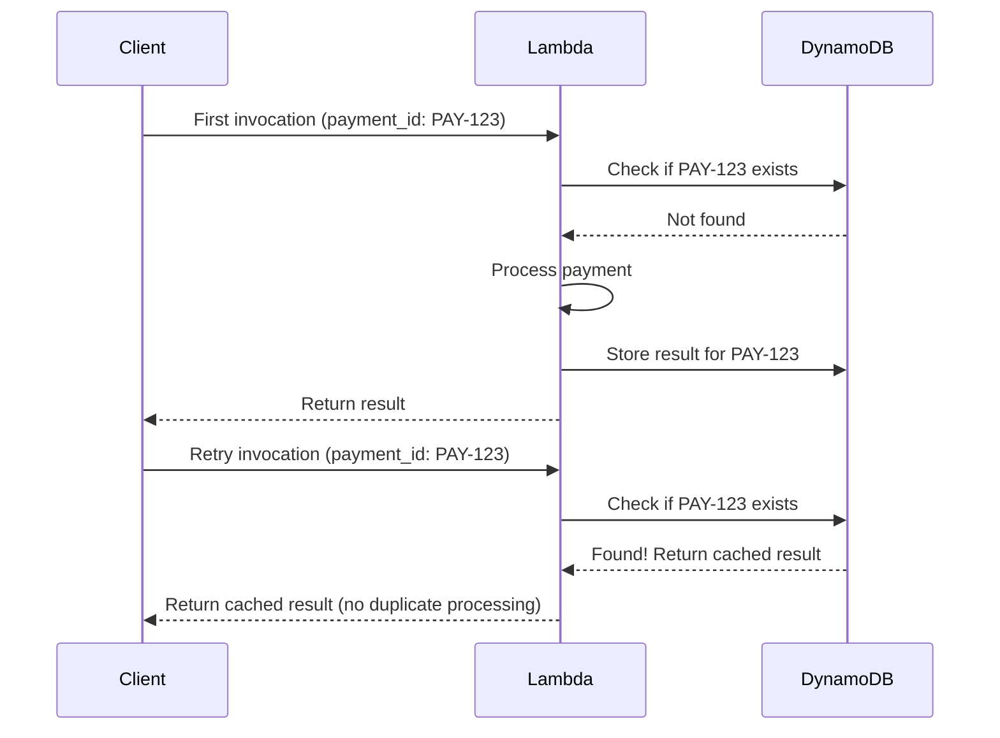

# How to Use Lambda Powertools Idempotency

Author: [nawazdhandala](https://github.com/nawazdhandala)

Tags: AWS, Lambda, Idempotency, Powertools, Serverless

Description: A practical guide to implementing idempotency in Lambda functions using Powertools to prevent duplicate processing of payments, orders, and other critical operations.

---

Lambda functions can be invoked more than once for the same event. API Gateway might retry on timeout. SQS delivers messages at least once, not exactly once. EventBridge rules can trigger multiple times. If your function creates an order, processes a payment, or sends an email, duplicate invocations mean duplicate operations. That's how customers get charged twice or receive the same confirmation email three times.

Idempotency means that running the same operation multiple times produces the same result as running it once. Lambda Powertools Idempotency handles this transparently, so your function always produces the right result regardless of how many times it's invoked.

## How It Works

The idempotency utility uses DynamoDB to track function executions.



The first invocation processes normally and stores the result. Any subsequent invocation with the same idempotency key returns the cached result without re-executing the function logic.

## Setting Up the DynamoDB Table

You need a DynamoDB table to store idempotency records. Here's the Terraform configuration.

```hcl
resource "aws_dynamodb_table" "idempotency" {
  name         = "idempotency-store"
  billing_mode = "PAY_PER_REQUEST"
  hash_key     = "id"

  attribute {
    name = "id"
    type = "S"
  }

  # TTL automatically cleans up expired records
  ttl {
    attribute_name = "expiration"
    enabled        = true
  }

  # Point-in-time recovery for safety
  point_in_time_recovery {
    enabled = true
  }

  tags = {
    Purpose = "lambda-idempotency"
  }
}
```

The IAM role for your Lambda function needs read/write access to this table.

```json
{
  "Version": "2012-10-17",
  "Statement": [
    {
      "Effect": "Allow",
      "Action": [
        "dynamodb:GetItem",
        "dynamodb:PutItem",
        "dynamodb:UpdateItem",
        "dynamodb:DeleteItem"
      ],
      "Resource": "arn:aws:dynamodb:us-east-1:123456789012:table/idempotency-store"
    }
  ]
}
```

## Basic Usage

The simplest way to add idempotency is decorating your handler function.

```python
from aws_lambda_powertools import Logger
from aws_lambda_powertools.utilities.idempotency import (
    DynamoDBPersistenceLayer,
    IdempotencyConfig,
    idempotent
)

logger = Logger(service="payment-service")

# Configure the persistence layer
persistence = DynamoDBPersistenceLayer(table_name="idempotency-store")

# Configure idempotency behavior
config = IdempotencyConfig(
    event_key_jmespath="payment_id",    # Use payment_id as the idempotency key
    expires_after_seconds=3600,          # Cache results for 1 hour
    use_local_cache=True,                # Cache in memory for Lambda reuse
)

@idempotent(config=config, persistence_store=persistence)
def handler(event, context):
    """Process a payment - guaranteed to execute only once per payment_id."""
    payment_id = event["payment_id"]
    customer_id = event["customer_id"]
    amount = event["amount"]

    logger.info("Processing payment", extra={
        "payment_id": payment_id,
        "amount": amount
    })

    # This code runs only on the first invocation
    result = charge_customer(customer_id, amount)

    logger.info("Payment processed", extra={"result": result})

    return {
        "statusCode": 200,
        "body": {
            "payment_id": payment_id,
            "status": "charged",
            "transaction_id": result["transaction_id"]
        }
    }


def charge_customer(customer_id, amount):
    # Actual payment processing
    return {"transaction_id": "TXN-987654", "status": "success"}
```

Now if this Lambda is invoked twice with `{"payment_id": "PAY-123", "customer_id": "CUST-456", "amount": 99.99}`, the customer is only charged once. The second invocation returns the cached result from the first.

## Idempotency on Specific Functions

Sometimes you want idempotency on a specific function within your handler, not the entire handler.

```python
from aws_lambda_powertools.utilities.idempotency import (
    DynamoDBPersistenceLayer,
    IdempotencyConfig,
    idempotent_function
)

persistence = DynamoDBPersistenceLayer(table_name="idempotency-store")
config = IdempotencyConfig(expires_after_seconds=3600)

def handler(event, context):
    """Handler that processes multiple items, each idempotent."""
    results = []

    for item in event["items"]:
        result = process_item(item=item)
        results.append(result)

    return {"statusCode": 200, "body": {"results": results}}


@idempotent_function(
    data_keyword_argument="item",
    config=config,
    persistence_store=persistence
)
def process_item(item: dict) -> dict:
    """Each item is processed idempotently based on its content."""
    # This runs only once per unique item
    return {
        "item_id": item["id"],
        "status": "processed",
        "result": do_expensive_operation(item)
    }
```

## Custom Idempotency Keys

By default, the idempotency key is a hash of the entire event. You can customize which parts of the event form the key.

```python
from aws_lambda_powertools.utilities.idempotency import (
    DynamoDBPersistenceLayer,
    IdempotencyConfig,
    idempotent
)

persistence = DynamoDBPersistenceLayer(table_name="idempotency-store")

# Use JMESPath to extract the idempotency key
config = IdempotencyConfig(
    # Simple key from a single field
    event_key_jmespath="order_id",
    expires_after_seconds=86400  # 24 hours
)

# For SQS events, use the message ID
sqs_config = IdempotencyConfig(
    event_key_jmespath="Records[0].messageId",
    expires_after_seconds=86400
)

# For complex keys combining multiple fields
compound_config = IdempotencyConfig(
    event_key_jmespath="[customer_id, order_date]",
    expires_after_seconds=3600
)

# For API Gateway events, use a header value
api_config = IdempotencyConfig(
    event_key_jmespath="headers.\"X-Idempotency-Key\"",
    expires_after_seconds=3600
)

@idempotent(config=api_config, persistence_store=persistence)
def api_handler(event, context):
    """API endpoint where clients provide their own idempotency key."""
    body = json.loads(event["body"])
    # Process the request
    return {"statusCode": 200, "body": json.dumps({"status": "ok"})}
```

## Handling SQS Batch Processing

When processing SQS messages in batches, each message should be idempotent independently.

```python
from aws_lambda_powertools import Logger
from aws_lambda_powertools.utilities.batch import (
    BatchProcessor,
    EventType,
    process_partial_response
)
from aws_lambda_powertools.utilities.idempotency import (
    DynamoDBPersistenceLayer,
    IdempotencyConfig,
    idempotent_function
)
import json

logger = Logger()
processor = BatchProcessor(event_type=EventType.SQS)
persistence = DynamoDBPersistenceLayer(table_name="idempotency-store")
idem_config = IdempotencyConfig(expires_after_seconds=3600)

@idempotent_function(
    data_keyword_argument="record",
    config=idem_config,
    persistence_store=persistence
)
def process_record(record):
    """Process each SQS message idempotently."""
    body = json.loads(record["body"])
    payment_id = body["payment_id"]

    logger.info("Processing payment from SQS", extra={"payment_id": payment_id})

    result = charge_customer(body["customer_id"], body["amount"])
    return {"payment_id": payment_id, "status": "charged"}


def handler(event, context):
    """Process SQS batch with partial failure handling."""
    return process_partial_response(
        event=event,
        record_handler=process_record,
        processor=processor,
        context=context
    )
```

## Handling Concurrent Invocations

What happens when two invocations start at the same time? Powertools uses an "in progress" status with optimistic locking to handle this.

```python
from aws_lambda_powertools.utilities.idempotency import (
    DynamoDBPersistenceLayer,
    IdempotencyConfig,
    idempotent,
    IdempotencyAlreadyInProgressError
)

persistence = DynamoDBPersistenceLayer(table_name="idempotency-store")
config = IdempotencyConfig(
    event_key_jmespath="payment_id",
    expires_after_seconds=3600,
    raise_on_no_idempotency_key=True  # Fail if the key is missing
)

@idempotent(config=config, persistence_store=persistence)
def handler(event, context):
    """
    If two invocations arrive simultaneously:
    1. First invocation: Records "IN_PROGRESS" in DynamoDB and starts processing
    2. Second invocation: Sees "IN_PROGRESS" and raises IdempotencyAlreadyInProgressError
    3. First invocation: Completes and stores the result
    4. Any subsequent invocation: Returns the cached result
    """
    return process_payment(event)
```

When a concurrent invocation is detected, `IdempotencyAlreadyInProgressError` is raised. The caller (API Gateway, SQS, etc.) can then retry, and the retry will find the completed result.

## Error Handling

What happens when the function fails? Idempotency records for failed invocations are automatically deleted so the operation can be retried.

```python
from aws_lambda_powertools.utilities.idempotency import (
    DynamoDBPersistenceLayer,
    IdempotencyConfig,
    idempotent
)
from aws_lambda_powertools import Logger

logger = Logger()
persistence = DynamoDBPersistenceLayer(table_name="idempotency-store")
config = IdempotencyConfig(
    event_key_jmespath="payment_id",
    expires_after_seconds=3600
)

@idempotent(config=config, persistence_store=persistence)
def handler(event, context):
    payment_id = event["payment_id"]

    try:
        result = charge_customer(event["customer_id"], event["amount"])
        return {"statusCode": 200, "body": result}
    except PaymentGatewayTimeout:
        # If the function raises an unhandled exception, the idempotency
        # record is deleted from DynamoDB. This means the next retry
        # will actually execute the function again.
        logger.error("Payment gateway timed out")
        raise
    except InsufficientFundsError as e:
        # If you return a response (even an error response), it's cached.
        # Subsequent invocations return this same error response.
        return {"statusCode": 400, "body": {"error": "Insufficient funds"}}
```

Key behavior: if the function raises an exception, the idempotency record is removed so retries work correctly. If the function returns a response (even an error response), that response is cached.

## Testing Idempotent Functions

Testing idempotent functions requires mocking the persistence layer.

```python
import pytest
from unittest.mock import patch, MagicMock
from app import handler

@pytest.fixture
def mock_persistence():
    """Mock the DynamoDB persistence layer for testing."""
    with patch("app.persistence") as mock:
        # Simulate no existing idempotency record
        mock.get_record.side_effect = Exception("Record not found")
        yield mock

def test_first_invocation(mock_persistence):
    """First invocation should process normally."""
    event = {
        "payment_id": "PAY-123",
        "customer_id": "CUST-456",
        "amount": 99.99
    }

    result = handler(event, {})

    assert result["statusCode"] == 200
    assert result["body"]["status"] == "charged"

def test_idempotency_key_required():
    """Should fail if idempotency key is missing."""
    event = {"customer_id": "CUST-456", "amount": 99.99}
    # Missing payment_id

    with pytest.raises(Exception):
        handler(event, {})
```

## Summary

Idempotency is not optional for production Lambda functions that perform side effects. Duplicate invocations are a normal part of serverless architectures, not an edge case. Lambda Powertools Idempotency gives you a battle-tested solution that handles concurrent invocations, automatic cleanup of failed records, and configurable expiration.

Set it up for any function that processes payments, creates records, sends notifications, or calls external APIs. The DynamoDB cost is negligible compared to the cost of handling duplicate operations in production.

For the full Powertools toolkit, see our guides on [Lambda Powertools for Python](https://oneuptime.com/blog/post/2026-02-12-lambda-powertools-python/view) and [Event Handler for API Gateway](https://oneuptime.com/blog/post/2026-02-12-lambda-powertools-event-handler-api-gateway/view).
