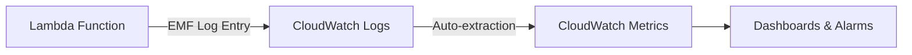

# How to Use Lambda Powertools Metrics for Custom CloudWatch Metrics

Author: [nawazdhandala](https://github.com/nawazdhandala)

Tags: AWS, Lambda, CloudWatch, Metrics, Powertools

Description: Learn how to create custom CloudWatch metrics from Lambda functions using Powertools Metrics with EMF, dimensions, high-resolution metrics, and cost-effective practices.

---

CloudWatch provides default Lambda metrics - invocation count, duration, error count, throttles. But these tell you about your Lambda function, not about your business. How many orders were processed? What's the average cart value? How many payments failed? These are the metrics that actually matter, and Lambda Powertools Metrics makes it easy to create them without the overhead of direct CloudWatch API calls.

Powertools Metrics uses the Embedded Metric Format (EMF), which means your metrics are published as structured log entries that CloudWatch automatically converts to metrics. No PutMetricData API calls, no extra latency, no additional cost beyond log ingestion.

## How EMF Works

Understanding EMF helps you use Metrics effectively.



Your Lambda function writes a specially formatted JSON log entry. CloudWatch Logs recognizes the EMF format and automatically creates metrics from it. This is faster and cheaper than calling the PutMetricData API directly.

## Basic Setup

Initialize the Metrics utility and use the decorator to flush metrics automatically.

```python
from aws_lambda_powertools import Metrics
from aws_lambda_powertools.metrics import MetricUnit

# Create a Metrics instance with namespace and service
metrics = Metrics(namespace="OrderService", service="order-processor")

@metrics.log_metrics(capture_cold_start_metric=True)
def handler(event, context):
    # Add a metric
    metrics.add_metric(name="OrderReceived", unit=MetricUnit.Count, value=1)

    # Process the order
    total = process_order(event)

    # Add more metrics
    metrics.add_metric(name="OrderValue", unit=MetricUnit.Count, value=total)
    metrics.add_metric(name="ItemCount", unit=MetricUnit.Count, value=len(event.get("items", [])))

    return {"statusCode": 200}
```

The `@metrics.log_metrics` decorator ensures all metrics are flushed at the end of the invocation. Without it, metrics would be lost. The `capture_cold_start_metric=True` flag automatically tracks cold starts.

## Dimensions

Dimensions let you slice and dice your metrics. Think of them as categories or labels for your data.

```python
from aws_lambda_powertools import Metrics
from aws_lambda_powertools.metrics import MetricUnit

metrics = Metrics(namespace="OrderService", service="order-processor")

@metrics.log_metrics
def handler(event, context):
    order = event

    # Default dimensions (apply to all metrics in this invocation)
    metrics.add_dimension(name="Environment", value="production")
    metrics.add_dimension(name="Region", value="us-east-1")

    # Business metrics with dimensions
    metrics.add_metric(name="OrderProcessed", unit=MetricUnit.Count, value=1)

    # Different metrics for different payment methods
    payment_method = order.get("payment_method", "unknown")
    metrics.add_dimension(name="PaymentMethod", value=payment_method)
    metrics.add_metric(name="PaymentProcessed", unit=MetricUnit.Count, value=1)
    metrics.add_metric(name="PaymentAmount", unit=MetricUnit.Count, value=order["total"])

    return {"statusCode": 200}
```

With dimensions, you can create CloudWatch dashboards that show order volume by payment method, or error rates by region. But be careful - each unique combination of dimensions creates a separate metric, and CloudWatch charges per metric. Don't use high-cardinality values (like user IDs) as dimensions.

## Multiple Metric Sets

Sometimes you need different dimensions for different metrics within the same invocation. Use `single_metric` for this.

```python
from aws_lambda_powertools import Metrics
from aws_lambda_powertools.metrics import MetricUnit, single_metric

metrics = Metrics(namespace="OrderService", service="order-processor")

@metrics.log_metrics
def handler(event, context):
    order = event

    # Standard metrics with environment dimension
    metrics.add_dimension(name="Environment", value="production")
    metrics.add_metric(name="OrderProcessed", unit=MetricUnit.Count, value=1)

    # Separate metric with different dimensions using single_metric
    with single_metric(
        name="PaymentByMethod",
        unit=MetricUnit.Count,
        value=1,
        namespace="OrderService"
    ) as metric:
        metric.add_dimension(name="PaymentMethod", value=order["payment_method"])
        metric.add_dimension(name="Currency", value=order.get("currency", "USD"))

    # Another separate metric for shipping
    with single_metric(
        name="ShippingByCarrier",
        unit=MetricUnit.Count,
        value=1,
        namespace="OrderService"
    ) as metric:
        metric.add_dimension(name="Carrier", value=order.get("shipping_carrier", "unknown"))
        metric.add_dimension(name="ShippingType", value=order.get("shipping_type", "standard"))

    return {"statusCode": 200}
```

## High-Resolution Metrics

Standard CloudWatch metrics have 1-minute resolution. For latency-sensitive applications, you can use high-resolution metrics with 1-second granularity.

```python
from aws_lambda_powertools import Metrics
from aws_lambda_powertools.metrics import MetricUnit, MetricResolution
import time

metrics = Metrics(namespace="OrderService", service="order-processor")

@metrics.log_metrics
def handler(event, context):
    start = time.time()

    result = process_order(event)

    # High-resolution metric for processing latency
    duration_ms = (time.time() - start) * 1000
    metrics.add_metric(
        name="ProcessingLatency",
        unit=MetricUnit.Milliseconds,
        value=duration_ms,
        resolution=MetricResolution.High  # 1-second resolution
    )

    # Standard resolution is fine for counts
    metrics.add_metric(
        name="OrderProcessed",
        unit=MetricUnit.Count,
        value=1,
        resolution=MetricResolution.Standard  # Default, 60-second resolution
    )

    return {"statusCode": 200}
```

High-resolution metrics cost more, so use them selectively for metrics where you need to detect spikes quickly.

## Building CloudWatch Alarms on Custom Metrics

Once your metrics are flowing, set up alarms to detect problems.

```hcl
# Alarm: Too many failed payments
resource "aws_cloudwatch_metric_alarm" "payment_failures" {
  alarm_name          = "high-payment-failure-rate"
  comparison_operator = "GreaterThanThreshold"
  evaluation_periods  = 3
  threshold           = 10

  metric_query {
    id          = "failure_rate"
    expression  = "failures / total * 100"
    label       = "Payment Failure Rate"
    return_data = true
  }

  metric_query {
    id = "failures"
    metric {
      metric_name = "PaymentFailed"
      namespace   = "OrderService"
      period      = 300
      stat        = "Sum"
      dimensions = {
        Environment = "production"
      }
    }
  }

  metric_query {
    id = "total"
    metric {
      metric_name = "PaymentProcessed"
      namespace   = "OrderService"
      period      = 300
      stat        = "Sum"
      dimensions = {
        Environment = "production"
      }
    }
  }

  alarm_actions = [aws_sns_topic.alerts.arn]
}

# Alarm: Order processing latency too high
resource "aws_cloudwatch_metric_alarm" "high_latency" {
  alarm_name          = "high-order-processing-latency"
  comparison_operator = "GreaterThanThreshold"
  evaluation_periods  = 2
  metric_name         = "ProcessingLatency"
  namespace           = "OrderService"
  period              = 300
  statistic           = "p99"
  threshold           = 5000  # 5 seconds
  alarm_actions       = [aws_sns_topic.alerts.arn]

  dimensions = {
    Environment = "production"
  }
}
```

## Building a Dashboard

Here's a CloudWatch dashboard that combines Lambda Powertools metrics with default Lambda metrics.

```python
import boto3
import json

def create_order_dashboard():
    cw = boto3.client("cloudwatch")

    dashboard_body = {
        "widgets": [
            {
                "type": "metric",
                "properties": {
                    "title": "Orders Per Minute",
                    "metrics": [
                        ["OrderService", "OrderProcessed", "Environment", "production",
                         {"stat": "Sum", "period": 60}],
                        ["OrderService", "OrderFailed", "Environment", "production",
                         {"stat": "Sum", "period": 60, "color": "#d62728"}]
                    ],
                    "view": "timeSeries",
                    "stacked": False,
                    "period": 60
                },
                "width": 12,
                "height": 6
            },
            {
                "type": "metric",
                "properties": {
                    "title": "Payment Methods Distribution",
                    "metrics": [
                        ["OrderService", "PaymentByMethod", "PaymentMethod", "credit_card"],
                        ["...", "debit_card"],
                        ["...", "paypal"],
                        ["...", "apple_pay"]
                    ],
                    "view": "pie",
                    "period": 3600
                },
                "width": 6,
                "height": 6
            },
            {
                "type": "metric",
                "properties": {
                    "title": "Processing Latency (p50, p90, p99)",
                    "metrics": [
                        ["OrderService", "ProcessingLatency", "Environment", "production",
                         {"stat": "p50", "label": "p50"}],
                        ["...", {"stat": "p90", "label": "p90"}],
                        ["...", {"stat": "p99", "label": "p99", "color": "#d62728"}]
                    ],
                    "view": "timeSeries",
                    "period": 300
                },
                "width": 12,
                "height": 6
            },
            {
                "type": "metric",
                "properties": {
                    "title": "Average Order Value",
                    "metrics": [
                        ["OrderService", "OrderValue", "Environment", "production",
                         {"stat": "Average", "period": 3600}]
                    ],
                    "view": "singleValue"
                },
                "width": 6,
                "height": 3
            },
            {
                "type": "metric",
                "properties": {
                    "title": "Cold Starts",
                    "metrics": [
                        ["OrderService", "ColdStart", "service", "order-processor",
                         {"stat": "Sum", "period": 300}]
                    ],
                    "view": "timeSeries"
                },
                "width": 6,
                "height": 3
            }
        ]
    }

    cw.put_dashboard(
        DashboardName="Order-Service",
        DashboardBody=json.dumps(dashboard_body)
    )
    print("Dashboard created")

create_order_dashboard()
```

## Cost-Effective Metrics Practices

Custom metrics have costs. Here are ways to keep them reasonable.

```python
from aws_lambda_powertools import Metrics
from aws_lambda_powertools.metrics import MetricUnit

metrics = Metrics(namespace="OrderService", service="order-processor")

@metrics.log_metrics
def handler(event, context):
    # DO: Use low-cardinality dimensions
    metrics.add_dimension(name="Environment", value="production")  # Good: 3-4 values
    metrics.add_dimension(name="PaymentMethod", value="credit_card")  # Good: 5-10 values

    # DON'T: Use high-cardinality dimensions
    # metrics.add_dimension(name="UserId", value=user_id)  # Bad: millions of values
    # metrics.add_dimension(name="OrderId", value=order_id)  # Bad: unique per order

    # DO: Batch related values into fewer metrics
    metrics.add_metric(name="OrderProcessed", unit=MetricUnit.Count, value=1)
    metrics.add_metric(name="OrderValue", unit=MetricUnit.Count, value=event["total"])

    # DON'T: Create separate metrics for each item type
    # for item in event["items"]:
    #     metrics.add_metric(name=f"Item_{item['type']}", ...)  # Metric explosion

    return {"statusCode": 200}
```

## Summary

Lambda Powertools Metrics gives you custom CloudWatch metrics with zero API call overhead. The EMF approach means your metrics are published through CloudWatch Logs, which is both faster and cheaper than direct PutMetricData calls. Use dimensions thoughtfully to avoid metric explosion, and build dashboards and alarms on the metrics that matter to your business.

For the complete observability picture, combine metrics with [structured logging](https://oneuptime.com/blog/post/lambda-powertools-logger-structured-logging/view) and [distributed tracing](https://oneuptime.com/blog/post/lambda-powertools-tracer-xray-integration/view).
