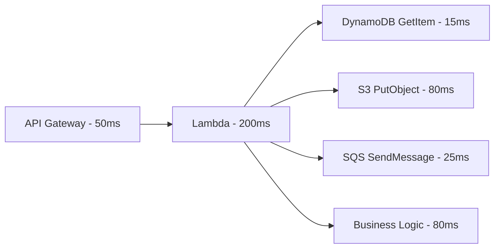

# How to Use Lambda Powertools Tracer for X-Ray Integration

Author: [nawazdhandala](https://github.com/nawazdhandala)

Tags: AWS, Lambda, X-Ray, Tracing, Powertools

Description: A deep dive into Lambda Powertools Tracer for distributed tracing with AWS X-Ray including subsegments, annotations, metadata, and troubleshooting performance bottlenecks.

---

When your serverless application spans multiple Lambda functions, API Gateway, DynamoDB, SQS, and S3, understanding where time is being spent becomes a real challenge. A request might take 3 seconds, but is that 3 seconds in your code, or 3 seconds waiting for DynamoDB? AWS X-Ray answers that question, and Lambda Powertools Tracer makes X-Ray integration painless.

The Tracer utility wraps the X-Ray SDK, auto-patches AWS SDK calls, and gives you decorators for tracing individual methods. Let's dive in.

## How X-Ray Tracing Works

X-Ray collects timing data for each component in your request flow.



Each component creates a segment or subsegment in X-Ray. When you look at a trace, you can see exactly how long each part took and where the bottlenecks are.

## Setting Up the Tracer

First, enable active tracing on your Lambda function and initialize the Tracer.

```yaml
# SAM template - enable tracing
Resources:
  MyFunction:
    Type: AWS::Serverless::Function
    Properties:
      Runtime: python3.12
      Handler: app.handler
      Tracing: Active  # This is required for X-Ray
      Environment:
        Variables:
          POWERTOOLS_SERVICE_NAME: order-service
```

Then use the Tracer in your function.

```python
from aws_lambda_powertools import Logger, Tracer
from aws_lambda_powertools.utilities.typing import LambdaContext

logger = Logger(service="order-service")
tracer = Tracer(service="order-service")

# The Tracer automatically patches boto3, requests, and other libraries
# so all AWS SDK calls and HTTP requests are traced

@tracer.capture_lambda_handler
@logger.inject_lambda_context
def handler(event: dict, context: LambdaContext) -> dict:
    order_id = event["order_id"]

    # Add an annotation - these are indexed and searchable in X-Ray
    tracer.put_annotation(key="OrderId", value=order_id)

    order = get_order(order_id)
    total = calculate_total(order)
    receipt = generate_receipt(order, total)

    return {"statusCode": 200, "body": {"order_id": order_id, "total": total}}
```

## Tracing Methods

Decorate individual methods to create subsegments in your trace. This shows exactly where time is spent within your Lambda function.

```python
import boto3
from aws_lambda_powertools import Tracer

tracer = Tracer()
dynamodb = boto3.resource("dynamodb")
s3 = boto3.client("s3")

@tracer.capture_method
def get_order(order_id: str) -> dict:
    """This creates a subsegment named 'get_order' in the trace."""
    table = dynamodb.Table("orders")
    response = table.get_item(Key={"order_id": order_id})

    order = response.get("Item")
    if not order:
        tracer.put_annotation(key="OrderNotFound", value=order_id)
        raise ValueError(f"Order {order_id} not found")

    # Add metadata - not indexed but visible in trace details
    tracer.put_metadata(key="order", value=order, namespace="OrderDetails")
    return order


@tracer.capture_method
def calculate_total(order: dict) -> float:
    """Each decorated method appears as its own subsegment."""
    items = order.get("items", [])

    total = 0
    for item in items:
        subtotal = item["price"] * item["quantity"]
        total += subtotal

    # Apply discount if applicable
    if total > 100:
        discount = total * 0.1
        total -= discount
        tracer.put_annotation(key="DiscountApplied", value=True)

    tracer.put_annotation(key="OrderTotal", value=str(round(total, 2)))
    return round(total, 2)


@tracer.capture_method
def generate_receipt(order: dict, total: float) -> str:
    """S3 put call is automatically traced because Tracer patches boto3."""
    receipt_key = f"receipts/{order['order_id']}.json"

    s3.put_object(
        Bucket="order-receipts",
        Key=receipt_key,
        Body=json.dumps({"order_id": order["order_id"], "total": total}),
        ContentType="application/json"
    )

    return receipt_key
```

In the X-Ray console, you'll see a trace like this: the Lambda segment contains subsegments for `get_order` (with a DynamoDB subsegment inside it), `calculate_total`, and `generate_receipt` (with an S3 subsegment inside it).

## Annotations vs Metadata

Understanding the difference between annotations and metadata is important for effective tracing.

```python
from aws_lambda_powertools import Tracer

tracer = Tracer()

@tracer.capture_method
def process_payment(payment_id: str, amount: float, method: str):
    # ANNOTATIONS: Indexed, searchable in X-Ray console
    # Use for values you want to filter traces by
    tracer.put_annotation(key="PaymentId", value=payment_id)
    tracer.put_annotation(key="PaymentMethod", value=method)
    tracer.put_annotation(key="PaymentAmount", value=str(amount))

    # METADATA: Not indexed, but visible in trace details
    # Use for debugging data that you don't need to search by
    tracer.put_metadata(
        key="payment_details",
        value={
            "payment_id": payment_id,
            "amount": amount,
            "method": method,
            "processor_response": {"auth_code": "ABC123", "risk_score": 0.02}
        },
        namespace="PaymentProcessing"
    )

    # Annotations let you search like:
    # "annotation.PaymentMethod = 'credit_card' AND annotation.PaymentAmount > '100'"
    # in the X-Ray console filter expression
```

## Tracing Async Operations

When your Lambda function sends messages to SQS or triggers other functions, you want the trace to follow the request.

```python
import boto3
import json
from aws_lambda_powertools import Tracer

tracer = Tracer()
sqs = boto3.client("sqs")

@tracer.capture_method
def queue_fulfillment(order: dict):
    """Send to SQS - the message carries the trace header automatically."""
    # Tracer patches boto3, so the X-Ray trace header is
    # automatically included in the SQS message attributes

    sqs.send_message(
        QueueUrl="https://sqs.us-east-1.amazonaws.com/123456789012/fulfillment",
        MessageBody=json.dumps({
            "order_id": order["order_id"],
            "items": order["items"],
            "shipping_address": order["shipping_address"]
        })
    )

    tracer.put_annotation(key="FulfillmentQueued", value=True)
```

The downstream Lambda function that processes the SQS message automatically picks up the trace context, creating a connected distributed trace.

## Handling Errors in Traces

When an exception occurs, you want it captured in the trace for easy debugging.

```python
from aws_lambda_powertools import Logger, Tracer

logger = Logger()
tracer = Tracer()

@tracer.capture_lambda_handler(capture_error=True)
@logger.inject_lambda_context
def handler(event, context):
    try:
        result = risky_operation(event)
        return {"statusCode": 200, "body": result}
    except Exception as e:
        # The exception is automatically captured in the X-Ray trace
        # because capture_error=True is the default
        logger.exception("Operation failed")

        # You can also manually add error information
        tracer.put_metadata(key="error_event", value=event, namespace="Errors")
        raise  # Re-raise to mark the trace as errored


@tracer.capture_method
def risky_operation(event):
    """If this throws, the subsegment is marked as error/fault in X-Ray."""
    if not event.get("required_field"):
        raise ValueError("Missing required_field")

    # ... process
    return {"status": "ok"}
```

## Disabling Tracing for Tests

In your test environment, you don't want to send traces to X-Ray. Powertools makes this easy.

```python
import os
import pytest

# Option 1: Environment variable
# Set POWERTOOLS_TRACE_DISABLED=true

# Option 2: In your test setup
@pytest.fixture(autouse=True)
def disable_tracing():
    os.environ["POWERTOOLS_TRACE_DISABLED"] = "true"
    yield
    del os.environ["POWERTOOLS_TRACE_DISABLED"]

# Option 3: Mock the tracer
from unittest.mock import patch

def test_handler():
    with patch("app.tracer") as mock_tracer:
        result = handler(test_event, test_context)
        assert result["statusCode"] == 200
```

## X-Ray Filter Expressions

Once your traces are flowing, use filter expressions to find specific traces in the X-Ray console.

```
# Find traces for a specific order
annotation.OrderId = "ORD-12345"

# Find slow traces (over 2 seconds)
responsetime > 2

# Find traces with errors
fault = true OR error = true

# Find traces for a specific service with high latency
service("order-service") AND responsetime > 1

# Combine annotations with performance filters
annotation.PaymentMethod = "credit_card" AND responsetime > 3

# Find traces with specific HTTP status codes
http.status = 500
```

## Performance Analysis with X-Ray

Use the X-Ray analytics page to spot patterns. Here's a Python script that pulls trace summaries for custom analysis.

```python
import boto3
from datetime import datetime, timedelta

def analyze_traces(service_name, hours=1):
    """Analyze recent traces for a service."""
    xray = boto3.client("xray")

    end_time = datetime.utcnow()
    start_time = end_time - timedelta(hours=hours)

    # Get trace summaries
    summaries = []
    paginator = xray.get_paginator("get_trace_summaries")
    for page in paginator.paginate(
        StartTime=start_time,
        EndTime=end_time,
        FilterExpression=f'service("{service_name}")',
        Sampling=False
    ):
        summaries.extend(page["TraceSummaries"])

    if not summaries:
        print("No traces found")
        return

    # Analyze response times
    response_times = [s["ResponseTime"] for s in summaries]
    error_count = sum(1 for s in summaries if s.get("HasFault") or s.get("HasError"))

    print(f"\nTrace Analysis for {service_name}")
    print(f"  Total traces: {len(summaries)}")
    print(f"  Error rate: {error_count / len(summaries) * 100:.1f}%")
    print(f"  Avg response time: {sum(response_times) / len(response_times):.3f}s")
    print(f"  P50 response time: {sorted(response_times)[len(response_times) // 2]:.3f}s")
    print(f"  P99 response time: {sorted(response_times)[int(len(response_times) * 0.99)]:.3f}s")
    print(f"  Max response time: {max(response_times):.3f}s")

analyze_traces("order-service", hours=24)
```

## Key Takeaways

X-Ray tracing with Lambda Powertools Tracer gives you visibility into your serverless application that's impossible to achieve with logs alone. You can see exactly where time is spent, follow requests across service boundaries, and quickly identify which downstream service is causing latency spikes.

Start by enabling tracing on all your Lambda functions and decorating your handler and key methods. Add annotations for the values you'll want to search by. Then use the X-Ray console to analyze performance patterns and debug issues.

For structured logging that complements your traces, see [Lambda Powertools Logger](https://oneuptime.com/blog/post/lambda-powertools-logger-structured-logging/view). For custom metrics, check out [Lambda Powertools Metrics](https://oneuptime.com/blog/post/lambda-powertools-metrics-custom-cloudwatch/view).
