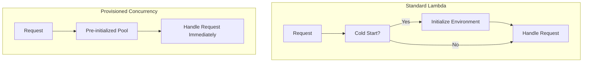

# How to Use Lambda Provisioned Concurrency to Eliminate Cold Starts

Author: [nawazdhandala](https://github.com/nawazdhandala)

Tags: AWS, Lambda, Provisioned Concurrency, Performance, Serverless

Description: Learn how to configure and manage Lambda provisioned concurrency to eliminate cold starts and deliver consistent low-latency performance for critical functions.

---

Provisioned concurrency is Lambda's answer to "I need zero cold starts, no matter what." It pre-initializes a specified number of execution environments and keeps them warm, ready to respond instantly. Unlike the warmer-function hack, provisioned concurrency is a first-class AWS feature with proper scaling and monitoring.

The trade-off is cost - you pay for provisioned environments whether they're handling requests or not. But for latency-sensitive workloads, it's worth every penny.

## How Provisioned Concurrency Works

Without provisioned concurrency, Lambda creates new environments on demand. The first request to a new environment gets a cold start. With provisioned concurrency, Lambda maintains a pool of pre-initialized environments:



The pre-initialized environments have already:
- Downloaded and extracted the code
- Started the runtime
- Run all initialization code (imports, connections, global setup)

When a request arrives, it goes straight to the handler with zero cold start.

## Setting Up Provisioned Concurrency

Provisioned concurrency requires a published version or an alias - it doesn't work with `$LATEST`.

First, publish a version:

```bash
# Publish a version of your function
VERSION=$(aws lambda publish-version \
  --function-name my-api-function \
  --description "Production release v2.1" \
  --query "Version" --output text)

echo "Published version: $VERSION"
```

Then configure provisioned concurrency:

```bash
# Set provisioned concurrency on the published version
aws lambda put-provisioned-concurrency-config \
  --function-name my-api-function \
  --qualifier $VERSION \
  --provisioned-concurrent-executions 10
```

Or use an alias (recommended - easier to manage):

```bash
# Create or update an alias
aws lambda update-alias \
  --function-name my-api-function \
  --name production \
  --function-version $VERSION

# Set provisioned concurrency on the alias
aws lambda put-provisioned-concurrency-config \
  --function-name my-api-function \
  --qualifier production \
  --provisioned-concurrent-executions 10
```

## Checking Status

Provisioned concurrency takes a few minutes to initialize. Check the status:

```bash
# Check provisioned concurrency status
aws lambda get-provisioned-concurrency-config \
  --function-name my-api-function \
  --qualifier production
```

The output shows the allocation status:

```json
{
  "RequestedProvisionedConcurrentExecutions": 10,
  "AvailableProvisionedConcurrentExecutions": 10,
  "AllocatedProvisionedConcurrentExecutions": 10,
  "Status": "READY",
  "LastModified": "2026-02-12T10:30:00.000+0000"
}
```

Statuses:
- **IN_PROGRESS** - Environments are being initialized
- **READY** - All environments are warm and ready
- **FAILED** - Something went wrong during initialization

## How Many to Provision

The right number depends on your traffic pattern. Provision enough for your baseline traffic, and let on-demand scaling handle spikes.

Check your current concurrency metrics:

```bash
# Get maximum concurrent executions over the past 7 days
aws cloudwatch get-metric-statistics \
  --namespace AWS/Lambda \
  --metric-name ConcurrentExecutions \
  --dimensions Name=FunctionName,Value=my-api-function \
  --start-time $(date -u -v-7d +%Y-%m-%dT%H:%M:%S) \
  --end-time $(date -u +%Y-%m-%dT%H:%M:%S) \
  --period 3600 \
  --statistics Maximum \
  --output table
```

A good starting point:
- If your peak concurrency is 50, provision 30-40 (60-80% of peak)
- If your baseline is steady at 10 with occasional spikes to 100, provision 10-15

Requests that exceed your provisioned concurrency use regular on-demand environments and may experience cold starts. But most of your traffic will be cold-start-free.

## Auto Scaling Provisioned Concurrency

For applications with predictable traffic patterns, use Application Auto Scaling to adjust provisioned concurrency automatically:

```bash
# Register the function as a scalable target
aws application-autoscaling register-scalable-target \
  --service-namespace lambda \
  --resource-id "function:my-api-function:production" \
  --scalable-dimension "lambda:function:ProvisionedConcurrency" \
  --min-capacity 5 \
  --max-capacity 50

# Create a target tracking scaling policy
aws application-autoscaling put-scaling-policy \
  --service-namespace lambda \
  --resource-id "function:my-api-function:production" \
  --scalable-dimension "lambda:function:ProvisionedConcurrency" \
  --policy-name "utilization-tracking" \
  --policy-type TargetTrackingScaling \
  --target-tracking-scaling-policy-configuration '{
    "TargetValue": 0.7,
    "PredefinedMetricSpecification": {
      "PredefinedMetricType": "LambdaProvisionedConcurrencyUtilization"
    },
    "ScaleInCooldown": 60,
    "ScaleOutCooldown": 0
  }'
```

This policy:
- Keeps provisioned concurrency utilization at 70% (scales up when 70% of provisioned environments are busy)
- Scales between 5 and 50 environments
- Scales out immediately (0 second cooldown)
- Waits 60 seconds before scaling in

## Scheduled Scaling

If you know your traffic patterns (peak during business hours, low at night), use scheduled scaling:

```bash
# Scale up at 8 AM EST on weekdays
aws application-autoscaling put-scheduled-action \
  --service-namespace lambda \
  --resource-id "function:my-api-function:production" \
  --scalable-dimension "lambda:function:ProvisionedConcurrency" \
  --scheduled-action-name "morning-scale-up" \
  --schedule "cron(0 13 ? * MON-FRI *)" \
  --scalable-target-action MinCapacity=30,MaxCapacity=50

# Scale down at 8 PM EST on weekdays
aws application-autoscaling put-scheduled-action \
  --service-namespace lambda \
  --resource-id "function:my-api-function:production" \
  --scalable-dimension "lambda:function:ProvisionedConcurrency" \
  --scheduled-action-name "evening-scale-down" \
  --schedule "cron(0 1 ? * TUE-SAT *)" \
  --scalable-target-action MinCapacity=5,MaxCapacity=15

# Weekend minimum
aws application-autoscaling put-scheduled-action \
  --service-namespace lambda \
  --resource-id "function:my-api-function:production" \
  --scalable-dimension "lambda:function:ProvisionedConcurrency" \
  --scheduled-action-name "weekend-scale-down" \
  --schedule "cron(0 1 ? * SAT-SUN *)" \
  --scalable-target-action MinCapacity=2,MaxCapacity=10
```

## Monitoring Provisioned Concurrency

Lambda provides specific CloudWatch metrics for provisioned concurrency:

- **ProvisionedConcurrentExecutions** - Number of environments in use
- **ProvisionedConcurrencyUtilization** - Percentage of provisioned environments in use
- **ProvisionedConcurrencySpilloverInvocations** - Requests that exceeded provisioned capacity and used on-demand environments

The spillover metric is the most important one. If it's consistently above zero, you need more provisioned concurrency.

```bash
# Check spillover invocations
aws cloudwatch get-metric-statistics \
  --namespace AWS/Lambda \
  --metric-name ProvisionedConcurrencySpilloverInvocations \
  --dimensions Name=FunctionName,Value=my-api-function \
  --start-time $(date -u -v-1d +%Y-%m-%dT%H:%M:%S) \
  --end-time $(date -u +%Y-%m-%dT%H:%M:%S) \
  --period 3600 \
  --statistics Sum \
  --output table
```

Set up an alarm for spillover:

```bash
# Alert when spillover exceeds threshold
aws cloudwatch put-metric-alarm \
  --alarm-name "ProvisionedConcurrencySpillover" \
  --metric-name ProvisionedConcurrencySpilloverInvocations \
  --namespace AWS/Lambda \
  --dimensions Name=FunctionName,Value=my-api-function \
  --statistic Sum \
  --period 300 \
  --threshold 100 \
  --comparison-operator GreaterThanThreshold \
  --evaluation-periods 1 \
  --alarm-actions "arn:aws:sns:us-east-1:123456789012:alerts"
```

## Cost Analysis

Provisioned concurrency pricing has two components:

1. **Provisioned concurrency charge** - You pay for every GB-second of provisioned capacity, whether it's used or not
2. **Request charge** - Same $0.20 per million requests as regular Lambda

The provisioned concurrency rate is roughly 60% cheaper per GB-second than on-demand execution. But you pay for it 24/7 if you don't scale it down.

Here's a cost comparison:

```python
# Cost calculation
import math

# Pricing (us-east-1, 2026)
ON_DEMAND_PER_GB_SEC = 0.0000166667
PROVISIONED_PER_GB_SEC = 0.0000097222  # ~40% cheaper per execution
PROVISIONED_CONCURRENCY_PER_GB_SEC = 0.0000041667  # Cost of keeping warm

def monthly_cost_on_demand(memory_mb, avg_duration_ms, monthly_invocations):
    gb_seconds = (memory_mb / 1024) * (avg_duration_ms / 1000) * monthly_invocations
    return gb_seconds * ON_DEMAND_PER_GB_SEC

def monthly_cost_provisioned(memory_mb, avg_duration_ms, monthly_invocations, provisioned_count):
    # Execution cost (cheaper rate)
    gb_seconds = (memory_mb / 1024) * (avg_duration_ms / 1000) * monthly_invocations
    execution_cost = gb_seconds * PROVISIONED_PER_GB_SEC

    # Keeping-warm cost (24/7)
    seconds_per_month = 30 * 24 * 3600
    warm_cost = (memory_mb / 1024) * provisioned_count * seconds_per_month * PROVISIONED_CONCURRENCY_PER_GB_SEC

    return execution_cost + warm_cost

# Example: 512 MB function, 200ms avg, 10M invocations/month
memory = 512
duration = 200
invocations = 10_000_000
provisioned = 20

on_demand = monthly_cost_on_demand(memory, duration, invocations)
provisioned_cost = monthly_cost_provisioned(memory, duration, invocations, provisioned)

print(f"On-demand: ${on_demand:.2f}/month")
print(f"Provisioned ({provisioned} units): ${provisioned_cost:.2f}/month")
```

## SAM Template Configuration

```yaml
Resources:
  MyFunction:
    Type: AWS::Serverless::Function
    Properties:
      Handler: app.handler
      Runtime: python3.12
      MemorySize: 512
      AutoPublishAlias: live
      ProvisionedConcurrencyConfig:
        ProvisionedConcurrentExecutions: 10
```

## Removing Provisioned Concurrency

If you need to remove it:

```bash
# Delete provisioned concurrency config
aws lambda delete-provisioned-concurrency-config \
  --function-name my-api-function \
  --qualifier production
```

The environments will be cleaned up within minutes.

## Wrapping Up

Provisioned concurrency is the nuclear option for cold starts - it eliminates them completely for traffic within your provisioned capacity. Use it for latency-sensitive APIs, payment processing, real-time applications, and anything where consistent response times matter more than cost optimization. Pair it with auto scaling or scheduled scaling to keep costs under control.

For a broader view of cold start optimization, see our guide on [reducing Lambda cold start times](https://oneuptime.com/blog/post/reduce-lambda-cold-start-times/view). And for managing concurrency limits more broadly, check out [configuring Lambda reserved concurrency](https://oneuptime.com/blog/post/configure-lambda-reserved-concurrency/view).
