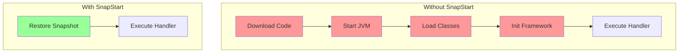

# How to Use Lambda SnapStart for Java Functions

Author: [nawazdhandala](https://github.com/nawazdhandala)

Tags: AWS, Lambda, Java, SnapStart, Performance

Description: Learn how to enable and optimize Lambda SnapStart for Java functions to reduce cold start times from seconds to under 200 milliseconds.

---

Java Lambda functions have a reputation for terrible cold starts. A simple Spring Boot function can take 5-10 seconds to cold start, and even lightweight Java functions take 1-3 seconds. That's an eternity for an API handler. Lambda SnapStart changes this dramatically by taking a snapshot of the initialized execution environment and restoring it in milliseconds.

Let's see how it works and how to use it effectively.

## The Java Cold Start Problem

Java's cold start is slow for good reasons. The JVM needs to:

1. Load and initialize the JVM itself
2. Load your application classes
3. Run static initializers
4. JIT-compile hot paths (though this is minimal during cold start)
5. Initialize frameworks (Spring, Micronaut, etc.)

For a Spring Boot application, steps 4 and 5 alone can take 3-8 seconds. That's before your handler code even runs.

Here's what a typical Java Lambda cold start looks like in the logs:

```
REPORT RequestId: abc-123
  Duration: 234.56 ms
  Billed Duration: 235 ms
  Memory Size: 512 MB
  Max Memory Used: 178 MB
  Init Duration: 6845.23 ms    <-- This is the problem
```

An init duration of 6.8 seconds means the first user waits almost 7 seconds for a response.

## How SnapStart Works

SnapStart uses the CRaC (Coordinated Restore at Checkpoint) mechanism. Here's the process:

1. When you publish a function version, Lambda initializes your function (loads classes, runs init code)
2. Lambda takes a Firecracker microVM snapshot of the entire execution environment - memory, CPU state, everything
3. When a cold start happens, Lambda restores from the snapshot instead of initializing from scratch

The restore takes about 100-200 milliseconds instead of seconds. That's a 10-50x improvement.



## Enabling SnapStart

Enabling SnapStart is straightforward. You just set the `SnapStart` configuration when publishing a version.

Using the CLI:

```bash
# Enable SnapStart on your function
aws lambda update-function-configuration \
  --function-name my-java-function \
  --snap-start ApplyOn=PublishedVersions

# You MUST publish a version for SnapStart to take effect
aws lambda publish-version \
  --function-name my-java-function \
  --description "v1 with SnapStart"
```

Important: SnapStart only works with published versions and aliases pointing to published versions. The `$LATEST` version does not use SnapStart.

Using SAM:

```yaml
Resources:
  MyJavaFunction:
    Type: AWS::Serverless::Function
    Properties:
      Handler: com.example.OrderHandler::handleRequest
      Runtime: java21
      MemorySize: 512
      Timeout: 30
      SnapStart:
        ApplyOn: PublishedVersions
      AutoPublishAlias: live
```

Using CloudFormation:

```yaml
Resources:
  MyJavaFunction:
    Type: AWS::Lambda::Function
    Properties:
      FunctionName: my-java-function
      Runtime: java21
      Handler: com.example.OrderHandler::handleRequest
      MemorySize: 512
      SnapStart:
        ApplyOn: PublishedVersions
```

## CRaC Hooks for Proper Snapshot Handling

Some resources don't survive a snapshot/restore cycle well. Network connections, file handles, and random number generators need to be refreshed after restore. The CRaC API provides hooks for this.

Add the CRaC dependency to your project:

```xml
<!-- pom.xml -->
<dependency>
    <groupId>io.github.crac</groupId>
    <artifactId>org-crac</artifactId>
    <version>0.1.3</version>
</dependency>
```

Implement the `Resource` interface:

```java
// src/main/java/com/example/OrderHandler.java
package com.example;

import com.amazonaws.services.lambda.runtime.Context;
import com.amazonaws.services.lambda.runtime.RequestHandler;
import com.amazonaws.services.lambda.runtime.events.APIGatewayProxyRequestEvent;
import com.amazonaws.services.lambda.runtime.events.APIGatewayProxyResponseEvent;
import org.crac.Core;
import org.crac.Resource;
import software.amazon.awssdk.services.dynamodb.DynamoDbClient;

public class OrderHandler implements RequestHandler<APIGatewayProxyRequestEvent, APIGatewayProxyResponseEvent>,
        Resource {

    private DynamoDbClient dynamoDbClient;

    public OrderHandler() {
        // Register this class for CRaC lifecycle callbacks
        Core.getGlobalContext().register(this);

        // Initialize the client during snapshot creation
        this.dynamoDbClient = DynamoDbClient.create();
    }

    @Override
    public void beforeCheckpoint(org.crac.Context<? extends Resource> context) {
        // Called before the snapshot is taken
        // Close connections that won't survive the snapshot
        if (dynamoDbClient != null) {
            dynamoDbClient.close();
        }
    }

    @Override
    public void afterRestore(org.crac.Context<? extends Resource> context) {
        // Called after restoring from snapshot
        // Re-establish connections
        this.dynamoDbClient = DynamoDbClient.create();
    }

    @Override
    public APIGatewayProxyResponseEvent handleRequest(
            APIGatewayProxyRequestEvent event, Context context) {

        // Your business logic using dynamoDbClient
        var response = new APIGatewayProxyResponseEvent();
        response.setStatusCode(200);
        response.setBody("{\"status\": \"ok\"}");
        return response;
    }
}
```

## What Needs CRaC Hooks

Not everything needs hooks. Here's a guide:

**Needs beforeCheckpoint/afterRestore:**
- Database connections (JDBC, DynamoDB clients)
- HTTP clients with connection pools
- gRPC channels
- File handles
- Custom caches with TTL-based expiration
- Random number generators (security-sensitive)

**Usually fine without hooks:**
- Static configuration values
- Parsed JSON/YAML config
- Pre-computed lookup tables
- Immutable data structures

The AWS SDK v2 for Java handles SnapStart automatically - you generally don't need CRaC hooks for AWS service clients if you're using the latest SDK.

## Handling Uniqueness After Restore

A subtle issue with SnapStart is that multiple execution environments are restored from the same snapshot. This means any "unique" values generated during initialization are shared across instances.

This is a problem for:
- UUIDs generated during init
- Random seeds
- Temporary file names

Always generate unique values inside the handler, not during initialization:

```java
// BAD - Same UUID for every restored instance
public class BadHandler implements RequestHandler<Object, String> {
    // This UUID is baked into the snapshot
    private final String instanceId = UUID.randomUUID().toString();
}

// GOOD - Unique per invocation
public class GoodHandler implements RequestHandler<Object, String> {
    @Override
    public String handleRequest(Object event, Context context) {
        // Fresh UUID for each invocation
        String requestId = UUID.randomUUID().toString();
        // ...
    }
}
```

## Measuring SnapStart Performance

Compare cold start times with and without SnapStart:

```bash
# Check restore duration in logs (replaces Init Duration)
aws logs filter-log-events \
  --log-group-name "/aws/lambda/my-java-function" \
  --filter-pattern "Restore Duration" \
  --limit 10 \
  --query "events[].message" \
  --output text
```

With SnapStart, you'll see `Restore Duration` instead of `Init Duration`:

```
REPORT RequestId: abc-123
  Duration: 123.45 ms
  Billed Duration: 173 ms
  Memory Size: 512 MB
  Max Memory Used: 178 MB
  Restore Duration: 156.78 ms    <-- Much faster than Init Duration
```

That 156 ms restore is a massive improvement over the 6+ second init duration without SnapStart.

## Spring Boot with SnapStart

Spring Boot works well with SnapStart but has some additional considerations.

Use the `aws-serverless-java-container` library:

```xml
<!-- pom.xml -->
<dependency>
    <groupId>com.amazonaws.serverless</groupId>
    <artifactId>aws-serverless-java-container-springboot3</artifactId>
    <version>2.0.0</version>
</dependency>
```

The handler:

```java
package com.example;

import com.amazonaws.serverless.exceptions.ContainerInitializationException;
import com.amazonaws.serverless.proxy.model.AwsProxyRequest;
import com.amazonaws.serverless.proxy.model.AwsProxyResponse;
import com.amazonaws.serverless.proxy.spring.SpringBootLambdaContainerHandler;
import com.amazonaws.services.lambda.runtime.Context;
import com.amazonaws.services.lambda.runtime.RequestHandler;
import org.crac.Core;
import org.crac.Resource;

public class StreamLambdaHandler implements
        RequestHandler<AwsProxyRequest, AwsProxyResponse>,
        Resource {

    private SpringBootLambdaContainerHandler<AwsProxyRequest, AwsProxyResponse> handler;

    public StreamLambdaHandler() throws ContainerInitializationException {
        Core.getGlobalContext().register(this);
        handler = SpringBootLambdaContainerHandler.getAwsProxyHandler(Application.class);
    }

    @Override
    public void beforeCheckpoint(org.crac.Context<? extends Resource> context) {
        // Spring Boot cleanup before snapshot
    }

    @Override
    public void afterRestore(org.crac.Context<? extends Resource> context) {
        // Refresh connections after restore
    }

    @Override
    public AwsProxyResponse handleRequest(AwsProxyRequest input, Context context) {
        return handler.proxy(input, context);
    }
}
```

With SnapStart, a Spring Boot Lambda function that took 8 seconds to cold start can be reduced to under 200 ms.

## Limitations

SnapStart has some restrictions to be aware of:

- Only available for Java 11, Java 17, and Java 21 runtimes
- Only works with x86_64 architecture (not ARM64/Graviton)
- Not compatible with provisioned concurrency
- Not compatible with EFS mounts
- Not compatible with ephemeral storage greater than 512 MB
- The snapshot must be under 250 MB (same as function size limit)

## Wrapping Up

SnapStart is a game-changer for Java Lambda functions. It cuts cold start times by 80-90%, making Java competitive with Python and Node.js for latency-sensitive workloads. The key is implementing CRaC hooks for any resources that need to be refreshed after restore, and making sure you don't bake unique values into the snapshot.

If you're running Java on Lambda and cold starts are a problem, enable SnapStart today. For other cold start reduction techniques, see our guide on [reducing Lambda cold start times](https://oneuptime.com/blog/post/reduce-lambda-cold-start-times/view). And if SnapStart isn't available for your runtime, check out [provisioned concurrency](https://oneuptime.com/blog/post/lambda-provisioned-concurrency-eliminate-cold-starts/view).
