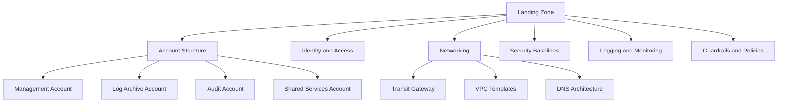

# How to Implement Landing Zone Best Practices on AWS

Author: [nawazdhandala](https://github.com/nawazdhandala)

Tags: AWS, Landing Zone, Control Tower, Cloud Architecture

Description: A comprehensive guide to building an AWS landing zone using Control Tower with guardrails, account factory, and network architecture for enterprise-ready environments.

---

A landing zone is the foundation of your entire AWS presence. It's the pre-configured, secure, multi-account environment that your teams build on top of. Get it right, and every new workload starts with a solid security baseline. Get it wrong, and you'll spend months cleaning up technical debt.

AWS Control Tower is the managed service for building landing zones, but it's not magic. You still need to understand what it does, customize it for your needs, and extend it where the defaults fall short.

## What a Landing Zone Includes

A well-built landing zone covers several areas that all work together.



## Setting Up Control Tower

Control Tower automates much of the landing zone setup. But you'll want to customize the configuration.

Here's a Terraform configuration that sets up Control Tower with customizations.

```hcl
# Enable Control Tower
resource "aws_controltower_landing_zone" "main" {
  manifest_json = jsonencode({
    governedRegions = ["us-east-1", "us-west-2"]
    organizationStructure = {
      security = {
        name = "Security"
      }
      sandbox = {
        name = "Sandbox"
      }
    }
    centralizedLogging = {
      accountId = var.log_archive_account_id
      configurations = {
        loggingBucket = {
          retentionDays = 365
        }
        accessLoggingBucket = {
          retentionDays = 365
        }
      }
      enabled = true
    }
    securityRoles = {
      accountId = var.audit_account_id
    }
    accessManagement = {
      enabled = true
    }
  })

  version = "3.3"
}

# Enable guardrails (controls)
resource "aws_controltower_control" "disallow_public_s3" {
  control_identifier = "arn:aws:controltower:us-east-1::control/AWS-GR_S3_ACCOUNT_LEVEL_PUBLIC_ACCESS_BLOCKS_PERIODIC"
  target_identifier  = aws_organizations_organizational_unit.workloads.arn
}

resource "aws_controltower_control" "require_ebs_encryption" {
  control_identifier = "arn:aws:controltower:us-east-1::control/AWS-GR_ENCRYPTED_VOLUMES"
  target_identifier  = aws_organizations_organizational_unit.workloads.arn
}

resource "aws_controltower_control" "disallow_root_access_keys" {
  control_identifier = "arn:aws:controltower:us-east-1::control/AWS-GR_RESTRICT_ROOT_USER_ACCESS_KEYS"
  target_identifier  = aws_organizations_organizational_unit.workloads.arn
}
```

## Account Factory Customizations

When Control Tower creates new accounts, you want them provisioned with your organization's baseline configurations. Use Account Factory Customization (AFC) or CloudFormation StackSets for this.

This CloudFormation template serves as a baseline applied to every new account.

```yaml
AWSTemplateFormatVersion: '2010-09-09'
Description: Security baseline for all accounts

Parameters:
  LogArchiveAccountId:
    Type: String
  CentralSecurityAccountId:
    Type: String

Resources:
  # Enable EBS encryption by default
  EBSEncryptionDefault:
    Type: AWS::EC2::EncryptionByDefault
    Properties: {}

  # Block public S3 access at account level
  S3PublicAccessBlock:
    Type: AWS::S3::AccountPublicAccessBlock
    Properties:
      BlockPublicAcls: true
      BlockPublicPolicy: true
      IgnorePublicAcls: true
      RestrictPublicBuckets: true

  # Enable GuardDuty
  GuardDutyDetector:
    Type: AWS::GuardDuty::Detector
    Properties:
      Enable: true
      FindingPublishingFrequency: FIFTEEN_MINUTES
      DataSources:
        S3Logs:
          Enable: true
        Kubernetes:
          AuditLogs:
            Enable: true

  # Security Hub
  SecurityHub:
    Type: AWS::SecurityHub::Hub
    Properties:
      EnableDefaultStandards: true

  # AWS Config recorder
  ConfigRecorder:
    Type: AWS::Config::ConfigurationRecorder
    Properties:
      Name: default
      RecordingGroup:
        AllSupported: true
        IncludeGlobalResourceTypes: true
      RoleARN: !GetAtt ConfigRole.Arn

  # Config delivery channel
  ConfigDeliveryChannel:
    Type: AWS::Config::DeliveryChannel
    Properties:
      S3BucketName: !Sub "${LogArchiveAccountId}-config-logs"
      ConfigSnapshotDeliveryProperties:
        DeliveryFrequency: Six_Hours

  ConfigRole:
    Type: AWS::IAM::Role
    Properties:
      AssumeRolePolicyDocument:
        Version: '2012-10-17'
        Statement:
          - Effect: Allow
            Principal:
              Service: config.amazonaws.com
            Action: sts:AssumeRole
      ManagedPolicyArns:
        - arn:aws:iam::aws:policy/service-role/AWS_ConfigRole
```

## Network Architecture

Your landing zone needs a network architecture that allows connectivity between accounts while maintaining isolation.

This sets up a Transit Gateway-based network hub.

```hcl
# Transit Gateway in the networking account
resource "aws_ec2_transit_gateway" "main" {
  description                     = "Organization Transit Gateway"
  default_route_table_association = "disable"
  default_route_table_propagation = "disable"
  dns_support                     = "enable"
  vpn_ecmp_support               = "enable"

  tags = {
    Name = "org-transit-gateway"
  }
}

# Share Transit Gateway with the organization via RAM
resource "aws_ram_resource_share" "tgw" {
  name                      = "transit-gateway-share"
  allow_external_principals = false
}

resource "aws_ram_resource_association" "tgw" {
  resource_arn       = aws_ec2_transit_gateway.main.arn
  resource_share_arn = aws_ram_resource_share.tgw.arn
}

resource "aws_ram_principal_association" "org" {
  principal          = aws_organizations_organization.org.arn
  resource_share_arn = aws_ram_resource_share.tgw.arn
}

# Route tables for network segmentation
resource "aws_ec2_transit_gateway_route_table" "production" {
  transit_gateway_id = aws_ec2_transit_gateway.main.id
  tags               = { Name = "production-routes" }
}

resource "aws_ec2_transit_gateway_route_table" "non_production" {
  transit_gateway_id = aws_ec2_transit_gateway.main.id
  tags               = { Name = "non-production-routes" }
}

resource "aws_ec2_transit_gateway_route_table" "shared_services" {
  transit_gateway_id = aws_ec2_transit_gateway.main.id
  tags               = { Name = "shared-services-routes" }
}
```

## VPC Templates

Provide standardized VPC templates so teams don't have to build their own from scratch.

```hcl
# Standardized VPC module for workload accounts
module "workload_vpc" {
  source = "./modules/vpc"

  vpc_cidr    = var.vpc_cidr
  environment = var.environment

  # Standard subnet layout
  public_subnet_cidrs  = [
    cidrsubnet(var.vpc_cidr, 4, 0),
    cidrsubnet(var.vpc_cidr, 4, 1),
    cidrsubnet(var.vpc_cidr, 4, 2)
  ]
  private_subnet_cidrs = [
    cidrsubnet(var.vpc_cidr, 4, 4),
    cidrsubnet(var.vpc_cidr, 4, 5),
    cidrsubnet(var.vpc_cidr, 4, 6)
  ]
  database_subnet_cidrs = [
    cidrsubnet(var.vpc_cidr, 4, 8),
    cidrsubnet(var.vpc_cidr, 4, 9),
    cidrsubnet(var.vpc_cidr, 4, 10)
  ]

  # Connect to Transit Gateway
  transit_gateway_id = var.transit_gateway_id

  # Enable VPC Flow Logs
  enable_flow_logs         = true
  flow_logs_destination    = "s3"
  flow_logs_s3_bucket_arn  = var.central_log_bucket_arn

  # Standard tags
  tags = {
    Environment = var.environment
    ManagedBy   = "landing-zone"
  }
}
```

## DNS Architecture

Centralize DNS management using Route 53 with shared private hosted zones.

```hcl
# Private hosted zone in shared services account
resource "aws_route53_zone" "internal" {
  name = "internal.company.com"

  vpc {
    vpc_id = aws_vpc.shared_services.id
  }
}

# Share with other accounts via RAM
resource "aws_ram_resource_share" "dns" {
  name                      = "internal-dns-share"
  allow_external_principals = false
}

# Associate VPCs from other accounts
# This is done via cross-account authorization
resource "aws_route53_vpc_association_authorization" "production" {
  vpc_id  = var.production_vpc_id
  zone_id = aws_route53_zone.internal.id
}
```

## Guardrail Categories

Control Tower provides three types of guardrails. Here's how to think about them.

```hcl
# Preventive guardrails - stop bad things from happening (SCPs)
resource "aws_controltower_control" "prevent_public_access" {
  control_identifier = "arn:aws:controltower:us-east-1::control/AWS-GR_S3_ACCOUNT_LEVEL_PUBLIC_ACCESS_BLOCKS_PERIODIC"
  target_identifier  = aws_organizations_organizational_unit.production.arn
}

# Detective guardrails - alert on policy violations (Config Rules)
resource "aws_controltower_control" "detect_unencrypted_volumes" {
  control_identifier = "arn:aws:controltower:us-east-1::control/AWS-GR_ENCRYPTED_VOLUMES"
  target_identifier  = aws_organizations_organizational_unit.workloads.arn
}

# Proactive guardrails - check CloudFormation before deployment
resource "aws_controltower_control" "proactive_rds_encryption" {
  control_identifier = "arn:aws:controltower:us-east-1::control/CT.RDS.PR.1"
  target_identifier  = aws_organizations_organizational_unit.production.arn
}
```

Preventive guardrails are implemented as SCPs and stop actions entirely. Detective guardrails use AWS Config and alert on violations. Proactive guardrails check CloudFormation templates before resources are created.

## Landing Zone Maintenance

A landing zone isn't a set-and-forget thing. You need to keep it updated, add new guardrails as threats evolve, and onboard new accounts smoothly.

This Python script generates a compliance report across all accounts.

```python
import boto3

def generate_compliance_report():
    """Generate a compliance report across all organization accounts."""
    org = boto3.client('organizations')
    accounts = []

    paginator = org.get_paginator('list_accounts')
    for page in paginator.paginate():
        accounts.extend(page['Accounts'])

    report = []
    for account in accounts:
        if account['Status'] != 'ACTIVE':
            continue

        # Check compliance via Config aggregator
        config = boto3.client('config')
        try:
            compliance = config.get_aggregate_compliance_details_by_config_rule(
                ConfigurationAggregatorName='org-aggregator',
                ConfigRuleName='encrypted-volumes',
                AccountId=account['Id'],
                ComplianceType='NON_COMPLIANT',
                Limit=10
            )

            non_compliant_count = len(compliance['AggregateEvaluationResults'])
            report.append({
                'account_id': account['Id'],
                'account_name': account['Name'],
                'non_compliant_resources': non_compliant_count,
                'status': 'COMPLIANT' if non_compliant_count == 0 else 'NON_COMPLIANT'
            })
        except Exception as e:
            report.append({
                'account_id': account['Id'],
                'account_name': account['Name'],
                'status': 'ERROR',
                'error': str(e)
            })

    # Print summary
    compliant = sum(1 for r in report if r['status'] == 'COMPLIANT')
    total = len(report)
    print(f"\nCompliance Summary: {compliant}/{total} accounts fully compliant")

    for r in report:
        if r['status'] != 'COMPLIANT':
            print(f"  [{r['status']}] {r['account_name']} ({r['account_id']})")

    return report

generate_compliance_report()
```

## Getting Started

If you're building a landing zone from scratch, start with Control Tower. It handles the basics - log archive account, audit account, SSO configuration, and basic guardrails. Then customize from there.

If you already have a multi-account setup, you can enroll existing accounts into Control Tower. It's not painless, but it's doable and worth the effort for the governance capabilities you get.

The most important thing is to start. Every week you operate without a proper landing zone is a week where accounts are created without security baselines, where logs aren't centralized, and where governance is manual and inconsistent.

For the multi-account strategy that your landing zone supports, see [multi-account strategy on AWS](https://oneuptime.com/blog/post/multi-account-strategy-aws/view). For securing the workloads that run on your landing zone, check out [defense in depth on AWS](https://oneuptime.com/blog/post/defense-in-depth-aws/view).
