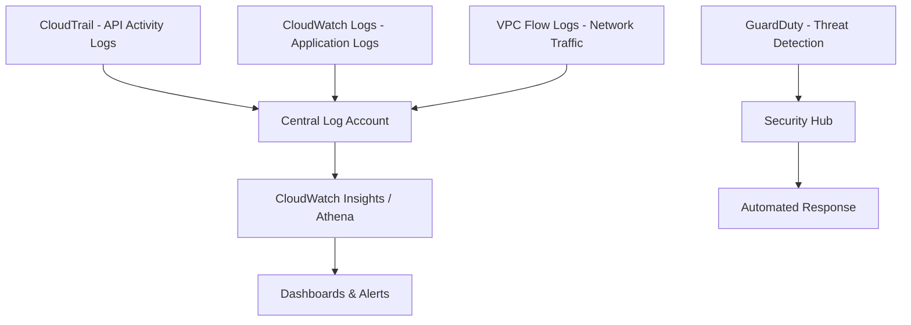

# How to Implement Logging and Monitoring Best Practices on AWS

Author: [nawazdhandala](https://github.com/nawazdhandala)

Tags: AWS, Monitoring, Logging, CloudWatch, Security

Description: A practical guide to implementing comprehensive logging and monitoring on AWS using CloudTrail, CloudWatch, and GuardDuty for full visibility into your environment.

---

You can't secure what you can't see, and you can't troubleshoot what you didn't log. Every AWS outage post-mortem I've read has a common thread: "we didn't have sufficient visibility." Logging and monitoring aren't glamorous, but they're the difference between catching an issue in minutes and discovering it days later in a customer complaint.

Let's build a proper observability foundation on AWS.

## The Monitoring Stack

AWS offers several monitoring services, and you'll want most of them working together.



## CloudTrail - Your API Audit Trail

CloudTrail records every API call made in your AWS account. This is non-negotiable - it should be enabled everywhere, for every account, logging to a centralized bucket that nobody can tamper with.

This Terraform configuration sets up an organization-wide CloudTrail with tamper protection.

```hcl
# S3 bucket for CloudTrail logs with immutability
resource "aws_s3_bucket" "cloudtrail" {
  bucket = "${var.org_id}-cloudtrail-logs"
}

# Enable versioning so logs can't be silently overwritten
resource "aws_s3_bucket_versioning" "cloudtrail" {
  bucket = aws_s3_bucket.cloudtrail.id
  versioning_configuration {
    status = "Enabled"
  }
}

# Object lock prevents deletion of log files
resource "aws_s3_bucket_object_lock_configuration" "cloudtrail" {
  bucket = aws_s3_bucket.cloudtrail.id
  rule {
    default_retention {
      mode = "COMPLIANCE"
      days = 365
    }
  }
}

# Organization-wide trail
resource "aws_cloudtrail" "org_trail" {
  name                       = "organization-trail"
  s3_bucket_name             = aws_s3_bucket.cloudtrail.id
  is_organization_trail      = true
  is_multi_region_trail      = true
  enable_log_file_validation = true  # Detect tampered log files
  include_global_service_events = true

  # Send to CloudWatch for real-time analysis
  cloud_watch_logs_group_arn = "${aws_cloudwatch_log_group.cloudtrail.arn}:*"
  cloud_watch_logs_role_arn  = aws_iam_role.cloudtrail_cloudwatch.arn

  # Log data events for S3 and Lambda
  event_selector {
    read_write_type           = "All"
    include_management_events = true

    data_resource {
      type   = "AWS::S3::Object"
      values = ["arn:aws:s3"]
    }
    data_resource {
      type   = "AWS::Lambda::Function"
      values = ["arn:aws:lambda"]
    }
  }

  insight_selectors {
    insight_type = "ApiCallRateInsight"
  }
  insight_selectors {
    insight_type = "ApiErrorRateInsight"
  }
}

resource "aws_cloudwatch_log_group" "cloudtrail" {
  name              = "/aws/cloudtrail/organization"
  retention_in_days = 90
  kms_key_id        = aws_kms_key.logs.arn
}
```

The `enable_log_file_validation` setting is crucial. It creates a digest file that lets you verify whether log files have been modified or deleted. If an attacker compromises your account, the first thing they'll try to do is cover their tracks by deleting CloudTrail logs.

## CloudWatch Logs - Application and Service Logging

Your applications should send structured logs to CloudWatch. Unstructured log messages are nearly useless at scale.

Here's a Python application logging setup that sends structured JSON logs to CloudWatch.

```python
import logging
import json
import sys
from datetime import datetime

class StructuredLogFormatter(logging.Formatter):
    """Format logs as JSON for CloudWatch Logs Insights queries."""

    def format(self, record):
        log_entry = {
            'timestamp': datetime.utcnow().isoformat(),
            'level': record.levelname,
            'logger': record.name,
            'message': record.getMessage(),
            'module': record.module,
            'function': record.funcName,
            'line': record.lineno,
        }

        # Include extra fields if provided
        if hasattr(record, 'request_id'):
            log_entry['request_id'] = record.request_id
        if hasattr(record, 'user_id'):
            log_entry['user_id'] = record.user_id
        if hasattr(record, 'duration_ms'):
            log_entry['duration_ms'] = record.duration_ms
        if record.exc_info:
            log_entry['exception'] = self.formatException(record.exc_info)

        return json.dumps(log_entry)

# Configure logging
def setup_logging():
    handler = logging.StreamHandler(sys.stdout)
    handler.setFormatter(StructuredLogFormatter())

    logger = logging.getLogger()
    logger.addHandler(handler)
    logger.setLevel(logging.INFO)

    return logger

# Usage example
logger = setup_logging()
logger.info(
    "Order processed successfully",
    extra={
        'request_id': 'req-abc-123',
        'user_id': 'user-456',
        'duration_ms': 245
    }
)
```

Structured logs let you use CloudWatch Logs Insights to query across millions of log entries efficiently.

Here's how you'd query these structured logs in CloudWatch Logs Insights.

```
# Find slow requests
fields @timestamp, request_id, duration_ms, message
| filter duration_ms > 1000
| sort duration_ms desc
| limit 50

# Error rate by module over time
filter level = "ERROR"
| stats count() as error_count by bin(5m), module
| sort error_count desc

# Trace a specific request across services
fields @timestamp, @message
| filter request_id = "req-abc-123"
| sort @timestamp asc
```

## VPC Flow Logs - Network Visibility

VPC Flow Logs capture information about IP traffic going to and from network interfaces. They're essential for security analysis and troubleshooting connectivity issues.

This configuration enables flow logs for your VPC and sends them to CloudWatch.

```hcl
resource "aws_flow_log" "vpc_flow_logs" {
  vpc_id               = aws_vpc.main.id
  traffic_type         = "ALL"  # Log both accepted and rejected traffic
  log_destination_type = "cloud-watch-logs"
  log_destination      = aws_cloudwatch_log_group.flow_logs.arn
  iam_role_arn         = aws_iam_role.flow_logs.arn

  # Custom log format with additional fields
  log_format = "$${version} $${account-id} $${interface-id} $${srcaddr} $${dstaddr} $${srcport} $${dstport} $${protocol} $${packets} $${bytes} $${start} $${end} $${action} $${log-status} $${vpc-id} $${subnet-id} $${tcp-flags}"
}

resource "aws_cloudwatch_log_group" "flow_logs" {
  name              = "/aws/vpc/flow-logs"
  retention_in_days = 30
  kms_key_id        = aws_kms_key.logs.arn
}
```

## Setting Up Actionable Alerts

Logs without alerts are just expensive storage. Set up CloudWatch Alarms for the metrics that actually matter.

This CloudFormation template creates essential security and operational alerts.

```yaml
AWSTemplateFormatVersion: '2010-09-09'
Resources:
  # Alert on root account usage
  RootAccountUsageAlarm:
    Type: AWS::CloudWatch::Alarm
    Properties:
      AlarmName: root-account-usage
      AlarmDescription: Root account was used - investigate immediately
      MetricName: RootAccountUsage
      Namespace: CloudTrailMetrics
      Statistic: Sum
      Period: 300
      EvaluationPeriods: 1
      Threshold: 1
      ComparisonOperator: GreaterThanOrEqualToThreshold
      AlarmActions:
        - !Ref SecurityAlertTopic
      TreatMissingData: notBreaching

  # Alert on unauthorized API calls
  UnauthorizedAPICallsAlarm:
    Type: AWS::CloudWatch::Alarm
    Properties:
      AlarmName: unauthorized-api-calls
      AlarmDescription: High number of unauthorized API calls detected
      MetricName: UnauthorizedAPICalls
      Namespace: CloudTrailMetrics
      Statistic: Sum
      Period: 300
      EvaluationPeriods: 1
      Threshold: 10
      ComparisonOperator: GreaterThanOrEqualToThreshold
      AlarmActions:
        - !Ref SecurityAlertTopic

  # Metric filter to count unauthorized calls from CloudTrail
  UnauthorizedAPICallsFilter:
    Type: AWS::Logs::MetricFilter
    Properties:
      LogGroupName: /aws/cloudtrail/organization
      FilterPattern: '{ ($.errorCode = "*UnauthorizedAccess*") || ($.errorCode = "AccessDenied*") }'
      MetricTransformations:
        - MetricNamespace: CloudTrailMetrics
          MetricName: UnauthorizedAPICalls
          MetricValue: "1"
          DefaultValue: 0

  # SNS topic for security alerts
  SecurityAlertTopic:
    Type: AWS::SNS::Topic
    Properties:
      TopicName: security-alerts
      KmsMasterKeyId: alias/aws/sns
```

## GuardDuty for Threat Detection

GuardDuty uses machine learning to detect threats across your AWS environment. It analyzes CloudTrail logs, VPC Flow Logs, and DNS logs automatically.

This script enables GuardDuty with all available data sources and configures publishing to Security Hub.

```python
import boto3

def setup_guardduty(admin_account_id):
    """Configure GuardDuty as an organization-wide threat detection system."""
    gd = boto3.client('guardduty')

    # Create detector with all data sources enabled
    response = gd.create_detector(
        Enable=True,
        FindingPublishingFrequency='FIFTEEN_MINUTES',
        DataSources={
            'S3Logs': {'Enable': True},
            'Kubernetes': {
                'AuditLogs': {'Enable': True}
            },
            'MalwareProtection': {
                'ScanEc2InstanceWithFindings': {
                    'EbsVolumes': True
                }
            }
        },
        Features=[
            {
                'Name': 'EKS_RUNTIME_MONITORING',
                'Status': 'ENABLED',
                'AdditionalConfiguration': [
                    {
                        'Name': 'EKS_ADDON_MANAGEMENT',
                        'Status': 'ENABLED'
                    }
                ]
            },
            {
                'Name': 'LAMBDA_NETWORK_LOGS',
                'Status': 'ENABLED'
            },
            {
                'Name': 'RDS_LOGIN_EVENTS',
                'Status': 'ENABLED'
            }
        ]
    )

    detector_id = response['DetectorId']
    print(f"GuardDuty detector created: {detector_id}")

    # Enable auto-enable for new organization accounts
    gd.update_organization_configuration(
        DetectorId=detector_id,
        AutoEnable=True,
        DataSources={
            'S3Logs': {'AutoEnable': True},
            'Kubernetes': {'AuditLogs': {'AutoEnable': True}},
            'MalwareProtection': {
                'ScanEc2InstanceWithFindings': {
                    'EbsVolumes': {'AutoEnable': True}
                }
            }
        }
    )
    print("Auto-enable configured for new accounts")

    return detector_id

setup_guardduty('123456789012')
```

## Building Dashboards That Matter

A dashboard full of green indicators feels reassuring but tells you nothing. Focus on dashboards that surface anomalies and actionable information.

This creates a CloudWatch dashboard with the most important operational metrics.

```python
import boto3
import json

def create_operations_dashboard():
    """Create a CloudWatch dashboard with key operational metrics."""
    cw = boto3.client('cloudwatch')

    dashboard_body = {
        "widgets": [
            {
                "type": "metric",
                "properties": {
                    "title": "API Error Rate",
                    "metrics": [
                        ["AWS/ApiGateway", "5XXError", "ApiName", "MyAPI",
                         {"stat": "Sum", "period": 300}],
                        ["AWS/ApiGateway", "4XXError", "ApiName", "MyAPI",
                         {"stat": "Sum", "period": 300}]
                    ],
                    "view": "timeSeries",
                    "region": "us-east-1",
                    "period": 300
                },
                "width": 12,
                "height": 6
            },
            {
                "type": "log",
                "properties": {
                    "title": "Recent Errors",
                    "query": "fields @timestamp, @message\n| filter level = 'ERROR'\n| sort @timestamp desc\n| limit 20",
                    "region": "us-east-1",
                    "stacked": False,
                    "view": "table"
                },
                "width": 12,
                "height": 6
            },
            {
                "type": "metric",
                "properties": {
                    "title": "Security Events",
                    "metrics": [
                        ["CloudTrailMetrics", "UnauthorizedAPICalls",
                         {"stat": "Sum", "period": 3600}],
                        ["CloudTrailMetrics", "RootAccountUsage",
                         {"stat": "Sum", "period": 3600}]
                    ],
                    "view": "timeSeries"
                },
                "width": 12,
                "height": 6
            }
        ]
    }

    cw.put_dashboard(
        DashboardName='Operations-Overview',
        DashboardBody=json.dumps(dashboard_body)
    )
    print("Dashboard created successfully")

create_operations_dashboard()
```

## Log Retention and Cost Management

Logs can get expensive fast. Set retention policies based on your compliance requirements and archive old logs to S3 Glacier for long-term storage.

```hcl
# Different retention for different log types
resource "aws_cloudwatch_log_group" "application" {
  name              = "/app/production"
  retention_in_days = 30  # 30 days for application logs
}

resource "aws_cloudwatch_log_group" "security" {
  name              = "/security/audit"
  retention_in_days = 365  # 1 year for security logs
}

resource "aws_cloudwatch_log_group" "debug" {
  name              = "/app/debug"
  retention_in_days = 7  # 7 days for debug logs
}
```

## Wrapping Up

Good logging and monitoring isn't something you bolt on at the end. Build it into your architecture from day one. Enable CloudTrail organization-wide, send structured application logs to CloudWatch, turn on VPC Flow Logs, and activate GuardDuty. Then set up alerts for the things that matter - not everything, just the things that require human attention.

The goal isn't to collect as much data as possible. It's to have the right data available when you need it. When an incident happens at 3 AM, you'll be glad you invested in proper observability.

For more on securing your AWS environment, check out our guide on [defense in depth on AWS](https://oneuptime.com/blog/post/defense-in-depth-aws/view) and [compliance automation on AWS](https://oneuptime.com/blog/post/compliance-automation-aws/view).
