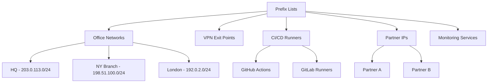

# How to Set Up Managed Prefix Lists for IP Whitelisting

Author: [nawazdhandala](https://github.com/nawazdhandala)

Tags: AWS, VPC, Prefix Lists, Security, IP Whitelisting

Description: A hands-on guide to using AWS managed prefix lists for centralized IP whitelisting across security groups, NACLs, and WAF rules in multi-account environments.

---

IP whitelisting is a fundamental security control, but managing it at scale is a headache. You've got office IPs, partner IPs, CI/CD runner IPs, VPN exit points, and maybe a monitoring service or two. These IPs need to be allowed in security groups across multiple VPCs, accounts, and regions. When an IP changes, you need to update every security group that references it. Miss one, and your deployment pipeline breaks at 2 AM.

Managed prefix lists centralize this. You define your whitelisted IPs in one place, reference the prefix list everywhere you need it, and updates propagate automatically. This post covers the full setup: creating prefix lists, organizing them for different use cases, sharing across accounts, and automating updates.

## Organizing Your Prefix Lists

Before creating anything, plan your prefix list structure. Group IPs by who they belong to and how they're used.

A typical organization might have:



Each logical group gets its own prefix list. This gives you granular control - you can give partner A access to your API without also giving them SSH access to your bastion hosts.

## Creating the Prefix Lists

Create prefix lists for each category.

Create prefix lists for common whitelisting scenarios:

```bash
# Office networks - IPs that get administrative access
aws ec2 create-managed-prefix-list \
  --prefix-list-name "whitelist-offices" \
  --max-entries 25 \
  --address-family IPv4 \
  --entries '[
    {"Cidr": "203.0.113.0/24", "Description": "HQ - Ashburn VA"},
    {"Cidr": "198.51.100.0/24", "Description": "Branch - New York"},
    {"Cidr": "192.0.2.0/24", "Description": "Branch - London"},
    {"Cidr": "203.0.113.128/25", "Description": "HQ VPN Pool"}
  ]' \
  --tags Key=Category,Value=Offices Key=Owner,Value=IT

# CI/CD runners - IPs that need deployment access
aws ec2 create-managed-prefix-list \
  --prefix-list-name "whitelist-cicd" \
  --max-entries 100 \
  --address-family IPv4 \
  --entries '[
    {"Cidr": "140.82.112.0/20", "Description": "GitHub Actions - Range 1"},
    {"Cidr": "185.199.108.0/22", "Description": "GitHub Actions - Range 2"},
    {"Cidr": "143.55.64.0/20", "Description": "GitHub Actions - Range 3"}
  ]' \
  --tags Key=Category,Value=CICD Key=Owner,Value=DevOps

# Monitoring services - IPs for uptime and health checks
aws ec2 create-managed-prefix-list \
  --prefix-list-name "whitelist-monitoring" \
  --max-entries 50 \
  --address-family IPv4 \
  --entries '[
    {"Cidr": "52.4.0.0/16", "Description": "OneUptime monitoring"},
    {"Cidr": "34.195.0.0/16", "Description": "External health checker"}
  ]' \
  --tags Key=Category,Value=Monitoring Key=Owner,Value=SRE

# Partner API access
aws ec2 create-managed-prefix-list \
  --prefix-list-name "whitelist-partners" \
  --max-entries 50 \
  --address-family IPv4 \
  --entries '[
    {"Cidr": "100.20.30.0/24", "Description": "Acme Corp - Production"},
    {"Cidr": "100.20.31.0/24", "Description": "Acme Corp - Staging"},
    {"Cidr": "172.16.50.0/24", "Description": "Beta Inc - API servers"}
  ]' \
  --tags Key=Category,Value=Partners Key=Owner,Value=Partnerships
```

## Building Security Groups with Prefix Lists

Now use these prefix lists in your security groups. Each security group references the prefix lists relevant to its role.

Security group for bastion hosts:

```bash
# Bastion host - SSH from offices only
aws ec2 create-security-group \
  --group-name "bastion-sg" \
  --description "Bastion host - office access only" \
  --vpc-id vpc-prod001

aws ec2 authorize-security-group-ingress \
  --group-id sg-bastion123 \
  --ip-permissions '[
    {
      "IpProtocol": "tcp",
      "FromPort": 22,
      "ToPort": 22,
      "PrefixListIds": [{"PrefixListId": "pl-offices", "Description": "SSH from offices"}]
    }
  ]'
```

Security group for web servers:

```bash
# Web servers - public access + monitoring
aws ec2 create-security-group \
  --group-name "web-sg" \
  --description "Web servers" \
  --vpc-id vpc-prod001

aws ec2 authorize-security-group-ingress \
  --group-id sg-web123 \
  --ip-permissions '[
    {
      "IpProtocol": "tcp",
      "FromPort": 443,
      "ToPort": 443,
      "IpRanges": [{"CidrIp": "0.0.0.0/0", "Description": "Public HTTPS"}]
    },
    {
      "IpProtocol": "tcp",
      "FromPort": 8080,
      "ToPort": 8080,
      "PrefixListIds": [{"PrefixListId": "pl-monitoring", "Description": "Health check endpoint"}]
    }
  ]'
```

Security group for deployment targets:

```bash
# Deployment targets - CI/CD runner access
aws ec2 create-security-group \
  --group-name "deploy-target-sg" \
  --description "Accepts deployments from CI/CD" \
  --vpc-id vpc-prod001

aws ec2 authorize-security-group-ingress \
  --group-id sg-deploy123 \
  --ip-permissions '[
    {
      "IpProtocol": "tcp",
      "FromPort": 22,
      "ToPort": 22,
      "PrefixListIds": [{"PrefixListId": "pl-cicd", "Description": "SSH from CI/CD runners"}]
    },
    {
      "IpProtocol": "tcp",
      "FromPort": 443,
      "ToPort": 443,
      "PrefixListIds": [
        {"PrefixListId": "pl-cicd", "Description": "HTTPS from CI/CD"},
        {"PrefixListId": "pl-offices", "Description": "HTTPS from offices"}
      ]
    }
  ]'
```

Security group for partner API access:

```bash
# API gateway - partner access
aws ec2 authorize-security-group-ingress \
  --group-id sg-api123 \
  --ip-permissions '[
    {
      "IpProtocol": "tcp",
      "FromPort": 443,
      "ToPort": 443,
      "PrefixListIds": [{"PrefixListId": "pl-partners", "Description": "Partner API access"}]
    }
  ]'
```

## Sharing Prefix Lists Across Accounts

Use RAM to share prefix lists with your entire organization or specific OUs.

Share prefix lists:

```bash
# Share all whitelist prefix lists with the organization
aws ram create-resource-share \
  --name "ip-whitelists" \
  --resource-arns \
    arn:aws:ec2:us-east-1:123456789012:prefix-list/pl-offices \
    arn:aws:ec2:us-east-1:123456789012:prefix-list/pl-cicd \
    arn:aws:ec2:us-east-1:123456789012:prefix-list/pl-monitoring \
    arn:aws:ec2:us-east-1:123456789012:prefix-list/pl-partners \
  --principals arn:aws:organizations::123456789012:organization/o-org123

# In spoke accounts, find the shared prefix lists
aws ec2 describe-managed-prefix-lists \
  --filters Name=owner-id,Values=123456789012
```

Shared prefix lists are read-only in receiving accounts. Teams can reference them in security groups but can't modify the entries. Only the central security team (in the owning account) can update the IP lists.

## Automating Updates for Dynamic IP Ranges

Some IP ranges change frequently. GitHub Actions runners, for example, publish their IP ranges via API. Automate the updates with a Lambda function.

Lambda function to sync GitHub Actions IPs:

```python
import boto3
import json
import urllib.request

ec2 = boto3.client('ec2')

PREFIX_LIST_ID = 'pl-cicd'
GITHUB_META_URL = 'https://api.github.com/meta'

def handler(event, context):
    # Fetch current GitHub Actions IP ranges
    req = urllib.request.Request(GITHUB_META_URL)
    with urllib.request.urlopen(req) as response:
        meta = json.loads(response.read().decode())

    github_cidrs = set(meta.get('actions', []))

    # Get current prefix list entries
    current = ec2.describe_managed_prefix_lists(
        PrefixListIds=[PREFIX_LIST_ID]
    )['PrefixLists'][0]
    current_version = current['Version']

    existing_entries = ec2.get_managed_prefix_list_entries(
        PrefixListId=PREFIX_LIST_ID
    )['Entries']

    existing_cidrs = {e['Cidr'] for e in existing_entries}

    # Calculate changes
    to_add = github_cidrs - existing_cidrs
    to_remove = existing_cidrs - github_cidrs

    if not to_add and not to_remove:
        print("No changes needed")
        return {'changes': 0}

    add_entries = [{'Cidr': cidr, 'Description': 'GitHub Actions'} for cidr in to_add]
    remove_entries = [{'Cidr': cidr} for cidr in to_remove]

    # Check if we need to increase max entries
    new_total = len(existing_cidrs) + len(to_add) - len(to_remove)
    if new_total > current['MaxEntries']:
        ec2.modify_managed_prefix_list(
            PrefixListId=PREFIX_LIST_ID,
            MaxEntries=new_total + 10  # Add buffer
        )
        # Need to re-fetch the version after max-entries change
        current = ec2.describe_managed_prefix_lists(
            PrefixListIds=[PREFIX_LIST_ID]
        )['PrefixLists'][0]
        current_version = current['Version']

    # Apply changes
    ec2.modify_managed_prefix_list(
        PrefixListId=PREFIX_LIST_ID,
        CurrentVersion=current_version,
        AddEntries=add_entries[:20] if add_entries else [],  # API limit per call
        RemoveEntries=remove_entries[:20] if remove_entries else []
    )

    print(f"Added {len(to_add)}, removed {len(to_remove)} entries")
    return {'added': len(to_add), 'removed': len(to_remove)}
```

Schedule the Lambda to run daily:

```bash
# Run daily to catch IP range changes
aws events put-rule \
  --name "sync-github-ips" \
  --schedule-expression "rate(1 day)" \
  --description "Sync GitHub Actions IPs to prefix list"

aws events put-targets \
  --rule "sync-github-ips" \
  --targets '[{
    "Id": "github-ip-sync",
    "Arn": "arn:aws:lambda:us-east-1:123456789012:function:sync-github-ips"
  }]'
```

## CloudFormation Template

Complete CloudFormation setup for IP whitelisting:

```yaml
AWSTemplateFormatVersion: '2010-09-09'
Description: Centralized IP Whitelisting with Prefix Lists

Resources:
  OfficeWhitelist:
    Type: AWS::EC2::PrefixList
    Properties:
      PrefixListName: whitelist-offices
      AddressFamily: IPv4
      MaxEntries: 25
      Entries:
        - Cidr: 203.0.113.0/24
          Description: HQ
        - Cidr: 198.51.100.0/24
          Description: NY Branch
      Tags:
        - Key: Category
          Value: Offices

  MonitoringWhitelist:
    Type: AWS::EC2::PrefixList
    Properties:
      PrefixListName: whitelist-monitoring
      AddressFamily: IPv4
      MaxEntries: 50
      Entries:
        - Cidr: 52.4.0.0/16
          Description: OneUptime
      Tags:
        - Key: Category
          Value: Monitoring

  WhitelistShare:
    Type: AWS::RAM::ResourceShare
    Properties:
      Name: ip-whitelists
      ResourceArns:
        - !Sub "arn:aws:ec2:${AWS::Region}:${AWS::AccountId}:prefix-list/${OfficeWhitelist}"
        - !Sub "arn:aws:ec2:${AWS::Region}:${AWS::AccountId}:prefix-list/${MonitoringWhitelist}"
      Principals:
        - !Sub "arn:aws:organizations::${AWS::AccountId}:organization/o-org123"
      PermissionArns:
        - arn:aws:ram::aws:permission/AWSRAMDefaultPermissionPrefixList

Outputs:
  OfficesPrefixListId:
    Value: !Ref OfficeWhitelist
    Export:
      Name: whitelist-offices-id
  MonitoringPrefixListId:
    Value: !Ref MonitoringWhitelist
    Export:
      Name: whitelist-monitoring-id
```

## Auditing and Compliance

Track prefix list changes using CloudTrail:

```bash
# Find all prefix list modifications in the last 30 days
aws cloudtrail lookup-events \
  --lookup-attributes AttributeKey=EventName,AttributeValue=ModifyManagedPrefixList \
  --start-time "2026-01-12T00:00:00Z" \
  --end-time "2026-02-12T23:59:59Z"
```

For compliance, regularly verify that prefix list entries match your approved IP list:

```bash
# Export all entries from all prefix lists
for pl_id in pl-offices pl-cicd pl-monitoring pl-partners; do
  echo "=== $pl_id ==="
  aws ec2 get-managed-prefix-list-entries \
    --prefix-list-id $pl_id \
    --query 'Entries[].{CIDR:Cidr,Description:Description}' \
    --output table
done
```

## Best Practices

**Set max-entries thoughtfully.** Each entry counts against security group rule limits. A prefix list with max-entries of 100 consumes 100 rules even if only 5 entries are populated. Size based on realistic maximums.

**Use descriptive names.** When someone sees `pl-0123456789abcdef0` in a security group, they need to know what it is. Good prefix list names like `whitelist-offices` make security group rules self-documenting.

**Document every entry.** The description field exists for a reason. "Partner A - Production API" is much more useful than "Some IP range" when you're auditing access six months later.

**Version your changes.** Prefix lists maintain versions internally. Use the version check on every modification to prevent race conditions.

**Automate where possible.** For any IP range that changes regularly (CI/CD services, CDN providers), set up automated sync rather than relying on manual updates.

For more on security group management strategies, check out our post on [prefix lists for security group management](https://oneuptime.com/blog/post/2026-02-12-prefix-lists-security-group-management/view).
