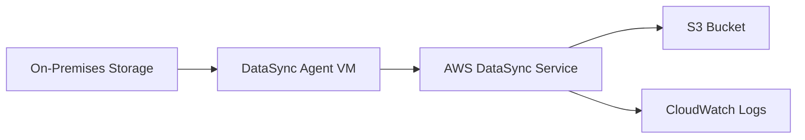

# How to Migrate Data to S3 Using AWS DataSync

Author: [nawazdhandala](https://github.com/nawazdhandala)

Tags: AWS, S3, DataSync, Migration

Description: Step-by-step guide to migrating data to Amazon S3 using AWS DataSync, covering agent setup, task configuration, scheduling, and monitoring transfers.

---

Moving large amounts of data into S3 isn't as simple as running an `aws s3 cp` command when you're dealing with terabytes of data sitting on-premises. AWS DataSync was built specifically for this - it handles the heavy lifting of large-scale data transfers with automatic retries, bandwidth throttling, data validation, and encryption in transit.

Let's walk through the entire process from installing the agent to monitoring your transfers.

## Why DataSync Over Other Options?

You've got choices when migrating data to S3: the CLI, Transfer Family, Snowball, and DataSync. Here's when DataSync makes sense:

- You're moving data from on-premises NFS or SMB shares
- You need automated, recurring transfers
- The dataset is large (hundreds of GB to petabytes) but network transfer is feasible
- You want built-in data integrity verification

DataSync can transfer data up to 10x faster than standard tools because it uses a purpose-built protocol with parallel transfers and network optimizations.

## Architecture Overview

Here's how DataSync works at a high level.



The DataSync agent runs as a VM in your on-premises environment. It reads data from your storage and transfers it to AWS over TLS. The service handles task scheduling, monitoring, and verification.

## Step 1: Deploy the DataSync Agent

The agent is distributed as a VM image. You can deploy it on VMware ESXi, Microsoft Hyper-V, or KVM.

Download and deploy the agent image for your hypervisor.

```bash
# For VMware, download the OVA image from the AWS console
# Then deploy it with your hypervisor's tools

# After the VM is running, activate the agent using the CLI
# The agent's IP is the one assigned to the VM
aws datasync create-agent \
  --activation-key YOUR_ACTIVATION_KEY \
  --agent-name "onprem-datasync-agent" \
  --tags Key=Environment,Value=Migration
```

To get the activation key, open a browser and navigate to `http://AGENT_IP:80`. The agent's web interface provides the key. Alternatively, you can get it programmatically.

```bash
# Get activation key via HTTP redirect
curl -s "http://AGENT_IP:80/?gatewayType=SYNC&activationRegion=us-east-1&no_redirect"
```

## Step 2: Create the Source Location

The source location tells DataSync where to read data from. This is typically an NFS or SMB share on your on-premises storage.

Here's how to configure an NFS source location.

```bash
# Create an NFS source location
aws datasync create-location-nfs \
  --server-hostname 192.168.1.100 \
  --on-prem-config AgentArns=arn:aws:datasync:us-east-1:123456789012:agent/agent-0abc123def456 \
  --subdirectory "/exports/data" \
  --mount-options Version=NFS4_1
```

For SMB shares, you'll need credentials.

```bash
# Create an SMB source location
aws datasync create-location-smb \
  --server-hostname 192.168.1.100 \
  --subdirectory "/SharedDrive/data" \
  --user "DOMAIN\\transfer-user" \
  --password "your-secure-password" \
  --agent-arns arn:aws:datasync:us-east-1:123456789012:agent/agent-0abc123def456 \
  --domain "CORP"
```

## Step 3: Create the Destination Location

Now tell DataSync where to write the data - your S3 bucket.

```bash
# Create an S3 destination location
aws datasync create-location-s3 \
  --s3-bucket-arn arn:aws:s3:::migration-target-bucket \
  --s3-config BucketAccessRoleArn=arn:aws:iam::123456789012:role/DataSyncS3Role \
  --s3-storage-class STANDARD \
  --subdirectory "/migrated-data"
```

The IAM role needs these permissions to write to S3.

```json
{
  "Version": "2012-10-17",
  "Statement": [
    {
      "Effect": "Allow",
      "Action": [
        "s3:GetBucketLocation",
        "s3:ListBucket",
        "s3:ListBucketMultipartUploads",
        "s3:HeadBucket"
      ],
      "Resource": "arn:aws:s3:::migration-target-bucket"
    },
    {
      "Effect": "Allow",
      "Action": [
        "s3:AbortMultipartUpload",
        "s3:DeleteObject",
        "s3:GetObject",
        "s3:GetObjectTagging",
        "s3:GetObjectVersion",
        "s3:GetObjectVersionTagging",
        "s3:ListMultipartUploadParts",
        "s3:PutObject",
        "s3:PutObjectTagging"
      ],
      "Resource": "arn:aws:s3:::migration-target-bucket/*"
    }
  ]
}
```

## Step 4: Create and Configure a Transfer Task

Now bring it all together with a task that connects source to destination.

```bash
# Create a DataSync task
aws datasync create-task \
  --source-location-arn arn:aws:datasync:us-east-1:123456789012:location/loc-src123 \
  --destination-location-arn arn:aws:datasync:us-east-1:123456789012:location/loc-dst456 \
  --name "onprem-to-s3-migration" \
  --options '{
    "VerifyMode": "ONLY_FILES_TRANSFERRED",
    "OverwriteMode": "ALWAYS",
    "Atime": "BEST_EFFORT",
    "Mtime": "PRESERVE",
    "PreserveDeletedFiles": "PRESERVE",
    "PreserveDevices": "NONE",
    "PosixPermissions": "NONE",
    "Uid": "NONE",
    "Gid": "NONE",
    "TaskQueueing": "ENABLED",
    "LogLevel": "TRANSFER",
    "TransferMode": "CHANGED",
    "SecurityDescriptorCopyFlags": "NONE"
  }' \
  --cloud-watch-log-group-arn arn:aws:logs:us-east-1:123456789012:log-group:/aws/datasync
```

Key options to understand:

- **VerifyMode**: `ONLY_FILES_TRANSFERRED` checks integrity of transferred files without re-scanning the entire destination
- **TransferMode**: `CHANGED` only transfers files that are new or modified since the last run
- **OverwriteMode**: `ALWAYS` ensures updated files replace existing ones

## Step 5: Add Filters (Optional)

You can include or exclude specific files using filters.

```bash
# Update task with filters to exclude temp files and include only CSV data
aws datasync update-task \
  --task-arn arn:aws:datasync:us-east-1:123456789012:task/task-abc123 \
  --includes '[
    {"FilterType": "SIMPLE_PATTERN", "Value": "*.csv|*.parquet"}
  ]' \
  --excludes '[
    {"FilterType": "SIMPLE_PATTERN", "Value": "*.tmp|*.log|.DS_Store"}
  ]'
```

## Step 6: Run the Task

Start the transfer.

```bash
# Execute the task
aws datasync start-task-execution \
  --task-arn arn:aws:datasync:us-east-1:123456789012:task/task-abc123 \
  --override-options '{
    "BytesPerSecond": 125000000
  }'
```

The `BytesPerSecond` option throttles the transfer to 1 Gbps (125 MB/s) so it doesn't saturate your network. Adjust this based on your available bandwidth.

## Step 7: Schedule Recurring Transfers

For ongoing synchronization, schedule the task to run on a cron schedule.

```bash
# Schedule task to run daily at 2 AM UTC
aws datasync update-task \
  --task-arn arn:aws:datasync:us-east-1:123456789012:task/task-abc123 \
  --schedule ScheduleExpression="cron(0 2 * * ? *)"
```

## Monitoring Transfers

DataSync publishes metrics to CloudWatch. You can monitor transfer progress and set up alarms for failures.

```bash
# Check task execution status
aws datasync describe-task-execution \
  --task-execution-arn arn:aws:datasync:us-east-1:123456789012:task/task-abc123/execution/exec-xyz789
```

The response includes bytes transferred, files transferred, estimated time remaining, and any errors.

For production migrations, set up CloudWatch alarms to catch failures early. You can also integrate with [OneUptime](https://oneuptime.com) for monitoring the health of your migration pipeline and getting alerts if transfers stall or fail.

## Performance Tuning

A few tips to maximize transfer speed:

1. **Use multiple agents** for parallel transfers across different shares
2. **Increase agent VM resources** - give it more CPUs and memory for better throughput
3. **Avoid throttling** during off-peak hours by removing the `BytesPerSecond` limit
4. **Use task queueing** to run multiple tasks sequentially without manual intervention

DataSync can achieve sustained transfer rates of several Gbps per agent when the network and storage support it.

## Cost Considerations

DataSync charges per GB of data transferred. As of writing, it's roughly $0.0125 per GB. For a 10 TB migration, that's about $125. There are no charges for the agent itself.

If you're doing a one-time migration of very large datasets (hundreds of TB), consider whether AWS Snowball might be more cost-effective. But for ongoing synchronization or migrations under 50 TB, DataSync is usually the better choice.

For more on managing S3 storage costs after migration, check out our post on [S3 storage class analysis](https://oneuptime.com/blog/post/s3-storage-class-analysis-optimize-costs/view).
