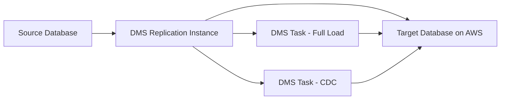
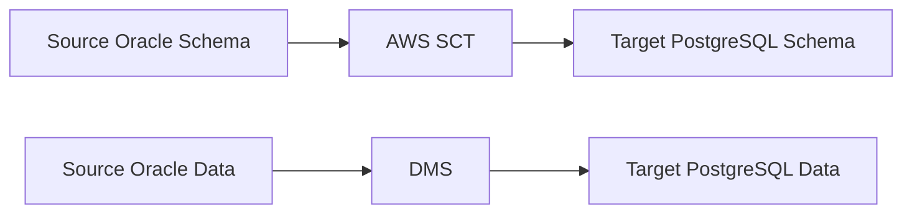

# How to Migrate Databases to AWS with DMS

Author: [nawazdhandala](https://github.com/nawazdhandala)

Tags: AWS, DMS, Database Migration Service, RDS, Aurora, Database Migration

Description: Learn how to migrate databases to AWS using the Database Migration Service with continuous replication and minimal downtime for production workloads.

---

Database migration is typically the most nerve-wracking part of any cloud migration. Your data is your business, and getting it wrong means downtime, data loss, or both. AWS Database Migration Service (DMS) reduces this risk by providing continuous replication from your source database to your target on AWS. The source database stays online and operational during the entire migration, and you only cut over when you are confident the target is ready.

This guide covers setting up DMS for both homogeneous (same engine) and heterogeneous (different engine) migrations.

## How DMS Works



DMS uses a replication instance that sits between your source and target databases. It performs a full load of existing data, then switches to Change Data Capture (CDC) to continuously replicate ongoing changes. Your applications keep writing to the source database during the entire process.

## Setting Up the Replication Instance

The replication instance is an EC2 instance managed by DMS. Size it based on your database size and the number of tables being replicated.

```python
# Create a DMS replication instance
import boto3

dms = boto3.client('dms')

response = dms.create_replication_instance(
    ReplicationInstanceIdentifier='prod-migration-instance',
    ReplicationInstanceClass='dms.r5.xlarge',
    AllocatedStorage=100,  # GB for buffering
    VpcSecurityGroupIds=['sg-dms-replication'],
    AvailabilityZone='us-east-1a',
    ReplicationSubnetGroupIdentifier='dms-subnet-group',
    MultiAZ=True,  # For production migrations
    EngineVersion='3.5.2',
    PubliclyAccessible=False,
    Tags=[
        {'Key': 'Project', 'Value': 'DatabaseMigration'},
        {'Key': 'Environment', 'Value': 'Production'}
    ]
)

print(f"Replication instance creating: {response['ReplicationInstance']['ReplicationInstanceArn']}")
```

Size recommendations:
- Up to 20 tables, small databases: `dms.t3.medium`
- 20-100 tables, medium databases: `dms.r5.large`
- 100+ tables, large databases: `dms.r5.xlarge` or larger

## Creating Source and Target Endpoints

Endpoints define the connection to your source and target databases.

### Source Endpoint (On-Premises MySQL)

```python
# Create source endpoint for on-premises MySQL
dms.create_endpoint(
    EndpointIdentifier='source-mysql-prod',
    EndpointType='source',
    EngineName='mysql',
    ServerName='mysql-prod.internal.company.com',
    Port=3306,
    DatabaseName='production_db',
    Username='dms_user',
    Password='SecurePassword123!',
    SslMode='require',
    Tags=[
        {'Key': 'Migration', 'Value': 'prod-mysql-to-aurora'}
    ]
)
```

### Target Endpoint (Amazon Aurora MySQL)

```python
# Create target endpoint for Aurora MySQL
dms.create_endpoint(
    EndpointIdentifier='target-aurora-prod',
    EndpointType='target',
    EngineName='aurora',
    ServerName='prod-cluster.cluster-abc123.us-east-1.rds.amazonaws.com',
    Port=3306,
    DatabaseName='production_db',
    Username='admin',
    Password='SecurePassword456!',
    SslMode='require'
)
```

### Testing Endpoint Connections

Always test connections before creating migration tasks:

```python
# Test endpoint connections
import boto3
import time

dms = boto3.client('dms')
replication_instance_arn = 'arn:aws:dms:us-east-1:123456789:rep:prod-migration-instance'

# Test source
dms.test_connection(
    ReplicationInstanceArn=replication_instance_arn,
    EndpointArn='arn:aws:dms:us-east-1:123456789:endpoint:source-mysql-prod'
)

# Test target
dms.test_connection(
    ReplicationInstanceArn=replication_instance_arn,
    EndpointArn='arn:aws:dms:us-east-1:123456789:endpoint:target-aurora-prod'
)

# Check connection test status
time.sleep(30)
connections = dms.describe_connections(
    Filters=[
        {
            'Name': 'endpoint-arn',
            'Values': [
                'arn:aws:dms:us-east-1:123456789:endpoint:source-mysql-prod',
                'arn:aws:dms:us-east-1:123456789:endpoint:target-aurora-prod'
            ]
        }
    ]
)

for conn in connections['Connections']:
    print(f"Endpoint: {conn['EndpointIdentifier']}")
    print(f"  Status: {conn['Status']}")
```

## Creating the Migration Task

The migration task defines what to migrate and how.

```python
# Create a migration task with full load and CDC
dms.create_replication_task(
    ReplicationTaskIdentifier='mysql-to-aurora-prod',
    SourceEndpointArn='arn:aws:dms:us-east-1:123456789:endpoint:source-mysql-prod',
    TargetEndpointArn='arn:aws:dms:us-east-1:123456789:endpoint:target-aurora-prod',
    ReplicationInstanceArn=replication_instance_arn,
    MigrationType='full-load-and-cdc',  # Full load then continuous replication
    TableMappings=json.dumps({
        'rules': [
            {
                'rule-type': 'selection',
                'rule-id': '1',
                'rule-name': 'include-all-tables',
                'object-locator': {
                    'schema-name': 'production_db',
                    'table-name': '%'  # All tables
                },
                'rule-action': 'include'
            },
            {
                'rule-type': 'selection',
                'rule-id': '2',
                'rule-name': 'exclude-temp-tables',
                'object-locator': {
                    'schema-name': 'production_db',
                    'table-name': 'tmp_%'
                },
                'rule-action': 'exclude'
            }
        ]
    }),
    ReplicationTaskSettings=json.dumps({
        'TargetMetadata': {
            'TargetSchema': '',
            'SupportLobs': True,
            'FullLobMode': False,
            'LobChunkSize': 64,
            'LimitedSizeLobMode': True,
            'LobMaxSize': 32768
        },
        'Logging': {
            'EnableLogging': True,
            'LogComponents': [
                {'Id': 'SOURCE_UNLOAD', 'Severity': 'LOGGER_SEVERITY_DEFAULT'},
                {'Id': 'TARGET_LOAD', 'Severity': 'LOGGER_SEVERITY_DEFAULT'},
                {'Id': 'SOURCE_CAPTURE', 'Severity': 'LOGGER_SEVERITY_DEFAULT'},
                {'Id': 'TARGET_APPLY', 'Severity': 'LOGGER_SEVERITY_DEFAULT'}
            ]
        },
        'ErrorBehavior': {
            'DataErrorPolicy': 'LOG_ERROR',
            'TableErrorPolicy': 'SUSPEND_TABLE'
        },
        'ValidationSettings': {
            'EnableValidation': True,
            'ThreadCount': 5
        }
    })
)
```

## Starting and Monitoring the Migration

```python
# Start the migration task
import boto3
import time

dms = boto3.client('dms')
task_arn = 'arn:aws:dms:us-east-1:123456789:task:mysql-to-aurora-prod'

# Start the task
dms.start_replication_task(
    ReplicationTaskArn=task_arn,
    StartReplicationTaskType='start-replication'
)

# Monitor progress
while True:
    response = dms.describe_replication_tasks(
        Filters=[{'Name': 'replication-task-arn', 'Values': [task_arn]}]
    )
    task = response['ReplicationTasks'][0]

    status = task['Status']
    stats = task.get('ReplicationTaskStats', {})

    print(f"Status: {status}")
    print(f"  Tables loaded: {stats.get('TablesLoaded', 0)}")
    print(f"  Tables loading: {stats.get('TablesLoading', 0)}")
    print(f"  Tables queued: {stats.get('TablesQueued', 0)}")
    print(f"  Tables errored: {stats.get('TablesErrored', 0)}")
    print(f"  Full load %: {stats.get('FullLoadProgressPercent', 0)}%")

    if status in ['running', 'stopped', 'failed']:
        if stats.get('FullLoadProgressPercent', 0) == 100:
            print("Full load complete, CDC is active")
            break

    time.sleep(60)
```

## Data Validation

DMS can validate that source and target data match:

```python
# Check validation results
response = dms.describe_table_statistics(
    ReplicationTaskArn=task_arn
)

for table in response['TableStatistics']:
    table_name = table['TableName']
    inserts = table['Inserts']
    updates = table['Updates']
    deletes = table['Deletes']
    validation_state = table.get('ValidationState', 'Not enabled')

    print(f"\nTable: {table_name}")
    print(f"  Inserts: {inserts}, Updates: {updates}, Deletes: {deletes}")
    print(f"  Validation: {validation_state}")

    if validation_state == 'Mismatched records':
        pending = table.get('ValidationPendingRecords', 0)
        failed = table.get('ValidationFailedRecords', 0)
        print(f"  Pending: {pending}, Failed: {failed}")
```

## Heterogeneous Migration with SCT

When migrating between different database engines (e.g., Oracle to PostgreSQL), use the AWS Schema Conversion Tool (SCT) first to convert the schema, then DMS for the data.



SCT handles:
- Schema conversion (tables, views, stored procedures)
- Data type mapping
- Code conversion for stored procedures and functions
- Identification of code that cannot be automatically converted

## Cutover Strategy

The cutover is the critical moment when you switch applications from the source to the target database.

1. **Reduce application load** - stop batch jobs, reduce traffic if possible
2. **Verify CDC lag is zero** - all changes have been replicated
3. **Stop applications writing to source**
4. **Final validation** - confirm row counts and checksums match
5. **Switch connection strings** to target database
6. **Start applications** pointing to the new database
7. **Monitor closely** for the first 24-48 hours

Keep the DMS task running and the source database available for a rollback period. If something goes wrong, you can reverse the replication direction.

## Monitoring Your Migrated Database

After migration, set up CloudWatch alarms for your new RDS or Aurora instance. Monitor CPU, memory, IOPS, replication lag (if using read replicas), and connection counts. For comprehensive database monitoring that covers both performance and availability, check out [OneUptime](https://oneuptime.com/blog/post/2026-02-12-migrate-from-on-premises-to-aws-step-by-step/view) for full-stack observability.

## Wrapping Up

AWS DMS takes much of the risk out of database migration by keeping your source online and providing continuous replication until you are ready to cut over. The key to a successful migration is thorough testing: validate your data, test your application against the target database, and have a clear cutover and rollback plan. Start with a non-production database to build confidence with the process, then tackle production with a well-rehearsed plan.
