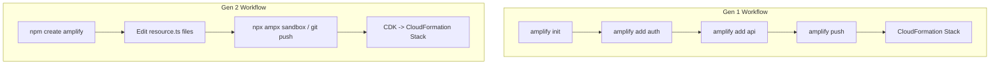

# How to Migrate from Amplify Gen 1 to Gen 2

Author: [nawazdhandala](https://github.com/nawazdhandala)

Tags: AWS, Amplify, Migration, Gen 1, Gen 2, TypeScript, Backend

Description: A practical migration guide for moving your AWS Amplify application from Gen 1 to Gen 2 with minimal downtime and risk

---

Amplify Gen 2 is a fundamentally different approach to building backends with Amplify. If you have a production application running on Gen 1, the question is not whether to migrate but when and how. The good news is that the migration does not have to be a big bang. You can move incrementally, keeping your existing backend resources while adopting the Gen 2 development model.

This guide covers the migration strategy, common pitfalls, and step-by-step instructions for moving from Gen 1 to Gen 2.

## Gen 1 vs Gen 2: Key Differences

Before migrating, understand what is actually changing:

| Aspect | Gen 1 | Gen 2 |
|--------|-------|-------|
| Backend definition | CLI prompts + JSON config | TypeScript code |
| Infrastructure | CloudFormation via Amplify CLI | CDK via Amplify backend |
| State management | amplify/ directory with team-provider-info.json | amplify/ directory with resource.ts files |
| Deployment | `amplify push` | Git push or `npx ampx sandbox` |
| Environment management | `amplify env` commands | Branch-based, automatic |
| Code generation | `amplify codegen` | Automatic with type inference |



## Migration Strategy Options

There are three approaches to migration:

### Option 1: Reference Existing Resources (Recommended)

Keep your Gen 1 backend resources running and reference them from a Gen 2 project. This is the safest approach because your existing infrastructure stays untouched.

### Option 2: Incremental Migration

Migrate one resource category at a time (auth first, then data, then storage). This works well for smaller apps.

### Option 3: Full Rewrite

Create a completely new Gen 2 backend and migrate data. This is the cleanest approach but carries the most risk and requires data migration.

We recommend Option 1 for most production applications.

## Step 1: Audit Your Gen 1 Resources

Before starting, inventory what your Gen 1 project uses:

```bash
# List all Amplify resources in your Gen 1 project
amplify status

# Expected output:
# Category  Resource name  Operation  Provider
# Auth      myappauth      No Change  awscloudformation
# Api       myappapi       No Change  awscloudformation
# Storage   mybucket       No Change  awscloudformation
# Function  myfunction     No Change  awscloudformation
```

Document each resource, its configuration, and its CloudFormation stack name. You will need these details during migration.

Also export your current Amplify configuration:

```bash
# Get the current cloud configuration
amplify pull

# Note your environment names
amplify env list
# Environments: dev, staging, prod
```

## Step 2: Create the Gen 2 Project Structure

In your existing project, initialize Amplify Gen 2:

```bash
# Install Gen 2 dependencies
npm install @aws-amplify/backend @aws-amplify/backend-cli

# Create the Gen 2 backend directory
npm create amplify@latest
```

This creates a new `amplify/` directory. If you have an existing `amplify/` directory from Gen 1, the tool will ask you to rename or merge it. Keep the Gen 1 directory as `amplify-gen1/` for reference.

## Step 3: Reference Existing Auth Resources

Instead of creating new Cognito resources, reference your existing ones:

```typescript
// amplify/auth/resource.ts - Reference existing Cognito resources
import { defineAuth, referenceAuth } from '@aws-amplify/backend';

// Reference the existing Gen 1 Cognito User Pool
export const auth = referenceAuth({
  userPoolId: 'us-east-1_abc123XYZ',
  userPoolClientId: 'abc123def456',
  identityPoolId: 'us-east-1:12345678-abcd-1234-abcd-123456789012',
});
```

Get these IDs from your Gen 1 configuration:

```bash
# Find your Cognito IDs from Gen 1
# Check amplify-gen1/team-provider-info.json
# Or look in the Cognito console
```

This approach means your existing users, passwords, and sessions continue working with zero disruption.

## Step 4: Reference Existing Data Resources

If you have a Gen 1 AppSync API with DynamoDB tables, reference them:

```typescript
// amplify/data/resource.ts - Reference existing AppSync API
import { defineData, a, type ClientSchema } from '@aws-amplify/backend';

const schema = a.schema({
  // Recreate your Gen 1 schema in Gen 2 TypeScript format
  Todo: a.model({
    name: a.string().required(),
    description: a.string(),
    completed: a.boolean().default(false),
  }).authorization((allow) => [
    allow.owner(),
  ]),
});

export type Schema = ClientSchema<typeof schema>;

export const data = defineData({
  schema,
  // Point to the existing AppSync API
  name: 'myExistingApi',
  authorizationModes: {
    defaultAuthorizationMode: 'userPool',
  },
});
```

If your Gen 1 schema used `@model`, `@auth`, `@connection`, and other directives, you need to translate those to Gen 2 equivalents:

| Gen 1 Directive | Gen 2 Equivalent |
|----------------|------------------|
| `@model` | `a.model({})` |
| `@auth(rules: [{allow: owner}])` | `.authorization((allow) => [allow.owner()])` |
| `@connection(keyName: ...)` | `a.belongsTo()` / `a.hasMany()` |
| `@key` | `a.secondaryIndexes()` |
| `@function` | `a.handler.function()` |
| `@searchable` | Custom OpenSearch configuration |

## Step 5: Reference Existing Storage

For S3 storage buckets:

```typescript
// amplify/storage/resource.ts - Reference existing S3 bucket
import { defineStorage } from '@aws-amplify/backend';

export const storage = defineStorage({
  name: 'existingBucket',
  // If referencing an existing bucket:
  isDefault: true,
  access: (allow) => ({
    'public/*': [allow.guest.to(['read']), allow.authenticated.to(['read', 'write'])],
    'private/{entity_id}/*': [allow.entity('identity').to(['read', 'write', 'delete'])],
  }),
});
```

## Step 6: Migrate Lambda Functions

Gen 1 Lambda functions defined with `amplify add function` need to be recreated as Gen 2 functions:

```typescript
// amplify/functions/process-order/resource.ts - Gen 2 function definition
import { defineFunction } from '@aws-amplify/backend';

export const processOrder = defineFunction({
  name: 'process-order',
  entry: './handler.ts',
  environment: {
    TABLE_NAME: 'OrdersTable',
  },
  timeoutSeconds: 30,
  memoryMB: 256,
});
```

```typescript
// amplify/functions/process-order/handler.ts - Function code
import type { Handler } from 'aws-lambda';

export const handler: Handler = async (event) => {
  // Your existing Lambda logic
  console.log('Processing order:', event);

  return {
    statusCode: 200,
    body: JSON.stringify({ message: 'Order processed' }),
  };
};
```

## Step 7: Update Frontend Configuration

Replace the Gen 1 `aws-exports.js` import with Gen 2's `amplify_outputs.json`:

```typescript
// Before (Gen 1):
// import awsConfig from './aws-exports';
// Amplify.configure(awsConfig);

// After (Gen 2):
import outputs from '../amplify_outputs.json';
import { Amplify } from 'aws-amplify';

Amplify.configure(outputs);
```

Update your API calls to use the Gen 2 client:

```typescript
// Before (Gen 1):
// import { API, graphqlOperation } from 'aws-amplify';
// const result = await API.graphql(graphqlOperation(listTodos));

// After (Gen 2):
import { generateClient } from 'aws-amplify/data';
import type { Schema } from '../amplify/data/resource';

const client = generateClient<Schema>();
const { data: todos } = await client.models.Todo.list();
```

## Step 8: Test with Sandbox

Before deploying to production, test everything with the Gen 2 sandbox:

```bash
# Start the sandbox - creates personal cloud resources
npx ampx sandbox

# Run your frontend against the sandbox backend
npm run dev
```

Test every feature of your application:
- Authentication (sign up, sign in, password reset)
- Data operations (create, read, update, delete)
- File uploads and downloads
- Custom Lambda functions
- Real-time subscriptions

## Step 9: Deploy

Once testing passes, deploy Gen 2 to production:

```bash
# Connect your repository to Amplify Gen 2 hosting
# This is done in the Amplify console

# Or deploy via CI/CD
npx ampx pipeline-deploy --branch main --app-id d1234abcde
```

## Step 10: Clean Up Gen 1 Resources

After confirming Gen 2 is working in production:

1. Remove the Gen 1 Amplify backend (but keep the underlying resources)
2. Delete the Gen 1 `amplify/` directory (or the renamed `amplify-gen1/`)
3. Remove Gen 1 CLI dependencies from your project

```bash
# Remove Gen 1 CLI
npm uninstall @aws-amplify/cli

# Remove old configuration files
rm -rf amplify-gen1/
rm aws-exports.js
```

Do NOT delete the CloudFormation stacks directly if you are referencing those resources from Gen 2. The Gen 2 project now manages the relationship to those resources.

## Common Migration Issues

**Type mismatches**: Gen 1 schemas with custom types may not translate directly. Review the generated types carefully and update your frontend code.

**Authorization rule differences**: Gen 1's `@auth` directive has some behaviors that differ from Gen 2's authorization model. Test every operation with different user roles.

**Environment variable naming**: Gen 1 uses `REACT_APP_` prefixed variables, while Gen 2 follows the framework's convention (e.g., `NEXT_PUBLIC_` for Next.js).

**Build configuration**: Gen 2 uses a different build process. Update your `amplify.yml` for the new build commands.

For building new features on Gen 2 after migrating, see our guide on [building a full-stack app with Amplify Gen 2](https://oneuptime.com/blog/post/2026-02-12-build-a-full-stack-app-with-amplify-gen-2/view).

## Wrapping Up

Migrating from Amplify Gen 1 to Gen 2 does not have to be scary. The reference-existing-resources approach lets you adopt the new development model without touching your production infrastructure. Start by referencing your existing Cognito and AppSync resources, update your frontend imports, and test thoroughly in a sandbox. Once you are confident, flip the switch to Gen 2 and enjoy the benefits of TypeScript-first backend definitions.
