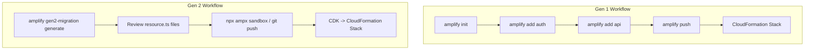

# How to Migrate from Amplify Gen 1 to Gen 2

Author: [nawazdhandala](https://github.com/nawazdhandala)

Tags: AWS, Amplify, Migration, Gen 1, Gen 2, TypeScript, Backend

Description: A practical migration guide for moving your AWS Amplify application from Gen 1 to Gen 2 with minimal downtime and risk

---

Amplify Gen 2 is a fundamentally different approach to building backends with Amplify. If you have a production application running on Gen 1, the question is not whether to migrate but when and how. The good news is that the migration does not have to be a big bang. You can move incrementally, keeping your existing backend resources while adopting the Gen 2 development model.

This guide covers the migration strategy, common pitfalls, and step-by-step instructions for moving from Gen 1 to Gen 2.

## Gen 1 vs Gen 2: Key Differences

Before migrating, understand what is actually changing:

| Aspect | Gen 1 | Gen 2 |
|--------|-------|-------|
| Backend definition | CLI prompts + JSON config | TypeScript code |
| Infrastructure | CloudFormation via Amplify CLI | CDK via Amplify backend |
| State management | amplify/ directory with team-provider-info.json | amplify/ directory with resource.ts files |
| Deployment | `amplify push` | Git push, `npx ampx sandbox`, or `npx ampx pipeline-deploy` |
| Environment management | `amplify env` commands | Branch-based, automatic |
| Code generation | `amplify codegen` | Automatic with type inference |


```mermaid
graph TD
    subgraph Gen 1 Workflow
        A[amplify init] --> B[amplify add auth]
        B --> C[amplify add api]
        C --> D[amplify push]
        D --> E[CloudFormation Stack]
    end

    subgraph Gen 2 Workflow
        F[amplify gen2-migration generate] --> G[Review resource.ts files]
        G --> H[npx ampx sandbox / git push]
        H --> I[CDK -> CloudFormation Stack]
    end
```

## Migration Strategy Options

There are three approaches to migration:

### Option 1: Use the Gen 2 Migration Tool (Recommended)

Generate a Gen 2 backend from your Gen 1 environment, deploy it alongside Gen 1, test it, and then use the refactor step to move stateful resources such as Cognito user pools, S3 buckets, and DynamoDB tables into the Gen 2 stacks. This is the safest supported approach because your production data is preserved while the new Gen 2 environment is validated.

### Option 2: Incremental Migration

Migrate one resource category at a time (auth first, then data, then storage). This works well for smaller apps.

### Option 3: Full Rewrite

Create a completely new Gen 2 backend and migrate data. This is the cleanest approach but carries the most risk and requires data migration.

We recommend Option 1 for most production applications.

## Step 1: Audit Your Gen 1 Resources

Before starting, inventory what your Gen 1 project uses:

```bash
# List all Amplify resources in your Gen 1 project

amplify status

# Expected output:
# Category  Resource name  Operation  Provider
# Auth      myappauth      No Change  awscloudformation
# Api       myappapi       No Change  awscloudformation
# Storage   mybucket       No Change  awscloudformation
# Function  myfunction     No Change  awscloudformation
```

Document each resource, its configuration, and its CloudFormation stack name. You will need these details during migration.

Also export your current Amplify configuration:

```bash
# Get the current cloud configuration
amplify pull

# Note your environment names
amplify env list
# Environments: dev, staging, prod
```

## Step 2: Generate the Gen 2 Project Structure

The official migration flow starts by assessing and locking the Gen 1 environment, then generating Gen 2 TypeScript backend files from the deployed Gen 1 CloudFormation stacks:

```bash
# Assess whether the Gen 1 environment can be migrated
amplify gen2-migration assess

# Lock the Gen 1 environment during migration
amplify gen2-migration lock

# Generate Gen 2 backend files on a migration branch
git checkout -b gen2-main
amplify gen2-migration generate
```

The generate command replaces the local `amplify/` directory with Gen 2 code. If you need to switch back to work on a Gen 1 environment, run `amplify pull` again.

## Step 3: Preserve Auth Resources

The migration tool generates Gen 2 auth code and later moves your Gen 1 Cognito resources into the Gen 2 stacks during the refactor step. If you are not using the migration tool and only need to connect a Gen 2 backend to Cognito resources that are managed outside of Amplify, use `referenceAuth` with the user pool, client, identity pool, and the authenticated and unauthenticated IAM role ARNs:

```typescript
// amplify/auth/resource.ts - Reference existing Cognito resources
import { referenceAuth } from '@aws-amplify/backend';

// Reference the existing Gen 1 Cognito User Pool
export const auth = referenceAuth({
  userPoolId: 'us-east-1_abc123XYZ',
  identityPoolId: 'us-east-1:12345678-abcd-1234-abcd-123456789012',
  authRoleArn: 'arn:aws:iam::123456789012:role/my-authenticated-role',
  unauthRoleArn: 'arn:aws:iam::123456789012:role/my-unauthenticated-role',
  userPoolClientId: 'abc123def456',
});
```

Get these IDs from your Gen 1 configuration:

```bash
# Find your Cognito IDs from Gen 1
# Check amplify-gen1/team-provider-info.json
# Or look in the Cognito console
```

The migration tool's refactor flow is what preserves your existing users and data during a Gen 1 to Gen 2 migration. A `referenceAuth` setup only references resources that remain managed outside the Amplify backend.

## Step 4: Migrate Data Resources

If you have a Gen 1 AppSync API with DynamoDB tables, the migration tool generates a Gen 2 `amplify/data/resource.ts` file from your existing GraphQL API. Review the generated schema carefully before deployment:

```typescript
// amplify/data/resource.ts - Generated Gen 2 schema example
import { defineData, a, type ClientSchema } from '@aws-amplify/backend';

const schema = a.schema({
  // Generated from your Gen 1 schema, then adjusted as needed
  Todo: a.model({
    name: a.string().required(),
    description: a.string(),
    completed: a.boolean().default(false),
  }).authorization((allow) => [
    allow.owner(),
  ]),
});

export type Schema = ClientSchema<typeof schema>;

export const data = defineData({
  schema,
  authorizationModes: {
    defaultAuthorizationMode: 'userPool',
  },
});
```

The `name` property on `defineData` names the Gen 2 data resource; it does not point to an existing AppSync API. During migration, DynamoDB tables that host your models can be reused by the generated Gen 2 application after deployment and refactor. If you only want a frontend to connect directly to an existing AppSync API, configure `amplify_outputs.json` or `Amplify.configure()` with the AppSync endpoint and auth modes instead of using `defineData`.

If your Gen 1 schema used `@model`, `@auth`, `@connection`, and other directives, you need to translate those to Gen 2 equivalents:

| Gen 1 Directive | Gen 2 Equivalent |
|----------------|------------------|
| `@model` | `a.model({})` |
| `@auth(rules: [{allow: owner}])` | `.authorization((allow) => [allow.owner()])` |
| `@connection(keyName: ...)` | `a.belongsTo()` / `a.hasMany()` |
| `@key` | `.secondaryIndexes((index) => [index('fieldName')])` |
| `@function` | `a.handler.function()` |
| `@searchable` | Not directly supported; use a custom OpenSearch integration such as DynamoDB zero-ETL to OpenSearch |

## Step 5: Migrate Existing Storage

For S3 storage buckets, let the migration tool generate the Gen 2 storage definition and move the bucket during the refactor step. A normal `defineStorage` block creates an Amplify-managed bucket; it does not import an existing bucket by name:

```typescript
// amplify/storage/resource.ts - Gen 2 storage definition
import { defineStorage } from '@aws-amplify/backend';

export const storage = defineStorage({
  name: 'appFiles',
  access: (allow) => ({
    'public/*': [allow.guest.to(['read']), allow.authenticated.to(['read', 'write'])],
    'private/{entity_id}/*': [allow.entity('identity').to(['read', 'write', 'delete'])],
  }),
});
```

If you only want the frontend libraries to use an S3 bucket that remains outside Amplify, configure the bucket name and region in `Amplify.configure()` or `amplify_outputs.json`, and make sure the Cognito identity roles have the required S3 IAM permissions.

## Step 6: Migrate Lambda Functions

Gen 1 Lambda functions defined with `amplify add function` need to be recreated as Gen 2 functions:

```typescript
// amplify/functions/process-order/resource.ts - Gen 2 function definition
import { defineFunction } from '@aws-amplify/backend';

export const processOrder = defineFunction({
  name: 'process-order',
  entry: './handler.ts',
  environment: {
    TABLE_NAME: 'OrdersTable',
  },
  timeoutSeconds: 30,
  memoryMB: 256,
});
```

```typescript
// amplify/functions/process-order/handler.ts - Function code
import type { Handler } from 'aws-lambda';

export const handler: Handler = async (event) => {
  // Your existing Lambda logic
  console.log('Processing order:', event);

  return {
    statusCode: 200,
    body: JSON.stringify({ message: 'Order processed' }),
  };
};
```

## Step 7: Update Frontend Configuration

Replace the Gen 1 `aws-exports.js` import with Gen 2's `amplify_outputs.json`:

```typescript
// Before (Gen 1):
// import awsConfig from './aws-exports';
// Amplify.configure(awsConfig);

// After (Gen 2):
import outputs from '../amplify_outputs.json';
import { Amplify } from 'aws-amplify';

Amplify.configure(outputs);
```

Update your API calls to use the Gen 2 client:

```typescript
// Before (Gen 1):
// import { API, graphqlOperation } from 'aws-amplify';
// const result = await API.graphql(graphqlOperation(listTodos));

// After (Gen 2):
import { generateClient } from 'aws-amplify/data';
import type { Schema } from '../amplify/data/resource';

const client = generateClient<Schema>();
const { data: todos } = await client.models.Todo.list();
```

## Step 8: Test with Sandbox

Before deploying to production, test everything with the Gen 2 sandbox:

```bash
# Deploy once to sandbox - creates isolated personal cloud resources
npx ampx sandbox --once

# Run your frontend against the sandbox backend
npm run dev
```

By default, sandbox uses isolated resources. If you need sandbox to share Gen 1 model DynamoDB tables during migration testing, update the generated `branchName` in `amplify/data/resource.ts` to `"sandbox"` as directed by the migration guide.

Test every feature of your application:
- Authentication (sign up, sign in, password reset)
- Data operations (create, read, update, delete)
- File uploads and downloads
- Custom Lambda functions
- Real-time subscriptions

## Step 9: Deploy

Once testing passes, deploy Gen 2 to production:

```bash
# Connect your repository to Amplify Gen 2 hosting
# This is done in the Amplify console

# Or deploy via CI/CD
npx ampx pipeline-deploy --branch main --app-id d1234abcde
```

After the Gen 2 environment is deployed and tested, run the migration refactor from the Gen 1 branch to move supported stateful resources into the Gen 2 stacks:

```bash
git checkout main
amplify pull --appId <appId> --envName main
amplify gen2-migration refactor --to <gen2-root-stack-name>
```

Then switch back to the Gen 2 branch, enable the generated post-refactor code in `amplify/backend.ts`, and deploy again so `amplify_outputs.json` reflects the transferred resources.

## Step 10: Clean Up Gen 1 Resources

After confirming Gen 2 is working in production:

1. Verify no users or applications are still accessing the Gen 1 stateless resources
2. Run the migration retain command so stateful resources are not deleted
3. Delete the Gen 1 root CloudFormation stack and then manually remove orphaned stateless resources that are safe to delete

```bash
# Retain migrated stateful resources before decommissioning Gen 1
amplify gen2-migration retain
```

You can remove old local Gen 1 configuration files after the migration is complete, but do not run `amplify env remove` or delete Gen 1 CloudFormation stacks directly before following the migration decommissioning steps. Doing so can trigger cleanup that disrupts the migrated Gen 2 environment.

## Common Migration Issues

**Type mismatches**: Gen 1 schemas with custom types may not translate directly. Review the generated types carefully and update your frontend code.

**Authorization rule differences**: Gen 1's `@auth` directive has some behaviors that differ from Gen 2's authorization model. Test every operation with different user roles.

**Environment variable naming**: Gen 1 uses `REACT_APP_` prefixed variables, while Gen 2 follows the framework's convention (e.g., `NEXT_PUBLIC_` for Next.js).

**Build configuration**: Gen 2 uses a different build process. Update your `amplify.yml` for the new build commands.

For building new features on Gen 2 after migrating, see our guide on [building a full-stack app with Amplify Gen 2](https://oneuptime.com/blog/post/2026-02-12-build-a-full-stack-app-with-amplify-gen-2/view).

## Wrapping Up

Migrating from Amplify Gen 1 to Gen 2 does not have to be scary. The migration-tool approach lets you adopt the new development model while preserving production data. Start by assessing and generating the Gen 2 backend from your Gen 1 environment, update your frontend imports, and test thoroughly before running the refactor step. Once you are confident, flip the switch to Gen 2 and enjoy the benefits of TypeScript-first backend definitions.
