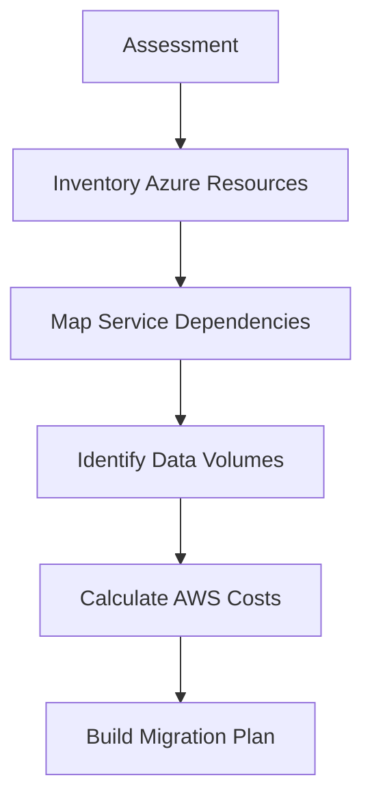

# How to Migrate from Azure to AWS

Author: [nawazdhandala](https://github.com/nawazdhandala)

Tags: AWS, Azure, Cloud Migration, Multi-Cloud, EC2, RDS, S3

Description: A practical guide for migrating workloads from Microsoft Azure to AWS covering compute, databases, storage, networking, and identity services.

---

Migrating from one cloud to another is a special kind of challenge. You already understand cloud concepts, but every service has different names, different APIs, and different operational patterns. Moving from Azure to AWS is not uncommon - sometimes it is driven by cost optimization, sometimes by technical requirements, and sometimes by organizational changes. Whatever the reason, this guide maps out how to move your workloads from Azure to AWS systematically.

## Service Mapping: Azure to AWS

Before diving into the migration, here is a reference map of equivalent services:

| Azure Service | AWS Equivalent | Notes |
|---|---|---|
| Azure VMs | EC2 | Similar concepts, different instance families |
| Azure SQL Database | Amazon RDS for SQL Server | Or Aurora PostgreSQL for engine change |
| Cosmos DB | DynamoDB | Different data models, plan carefully |
| Azure Blob Storage | Amazon S3 | Very similar concepts |
| Azure Functions | AWS Lambda | Runtime differences matter |
| Azure App Service | Elastic Beanstalk / ECS | Depends on architecture |
| Azure DevOps | CodePipeline / CodeBuild | Or use GitHub Actions |
| Azure AD | IAM Identity Center | Federate rather than migrate |
| Azure Monitor | CloudWatch | Different query languages |
| Azure Key Vault | AWS Secrets Manager / KMS | Similar functionality |
| AKS | Amazon EKS | Both run Kubernetes |
| Azure SQL Managed Instance | RDS for SQL Server | Closest equivalent |

## Phase 1: Assessment

### Inventory Your Azure Resources

Start by cataloging everything running in Azure:

```bash
# Export all Azure resources to JSON
az resource list --output json > azure-resources.json

# Get VM inventory
az vm list --show-details --output table

# List all databases
az sql server list --output table
az sql db list --server YOUR_SERVER --output table

# List storage accounts
az storage account list --output table
```

### Map Dependencies

Understanding which services talk to each other is critical. Azure Network Watcher provides flow logs, but you can also use application-level tracing to map dependencies.



## Phase 2: Set Up AWS Foundation

### Networking

Your Azure VNets map to AWS VPCs. Plan your IP addressing to avoid conflicts if you need connectivity between both clouds during migration.

```python
# Create the target VPC in AWS
import boto3

ec2 = boto3.client('ec2')

# Create VPC
vpc = ec2.create_vpc(
    CidrBlock='10.1.0.0/16',  # Different range from Azure VNet
    TagSpecifications=[
        {
            'ResourceType': 'vpc',
            'Tags': [{'Key': 'Name', 'Value': 'migrated-from-azure'}]
        }
    ]
)

vpc_id = vpc['Vpc']['VpcId']

# Create subnets across AZs
for az, cidr in [('us-east-1a', '10.1.1.0/24'), ('us-east-1b', '10.1.2.0/24')]:
    ec2.create_subnet(
        VpcId=vpc_id,
        CidrBlock=cidr,
        AvailabilityZone=az
    )
```

### Cross-Cloud Connectivity

During migration, you need connectivity between Azure and AWS. Use a site-to-site VPN:

```python
# Create VPN gateway in AWS for Azure connectivity
ec2.create_vpn_gateway(
    Type='ipsec.1',
    TagSpecifications=[
        {
            'ResourceType': 'vpn-gateway',
            'Tags': [{'Key': 'Name', 'Value': 'azure-to-aws-vpn'}]
        }
    ]
)

# On the Azure side, create a VPN Gateway and configure the connection
# to the AWS VPN gateway's public IP
```

## Phase 3: Migrate Compute

### Azure VMs to EC2

For Azure VMs, you have two main options:

**Option A: Export and Import (Simple but more downtime)**

```bash
# In Azure, export the VM disk
az vm deallocate --resource-group myRG --name myVM
az disk grant-access --resource-group myRG --name myVM-disk \
  --access-level Read --duration-in-seconds 86400

# Download the VHD and convert to raw format
qemu-img convert -f vpc -O raw azure-disk.vhd disk.raw

# Upload to S3 and import as AMI
aws s3 cp disk.raw s3://vm-import-bucket/disk.raw
```

```python
# Import the disk as an EC2 AMI
import boto3

ec2 = boto3.client('ec2')

response = ec2.import_image(
    Description='Migrated from Azure',
    DiskContainers=[
        {
            'Description': 'Root volume',
            'Format': 'RAW',
            'UserBucket': {
                'S3Bucket': 'vm-import-bucket',
                'S3Key': 'disk.raw'
            }
        }
    ],
    RoleName='vmimport'
)

import_task_id = response['ImportTaskId']
print(f"Import task: {import_task_id}")
```

**Option B: Use AWS Application Migration Service (Less downtime)**

Install the MGN agent on your Azure VMs and replicate to AWS, just like migrating from on-premises. See our [MGN migration guide](https://oneuptime.com/blog/post/2026-02-12-migrate-vms-to-aws-with-aws-application-migration-service-mgn/view) for details.

### Azure App Service to AWS

For App Service applications, the approach depends on the application type:

- **Container-based**: Deploy to ECS Fargate or EKS
- **.NET applications**: Deploy to Elastic Beanstalk or containerize for ECS
- **Static sites**: Deploy to S3 + CloudFront

## Phase 4: Migrate Databases

### Azure SQL Database to RDS

Use DMS for database migration. See our detailed [DMS migration guide](https://oneuptime.com/blog/post/2026-02-12-migrate-databases-to-aws-with-dms/view).

```python
# Create DMS task for Azure SQL to RDS
import boto3
import json

dms = boto3.client('dms')

# Source endpoint - Azure SQL
dms.create_endpoint(
    EndpointIdentifier='source-azure-sql',
    EndpointType='source',
    EngineName='sqlserver',
    ServerName='your-server.database.windows.net',
    Port=1433,
    DatabaseName='your-database',
    Username='dms_user',
    Password='password',
    SslMode='require'
)

# Target endpoint - RDS SQL Server
dms.create_endpoint(
    EndpointIdentifier='target-rds-sql',
    EndpointType='target',
    EngineName='sqlserver',
    ServerName='your-rds-instance.us-east-1.rds.amazonaws.com',
    Port=1433,
    DatabaseName='your-database',
    Username='admin',
    Password='password',
    SslMode='require'
)
```

### Cosmos DB to DynamoDB

Cosmos DB to DynamoDB migration requires data transformation since the data models differ. Use a custom migration script or AWS Data Pipeline:

```python
# Export Cosmos DB data and transform for DynamoDB
import json
import boto3

dynamodb = boto3.resource('dynamodb')
table = dynamodb.Table('migrated-collection')

# Read exported Cosmos DB data
with open('cosmos-export.json', 'r') as f:
    documents = json.load(f)

with table.batch_writer() as batch:
    for doc in documents:
        # Transform Cosmos DB document to DynamoDB item
        item = {
            'id': doc['id'],
            # Map Cosmos DB fields to DynamoDB attributes
            # Remove Cosmos DB metadata fields
        }
        # Remove Cosmos DB system properties
        for key in ['_rid', '_self', '_etag', '_attachments', '_ts']:
            item.pop(key, None)

        batch.put_item(Item=item)
```

## Phase 5: Migrate Storage

### Azure Blob Storage to S3

Use `azcopy` and AWS CLI together, or use a tool like `rclone` that speaks both protocols:

```bash
# Using rclone to sync Azure Blob Storage to S3
rclone sync azure:my-container aws-s3:my-bucket \
  --transfers 32 \
  --checkers 16 \
  --progress

# Or use azcopy to download, then aws s3 to upload
azcopy copy "https://myaccount.blob.core.windows.net/mycontainer/*" \
  "/local/staging/" --recursive

aws s3 sync /local/staging/ s3://my-bucket/ --storage-class INTELLIGENT_TIERING
```

For large datasets (tens of TB or more), consider using [AWS Snowball](https://oneuptime.com/blog/post/2026-02-12-migrate-large-datasets-to-s3-with-aws-snowball/view) instead of network transfer.

## Phase 6: Migrate Identity and Access

Do not try to replicate Azure AD in AWS. Instead, federate:

1. Keep Azure AD (or Entra ID) as your identity provider
2. Configure SAML federation with AWS IAM Identity Center
3. Map Azure AD groups to AWS permission sets

This lets your users keep their existing credentials while accessing AWS resources.

## Phase 7: Update DNS and Cut Over

Migrate DNS zones from Azure DNS to Route 53:

```bash
# Export Azure DNS zone
az network dns zone export --resource-group myRG --name example.com --output json > dns-export.json

# Import into Route 53 (manual mapping or scripted)
```

## Monitoring During Migration

During the transition, you need monitoring on both clouds. CloudWatch handles the AWS side, but you need a single pane of glass that covers both environments. [OneUptime](https://oneuptime.com) provides cross-cloud monitoring that works during migration transitions and beyond.

## Wrapping Up

Migrating from Azure to AWS is fundamentally about understanding the service mappings and moving data safely. The compute migration is usually the easiest part since you can use MGN or VM import. Databases require more care with DMS and data validation. Storage transfers can be the most time-consuming depending on volume. Take it wave by wave, validate at each step, and maintain connectivity between both clouds until you are fully cut over.
