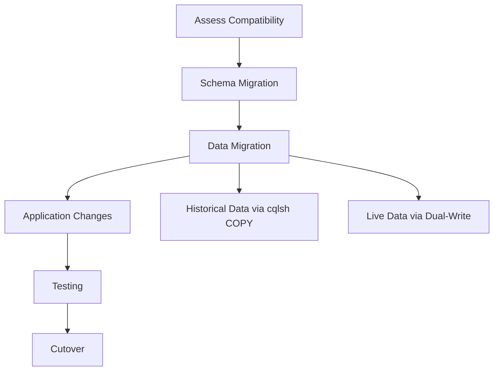

# How to Migrate from Cassandra to Amazon Keyspaces

Author: [nawazdhandala](https://github.com/nawazdhandala)

Tags: AWS, Keyspaces, Cassandra, Migration, Database, NoSQL

Description: A practical guide to migrating your self-managed Apache Cassandra workloads to Amazon Keyspaces with minimal downtime and data loss.

---

Running Apache Cassandra in production is operationally demanding. You need to manage node health, handle compaction, tune garbage collection, manage repairs, deal with tombstones, and plan capacity across multiple data centers. Amazon Keyspaces offers a fully managed, serverless Cassandra-compatible database that eliminates all of this operational burden.

But migrating from self-managed Cassandra to Keyspaces is not as simple as pointing your application at a new endpoint. There are compatibility differences, data migration challenges, and application changes to consider. This guide walks through the entire migration process.

## Migration Overview



## Step 1: Assess Compatibility

Keyspaces supports CQL (Cassandra Query Language) but does not support everything Cassandra does. Check for these common incompatibilities.

### Unsupported Features

- Lightweight transactions (LWT) have some limitations
- User-defined types (UDTs) are supported but with restrictions
- Materialized views are not supported
- Secondary indexes are not supported (use separate tables instead)
- ALLOW FILTERING is supported but may perform differently
- Batch statements have a limit of 30 statements
- TTL maximum is 630,720,000 seconds (20 years)
- No support for counters in some configurations

### Check Your Schema

```python
# Script to check Cassandra schema for Keyspaces compatibility issues
from cassandra.cluster import Cluster

cluster = Cluster(['cassandra-node-1'])
session = cluster.connect()

# Get all keyspaces and tables
keyspaces = session.execute("SELECT keyspace_name FROM system_schema.keyspaces")

issues = []

for ks in keyspaces:
    ks_name = ks.keyspace_name
    if ks_name.startswith('system'):
        continue

    tables = session.execute(
        "SELECT table_name FROM system_schema.tables WHERE keyspace_name = %s",
        [ks_name]
    )

    for table in tables:
        table_name = table.table_name

        # Check for materialized views
        views = session.execute(
            "SELECT view_name FROM system_schema.views WHERE keyspace_name = %s AND base_table_name = %s",
            [ks_name, table_name]
        )
        for view in views:
            issues.append(f"MATERIALIZED VIEW: {ks_name}.{view.view_name} - Not supported, create separate table")

        # Check for secondary indexes
        indexes = session.execute(
            "SELECT index_name FROM system_schema.indexes WHERE keyspace_name = %s AND table_name = %s",
            [ks_name, table_name]
        )
        for idx in indexes:
            issues.append(f"SECONDARY INDEX: {ks_name}.{table_name}.{idx.index_name} - Not supported, create separate table")

        # Check for counter tables
        columns = session.execute(
            "SELECT column_name, type FROM system_schema.columns WHERE keyspace_name = %s AND table_name = %s",
            [ks_name, table_name]
        )
        for col in columns:
            if col.type == 'counter':
                issues.append(f"COUNTER: {ks_name}.{table_name}.{col.column_name} - Limited support")

print("Compatibility Issues Found:")
for issue in issues:
    print(f"  - {issue}")

if not issues:
    print("  No compatibility issues found!")
```

## Step 2: Migrate the Schema

### Create the Keyspace in Keyspaces

```bash
# Create a keyspace in Amazon Keyspaces
aws keyspaces create-keyspace \
  --keyspace-name my_application \
  --tags Key=MigratedFrom,Value=self-managed-cassandra
```

### Convert and Create Tables

Some table options need adjustment for Keyspaces.

```python
# Example: Convert Cassandra CREATE TABLE to Keyspaces-compatible syntax
# Original Cassandra table
original_cql = """
CREATE TABLE my_application.user_profiles (
    user_id text,
    email text,
    name text,
    created_at timestamp,
    metadata map<text, text>,
    PRIMARY KEY (user_id)
) WITH compaction = {'class': 'LeveledCompactionStrategy'}
  AND gc_grace_seconds = 864000
  AND default_time_to_live = 2592000;
"""

# Keyspaces-compatible version
# Remove compaction and gc_grace_seconds (managed by Keyspaces)
keyspaces_cql = """
CREATE TABLE my_application.user_profiles (
    user_id text,
    email text,
    name text,
    created_at timestamp,
    metadata map<text, text>,
    PRIMARY KEY (user_id)
) WITH default_time_to_live = 2592000
  AND custom_properties = {'capacity_mode': {'throughput_mode': 'PAY_PER_REQUEST'}};
"""
```

Create tables using cqlsh connected to Keyspaces.

```bash
# Connect to Keyspaces using cqlsh with SSL
cqlsh cassandra.us-east-1.amazonaws.com 9142 \
  --ssl \
  --execute "CREATE TABLE my_application.user_profiles (
    user_id text,
    email text,
    name text,
    created_at timestamp,
    metadata map<text, text>,
    PRIMARY KEY (user_id)
  ) WITH default_time_to_live = 2592000;"
```

## Step 3: Migrate Historical Data

### Using cqlsh COPY for Small Tables

For tables under a few GB, cqlsh COPY is the simplest approach.

```bash
# Export from Cassandra
cqlsh cassandra-node-1 -e "COPY my_application.user_profiles TO '/tmp/user_profiles.csv' WITH HEADER = TRUE;"

# Import to Keyspaces
cqlsh cassandra.us-east-1.amazonaws.com 9142 --ssl \
  -e "COPY my_application.user_profiles FROM '/tmp/user_profiles.csv' WITH HEADER = TRUE AND INGESTRATE = 1500;"
```

The `INGESTRATE` parameter controls how many rows per second are written. Start low and increase based on your Keyspaces capacity.

### Using AWS Glue for Large Tables

For tables with hundreds of GB or more, use AWS Glue with the Cassandra connector.

```python
# AWS Glue script for migrating large Cassandra tables to Keyspaces
import sys
from awsglue.transforms import *
from awsglue.utils import getResolvedOptions
from pyspark.context import SparkContext
from awsglue.context import GlueContext
from awsglue.job import Job

args = getResolvedOptions(sys.argv, ['JOB_NAME'])
sc = SparkContext()
glueContext = GlueContext(sc)
spark = glueContext.spark_session
job = Job(glueContext)
job.init(args['JOB_NAME'], args)

# Read from source Cassandra
source_df = spark.read \
    .format("org.apache.spark.sql.cassandra") \
    .options(
        table="user_profiles",
        keyspace="my_application",
        spark_cassandra_connection_host="cassandra-node-1",
        spark_cassandra_connection_port="9042"
    ) \
    .load()

# Write to Amazon Keyspaces
source_df.write \
    .format("org.apache.spark.sql.cassandra") \
    .options(
        table="user_profiles",
        keyspace="my_application",
        spark_cassandra_connection_host="cassandra.us-east-1.amazonaws.com",
        spark_cassandra_connection_port="9142",
        spark_cassandra_connection_ssl_enabled="true",
        spark_cassandra_auth_username="your-keyspaces-user",
        spark_cassandra_auth_password="your-keyspaces-password",
        spark_cassandra_output_consistency_level="LOCAL_QUORUM",
        spark_cassandra_output_batch_size_rows="1"
    ) \
    .mode("append") \
    .save()

job.commit()
```

### Verifying Data Migration

```python
# Verify row counts match between source and destination
import boto3

# Count in Keyspaces
keyspaces_session = connect_to_keyspaces()
keyspaces_count = keyspaces_session.execute(
    "SELECT COUNT(*) FROM my_application.user_profiles"
).one()[0]

# Count in original Cassandra
cassandra_session = connect_to_cassandra()
cassandra_count = cassandra_session.execute(
    "SELECT COUNT(*) FROM my_application.user_profiles"
).one()[0]

print(f"Cassandra: {cassandra_count} rows")
print(f"Keyspaces: {keyspaces_count} rows")
print(f"Match: {cassandra_count == keyspaces_count}")
```

## Step 4: Application Changes

### Update Connection Configuration

```python
# Before: connecting to self-managed Cassandra
from cassandra.cluster import Cluster

cluster = Cluster(['cassandra-node-1', 'cassandra-node-2', 'cassandra-node-3'])
session = cluster.connect('my_application')

# After: connecting to Amazon Keyspaces
from cassandra.cluster import Cluster
from ssl import SSLContext, PROTOCOL_TLS, CERT_REQUIRED
from cassandra_sigv4.auth import SigV4AuthProvider
import boto3

# Use IAM authentication (recommended)
boto_session = boto3.Session()
auth_provider = SigV4AuthProvider(boto_session)

ssl_context = SSLContext(PROTOCOL_TLS)
ssl_context.verify_mode = CERT_REQUIRED
ssl_context.load_verify_locations('sf-class2-root.crt')

cluster = Cluster(
    ['cassandra.us-east-1.amazonaws.com'],
    port=9142,
    auth_provider=auth_provider,
    ssl_context=ssl_context
)
session = cluster.connect('my_application')
```

### Handle Compatibility Differences

```python
# Replace materialized views with separate tables and dual writes
# Before: query materialized view
# SELECT * FROM user_profiles_by_email WHERE email = 'alice@example.com'

# After: maintain a separate table manually
def create_user_profile(user_id, email, name, metadata):
    """Write to both the main table and the lookup table."""
    # Main table
    session.execute(
        "INSERT INTO user_profiles (user_id, email, name, metadata) VALUES (%s, %s, %s, %s)",
        (user_id, email, name, metadata)
    )
    # Lookup table (replaces materialized view)
    session.execute(
        "INSERT INTO user_profiles_by_email (email, user_id, name) VALUES (%s, %s, %s)",
        (email, user_id, name)
    )

def get_profile_by_email(email):
    """Look up user by email using the separate table."""
    return session.execute(
        "SELECT * FROM user_profiles_by_email WHERE email = %s",
        (email,)
    ).one()
```

## Step 5: Dual-Write Period

During migration, write to both Cassandra and Keyspaces to keep them in sync.

```python
# Dual-write wrapper for the migration period
class DualWriter:
    def __init__(self, cassandra_session, keyspaces_session):
        self.cassandra = cassandra_session
        self.keyspaces = keyspaces_session

    def execute(self, query, params=None):
        """Write to both databases during migration."""
        # Write to Cassandra (primary)
        result = self.cassandra.execute(query, params)

        # Write to Keyspaces (secondary, async)
        try:
            self.keyspaces.execute(query, params)
        except Exception as e:
            # Log but do not fail - Keyspaces write will be retried
            logger.error(f"Keyspaces write failed: {e}")
            enqueue_for_retry(query, params)

        return result
```

## Step 6: Cutover

Once you have verified data consistency and your application works correctly with Keyspaces:

1. Switch reads to Keyspaces
2. Monitor for errors and latency
3. Switch writes to Keyspaces
4. Keep Cassandra running for a rollback window
5. Decommission Cassandra after the rollback window expires

## Monitoring After Migration

```bash
# Monitor Keyspaces performance after migration
aws cloudwatch get-metric-statistics \
  --namespace AWS/Cassandra \
  --metric-name SuccessfulRequestLatency \
  --dimensions Name=Keyspace,Value=my_application Name=TableName,Value=user_profiles Name=Operation,Value=Select \
  --start-time $(date -u -d '1 hour ago' +%Y-%m-%dT%H:%M:%S) \
  --end-time $(date -u +%Y-%m-%dT%H:%M:%S) \
  --period 300 \
  --statistics Average,p99
```

## Summary

Migrating from Cassandra to Keyspaces eliminates operational overhead but requires careful planning around compatibility differences, data migration, and application changes. Start with a compatibility assessment, migrate schema and data, run a dual-write period for validation, and then cut over. The operational savings of not managing Cassandra clusters typically justify the migration effort within months.

For more on Keyspaces, see our guide on [on-demand vs provisioned capacity](https://oneuptime.com/blog/post/2026-02-12-set-up-keyspaces-on-demand-vs-provisioned-capacity/view). For database migration tools, check out [setting up DMS for MySQL to Aurora migration](https://oneuptime.com/blog/post/2026-02-12-set-up-dms-for-mysql-to-aurora-migration/view).
