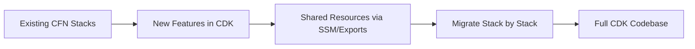

# How to Migrate from CloudFormation to CDK

Author: [nawazdhandala](https://github.com/nawazdhandala)

Tags: AWS, CDK, CloudFormation, Migration

Description: A practical guide to migrating existing CloudFormation stacks to AWS CDK, covering import strategies, the cdk migrate command, and incremental adoption patterns.

---

You've got a pile of CloudFormation templates - maybe hundreds of them. They work, but they're painful to maintain. The YAML is verbose, the JSON is worse, and every change feels like you're editing a configuration file instead of writing code. CDK promises a better developer experience, but how do you get there without blowing up your existing infrastructure?

This guide covers practical strategies for migrating from CloudFormation to CDK. We'll look at the different approaches, their tradeoffs, and a step-by-step process you can follow.

## The Migration Spectrum

There's no single "right way" to migrate. Your approach depends on your stack complexity, team comfort level, and risk tolerance. Here are the main options, from least disruptive to most thorough.

**Option 1: Wrap existing templates** - Use CDK to include your existing CloudFormation templates as-is. Minimal risk, minimal benefit.

**Option 2: Use cdk migrate** - The CDK CLI can generate CDK code from existing templates or deployed stacks. Good starting point, but the generated code needs cleanup.

**Option 3: Rewrite and import** - Write new CDK code and import existing resources into it. Most work, but gives you the cleanest result.

**Option 4: Gradual rewrite** - Keep existing stacks running, build new features in CDK, and migrate resources over time. Lowest risk for large organizations.

## Option 1: Including Existing Templates

The quickest way to get started is wrapping your CloudFormation templates in CDK. This gives you the CDK deployment experience without changing any infrastructure.

```typescript
import * as cdk from 'aws-cdk-lib';
import * as cfn from 'aws-cdk-lib/cloudformation-include';
import { Construct } from 'constructs';

export class MigrationStack extends cdk.Stack {
  constructor(scope: Construct, id: string, props?: cdk.StackProps) {
    super(scope, id, props);

    // Include your existing CloudFormation template
    const template = new cfn.CfnInclude(this, 'ExistingTemplate', {
      templateFile: 'existing-templates/my-stack.yaml',
      // Optionally preserve logical IDs to prevent resource replacement
      preserveLogicalIds: true,
    });

    // You can reference resources from the included template
    const existingBucket = template.getResource('MyS3Bucket');
    const existingVpc = template.getResource('MyVPC');

    // And add new CDK constructs alongside them
    // const newTable = new dynamodb.Table(this, 'NewTable', { ... });
  }
}
```

The `CfnInclude` construct reads your template and creates CDK representations of each resource. You can reference these resources, modify their properties, and add new resources alongside them.

The `preserveLogicalIds` flag is critical. CloudFormation uses logical IDs to track resources. If the IDs change, CloudFormation thinks the old resource should be deleted and a new one created. That's not what you want during a migration.

## Option 2: Using cdk migrate

CDK has a built-in migration command that generates CDK code from CloudFormation templates or deployed stacks.

From a template file:

```bash
# Generate CDK code from a CloudFormation template
cdk migrate --stack-name MyStack \
  --from-path ./existing-template.yaml \
  --language typescript
```

From a deployed stack:

```bash
# Generate CDK code from a running stack
cdk migrate --stack-name MyStack \
  --from-stack \
  --language typescript
```

This creates a new CDK project with TypeScript code that reproduces your template. Here's what the generated code typically looks like.

```typescript
// Generated code uses L1 constructs (Cfn* classes)
import * as cdk from 'aws-cdk-lib';
import * as s3 from 'aws-cdk-lib/aws-s3';
import { Construct } from 'constructs';

export class MigratedStack extends cdk.Stack {
  constructor(scope: Construct, id: string, props?: cdk.StackProps) {
    super(scope, id, props);

    // Generated code - this is a direct translation, not idiomatic CDK
    const myBucket = new s3.CfnBucket(this, 'MyBucket', {
      bucketName: 'my-existing-bucket',
      versioningConfiguration: {
        status: 'Enabled',
      },
      bucketEncryption: {
        serverSideEncryptionConfiguration: [{
          serverSideEncryptionByDefault: {
            sseAlgorithm: 'AES256',
          },
        }],
      },
    });
  }
}
```

The generated code uses L1 constructs (`CfnBucket` instead of `Bucket`), which are a 1:1 mapping to CloudFormation resources. They work, but they don't give you the nice defaults and helper methods of L2 constructs.

## Upgrading L1 to L2 Constructs

The real value of CDK comes from L2 constructs. Here's how you'd upgrade the generated code.

```typescript
// Before: L1 construct (generated by cdk migrate)
const cfnBucket = new s3.CfnBucket(this, 'MyBucket', {
  bucketName: 'my-existing-bucket',
  versioningConfiguration: { status: 'Enabled' },
  bucketEncryption: {
    serverSideEncryptionConfiguration: [{
      serverSideEncryptionByDefault: { sseAlgorithm: 'AES256' },
    }],
  },
});

// After: L2 construct (idiomatic CDK)
const bucket = new s3.Bucket(this, 'MyBucket', {
  bucketName: 'my-existing-bucket',
  versioned: true,
  encryption: s3.BucketEncryption.S3_MANAGED,
  enforceSSL: true,
  blockPublicAccess: s3.BlockPublicAccess.BLOCK_ALL,
});
```

The L2 version is shorter and includes sensible defaults. But be careful - upgrading constructs can change logical IDs, which may trigger resource replacement. Always run `cdk diff` before deploying.

## Option 3: Import Existing Resources

If you want to write fresh CDK code but keep existing resources, you can import them.

Step 1: Write your CDK stack as if creating resources from scratch.

Step 2: Generate the CloudFormation template.

```bash
cdk synth > template.yaml
```

Step 3: Use CloudFormation's import feature to bring existing resources under the stack's control.

```bash
# Import resources into the stack
aws cloudformation create-change-set \
  --stack-name MyNewCdkStack \
  --change-set-name ImportChangeSet \
  --change-set-type IMPORT \
  --template-body file://template.yaml \
  --resources-to-import "[{\"ResourceType\":\"AWS::S3::Bucket\",\"LogicalResourceId\":\"MyBucket\",\"ResourceIdentifier\":{\"BucketName\":\"my-existing-bucket\"}}]"

# Execute the import
aws cloudformation execute-change-set \
  --stack-name MyNewCdkStack \
  --change-set-name ImportChangeSet
```

This is the cleanest approach, but it requires matching every logical ID and property exactly.

## The Gradual Migration Pattern

For large organizations, the safest approach is gradual migration. Don't try to move everything at once.



The process looks like this:

1. Keep existing CloudFormation stacks running
2. Build all new features in CDK
3. Share resource references between stacks using SSM Parameter Store or CloudFormation exports
4. Migrate existing stacks one at a time, starting with the least critical
5. Eventually, everything is in CDK

Here's how to share references between a CloudFormation stack and a CDK stack.

```typescript
// In your CDK stack, read values from SSM that were written by CloudFormation
import * as ssm from 'aws-cdk-lib/aws-ssm';

const vpcId = ssm.StringParameter.valueFromLookup(this, '/infra/vpc-id');
const vpc = ec2.Vpc.fromLookup(this, 'ExistingVpc', {
  vpcId: vpcId,
});
```

## Testing Your Migration

Before deploying a migrated stack, always verify with `cdk diff`.

```bash
# This should show NO changes if the migration is correct
cdk diff
```

If `cdk diff` shows resource replacements, something's wrong - usually a logical ID mismatch. Fix it before deploying. For more on this workflow, see our guide on [synthesizing and diffing CDK changes](https://oneuptime.com/blog/post/2026-02-12-synthesize-and-diff-cdk-changes-before-deployment/view).

## Common Pitfalls

Logical ID mismatches are the biggest source of problems. CDK generates logical IDs from the construct tree path. If your construct hierarchy doesn't match the original template's logical IDs, CloudFormation will try to replace resources.

Drift is another issue. If someone modified resources through the console after the original CloudFormation deployment, your template won't match reality. Run drift detection before starting the migration.

```bash
# Check for drift in your existing stack
aws cloudformation detect-stack-drift --stack-name MyStack
aws cloudformation describe-stack-drift-detection-status --stack-drift-detection-id <id>
```

## Wrapping Up

Migrating from CloudFormation to CDK isn't an overnight project, but it doesn't have to be a big-bang migration either. Start by wrapping existing templates with `CfnInclude`, build new features in CDK, and gradually migrate existing stacks when it makes sense. The goal is to end up with maintainable, type-safe infrastructure code - and you'll get there faster by taking it one stack at a time.

For a solid CDK foundation, make sure your account is properly set up with [CDK bootstrap](https://oneuptime.com/blog/post/2026-02-12-use-cdk-bootstrap-for-account-preparation/view), and consider using [CDK Nag](https://oneuptime.com/blog/post/2026-02-12-use-cdk-nag-for-security-best-practice-checks/view) to catch security issues as you migrate.
