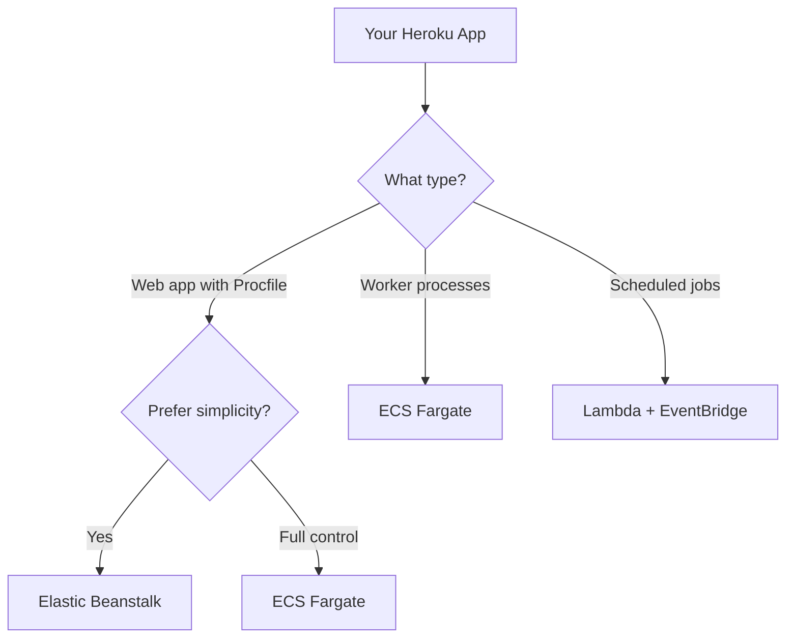

# How to Migrate from Heroku to AWS

Author: [nawazdhandala](https://github.com/nawazdhandala)

Tags: AWS, Heroku, Migration, ECS, Fargate, RDS, Elastic Beanstalk

Description: A practical guide for migrating applications from Heroku to AWS using ECS Fargate, Elastic Beanstalk, or Lambda depending on your application needs.

---

Heroku is great for getting started, but many teams outgrow it. The reasons are usually cost (Heroku gets expensive at scale), control (you need VPC networking, custom runtimes, or specific compliance requirements), or performance (you need more granular control over compute resources). AWS gives you all of that, but the migration requires careful planning because Heroku abstracts away a lot of infrastructure that you will now need to manage.

This guide covers how to migrate from Heroku to AWS, mapping Heroku concepts to their AWS equivalents and walking through the migration step by step.

## Heroku to AWS Service Mapping

| Heroku Concept | AWS Equivalent | Notes |
|---|---|---|
| Dynos | ECS Fargate tasks or EC2 | Fargate is closest to Heroku's model |
| Heroku Postgres | Amazon RDS for PostgreSQL | Direct migration with pg_dump/DMS |
| Heroku Redis | Amazon ElastiCache for Redis | Similar feature set |
| Heroku Pipelines | CodePipeline + CodeBuild | Or GitHub Actions |
| Add-ons | AWS managed services | Map each add-on individually |
| Config Vars | Secrets Manager / SSM Parameter Store | Environment variables |
| Procfile | ECS task definition / Dockerfile | Defines how app runs |
| Heroku Router | Application Load Balancer | Request routing |
| heroku.yml | Dockerfile + buildspec.yml | Build configuration |

## Choosing Your AWS Compute Platform



- **ECS Fargate**: The closest equivalent to Heroku's dyno model. Serverless containers with auto-scaling. Best choice for most migrations.
- **Elastic Beanstalk**: The most Heroku-like experience on AWS. Handles deployment, scaling, and monitoring. Good if you want to minimize operational changes.
- **Lambda**: For event-driven or scheduled workloads that do not need a persistent process.

## Step 1: Containerize Your Application

If your Heroku app uses a Procfile, you need to create a Dockerfile. Here is an example for a Node.js application:

```dockerfile
# Dockerfile for a Node.js Heroku app
FROM node:18-alpine

WORKDIR /app

# Install dependencies
COPY package*.json ./
RUN npm ci --only=production

# Copy application code
COPY . .

# Expose the port (Heroku uses dynamic PORT, AWS uses fixed)
EXPOSE 3000

# Start command (equivalent to Procfile web process)
CMD ["node", "server.js"]
```

For a Python/Django application:

```dockerfile
# Dockerfile for a Django Heroku app
FROM python:3.11-slim

WORKDIR /app

# Install dependencies
COPY requirements.txt .
RUN pip install --no-cache-dir -r requirements.txt

COPY . .

# Collect static files
RUN python manage.py collectstatic --noinput

EXPOSE 8000

# Gunicorn command (from Procfile)
CMD ["gunicorn", "myapp.wsgi:application", "--bind", "0.0.0.0:8000", "--workers", "3"]
```

Key differences from Heroku:
- Heroku injects `PORT` as an environment variable. On AWS, you define the port explicitly.
- Heroku buildpacks handle dependencies automatically. With Docker, you manage this in the Dockerfile.
- Heroku's slug size limit (500 MB) does not apply on AWS.

## Step 2: Migrate the Database

### Export from Heroku Postgres

```bash
# Create a backup of your Heroku database
heroku pg:backups:capture --app your-app-name

# Download the backup
heroku pg:backups:download --app your-app-name

# Or use pg_dump directly for more control
heroku pg:credentials:url --app your-app-name
# Use the connection string to pg_dump
pg_dump -Fc --no-acl --no-owner -h host -U user dbname > heroku_backup.dump
```

### Set Up RDS PostgreSQL

```python
# Create RDS PostgreSQL instance
import boto3

rds = boto3.client('rds')

rds.create_db_instance(
    DBInstanceIdentifier='migrated-from-heroku',
    DBInstanceClass='db.t3.medium',
    Engine='postgres',
    EngineVersion='15.4',
    MasterUsername='admin',
    MasterUserPassword='SecurePassword123!',
    AllocatedStorage=50,
    StorageType='gp3',
    VpcSecurityGroupIds=['sg-database'],
    DBSubnetGroupName='private-subnets',
    MultiAZ=True,
    BackupRetentionPeriod=7,
    StorageEncrypted=True,
    PubliclyAccessible=False
)
```

### Restore to RDS

```bash
# Restore the dump to RDS
pg_restore --verbose --clean --no-acl --no-owner \
  -h migrated-from-heroku.abc123.us-east-1.rds.amazonaws.com \
  -U admin \
  -d your_database \
  heroku_backup.dump
```

For zero-downtime migration, use AWS DMS for continuous replication. See our [DMS migration guide](https://oneuptime.com/blog/post/2026-02-12-migrate-databases-to-aws-with-dms/view).

## Step 3: Migrate Redis

```bash
# Export Redis data from Heroku
heroku redis:info --app your-app-name

# For small datasets, use redis-cli to dump and restore
redis-cli -h heroku-redis-host -p port -a password --rdb dump.rdb

# Create ElastiCache Redis cluster
```

```python
# Create ElastiCache Redis
import boto3

elasticache = boto3.client('elasticache')

elasticache.create_replication_group(
    ReplicationGroupId='migrated-redis',
    ReplicationGroupDescription='Migrated from Heroku Redis',
    Engine='redis',
    EngineVersion='7.0',
    CacheNodeType='cache.t3.medium',
    NumCacheClusters=2,
    AutomaticFailoverEnabled=True,
    CacheSubnetGroupName='private-subnets',
    SecurityGroupIds=['sg-redis'],
    AtRestEncryptionEnabled=True,
    TransitEncryptionEnabled=True
)
```

## Step 4: Set Up ECS Fargate

```python
# Create ECS cluster and task definition
import boto3
import json

ecs = boto3.client('ecs')

# Create cluster
ecs.create_cluster(
    clusterName='heroku-migrated',
    capacityProviders=['FARGATE', 'FARGATE_SPOT'],
    defaultCapacityProviderStrategy=[
        {'capacityProvider': 'FARGATE', 'weight': 1, 'base': 1},
        {'capacityProvider': 'FARGATE_SPOT', 'weight': 3}
    ]
)

# Register task definition
ecs.register_task_definition(
    family='my-web-app',
    networkMode='awsvpc',
    requiresCompatibilities=['FARGATE'],
    cpu='512',
    memory='1024',
    executionRoleArn='arn:aws:iam::123456789:role/ecsTaskExecutionRole',
    taskRoleArn='arn:aws:iam::123456789:role/ecsTaskRole',
    containerDefinitions=[
        {
            'name': 'web',
            'image': '123456789.dkr.ecr.us-east-1.amazonaws.com/my-app:latest',
            'portMappings': [
                {'containerPort': 3000, 'protocol': 'tcp'}
            ],
            'environment': [
                {'name': 'NODE_ENV', 'value': 'production'}
            ],
            'secrets': [
                {
                    'name': 'DATABASE_URL',
                    'valueFrom': 'arn:aws:secretsmanager:us-east-1:123456789:secret:db-url'
                }
            ],
            'logConfiguration': {
                'logDriver': 'awslogs',
                'options': {
                    'awslogs-group': '/ecs/my-web-app',
                    'awslogs-region': 'us-east-1',
                    'awslogs-stream-prefix': 'web'
                }
            }
        }
    ]
)
```

## Step 5: Set Up the Load Balancer

Replace Heroku's router with an Application Load Balancer:

```python
# Create ALB for the application
import boto3

elbv2 = boto3.client('elbv2')

# Create ALB
alb = elbv2.create_load_balancer(
    Name='my-web-app-alb',
    Subnets=['subnet-public-1', 'subnet-public-2'],
    SecurityGroups=['sg-alb'],
    Scheme='internet-facing',
    Type='application'
)

# Create target group
tg = elbv2.create_target_group(
    Name='my-web-app-tg',
    Protocol='HTTP',
    Port=3000,
    VpcId='vpc-xyz',
    TargetType='ip',
    HealthCheckPath='/health',
    HealthCheckIntervalSeconds=30
)

# Create HTTPS listener
elbv2.create_listener(
    LoadBalancerArn=alb['LoadBalancers'][0]['LoadBalancerArn'],
    Protocol='HTTPS',
    Port=443,
    SslPolicy='ELBSecurityPolicy-TLS13-1-2-2021-06',
    Certificates=[
        {'CertificateArn': 'arn:aws:acm:us-east-1:123456789:certificate/abc-123'}
    ],
    DefaultActions=[
        {
            'Type': 'forward',
            'TargetGroupArn': tg['TargetGroups'][0]['TargetGroupArn']
        }
    ]
)
```

## Step 6: Migrate Config Vars

Move Heroku config vars to AWS Secrets Manager or SSM Parameter Store:

```bash
# Export all Heroku config vars
heroku config --app your-app-name --json > config-vars.json
```

```python
# Import config vars to AWS Secrets Manager
import boto3
import json

secrets = boto3.client('secretsmanager')

with open('config-vars.json', 'r') as f:
    config_vars = json.load(f)

for key, value in config_vars.items():
    secrets.create_secret(
        Name=f'my-app/{key}',
        SecretString=value,
        Description=f'Migrated from Heroku config var: {key}'
    )
    print(f"Created secret: my-app/{key}")
```

## Step 7: Set Up CI/CD

Replace Heroku Pipelines with AWS CodePipeline or GitHub Actions:

```yaml
# GitHub Actions workflow for deploying to ECS
name: Deploy to ECS
on:
  push:
    branches: [main]

jobs:
  deploy:
    runs-on: ubuntu-latest
    steps:
      - uses: actions/checkout@v4

      - name: Configure AWS credentials
        uses: aws-actions/configure-aws-credentials@v4
        with:
          aws-access-key-id: ${{ secrets.AWS_ACCESS_KEY_ID }}
          aws-secret-access-key: ${{ secrets.AWS_SECRET_ACCESS_KEY }}
          aws-region: us-east-1

      - name: Login to ECR
        uses: aws-actions/amazon-ecr-login@v2

      - name: Build and push image
        run: |
          docker build -t my-app .
          docker tag my-app:latest 123456789.dkr.ecr.us-east-1.amazonaws.com/my-app:latest
          docker push 123456789.dkr.ecr.us-east-1.amazonaws.com/my-app:latest

      - name: Deploy to ECS
        uses: aws-actions/amazon-ecs-deploy-task-definition@v1
        with:
          task-definition: task-definition.json
          service: my-web-app
          cluster: heroku-migrated
```

## Step 8: DNS Cutover

Update DNS to point from Heroku to AWS:

```bash
# Update DNS from Heroku to ALB
# In Route 53 or your DNS provider
# Change CNAME from your-app.herokuapp.com to my-web-app-alb-xyz.us-east-1.elb.amazonaws.com
```

## Monitoring After Migration

Heroku's built-in metrics dashboard gets replaced by CloudWatch. For a more comprehensive monitoring solution that covers application performance, uptime, and incident management, check out [OneUptime](https://oneuptime.com/blog/post/2026-02-12-migrate-from-on-premises-to-aws-step-by-step/view).

## Wrapping Up

Migrating from Heroku to AWS trades simplicity for control and cost efficiency at scale. The core steps are containerizing your app, migrating your database, setting up ECS Fargate with a load balancer, and rebuilding your CI/CD pipeline. Take it step by step, run both environments in parallel during the transition, and only cut over DNS when you have validated everything on AWS. The initial setup is more work than Heroku, but the long-term operational flexibility and cost control make it worthwhile.
