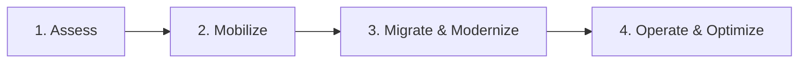
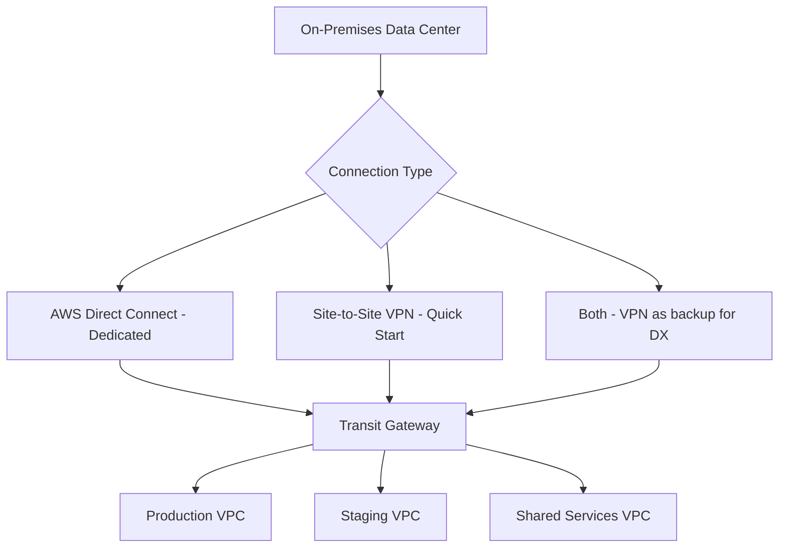
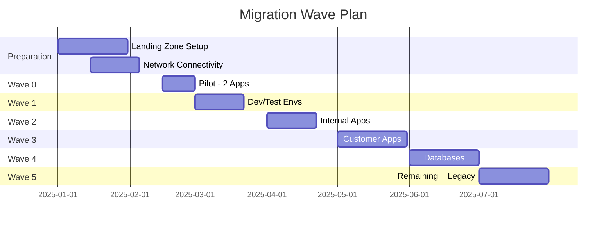

# How to Migrate from On-Premises to AWS Step by Step

Author: [nawazdhandala](https://github.com/nawazdhandala)

Tags: AWS, Cloud Migration, On-Premises, Migration Hub, MGN, DMS, Lift and Shift

Description: A complete step-by-step guide for migrating on-premises infrastructure to AWS covering discovery, planning, execution, and optimization phases.

---

Migrating from on-premises to AWS is a multi-phase project that touches every part of your technology stack. It is not just about moving servers - it involves networking, security, data, applications, processes, and people. This guide breaks the entire migration down into clear, sequential steps that you can follow regardless of your organization's size.

## The Migration Framework

AWS defines a six-phase migration framework:



In practice, these phases overlap. You will be assessing new workloads while migrating others and optimizing ones that already moved. But the framework gives you a useful mental model.

## Phase 1: Assessment

### Build Your Business Case

Before touching any technology, quantify why you are migrating. Common drivers include:

- Data center lease expiration
- Hardware end-of-life
- Scaling limitations
- Cost reduction (or cost predictability)
- Speed of innovation

Calculate your total cost of ownership (TCO) for on-premises vs. AWS using the AWS Pricing Calculator and your actual infrastructure costs including power, cooling, real estate, and staff.

### Discover Your Environment

Use AWS Application Discovery Service to inventory your environment. For details, see our guide on [using the AWS Application Discovery Service](https://oneuptime.com/blog/post/use-the-aws-application-discovery-service/view).

```python
# Start discovery to inventory your environment
import boto3

discovery = boto3.client('discovery')

# Deploy agents and start collection
response = discovery.start_data_collection_by_agent_ids(
    agentIds=['agent-id-1', 'agent-id-2']
)
```

Let discovery run for at least two weeks to capture meaningful performance data and dependency information.

### Assess Migration Strategies

For each application, determine the right migration strategy. Use [Migration Hub Strategy Recommendations](https://oneuptime.com/blog/post/assess-your-applications-with-aws-migration-hub-strategy-recommendations/view) for data-driven guidance.

The most common strategies for an initial migration:
- **Rehost (70-80% of workloads)**: Fastest path, move as-is
- **Replatform (10-15%)**: Minor optimization during migration
- **Retire (5-10%)**: Turn off what you no longer need

## Phase 2: Mobilize

### Set Up Your AWS Landing Zone

Before migrating anything, set up the foundation:

```python
# Create organizational structure with AWS Organizations
import boto3

organizations = boto3.client('organizations')

# Create OUs for different environments
for ou_name in ['Production', 'Staging', 'Development', 'SharedServices', 'Security']:
    organizations.create_organizational_unit(
        ParentId='r-root-id',
        Name=ou_name
    )
```

Key landing zone components:
- **AWS Organizations** with separate accounts for production, staging, development, shared services, and security
- **AWS Control Tower** for governance and guardrails
- **Networking** with Transit Gateway, VPCs, and subnets
- **Identity** with AWS SSO (IAM Identity Center) and federated access
- **Logging** with CloudTrail, Config, and centralized log bucket

### Establish Network Connectivity

Connect your on-premises network to AWS:



For production migrations, use AWS Direct Connect with a VPN backup:

```python
# Create a Transit Gateway for hub-and-spoke networking
import boto3

ec2 = boto3.client('ec2')

tgw = ec2.create_transit_gateway(
    Description='Migration Transit Gateway',
    Options={
        'AmazonSideAsn': 64512,
        'AutoAcceptSharedAttachments': 'enable',
        'DefaultRouteTableAssociation': 'enable',
        'DefaultRouteTablePropagation': 'enable',
        'DnsSupport': 'enable'
    },
    TagSpecifications=[
        {
            'ResourceType': 'transit-gateway',
            'Tags': [{'Key': 'Name', 'Value': 'migration-tgw'}]
        }
    ]
)
```

### Build Your Migration Factory

A migration factory is the repeatable process for migrating workloads. Document the steps for each migration pattern:

**Rehost Pattern:**
1. Install MGN agent on source server
2. Wait for initial replication to complete
3. Configure launch settings
4. Run test launch and validate
5. Schedule cutover window
6. Execute cutover
7. Validate and monitor
8. Decommission source

**Database Migration Pattern:**
1. Set up DMS replication instance
2. Create source and target endpoints
3. Run full load with CDC
4. Validate data integrity
5. Schedule cutover window
6. Stop applications, verify zero lag, switch connections
7. Monitor and validate

## Phase 3: Migrate

### Wave Planning

Organize your migration into waves of 5-10 applications each:



### Execute Server Migrations with MGN

For each server in the wave, follow the [MGN migration process](https://oneuptime.com/blog/post/migrate-vms-to-aws-with-aws-application-migration-service-mgn/view):

```python
# Batch install MGN agents and track progress
import boto3

mgn = boto3.client('mgn')

# Check replication status for the current wave
response = mgn.describe_source_servers(filters={})

ready_for_cutover = []
still_replicating = []

for server in response['items']:
    state = server.get('dataReplicationInfo', {}).get('dataReplicationState', '')
    hostname = server.get('sourceProperties', {}).get('identificationHints', {}).get('hostname', 'Unknown')

    if state == 'CONTINUOUS':
        ready_for_cutover.append(hostname)
    else:
        still_replicating.append(f"{hostname} ({state})")

print(f"Ready for cutover: {len(ready_for_cutover)}")
print(f"Still replicating: {len(still_replicating)}")
```

### Execute Database Migrations with DMS

For databases, use [AWS DMS](https://oneuptime.com/blog/post/migrate-databases-to-aws-with-dms/view) for continuous replication:

```python
# Monitor all active DMS tasks
import boto3

dms = boto3.client('dms')

response = dms.describe_replication_tasks()

for task in response['ReplicationTasks']:
    task_id = task['ReplicationTaskIdentifier']
    status = task['Status']
    stats = task.get('ReplicationTaskStats', {})

    print(f"\nTask: {task_id}")
    print(f"  Status: {status}")
    print(f"  Full Load: {stats.get('FullLoadProgressPercent', 0)}%")
    print(f"  CDC Latency: {stats.get('CDCLatency', 'N/A')}s")
```

### Cutover Checklist

For each application cutover:

- [ ] Replication is current (zero lag for servers, zero CDC latency for databases)
- [ ] Test instances validated successfully
- [ ] DNS changes prepared
- [ ] Load balancer configuration ready
- [ ] Rollback plan documented and tested
- [ ] Monitoring set up on AWS side
- [ ] Stakeholders notified of cutover window
- [ ] On-call team available during cutover

## Phase 4: Operate and Optimize

### Set Up Monitoring

From day one on AWS, set up comprehensive monitoring:

```python
# Create CloudWatch dashboards for migrated workloads
import boto3

cloudwatch = boto3.client('cloudwatch')

# Create alarms for critical metrics
cloudwatch.put_metric_alarm(
    AlarmName='High-CPU-WebServer',
    ComparisonOperator='GreaterThanThreshold',
    EvaluationPeriods=3,
    MetricName='CPUUtilization',
    Namespace='AWS/EC2',
    Period=300,
    Statistic='Average',
    Threshold=85.0,
    AlarmActions=['arn:aws:sns:us-east-1:123456789:ops-alerts'],
    Dimensions=[
        {'Name': 'InstanceId', 'Value': 'i-migrated-webserver'}
    ]
)
```

For full-stack monitoring across your migrated applications, [OneUptime](https://oneuptime.com) provides comprehensive observability including uptime monitoring, incident management, and performance tracking.

### Right-Size Your Instances

After running on AWS for 2-4 weeks, use AWS Compute Optimizer to identify right-sizing opportunities:

```python
# Get right-sizing recommendations
import boto3

optimizer = boto3.client('compute-optimizer')

response = optimizer.get_ec2_instance_recommendations()

for rec in response['instanceRecommendations']:
    current = rec['currentInstanceType']
    instance_id = rec['instanceArn'].split('/')[-1]

    for option in rec['recommendationOptions'][:1]:
        recommended = option['instanceType']
        if current != recommended:
            print(f"Instance {instance_id}: {current} -> {recommended}")
```

### Optimize Costs

Once workloads are stable, optimize costs:
- Purchase Reserved Instances or Savings Plans for steady-state workloads
- Implement auto-scaling for variable workloads
- Move infrequently accessed data to S3 Intelligent-Tiering or Glacier
- Shut down non-production environments outside business hours

## Common Mistakes to Avoid

1. **Migrating without discovery**: You will miss dependencies and break things
2. **Big bang migration**: Migrate in waves to contain risk
3. **Skipping the pilot**: Your first wave should be 1-2 low-risk applications
4. **Not training your team**: Invest in AWS training before and during migration
5. **Ignoring security**: Set up security controls in the landing zone before migrating workloads
6. **No rollback plan**: Every cutover needs a tested rollback procedure

## Wrapping Up

Migrating from on-premises to AWS is a marathon, not a sprint. The organizations that succeed are the ones that invest in proper assessment and planning, build repeatable processes through their migration factory, and migrate in controlled waves with clear success criteria. Start with discovery, build your landing zone, migrate a pilot, learn from it, and then scale up. The AWS migration toolset handles the technical heavy lifting; your job is the planning, coordination, and validation that make each wave successful.
