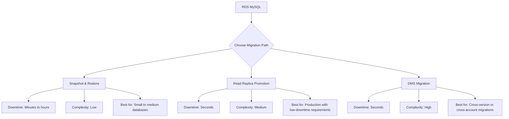

# How to Migrate from RDS MySQL to Aurora MySQL

Author: [nawazdhandala](https://github.com/nawazdhandala)

Tags: AWS, Aurora, MySQL, Migration, RDS

Description: A practical guide to migrating from standard RDS MySQL to Aurora MySQL, covering snapshot migration, read replica promotion, and DMS-based approaches with minimal downtime.

---

You're running MySQL on standard RDS and you've heard good things about Aurora - better performance, faster replication, automatic storage scaling. The question is: how do you actually move your database without a long maintenance window or, worse, data loss?

There are three main approaches, and the right one depends on how much downtime you can tolerate and how complex your setup is. Let's go through all of them.

## Migration Approaches Overview



## Approach 1: Snapshot and Restore

This is the simplest approach. You take a snapshot of your RDS MySQL instance and restore it as a new Aurora cluster. The downside is that your application has downtime while the snapshot is created and restored.

### Step-by-Step

First, create a snapshot of your RDS MySQL instance:

```bash
# Create a snapshot of the RDS MySQL instance
aws rds create-db-snapshot \
  --db-instance-identifier my-rds-mysql \
  --db-snapshot-identifier mysql-to-aurora-snapshot

# Wait for the snapshot to complete
aws rds wait db-snapshot-available \
  --db-snapshot-identifier mysql-to-aurora-snapshot
```

Now restore the snapshot as an Aurora cluster:

```bash
# Restore the snapshot as an Aurora MySQL cluster
aws rds restore-db-cluster-from-snapshot \
  --db-cluster-identifier my-aurora-cluster \
  --snapshot-identifier mysql-to-aurora-snapshot \
  --engine aurora-mysql \
  --engine-version 5.7.mysql_aurora.2.11.2 \
  --db-subnet-group-name my-subnet-group \
  --vpc-security-group-ids sg-abc123

# Add a writer instance to the new Aurora cluster
aws rds create-db-instance \
  --db-instance-identifier my-aurora-writer \
  --db-cluster-identifier my-aurora-cluster \
  --db-instance-class db.r5.large \
  --engine aurora-mysql

# Wait for the instance to become available
aws rds wait db-instance-available \
  --db-instance-identifier my-aurora-writer
```

After the Aurora cluster is ready, update your application's connection string and you're done.

### When to Use This Approach

- Database is small (under 100 GB)
- You can afford a maintenance window
- You want the simplest possible migration path

## Approach 2: Read Replica Promotion (Recommended)

This is the best approach for production databases. You create an Aurora Read Replica of your RDS MySQL instance, let it sync, then promote it to a standalone Aurora cluster. The cutover downtime is measured in seconds.

### Step 1: Create an Aurora Read Replica

```bash
# Create an Aurora Read Replica from the RDS MySQL instance
aws rds create-db-cluster \
  --db-cluster-identifier my-aurora-migration \
  --engine aurora-mysql \
  --engine-version 5.7.mysql_aurora.2.11.2 \
  --replication-source-identifier arn:aws:rds:us-east-1:123456789012:db:my-rds-mysql \
  --db-subnet-group-name my-subnet-group \
  --vpc-security-group-ids sg-abc123

# Add an instance to the Aurora replica cluster
aws rds create-db-instance \
  --db-instance-identifier my-aurora-migration-instance \
  --db-cluster-identifier my-aurora-migration \
  --db-instance-class db.r5.large \
  --engine aurora-mysql
```

### Step 2: Monitor Replication Lag

Wait for the replica to catch up with the source. Check the replication lag:

```bash
# Check replication status
aws rds describe-db-clusters \
  --db-cluster-identifier my-aurora-migration \
  --query 'DBClusters[0].{Status:Status,ReplicationSourceIdentifier:ReplicationSourceIdentifier}'
```

You can also check from within the database:

```sql
-- Check replica lag from inside the Aurora replica
SHOW SLAVE STATUS\G
-- Look for Seconds_Behind_Master - it should be 0 or very close
```

### Step 3: Prepare for Cutover

Before the cutover, verify everything is in sync:

```bash
# Verify the replica is caught up
# Run this until Seconds_Behind_Master is consistently 0
mysql -h my-aurora-migration-instance.abc123.us-east-1.rds.amazonaws.com \
  -u admin -p \
  -e "SHOW SLAVE STATUS\G" | grep "Seconds_Behind_Master"
```

### Step 4: Perform the Cutover

The cutover sequence should be quick and practiced:

```bash
# Step 4a: Stop writes to the source (put your app in maintenance mode)
# This is application-specific - pause your write operations

# Step 4b: Verify final replication catch-up
# Wait for Seconds_Behind_Master = 0

# Step 4c: Promote the Aurora replica to a standalone cluster
aws rds promote-read-replica-db-cluster \
  --db-cluster-identifier my-aurora-migration

# Step 4d: Update your application connection string to the Aurora endpoint
# New endpoint: my-aurora-migration.cluster-abc123.us-east-1.rds.amazonaws.com

# Step 4e: Resume writes to the new Aurora cluster
```

Here's a Python script that automates the monitoring and cutover:

```python
import boto3
import pymysql
import time

def monitor_and_cutover(source_instance, aurora_cluster, aurora_endpoint):
    """
    Monitor replication lag and assist with cutover.
    """
    rds = boto3.client('rds')

    # Check replication lag
    conn = pymysql.connect(
        host=aurora_endpoint,
        user='admin',
        password='password',
        connect_timeout=5
    )
    cursor = conn.cursor(pymysql.cursors.DictCursor)

    print("Monitoring replication lag...")
    while True:
        cursor.execute("SHOW SLAVE STATUS")
        status = cursor.fetchone()

        if status is None:
            print("No replication status - replica may already be promoted")
            break

        lag = status.get('Seconds_Behind_Master', 'NULL')
        print(f"Replication lag: {lag} seconds")

        if lag == 0:
            print("Replica is caught up!")
            confirm = input("Ready to promote? (yes/no): ")
            if confirm.lower() == 'yes':
                break

        time.sleep(5)

    conn.close()

    # Promote the Aurora cluster
    print(f"Promoting {aurora_cluster}...")
    rds.promote_read_replica_db_cluster(
        DBClusterIdentifier=aurora_cluster
    )

    # Wait for promotion to complete
    print("Waiting for promotion to complete...")
    waiter = rds.get_waiter('db_cluster_available')
    waiter.wait(DBClusterIdentifier=aurora_cluster)

    print("Promotion complete! Update your application connection strings.")
    cluster = rds.describe_db_clusters(
        DBClusterIdentifier=aurora_cluster
    )['DBClusters'][0]
    print(f"Writer endpoint: {cluster['Endpoint']}")
    print(f"Reader endpoint: {cluster['ReaderEndpoint']}")
```

## Approach 3: AWS DMS (Database Migration Service)

Use DMS when the first two approaches don't work - for example, cross-account migrations, major version upgrades, or when you need to filter or transform data during migration.

Set up a DMS replication instance and task:

```bash
# Create a DMS replication instance
aws dms create-replication-instance \
  --replication-instance-identifier mysql-to-aurora-repl \
  --replication-instance-class dms.r5.large \
  --allocated-storage 100

# Create source endpoint (RDS MySQL)
aws dms create-endpoint \
  --endpoint-identifier source-mysql \
  --endpoint-type source \
  --engine-name mysql \
  --server-name my-rds-mysql.abc123.us-east-1.rds.amazonaws.com \
  --port 3306 \
  --username admin \
  --password YourPassword123 \
  --database-name mydb

# Create target endpoint (Aurora MySQL)
aws dms create-endpoint \
  --endpoint-identifier target-aurora \
  --endpoint-type target \
  --engine-name aurora \
  --server-name my-aurora-cluster.cluster-abc123.us-east-1.rds.amazonaws.com \
  --port 3306 \
  --username admin \
  --password YourPassword123 \
  --database-name mydb

# Create the migration task with CDC for ongoing replication
aws dms create-replication-task \
  --replication-task-identifier mysql-to-aurora-task \
  --source-endpoint-arn arn:aws:dms:us-east-1:123456789012:endpoint:source-mysql-id \
  --target-endpoint-arn arn:aws:dms:us-east-1:123456789012:endpoint:target-aurora-id \
  --replication-instance-arn arn:aws:dms:us-east-1:123456789012:rep:repl-instance-id \
  --migration-type full-load-and-cdc \
  --table-mappings '{"rules":[{"rule-type":"selection","rule-id":"1","rule-name":"include-all","object-locator":{"schema-name":"mydb","table-name":"%"},"rule-action":"include"}]}'
```

## Post-Migration Checklist

After migrating, don't just flip the switch and walk away. Run through this checklist:

```bash
# 1. Verify data integrity - compare row counts
mysql -h aurora-endpoint -u admin -p -e "
SELECT 'users' as tbl, COUNT(*) as cnt FROM users
UNION ALL
SELECT 'orders', COUNT(*) FROM orders
UNION ALL
SELECT 'products', COUNT(*) FROM products;"

# 2. Check Aurora-specific parameters
aws rds describe-db-cluster-parameters \
  --db-cluster-parameter-group-name default.aurora-mysql5.7 \
  --query 'Parameters[?ParameterName==`innodb_buffer_pool_size`].{Name:ParameterName,Value:ParameterValue}'

# 3. Add reader instances for read scaling
aws rds create-db-instance \
  --db-instance-identifier my-aurora-reader-1 \
  --db-cluster-identifier my-aurora-cluster \
  --db-instance-class db.r5.large \
  --engine aurora-mysql
```

Run your application's test suite against the new Aurora cluster. Check query performance, verify that all features work, and monitor for the first 24-48 hours.

## Common Migration Issues

**Binary log format.** Aurora requires ROW-based binary logging for replication. If your RDS MySQL instance uses STATEMENT or MIXED, you'll need to change it before creating the replica.

**Parameter group differences.** Aurora has its own parameter groups. Some MySQL parameters don't exist or have different defaults in Aurora. Review your custom parameters and create an Aurora parameter group.

**Storage engine compatibility.** Aurora only supports InnoDB. If you have MyISAM tables, convert them before migration.

**Application connection strings.** Aurora uses cluster endpoints instead of instance endpoints. Update your application to use the [proper Aurora endpoints](https://oneuptime.com/blog/post/configure-aurora-endpoints-writer-reader-custom/view) for read/write splitting.

## Wrapping Up

The read replica promotion method is the gold standard for production migrations - minimal downtime, no data loss, and straightforward rollback (just keep the source instance running until you're confident). For simpler scenarios, snapshot-and-restore works fine. Save DMS for the complex cases.

Whichever approach you choose, test it in a non-production environment first. For understanding the performance differences you'll see after migration, check out the guide on [comparing Aurora vs Standard RDS](https://oneuptime.com/blog/post/compare-aurora-vs-standard-rds/view).
