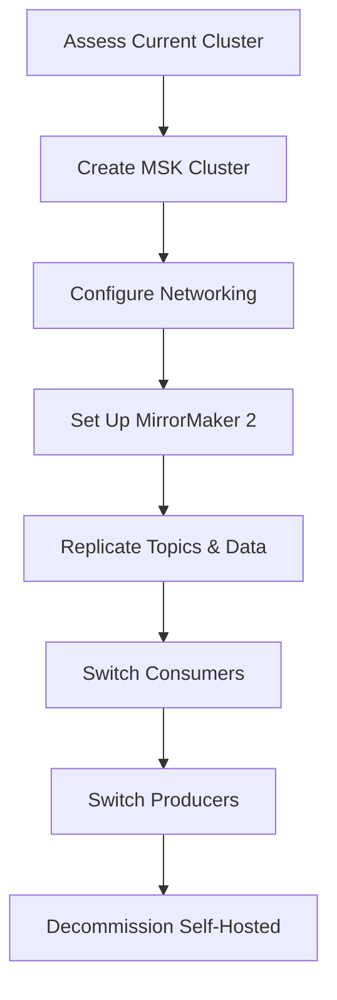

# How to Migrate from Self-Hosted Kafka to Amazon MSK

Author: [nawazdhandala](https://github.com/nawazdhandala)

Tags: AWS, Amazon MSK, Kafka, Streaming, Migration, Event Streaming

Description: Learn how to migrate from self-hosted Apache Kafka to Amazon Managed Streaming for Apache Kafka (MSK) with minimal disruption to your producers and consumers.

---

Running Apache Kafka in production is serious operational work. Broker management, ZooKeeper coordination, disk management, security patches, rebalancing, and monitoring all demand constant attention. Amazon Managed Streaming for Apache Kafka (MSK) takes on these operational responsibilities while giving you a fully compatible Kafka cluster that your existing producers and consumers can connect to with minimal changes.

This guide covers the migration from self-hosted Kafka to MSK step by step.

## Why Migrate to MSK

MSK provides:
- Automated broker provisioning and patching
- Built-in monitoring with CloudWatch and Prometheus
- Automatic storage scaling
- Integration with AWS services (Lambda, Firehose, S3)
- Encryption at rest and in transit by default
- Multi-AZ deployment for high availability

The key benefit is that MSK runs standard Apache Kafka. Your existing client applications work without code changes - you only update the bootstrap server addresses.

## Planning the Migration



The migration strategy uses Kafka MirrorMaker 2 to replicate data from your self-hosted cluster to MSK in real-time. Once replication is current, you switch consumers first, then producers. This approach minimizes downtime and risk.

## Step 1: Assess Your Current Cluster

Before creating the MSK cluster, document your current setup:

```bash
# List all topics and their configurations
kafka-topics.sh --bootstrap-server your-kafka:9092 --list

# Get detailed topic configuration
kafka-topics.sh --bootstrap-server your-kafka:9092 \
  --describe --topic your-topic

# Check consumer group offsets
kafka-consumer-groups.sh --bootstrap-server your-kafka:9092 \
  --list

kafka-consumer-groups.sh --bootstrap-server your-kafka:9092 \
  --group your-consumer-group \
  --describe
```

Key things to capture:
- Number of topics and partitions
- Replication factor for each topic
- Retention policies
- Consumer groups and their current offsets
- Throughput (messages per second, MB per second)
- Average message size

## Step 2: Create the MSK Cluster

Size the MSK cluster to match or exceed your current capacity:

```python
# Create MSK cluster
import boto3

msk = boto3.client('kafka')

response = msk.create_cluster(
    ClusterName='migrated-kafka',
    KafkaVersion='3.5.1',
    NumberOfBrokerNodes=3,  # Must be multiple of AZ count
    BrokerNodeGroupInfo={
        'InstanceType': 'kafka.m5.large',
        'ClientSubnets': [
            'subnet-private-1a',
            'subnet-private-1b',
            'subnet-private-1c'
        ],
        'SecurityGroups': ['sg-msk-cluster'],
        'StorageInfo': {
            'EbsStorageInfo': {
                'VolumeSize': 500,  # GB per broker
                'ProvisionedThroughput': {
                    'Enabled': True,
                    'VolumeThroughput': 250  # MB/s
                }
            }
        }
    },
    EncryptionInfo={
        'EncryptionInTransit': {
            'ClientBroker': 'TLS',
            'InCluster': True
        },
        'EncryptionAtRest': {
            'DataVolumeKMSKeyId': 'arn:aws:kms:us-east-1:123456789:key/abc-123'
        }
    },
    ConfigurationInfo={
        'Arn': 'arn:aws:kafka:us-east-1:123456789:configuration/custom-config/1',
        'Revision': 1
    },
    EnhancedMonitoring='PER_TOPIC_PER_BROKER',
    OpenMonitoring={
        'Prometheus': {
            'JmxExporter': {'EnabledInBroker': True},
            'NodeExporter': {'EnabledInBroker': True}
        }
    },
    LoggingInfo={
        'BrokerLogs': {
            'CloudWatchLogs': {
                'Enabled': True,
                'LogGroup': '/aws/msk/migrated-kafka'
            }
        }
    },
    Tags={
        'Project': 'KafkaMigration',
        'Environment': 'Production'
    }
)

cluster_arn = response['ClusterArn']
print(f"MSK cluster creating: {cluster_arn}")
```

### Custom Configuration

Match your self-hosted Kafka configuration:

```python
# Create custom MSK configuration
msk.create_configuration(
    Name='custom-config',
    Description='Matched from self-hosted cluster',
    KafkaVersions=['3.5.1'],
    ServerProperties=b"""
auto.create.topics.enable=false
default.replication.factor=3
min.insync.replicas=2
num.partitions=6
log.retention.hours=168
log.retention.bytes=-1
message.max.bytes=10485760
replica.fetch.max.bytes=10485760
"""
)
```

## Step 3: Set Up Network Connectivity

Your self-hosted Kafka cluster needs to reach the MSK cluster for MirrorMaker 2 replication.

Options:
- **VPN/Direct Connect**: If self-hosted is on-premises
- **VPC Peering**: If self-hosted is in another VPC
- **Transit Gateway**: For more complex networking

```python
# If self-hosted Kafka is in another VPC, create peering
ec2 = boto3.client('ec2')

peering = ec2.create_vpc_peering_connection(
    VpcId='vpc-self-hosted-kafka',
    PeerVpcId='vpc-msk-cluster',
    PeerRegion='us-east-1'
)
```

## Step 4: Replicate Topics with MirrorMaker 2

MirrorMaker 2 (MM2) is the recommended tool for Kafka-to-Kafka replication. It handles topic creation, data replication, and consumer offset translation.

Create the MM2 configuration:

```properties
# mm2.properties - MirrorMaker 2 configuration
clusters = source, target

# Source cluster (self-hosted)
source.bootstrap.servers = kafka-broker-1:9092,kafka-broker-2:9092
source.security.protocol = PLAINTEXT

# Target cluster (MSK)
target.bootstrap.servers = b-1.migrated-kafka.abc123.c2.kafka.us-east-1.amazonaws.com:9094,b-2.migrated-kafka.abc123.c2.kafka.us-east-1.amazonaws.com:9094
target.security.protocol = SSL
target.ssl.truststore.location = /path/to/kafka.client.truststore.jks

# Replication configuration
source->target.enabled = true
source->target.topics = .*
source->target.groups = .*

# Preserve topic configuration
replication.factor = 3
sync.topic.configs.enabled = true
sync.topic.acls.enabled = false

# Consumer offset sync
emit.consumer.offsets.enabled = true
emit.consumer.offsets.interval.seconds = 10

# Heartbeat and checkpoint
emit.heartbeats.enabled = true
emit.checkpoints.enabled = true
emit.checkpoints.interval.seconds = 10

# Performance tuning
tasks.max = 10
replication.policy.class = org.apache.kafka.connect.mirror.IdentityReplicationPolicy
```

The `IdentityReplicationPolicy` is critical - it preserves the original topic names instead of adding a source prefix.

Start MirrorMaker 2:

```bash
# Start MirrorMaker 2 for replication
connect-mirror-maker.sh mm2.properties
```

## Step 5: Monitor Replication

```bash
# Check replication lag
kafka-consumer-groups.sh \
  --bootstrap-server b-1.migrated-kafka.abc123.c2.kafka.us-east-1.amazonaws.com:9094 \
  --command-config client.properties \
  --describe \
  --group mm2-source-target

# Verify topic data on MSK
kafka-topics.sh \
  --bootstrap-server b-1.migrated-kafka.abc123.c2.kafka.us-east-1.amazonaws.com:9094 \
  --command-config client.properties \
  --describe \
  --topic your-topic
```

Wait until replication lag is consistently zero before proceeding.

## Step 6: Switch Consumers

Switch consumers first because they are idempotent (reading the same message twice is safe, but missing a message is not).

```python
# Update consumer configuration to point to MSK
# Before
# bootstrap_servers = 'kafka-broker-1:9092,kafka-broker-2:9092'

# After
bootstrap_servers = 'b-1.migrated-kafka.abc123.c2.kafka.us-east-1.amazonaws.com:9094,b-2.migrated-kafka.abc123.c2.kafka.us-east-1.amazonaws.com:9094'

from kafka import KafkaConsumer

consumer = KafkaConsumer(
    'your-topic',
    bootstrap_servers=bootstrap_servers,
    security_protocol='SSL',
    ssl_cafile='/path/to/ca-cert.pem',
    group_id='your-consumer-group',
    auto_offset_reset='earliest'
)
```

MirrorMaker 2's checkpoint feature translates consumer offsets, so consumers can pick up from where they left off on the MSK cluster.

## Step 7: Switch Producers

After consumers are stable on MSK, switch producers:

```python
# Update producer configuration to point to MSK
from kafka import KafkaProducer

producer = KafkaProducer(
    bootstrap_servers='b-1.migrated-kafka.abc123.c2.kafka.us-east-1.amazonaws.com:9094,b-2.migrated-kafka.abc123.c2.kafka.us-east-1.amazonaws.com:9094',
    security_protocol='SSL',
    ssl_cafile='/path/to/ca-cert.pem',
    value_serializer=lambda v: json.dumps(v).encode('utf-8'),
    acks='all',
    retries=3
)
```

## Step 8: Cleanup

Once all producers and consumers are on MSK and running stable:

1. Stop MirrorMaker 2
2. Monitor MSK for 24-48 hours
3. Decommission the self-hosted Kafka cluster

## MSK-Specific Features to Enable

After migration, take advantage of MSK-specific features:

```python
# Enable MSK Serverless for burst workloads
# Or configure auto-scaling for storage
msk.update_broker_storage(
    ClusterArn=cluster_arn,
    CurrentVersion='K1234567890',
    TargetBrokerEBSVolumeInfo=[
        {
            'KafkaBrokerNodeId': '1',
            'ProvisionedThroughput': {
                'Enabled': True,
                'VolumeThroughput': 250
            },
            'VolumeSizeGB': 1000
        }
    ]
)
```

## Monitoring MSK

MSK publishes detailed metrics to CloudWatch. For comprehensive monitoring of your Kafka migration and ongoing cluster health, check out [OneUptime](https://oneuptime.com/blog/post/2026-02-12-build-an-anomaly-detection-system-on-aws/view) for anomaly detection across your streaming infrastructure.

## Wrapping Up

Migrating from self-hosted Kafka to MSK is one of the smoother managed service migrations because MSK runs real Apache Kafka. MirrorMaker 2 handles data replication while preserving topic names and consumer offsets. The key to a smooth migration is getting the replication lag to zero, switching consumers first, then producers, and keeping the old cluster available for rollback. Once you are on MSK, you can focus on your streaming applications instead of managing broker infrastructure.
