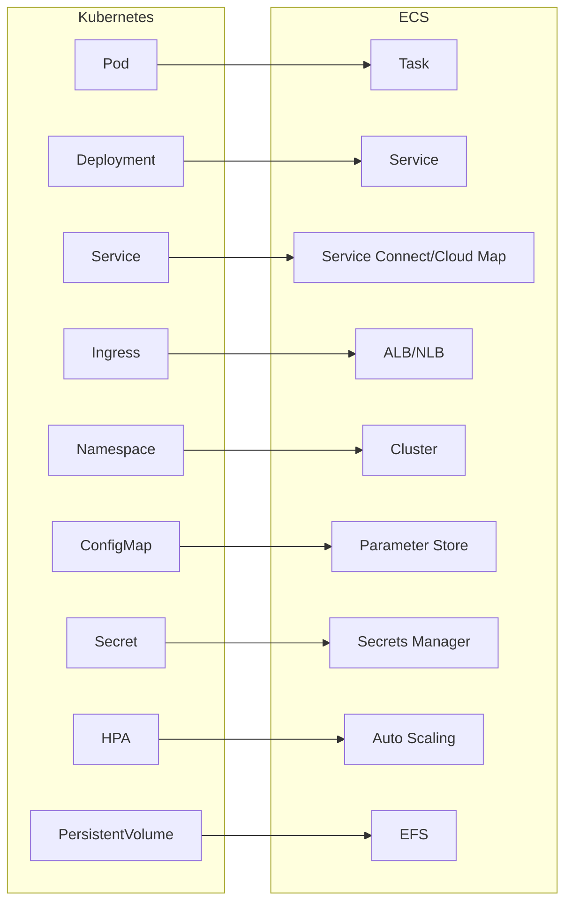

# How to Migrate from Kubernetes to ECS

Author: [nawazdhandala](https://github.com/nawazdhandala)

Tags: AWS, ECS, Kubernetes, Migration, Containers, DevOps

Description: Plan and execute a migration from Kubernetes to Amazon ECS including mapping K8s concepts to ECS equivalents and handling the transition

---

Kubernetes is powerful, but it comes with operational overhead that not every team needs. If you are running self-managed Kubernetes (or even EKS) and spending more time managing the platform than building your product, migrating to ECS can simplify your life significantly. ECS handles the orchestration layer for you, while giving you enough flexibility to run most containerized workloads.

This guide maps Kubernetes concepts to ECS equivalents and walks through a practical migration strategy.

## Why Migrate from Kubernetes to ECS?

Common reasons teams make this switch:

- **Reduced operational overhead**: No more managing control planes, etcd, node upgrades, or CRDs
- **Simpler mental model**: ECS has fewer concepts to learn and manage
- **Cost savings**: No control plane costs, and tight integration with AWS services reduces the need for additional tooling
- **Faster onboarding**: New team members can be productive with ECS much faster than with Kubernetes

The trade-off is that ECS is AWS-only. If multi-cloud portability is important to you, Kubernetes may still be the better choice.

## Concept Mapping: Kubernetes to ECS

Understanding how K8s concepts translate to ECS is the foundation of your migration.



| Kubernetes | ECS Equivalent | Notes |
|-----------|---------------|-------|
| Pod | Task | A group of co-located containers |
| Deployment | Service | Manages desired state and rolling updates |
| Service (ClusterIP) | Service Connect | Service-to-service communication |
| Service (LoadBalancer) | ALB/NLB | External traffic routing |
| Ingress | ALB Listener Rules | Path-based and host-based routing |
| Namespace | Cluster | Logical isolation boundary |
| ConfigMap | Parameter Store | Application configuration |
| Secret | Secrets Manager | Sensitive configuration |
| HPA | Application Auto Scaling | Scale based on metrics |
| PersistentVolume | EFS | Shared persistent storage |
| DaemonSet | Daemon scheduling strategy | One task per instance (EC2 only) |
| CronJob | Scheduled Tasks (EventBridge) | Scheduled container execution |
| Node | Container Instance / Fargate | Compute infrastructure |

## Migration Strategy

Do not try to migrate everything at once. Use a phased approach.

### Phase 1: Assessment and Planning

Inventory all your Kubernetes workloads.

```bash
# Export all deployments, services, and config from your K8s cluster
kubectl get deployments --all-namespaces -o yaml > k8s-deployments.yaml
kubectl get services --all-namespaces -o yaml > k8s-services.yaml
kubectl get configmaps --all-namespaces -o yaml > k8s-configmaps.yaml
kubectl get secrets --all-namespaces -o yaml > k8s-secrets.yaml
kubectl get hpa --all-namespaces -o yaml > k8s-hpa.yaml
kubectl get ingress --all-namespaces -o yaml > k8s-ingress.yaml
```

For each workload, document:
- Container images and resource requirements
- Environment variables and config sources
- Networking requirements (ports, protocols, service mesh)
- Storage requirements
- Scaling policies
- Dependencies on other services

### Phase 2: Translate Kubernetes Manifests to ECS

#### Converting a Deployment to an ECS Service

Here is a typical Kubernetes Deployment:

```yaml
# Kubernetes Deployment
apiVersion: apps/v1
kind: Deployment
metadata:
  name: web-api
  namespace: production
spec:
  replicas: 3
  strategy:
    type: RollingUpdate
    rollingUpdate:
      maxSurge: 1
      maxUnavailable: 0
  selector:
    matchLabels:
      app: web-api
  template:
    spec:
      containers:
      - name: api
        image: my-registry/web-api:v1.2.3
        ports:
        - containerPort: 8080
        resources:
          requests:
            cpu: 250m
            memory: 512Mi
          limits:
            cpu: 500m
            memory: 1Gi
        env:
        - name: DB_HOST
          valueFrom:
            configMapKeyRef:
              name: db-config
              key: host
        - name: DB_PASSWORD
          valueFrom:
            secretKeyRef:
              name: db-secret
              key: password
        livenessProbe:
          httpGet:
            path: /health
            port: 8080
          initialDelaySeconds: 30
          periodSeconds: 10
        readinessProbe:
          httpGet:
            path: /ready
            port: 8080
          initialDelaySeconds: 5
          periodSeconds: 5
```

The equivalent ECS task definition and service:

```json
{
  "family": "web-api",
  "networkMode": "awsvpc",
  "requiresCompatibilities": ["FARGATE"],
  "cpu": "512",
  "memory": "1024",
  "executionRoleArn": "arn:aws:iam::123456789:role/ecsTaskExecutionRole",
  "taskRoleArn": "arn:aws:iam::123456789:role/ecsTaskRole",
  "containerDefinitions": [
    {
      "name": "api",
      "image": "123456789.dkr.ecr.us-east-1.amazonaws.com/web-api:v1.2.3",
      "essential": true,
      "portMappings": [
        {
          "containerPort": 8080,
          "protocol": "tcp"
        }
      ],
      "secrets": [
        {
          "name": "DB_HOST",
          "valueFrom": "arn:aws:ssm:us-east-1:123456789:parameter/production/web-api/db_host"
        },
        {
          "name": "DB_PASSWORD",
          "valueFrom": "arn:aws:secretsmanager:us-east-1:123456789:secret:production/web-api/db-password"
        }
      ],
      "healthCheck": {
        "command": ["CMD-SHELL", "curl -f http://localhost:8080/health || exit 1"],
        "interval": 10,
        "timeout": 5,
        "retries": 3,
        "startPeriod": 30
      },
      "logConfiguration": {
        "logDriver": "awslogs",
        "options": {
          "awslogs-group": "/ecs/web-api",
          "awslogs-region": "us-east-1",
          "awslogs-stream-prefix": "api"
        }
      }
    }
  ]
}
```

```bash
# Create the ECS service
aws ecs create-service \
  --cluster production \
  --service-name web-api \
  --task-definition web-api:1 \
  --desired-count 3 \
  --launch-type FARGATE \
  --deployment-configuration "minimumHealthyPercent=100,maximumPercent=200" \
  --network-configuration "awsvpcConfiguration={subnets=[subnet-aaa,subnet-bbb],securityGroups=[sg-123]}" \
  --health-check-grace-period-seconds 30
```

#### Converting ConfigMaps to Parameter Store

```bash
# Extract ConfigMap values and store in Parameter Store
kubectl get configmap db-config -n production -o json | \
  jq -r '.data | to_entries[] | "\(.key) \(.value)"' | \
  while read key value; do
    aws ssm put-parameter \
      --name "/production/web-api/$key" \
      --type String \
      --value "$value"
  done
```

#### Converting Secrets to Secrets Manager

```bash
# Extract Kubernetes secrets and store in Secrets Manager
kubectl get secret db-secret -n production -o json | \
  jq -r '.data | to_entries[] | "\(.key) \(.value)"' | \
  while read key value; do
    DECODED=$(echo "$value" | base64 -d)
    aws secretsmanager create-secret \
      --name "production/web-api/$key" \
      --secret-string "$DECODED"
  done
```

#### Converting HPA to ECS Auto Scaling

```bash
# Register the ECS service as a scalable target
aws application-autoscaling register-scalable-target \
  --service-namespace ecs \
  --resource-id service/production/web-api \
  --scalable-dimension ecs:service:DesiredCount \
  --min-capacity 2 \
  --max-capacity 10

# Create a target tracking scaling policy (like K8s HPA)
aws application-autoscaling put-scaling-policy \
  --policy-name web-api-cpu-scaling \
  --service-namespace ecs \
  --resource-id service/production/web-api \
  --scalable-dimension ecs:service:DesiredCount \
  --policy-type TargetTrackingScaling \
  --target-tracking-scaling-policy-configuration '{
    "TargetValue": 70.0,
    "PredefinedMetricSpecification": {
      "PredefinedMetricType": "ECSServiceAverageCPUUtilization"
    },
    "ScaleInCooldown": 300,
    "ScaleOutCooldown": 60
  }'
```

### Phase 3: Service-to-Service Communication

Replace Kubernetes Services with ECS Service Connect or Cloud Map.

```bash
# Create a Cloud Map namespace (replaces K8s DNS-based service discovery)
aws servicediscovery create-private-dns-namespace \
  --name production.local \
  --vpc vpc-abc123
```

For more on ECS service discovery, see our guide on [ECS Service Discovery with Cloud Map](https://oneuptime.com/blog/post/ecs-service-discovery-cloud-map/view).

### Phase 4: Parallel Run and Cutover

Run both systems in parallel before cutting over.

1. Deploy the ECS version alongside the Kubernetes version
2. Route a small percentage of traffic to ECS (using weighted ALB target groups)
3. Monitor metrics, logs, and error rates
4. Gradually increase ECS traffic
5. Once confident, route 100% to ECS
6. Decommission Kubernetes resources

## Things That Do Not Map Directly

Some Kubernetes features do not have direct ECS equivalents:

- **Custom Resource Definitions (CRDs)**: No equivalent. Replace with native AWS services or custom tooling
- **Operators**: Replace with Lambda functions, Step Functions, or EventBridge rules
- **Network Policies**: Use VPC security groups and NACLs instead
- **Pod Disruption Budgets**: Use ECS deployment configuration (minimumHealthyPercent)
- **Service Mesh (Istio)**: Use AWS App Mesh or VPC Lattice
- **Helm Charts**: Use CDK, CloudFormation, or Copilot CLI

## Wrapping Up

Migrating from Kubernetes to ECS is primarily a concept-mapping exercise. Most Kubernetes resources have clear ECS equivalents, and the migration can be done incrementally, service by service. The biggest win is the reduction in operational overhead - no more cluster upgrades, etcd maintenance, or control plane debugging. Start with a non-critical service, prove the pattern, then migrate the rest.

For more on ECS fundamentals, see our guides on [creating your first ECS cluster](https://oneuptime.com/blog/post/first-ecs-cluster/view) and [ECS task definitions](https://oneuptime.com/blog/post/ecs-task-definition/view).
