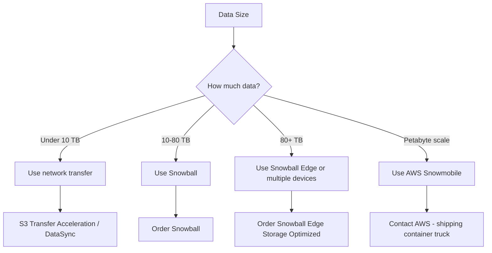

# How to Migrate Large Datasets to S3 with AWS Snowball

Author: [nawazdhandala](https://github.com/nawazdhandala)

Tags: AWS, Snowball, S3, Data Migration, Snowball Edge, Data Transfer

Description: Learn how to migrate large datasets to Amazon S3 using AWS Snowball and Snowball Edge for offline bulk data transfer when network transfer is impractical.

---

When you have tens or hundreds of terabytes of data to move to AWS, transferring it over the network becomes impractical. Even on a 1 Gbps dedicated connection, transferring 100 TB would take over 10 days of continuous transfer at full speed, and in practice it takes much longer. AWS Snowball solves this by shipping you a physical storage device. You load your data onto it, ship it back, and AWS uploads it to S3 for you.

This guide covers the entire Snowball workflow from ordering to verifying your data in S3.

## When to Use Snowball vs. Network Transfer

The general rule of thumb is straightforward:



- **Under 10 TB**: Network transfer with S3 Transfer Acceleration or AWS DataSync is usually faster when you factor in shipping time
- **10-80 TB**: Standard Snowball device
- **80 TB - 210 TB**: Snowball Edge Storage Optimized (up to 210 TB usable per device)
- **Multiple petabytes**: Multiple Snowball Edge devices or AWS Snowmobile (an actual shipping container)

## Ordering a Snowball Device

Create a job through the AWS Snow Family console or SDK:

```python
# Create a Snowball import job
import boto3

snowball = boto3.client('snowball')

response = snowball.create_job(
    JobType='IMPORT',
    Resources={
        'S3Resources': [
            {
                'BucketArn': 'arn:aws:s3:::my-data-migration-bucket',
                'KeyRange': {}  # All keys
            }
        ]
    },
    Description='Data center migration - file server data',
    AddressId='ADIXXXXXXXXX',  # Your shipping address ID
    RoleARN='arn:aws:iam::123456789:role/SnowballImportRole',
    SnowballType='STANDARD',  # or EDGE, EDGE_C, EDGE_CG
    ShippingOption='SECOND_DAY',  # SECOND_DAY, NEXT_DAY, EXPRESS
    Notification={
        'SnsTopicARN': 'arn:aws:sns:us-east-1:123456789:snowball-notifications',
        'JobStatesToNotify': [
            'New', 'PreparingAppliance', 'InTransitToCustomer',
            'WithCustomer', 'InTransitToAWS', 'WithAWSSortingFacility',
            'AtAWS', 'Complete'
        ]
    },
    SnowballCapacityPreference='T80'  # T50 or T80
)

job_id = response['JobId']
print(f"Snowball job created: {job_id}")
```

AWS prepares the device and ships it to you. This typically takes 3-5 business days.

## Receiving and Setting Up the Device

When the Snowball arrives, it comes pre-configured and ready to use. Connect it to your network with the provided cables.

### Step 1: Power On and Connect

Plug in the device and connect it to your network via the provided 10GbE or 25GbE cables. The device gets an IP address via DHCP, or you can configure a static IP through the E Ink display on the device.

### Step 2: Get Your Credentials

```python
# Get credentials for the Snowball device
import boto3

snowball = boto3.client('snowball')

# Get the manifest and unlock code
response = snowball.get_job_manifest(JobId=job_id)
manifest = response['ManifestURI']

response = snowball.get_job_unlock_code(JobId=job_id)
unlock_code = response['UnlockCode']

print(f"Manifest: {manifest}")
print(f"Unlock code: {unlock_code}")
```

### Step 3: Unlock the Device

Use the Snowball client to unlock:

```bash
# Download the Snowball client
# Then unlock the device
snowball start -i 192.168.1.100 -m /path/to/manifest -u UNLOCK_CODE

# Verify the device is ready
snowball status
```

## Transferring Data

### Using the Snowball Client

The Snowball client provides a simple interface for copying data:

```bash
# Copy a directory to the Snowball
snowball cp -r /data/file-server/ s3://my-data-migration-bucket/file-server/

# Copy with multiple threads for better performance
snowball cp -r --batch /data/file-server/ s3://my-data-migration-bucket/file-server/
```

### Using the S3 Adapter (Recommended for Large Transfers)

The S3 adapter lets you use standard S3 tools like the AWS CLI:

```bash
# Start the S3 adapter on the Snowball
snowball start -i 192.168.1.100 -m /path/to/manifest -u UNLOCK_CODE

# Use AWS CLI with the S3 adapter endpoint
aws s3 cp /data/file-server/ s3://my-data-migration-bucket/file-server/ \
  --recursive \
  --endpoint http://192.168.1.100:8080 \
  --profile snowball

# For better performance, use S3 sync with multiple threads
aws s3 sync /data/file-server/ s3://my-data-migration-bucket/file-server/ \
  --endpoint http://192.168.1.100:8080 \
  --profile snowball
```

Configure the Snowball profile in your AWS credentials:

```ini
# ~/.aws/credentials
[snowball]
aws_access_key_id = YOUR_SNOWBALL_ACCESS_KEY
aws_secret_access_key = YOUR_SNOWBALL_SECRET_KEY
```

## Optimizing Transfer Speed

To get the best transfer performance:

1. **Use multiple terminals**: Run several copy operations in parallel, targeting different source directories
2. **Batch small files**: Snowball performs better with larger files. If you have millions of small files, consider tarring them first
3. **Use 10GbE or faster**: The bottleneck is usually the network connection. Use the fastest interface available
4. **Minimize file operations**: Copy entire directories rather than individual files

```bash
# Tar small files before transfer for better performance
# This is crucial for directories with millions of small files
tar cf - /data/small-files/ | split -b 50G - /staging/archive-

# Then copy the tar chunks to Snowball
aws s3 cp /staging/ s3://my-data-migration-bucket/archives/ \
  --recursive \
  --endpoint http://192.168.1.100:8080 \
  --profile snowball
```

## Verifying Data Before Shipping

Before shipping the device back, verify your data was copied correctly:

```bash
# List the contents on the Snowball
aws s3 ls s3://my-data-migration-bucket/ \
  --recursive \
  --endpoint http://192.168.1.100:8080 \
  --profile snowball | wc -l

# Compare file counts
find /data/file-server/ -type f | wc -l
```

For critical data, compare checksums:

```python
# Verify data integrity with checksums
import hashlib
import os

def compute_checksum(filepath):
    sha256 = hashlib.sha256()
    with open(filepath, 'rb') as f:
        for chunk in iter(lambda: f.read(8192), b''):
            sha256.update(chunk)
    return sha256.hexdigest()

# Compare local checksums with manifest
source_dir = '/data/file-server/'
for root, dirs, files in os.walk(source_dir):
    for filename in files:
        filepath = os.path.join(root, filename)
        local_checksum = compute_checksum(filepath)
        # Store checksums for post-import validation
        print(f"{local_checksum}  {filepath}")
```

## Shipping the Device Back

When your transfer is complete:

```bash
# Stop the Snowball client
snowball stop
```

Power off the device and use the prepaid shipping label (it is on the E Ink display). Drop it off with your carrier. The device is tamper-evident and encrypted, so your data is secure in transit.

## Monitoring the Import

Track the job status as the device travels back to AWS and your data is imported:

```python
# Monitor Snowball job status
import boto3
import time

snowball = boto3.client('snowball')

while True:
    response = snowball.describe_job(JobId=job_id)
    job = response['JobMetadata']

    status = job['JobState']
    print(f"Job Status: {status}")

    if status == 'Complete':
        print("Data has been imported to S3!")
        break
    elif status == 'WithAWSSortingFacility':
        print("Device received at AWS, waiting for processing...")
    elif status == 'InTransitToAWS':
        print("Device is in transit to AWS...")

    time.sleep(3600)  # Check hourly
```

## Post-Import Validation

After import completes, validate your data in S3:

```python
# Validate imported data in S3
import boto3

s3 = boto3.client('s3')

# Count objects in the bucket
paginator = s3.get_paginator('list_objects_v2')
total_objects = 0
total_size = 0

for page in paginator.paginate(Bucket='my-data-migration-bucket', Prefix='file-server/'):
    for obj in page.get('Contents', []):
        total_objects += 1
        total_size += obj['Size']

print(f"Total objects: {total_objects}")
print(f"Total size: {total_size / (1024**4):.2f} TB")
```

## Using Multiple Devices for Larger Migrations

For datasets larger than a single device capacity, order multiple Snowball devices as a cluster:

```python
# Create a cluster job for larger migrations
snowball.create_cluster(
    JobType='IMPORT',
    Resources={
        'S3Resources': [
            {
                'BucketArn': 'arn:aws:s3:::my-large-migration-bucket'
            }
        ]
    },
    Description='Data center migration - full storage migration',
    AddressId='ADIXXXXXXXXX',
    RoleARN='arn:aws:iam::123456789:role/SnowballImportRole',
    SnowballType='EDGE',
    ShippingOption='SECOND_DAY'
)
```

## Cost Breakdown

Snowball pricing includes:
- **Service fee**: Per-device fee (varies by device type and region)
- **Shipping**: Included in the service fee for standard shipping
- **Extra days**: First 10 days on-site are included, after that it is a per-day charge
- **Data transfer into S3**: Free (as with all S3 ingress)

For a single Snowball 80TB device, expect around $300 for the service fee. Compare this to the cost of provisioning a Direct Connect or paying for months of saturated internet bandwidth.

For monitoring the data once it lands in S3, you can set up [OneUptime](https://oneuptime.com/blog/post/migrate-from-on-premises-to-aws-step-by-step/view) to track access patterns and storage costs from day one.

## Wrapping Up

AWS Snowball is the practical solution for moving large datasets when network transfer would take weeks or months. The process is straightforward: order a device, load your data, ship it back, and verify the import. The key to a smooth experience is proper preparation, especially verifying checksums, optimizing for your file size distribution, and planning enough time for the round trip. For most organizations doing a data center migration, Snowball is the fastest and most cost-effective way to move the bulk of your data to S3.
