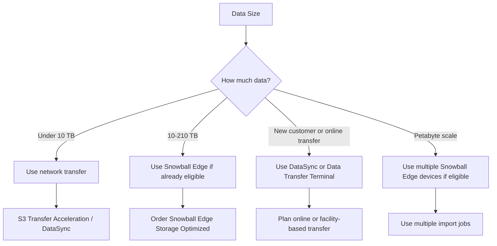

# How to Migrate Large Datasets to S3 with AWS Snowball

Author: [nawazdhandala](https://github.com/nawazdhandala)

Tags: AWS, Snowball, S3, Data Migration, Snowball Edge, Data Transfer

Description: Learn how to migrate large datasets to Amazon S3 using AWS Snowball and Snowball Edge for offline bulk data transfer when network transfer is impractical.

---

When you have tens or hundreds of terabytes of data to move to AWS, transferring it over the network becomes impractical. Even on a 1 Gbps dedicated connection, transferring 100 TB would take over 10 days of continuous transfer at full speed, and in practice it takes much longer. For existing AWS Snowball Edge customers, AWS Snowball solves this by shipping you a physical storage device. You load your data onto it, ship it back, and AWS uploads it to S3 for you.

AWS Snowball Edge is no longer available to new customers. New customers should evaluate AWS DataSync for online transfers, AWS Data Transfer Terminal for secure physical transfers, or AWS Partner solutions.

This guide covers the entire Snowball workflow from ordering to verifying your data in S3.

## When to Use Snowball vs. Network Transfer

The general rule of thumb is straightforward:


```mermaid
graph TD
    A[Data Size] --> B{How much data?}
    B -->|Under 10 TB| C[Use network transfer]
    B -->|10-210 TB| D[Use Snowball Edge if already eligible]
    B -->|New customer or online transfer| E[Use DataSync or Data Transfer Terminal]
    B -->|Petabyte scale| F[Use multiple Snowball Edge devices if eligible]
    C --> G[S3 Transfer Acceleration / DataSync]
    D --> H[Order Snowball Edge Storage Optimized]
    E --> I[Plan online or facility-based transfer]
    F --> J[Use multiple import jobs]
```

- **Under 10 TB**: Network transfer with S3 Transfer Acceleration or AWS DataSync is usually faster when you factor in shipping time
- **10-210 TB**: Snowball Edge Storage Optimized if your account is already eligible to order Snowball Edge
- **New customers or online transfers**: AWS DataSync, Direct Connect plus DataSync, AWS Data Transfer Terminal, or an AWS Partner solution
- **Multiple petabytes**: Multiple Snowball Edge import jobs if eligible

## Ordering a Snowball Device

Create a job through the AWS Snow Family console or SDK:

```python
# Create a Snowball import job

import boto3

snowball = boto3.client('snowball')

response = snowball.create_job(
    JobType='IMPORT',
    Resources={
        'S3Resources': [
            {
                'BucketArn': 'arn:aws:s3:::my-data-migration-bucket',
                'KeyRange': {}  # All keys
            }
        ]
    },
    Description='Data center migration - file server data',
    AddressId='ADID1234ab12-3eec-4eb3-9be6-9374c10eb51b',  # Your shipping address ID
    RoleARN='arn:aws:iam::123456789012:role/SnowballImportRole',
    SnowballType='V3_5S',  # Snowball Edge Storage Optimized 210TB
    ShippingOption='SECOND_DAY',  # SECOND_DAY, NEXT_DAY, EXPRESS
    Notification={
        'SnsTopicARN': 'arn:aws:sns:us-east-1:123456789012:snowball-notifications',
        'JobStatesToNotify': [
            'New', 'PreparingAppliance', 'InTransitToCustomer',
            'WithCustomer', 'InTransitToAWS', 'WithAWSSortingFacility',
            'WithAWS', 'Complete'
        ]
    },
    SnowballCapacityPreference='T240'
)

job_id = response['JobId']
print(f"Snowball job created: {job_id}")
```

AWS prepares the device and ships it to you. Provisioning can take up to 4 weeks, so include that lead time in your migration plan.

## Receiving and Setting Up the Device

When the Snowball arrives, it comes pre-configured and ready to use. Connect it to your network with a supported network cable.

### Step 1: Power On and Connect

Plug in the device and connect it to your network using a supported network interface, such as 10GbE RJ45, 25GbE SFP28, or 100GbE QSFP28 depending on the device configuration. The device gets an IP address via DHCP, or you can configure a static IP through the LCD display on the device.

### Step 2: Get Your Credentials

```python
# Get credentials for the Snowball device
import boto3

snowball = boto3.client('snowball')

# Get the manifest and unlock code
response = snowball.get_job_manifest(JobId=job_id)
manifest = response['ManifestURI']

response = snowball.get_job_unlock_code(JobId=job_id)
unlock_code = response['UnlockCode']

print(f"Manifest: {manifest}")
print(f"Unlock code: {unlock_code}")
```

### Step 3: Unlock the Device

Use the Snowball Edge Client to unlock:

```bash
# Download the Snowball client
# Then unlock the device
snowballEdge unlock-device \
  --endpoint https://192.168.1.100 \
  --manifest-file /path/to/manifest.bin \
  --unlock-code UNLOCK_CODE

# Verify the device is ready
snowballEdge describe-device \
  --endpoint https://192.168.1.100 \
  --manifest-file /path/to/manifest.bin \
  --unlock-code UNLOCK_CODE
```

## Transferring Data

### Using AWS OpsHub

AWS OpsHub provides a graphical interface for copying data to the device and validates transfers with checksums:

```bash
# Use AWS OpsHub for Snow Family to unlock the device and copy files
# from your local system to the S3 bucket configured on the device.
```

### Using the S3 Adapter (Recommended for Large Transfers)

The S3 adapter lets you use standard S3 tools like the AWS CLI:

```bash
# Unlock the Snowball Edge device first
snowballEdge unlock-device \
  --endpoint https://192.168.1.100 \
  --manifest-file /path/to/manifest.bin \
  --unlock-code UNLOCK_CODE

# Get local S3 credentials from the device
snowballEdge list-access-keys \
  --endpoint https://192.168.1.100 \
  --manifest-file /path/to/manifest.bin \
  --unlock-code UNLOCK_CODE

snowballEdge get-secret-access-key \
  --access-key-id YOUR_SNOWBALL_ACCESS_KEY \
  --endpoint https://192.168.1.100 \
  --manifest-file /path/to/manifest.bin \
  --unlock-code UNLOCK_CODE

# Use AWS CLI with the S3 adapter endpoint
aws s3 cp /data/file-server/ s3://my-data-migration-bucket/file-server/ \
  --recursive \
  --endpoint http://192.168.1.100:8080 \
  --region snow \
  --profile snowball

# For better performance, use S3 sync with multiple threads
aws s3 sync /data/file-server/ s3://my-data-migration-bucket/file-server/ \
  --endpoint http://192.168.1.100:8080 \
  --region snow \
  --profile snowball
```

Configure the Snowball profile in your AWS credentials:

```ini
# ~/.aws/credentials
[snowball]
aws_access_key_id = YOUR_SNOWBALL_ACCESS_KEY
aws_secret_access_key = YOUR_SNOWBALL_SECRET_KEY
```

## Optimizing Transfer Speed

To get the best transfer performance:

1. **Use multiple terminals**: Run several copy operations in parallel, targeting different source directories
2. **Batch small files**: Snowball performs better with larger files. If you have millions of small files, consider tarring them first
3. **Use 10GbE or faster**: The bottleneck is usually the network connection. Use the fastest interface available
4. **Minimize file operations**: Copy entire directories rather than individual files

```bash
# Tar small files before transfer for better performance
# This is crucial for directories with millions of small files
tar cf - /data/small-files/ | split -b 50G - /staging/archive-

# Then copy the tar chunks to Snowball
aws s3 cp /staging/ s3://my-data-migration-bucket/archives/ \
  --recursive \
  --endpoint http://192.168.1.100:8080 \
  --region snow \
  --profile snowball
```

## Verifying Data Before Shipping

Before shipping the device back, verify your data was copied correctly:

```bash
# List the contents on the Snowball
aws s3 ls s3://my-data-migration-bucket/ \
  --recursive \
  --endpoint http://192.168.1.100:8080 \
  --region snow \
  --profile snowball | wc -l

# Compare file counts
find /data/file-server/ -type f | wc -l
```

For critical data, compare checksums:

```python
# Verify data integrity with checksums
import hashlib
import os

def compute_checksum(filepath):
    sha256 = hashlib.sha256()
    with open(filepath, 'rb') as f:
        for chunk in iter(lambda: f.read(8192), b''):
            sha256.update(chunk)
    return sha256.hexdigest()

# Compare local checksums with manifest
source_dir = '/data/file-server/'
for root, dirs, files in os.walk(source_dir):
    for filename in files:
        filepath = os.path.join(root, filename)
        local_checksum = compute_checksum(filepath)
        # Store checksums for post-import validation
        print(f"{local_checksum}  {filepath}")
```

## Shipping the Device Back

When your transfer is complete, make sure all data transfer has stopped, then power off the device with AWS OpsHub or the power button above the LCD display.

After the device shuts down, use the prepaid shipping label (it is on the E Ink display) and drop it off with your carrier. The device is tamper-evident and encrypted, so your data is secure in transit.

## Monitoring the Import

Track the job status as the device travels back to AWS and your data is imported:

```python
# Monitor Snowball job status
import boto3
import time

snowball = boto3.client('snowball')

while True:
    response = snowball.describe_job(JobId=job_id)
    job = response['JobMetadata']

    status = job['JobState']
    print(f"Job Status: {status}")

    if status == 'Complete':
        print("Data has been imported to S3!")
        break
    elif status == 'WithAWSSortingFacility':
        print("Device received at AWS, waiting for processing...")
    elif status == 'InTransitToAWS':
        print("Device is in transit to AWS...")

    time.sleep(3600)  # Check hourly
```

## Post-Import Validation

After import completes, validate your data in S3:

```python
# Validate imported data in S3
import boto3

s3 = boto3.client('s3')

# Count objects in the bucket
paginator = s3.get_paginator('list_objects_v2')
total_objects = 0
total_size = 0

for page in paginator.paginate(Bucket='my-data-migration-bucket', Prefix='file-server/'):
    for obj in page.get('Contents', []):
        total_objects += 1
        total_size += obj['Size']

print(f"Total objects: {total_objects}")
print(f"Total size: {total_size / (1024**4):.2f} TB")
```

## Using Multiple Devices for Larger Migrations

For datasets larger than a single device capacity, order multiple import jobs. Cluster jobs are for local-use clusters, not S3 import jobs:

```python
# Create another import job for an additional device
snowball.create_job(
    JobType='IMPORT',
    Resources={
        'S3Resources': [
            {
                'BucketArn': 'arn:aws:s3:::my-large-migration-bucket'
            }
        ]
    },
    Description='Data center migration - full storage migration',
    AddressId='ADID1234ab12-3eec-4eb3-9be6-9374c10eb51b',
    RoleARN='arn:aws:iam::123456789012:role/SnowballImportRole',
    SnowballType='V3_5S',
    ShippingOption='SECOND_DAY',
    SnowballCapacityPreference='T240'
)
```

## Cost Breakdown

Snowball pricing includes:
- **Service fee**: Per-device fee (varies by device type and region)
- **Shipping**: Included in the service fee for standard shipping
- **Extra days**: Depending on device type and job configuration, the first 15 days on-site are included, after that it is a per-day charge
- **Data transfer into S3**: No data transfer fee for ingress, but standard S3 storage and request charges apply after import

Pricing varies by Region, device type, and pricing plan. Compare this to the cost of provisioning a Direct Connect or paying for months of saturated internet bandwidth.

For monitoring the data once it lands in S3, you can set up [OneUptime](https://oneuptime.com/blog/post/2026-02-12-migrate-from-on-premises-to-aws-step-by-step/view) to track access patterns and storage costs from day one.

## Wrapping Up

AWS Snowball is the practical solution for moving large datasets when network transfer would take weeks or months. The process is straightforward: order a device, load your data, ship it back, and verify the import. The key to a smooth experience is proper preparation, especially verifying checksums, optimizing for your file size distribution, and planning enough time for the round trip. For most organizations doing a data center migration, Snowball is the fastest and most cost-effective way to move the bulk of your data to S3.
