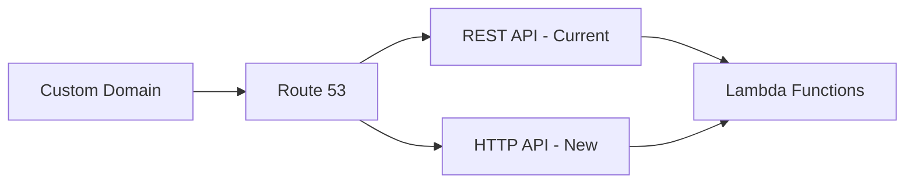

# How to Migrate from REST API to HTTP API on API Gateway

Author: [nawazdhandala](https://github.com/nawazdhandala)

Tags: AWS, API Gateway, Migration, Serverless

Description: A practical guide to migrating from API Gateway REST API to HTTP API, covering feature differences, migration steps, and what to watch out for.

---

API Gateway HTTP API launched as a faster, cheaper alternative to REST API. It costs up to 71% less, has lower latency, and supports most common use cases. But it's not a drop-in replacement - some REST API features are missing from HTTP API. Here's how to evaluate whether migration makes sense for your APIs and how to do it safely.

## Why Migrate?

The numbers make a compelling case:

| Feature | REST API | HTTP API |
|---------|----------|----------|
| Cost per million requests | $3.50 | $1.00 |
| Average latency overhead | 29ms | 10ms |
| Maximum integrations per API | 300 | 300 |
| WebSocket support | No | No |
| Native CORS support | No | Yes |
| Auto-deploy | No | Yes |

For a high-traffic API handling 100 million requests per month, switching from REST to HTTP saves $250/month in API Gateway costs alone. The latency improvement compounds across every request.

## Feature Comparison

Before migrating, check that HTTP API supports everything you need.

Features available in both:
- Lambda proxy integration
- HTTP proxy integration
- Custom domain names
- Stage variables
- Authorization (JWT, Lambda authorizers)
- CloudWatch logging
- Throttling
- VPC links

Features only in REST API (not in HTTP API):
- API keys and usage plans
- Request/response validation (models)
- Request/response transformation (mapping templates)
- Caching
- WAF integration
- Resource policies
- Client certificates (mTLS)
- Private API endpoints
- Mock integrations
- Canary deployments

If you rely heavily on any of those REST-only features, migration gets more complicated. You'd need to implement the missing functionality elsewhere (like validation in your Lambda function).

## Migration Strategy

Don't migrate by swapping the endpoint. Instead, run both APIs in parallel and shift traffic gradually.



Both APIs point to the same Lambda functions, so there's no backend change needed. You just shift DNS from one to the other.

## Step 1: Create the HTTP API

Create a new HTTP API that mirrors your REST API's routes.

Here's a script that reads your REST API configuration and creates equivalent HTTP API routes:

```python
import boto3
import json

apigw = boto3.client("apigateway")
apigwv2 = boto3.client("apigatewayv2")


def get_rest_api_config(api_id):
    """Extract the route configuration from a REST API."""
    resources = apigw.get_resources(restApiId=api_id, limit=500)
    routes = []

    for resource in resources["items"]:
        path = resource["path"]
        for method in resource.get("resourceMethods", {}).keys():
            if method == "OPTIONS":
                continue  # HTTP API handles OPTIONS automatically

            method_config = apigw.get_method(
                restApiId=api_id,
                resourceId=resource["id"],
                httpMethod=method,
            )
            integration = apigw.get_integration(
                restApiId=api_id,
                resourceId=resource["id"],
                httpMethod=method,
            )

            routes.append({
                "path": path,
                "method": method,
                "integration_uri": integration.get("uri", ""),
                "auth_type": method_config.get("authorizationType", "NONE"),
            })

    return routes


def create_http_api(name, routes):
    """Create an HTTP API with the given routes."""
    # Create the API
    api = apigwv2.create_api(
        Name=name,
        ProtocolType="HTTP",
        CorsConfiguration={
            "AllowOrigins": ["*"],
            "AllowMethods": ["GET", "POST", "PUT", "DELETE"],
            "AllowHeaders": ["Content-Type", "Authorization"],
            "MaxAge": 86400,
        },
    )
    api_id = api["ApiId"]

    # Create integrations and routes
    for route in routes:
        # Create Lambda integration
        integration = apigwv2.create_integration(
            ApiId=api_id,
            IntegrationType="AWS_PROXY",
            IntegrationUri=route["integration_uri"],
            PayloadFormatVersion="2.0",
        )

        # Create the route
        route_key = f"{route['method']} {route['path']}"
        apigwv2.create_route(
            ApiId=api_id,
            RouteKey=route_key,
            Target=f"integrations/{integration['IntegrationId']}",
        )

    # Create the default stage with auto-deploy
    apigwv2.create_stage(
        ApiId=api_id,
        StageName="$default",
        AutoDeploy=True,
    )

    return api_id


# Migrate
routes = get_rest_api_config("rest-api-id")
http_api_id = create_http_api("my-api-v2", routes)
print(f"Created HTTP API: {http_api_id}")
```

## Step 2: Handle Payload Format Differences

HTTP API supports two payload formats. Version 2.0 (default) is different from what REST API sends.

Key differences in the event your Lambda receives:

```python
# REST API event (v1.0 format)
rest_event = {
    "resource": "/users/{id}",
    "path": "/users/123",
    "httpMethod": "GET",
    "headers": {"Authorization": "Bearer token"},
    "queryStringParameters": {"status": "active"},
    "pathParameters": {"id": "123"},
    "requestContext": {
        "authorizer": {"claims": {"sub": "user123"}},
    },
    "body": None,
    "isBase64Encoded": False,
}

# HTTP API event (v2.0 format)
http_event = {
    "version": "2.0",
    "routeKey": "GET /users/{id}",
    "rawPath": "/users/123",
    "requestContext": {
        "http": {
            "method": "GET",
            "path": "/users/123",
        },
        "authorizer": {"jwt": {"claims": {"sub": "user123"}}},
    },
    "headers": {"authorization": "Bearer token"},  # lowercase!
    "queryStringParameters": {"status": "active"},
    "pathParameters": {"id": "123"},
    "body": None,
    "isBase64Encoded": False,
}
```

To avoid changing your Lambda functions, set the HTTP API integration to use payload format version 1.0:

```bash
# Use v1.0 payload format for backwards compatibility
aws apigatewayv2 create-integration \
  --api-id httpapi123 \
  --integration-type AWS_PROXY \
  --integration-uri "arn:aws:apigateway:us-east-1:lambda:path/2015-03-31/functions/arn:aws:lambda:us-east-1:123456789012:function:my-function/invocations" \
  --payload-format-version "1.0"
```

Or write a wrapper that handles both formats:

```python
def lambda_handler(event, context):
    # Detect payload format
    if event.get("version") == "2.0":
        # HTTP API v2.0 format
        method = event["requestContext"]["http"]["method"]
        path = event["rawPath"]
        headers = event.get("headers", {})
        # Note: headers are lowercase in v2.0
        auth_header = headers.get("authorization", "")
    else:
        # REST API v1.0 format
        method = event["httpMethod"]
        path = event["path"]
        headers = event.get("headers", {})
        auth_header = headers.get("Authorization", "")

    # Rest of your logic works the same
    return process_request(method, path, auth_header)
```

## Step 3: Migrate Authorization

If you use Cognito authorizers on REST API, switch to JWT authorizers on HTTP API.

REST API Cognito authorizer equivalent in HTTP API:

```bash
# Create a JWT authorizer (replaces Cognito authorizer)
aws apigatewayv2 create-authorizer \
  --api-id httpapi123 \
  --name "CognitoJWT" \
  --authorizer-type JWT \
  --identity-source '$request.header.Authorization' \
  --jwt-configuration '{
    "Audience": ["your-app-client-id"],
    "Issuer": "https://cognito-idp.us-east-1.amazonaws.com/us-east-1_ABC123"
  }'

# Attach to a route
aws apigatewayv2 update-route \
  --api-id httpapi123 \
  --route-id route456 \
  --authorization-type JWT \
  --authorizer-id auth789
```

For Lambda authorizers, the format changes slightly:

```python
# Lambda authorizer response for HTTP API
def lambda_handler(event, context):
    token = event["headers"].get("authorization", "")

    if verify_token(token):
        return {
            "isAuthorized": True,  # Simple format for HTTP API
            "context": {
                "user_id": "123",
                "role": "admin",
            },
        }

    return {"isAuthorized": False}
```

## Step 4: Set Up Custom Domain

Point your custom domain to the new HTTP API.

Add the HTTP API to your existing custom domain:

```bash
# Create API mapping for HTTP API on the same domain
aws apigatewayv2 create-api-mapping \
  --domain-name "api.yourcompany.com" \
  --api-id httpapi123 \
  --stage '$default' \
  --api-mapping-key "v2"  # Accessible at api.yourcompany.com/v2
```

## Step 5: Gradual Traffic Shift

Use Route 53 weighted routing to shift traffic gradually:

```bash
# REST API gets 90% of traffic initially
aws route53 change-resource-record-sets \
  --hosted-zone-id Z123456 \
  --change-batch '{
    "Changes": [{
      "Action": "UPSERT",
      "ResourceRecordSet": {
        "Name": "api.yourcompany.com",
        "Type": "A",
        "SetIdentifier": "rest-api",
        "Weight": 90,
        "AliasTarget": {
          "DNSName": "d-rest123.execute-api.us-east-1.amazonaws.com",
          "HostedZoneId": "Z1UJRXOUMOOFQ8",
          "EvaluateTargetHealth": true
        }
      }
    }]
  }'

# HTTP API gets 10% of traffic
aws route53 change-resource-record-sets \
  --hosted-zone-id Z123456 \
  --change-batch '{
    "Changes": [{
      "Action": "UPSERT",
      "ResourceRecordSet": {
        "Name": "api.yourcompany.com",
        "Type": "A",
        "SetIdentifier": "http-api",
        "Weight": 10,
        "AliasTarget": {
          "DNSName": "d-http456.execute-api.us-east-1.amazonaws.com",
          "HostedZoneId": "Z1UJRXOUMOOFQ8",
          "EvaluateTargetHealth": true
        }
      }
    }]
  }'
```

Monitor error rates and latency on both APIs. Gradually increase the HTTP API weight from 10% to 25%, 50%, 75%, and finally 100%.

## CloudFormation for HTTP API

```yaml
Resources:
  HttpApi:
    Type: AWS::ApiGatewayV2::Api
    Properties:
      Name: my-http-api
      ProtocolType: HTTP
      CorsConfiguration:
        AllowOrigins:
          - "https://app.example.com"
        AllowMethods:
          - GET
          - POST
          - PUT
          - DELETE
        AllowHeaders:
          - Content-Type
          - Authorization
        MaxAge: 86400

  DefaultStage:
    Type: AWS::ApiGatewayV2::Stage
    Properties:
      ApiId: !Ref HttpApi
      StageName: $default
      AutoDeploy: true

  LambdaIntegration:
    Type: AWS::ApiGatewayV2::Integration
    Properties:
      ApiId: !Ref HttpApi
      IntegrationType: AWS_PROXY
      IntegrationUri: !GetAtt MyFunction.Arn
      PayloadFormatVersion: "1.0"  # Use 1.0 for REST API compatibility

  GetUsersRoute:
    Type: AWS::ApiGatewayV2::Route
    Properties:
      ApiId: !Ref HttpApi
      RouteKey: "GET /users"
      Target: !Sub "integrations/${LambdaIntegration}"
```

For monitoring during your migration and comparing performance between REST and HTTP API, see our post on [API monitoring best practices](https://oneuptime.com/blog/post/2026-01-26-restful-api-best-practices/view).

## Wrapping Up

Migrating from REST API to HTTP API saves money and reduces latency. The key is understanding which features you'll lose and whether that matters for your use case. If you need API keys, WAF, request validation, or caching at the gateway level, stick with REST API. For straightforward Lambda proxy APIs with JWT auth and CORS, HTTP API is the better choice. Always run both in parallel during migration and use weighted routing to shift traffic gradually.
