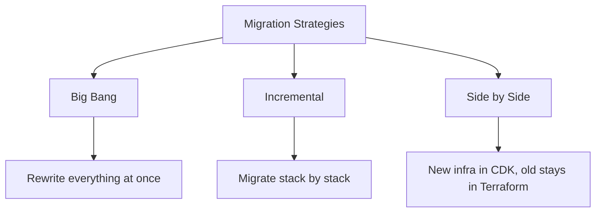

# How to Migrate from Terraform to CDK

Author: [nawazdhandala](https://github.com/nawazdhandala)

Tags: AWS, CDK, Terraform, Migration

Description: A practical guide to migrating your infrastructure from Terraform to AWS CDK, covering import strategies, state management, and incremental migration patterns.

---

Migrating from Terraform to CDK is a decision that usually comes from wanting tighter AWS integration, the ability to use real programming languages, or reducing the cognitive overhead of managing two toolchains. Whatever your reason, the migration doesn't have to be a big-bang rewrite. You can move incrementally, stack by stack, and keep Terraform managing some resources while CDK takes over others.

Let's go through the strategies, tools, and patterns for making this migration smooth.

## Why Teams Migrate

Before diving into the how, it's worth understanding the common motivations:

**Type safety and IDE support**. Terraform's HCL is declarative but lacks the type checking and autocomplete that TypeScript provides. Catching errors at compile time instead of plan time saves real time.

**Abstraction with real code**. CDK constructs are objects with methods, inheritance, and composition. Building reusable infrastructure patterns in CDK is more natural than Terraform modules.

**AWS-native integration**. CDK generates CloudFormation, which has deep integration with AWS services. Features like cross-stack references and CloudFormation hooks work seamlessly.

**Testing**. Unit testing CDK stacks uses the same frameworks your application uses. Testing Terraform requires specialized tools like Terratest.

## The Migration Approaches

There are three main strategies:



**Big Bang**: Rewrite all Terraform to CDK, import existing resources, tear down Terraform state. Risky but clean.

**Incremental**: Migrate one logical group at a time. Move the VPC first, then databases, then compute. Resources transition from Terraform to CDK management gradually.

**Side by Side**: Keep existing infrastructure in Terraform, build all new infrastructure in CDK. Over time, the Terraform-managed portion shrinks naturally.

Most teams go with incremental or side-by-side. Let's focus on those.

## Step 1: Audit Your Terraform State

Before migrating anything, understand what you're working with:

```bash
# List all resources in Terraform state
terraform state list

# Export the state for reference
terraform state pull > terraform-state-backup.json

# Show details of a specific resource
terraform state show aws_vpc.main
```

Create a spreadsheet or document mapping Terraform resources to their CDK equivalents. This becomes your migration checklist.

## Step 2: CDK Import for Existing Resources

CDK can import existing AWS resources into a CloudFormation stack. This is the key mechanism for migration.

First, write the CDK code that describes your existing resources:

```typescript
// lib/vpc-stack.ts - CDK code matching existing Terraform VPC
import * as cdk from 'aws-cdk-lib';
import * as ec2 from 'aws-cdk-lib/aws-ec2';
import { Construct } from 'constructs';

export class VpcStack extends cdk.Stack {
  public readonly vpc: ec2.Vpc;

  constructor(scope: Construct, id: string, props?: cdk.StackProps) {
    super(scope, id, props);

    // This must match the existing VPC configuration exactly
    this.vpc = new ec2.Vpc(this, 'MainVpc', {
      vpcName: 'production-vpc',
      maxAzs: 3,
      ipAddresses: ec2.IpAddresses.cidr('10.0.0.0/16'),
      natGateways: 2,
      subnetConfiguration: [
        {
          name: 'Public',
          subnetType: ec2.SubnetType.PUBLIC,
          cidrMask: 24,
        },
        {
          name: 'Private',
          subnetType: ec2.SubnetType.PRIVATE_WITH_EGRESS,
          cidrMask: 22,
        },
        {
          name: 'Isolated',
          subnetType: ec2.SubnetType.PRIVATE_ISOLATED,
          cidrMask: 24,
        },
      ],
    });
  }
}
```

Then use CDK import:

```bash
# Import existing resources into the CDK stack
cdk import VpcStack
```

CDK will prompt you for the physical resource IDs of each resource it needs to import. You'll need the VPC ID, subnet IDs, route table IDs, and so on.

## Step 3: Using cdktf as a Bridge

If you want to take a more gradual approach, CDKTF (CDK for Terraform) lets you write CDK code that generates Terraform configs instead of CloudFormation. This can be an intermediate step:

```typescript
// Using CDKTF as an intermediate step
import { App, TerraformStack } from 'cdktf';
import { AwsProvider } from '@cdktf/provider-aws/lib/provider';
import { Vpc } from '@cdktf/provider-aws/lib/vpc';

class MyStack extends TerraformStack {
  constructor(scope: App, id: string) {
    super(scope, id);

    new AwsProvider(this, 'aws', { region: 'us-east-1' });

    new Vpc(this, 'main', {
      cidrBlock: '10.0.0.0/16',
      enableDnsHostnames: true,
      tags: { Name: 'production-vpc' },
    });
  }
}
```

This lets your team learn CDK patterns while still using Terraform's state management.

## Step 4: Reference Terraform Outputs from CDK

During migration, CDK stacks may need to reference resources still managed by Terraform. Use SSM Parameter Store as a bridge:

In Terraform, export values to SSM:

```hcl
# Terraform: Export VPC ID to SSM for CDK to consume
resource "aws_ssm_parameter" "vpc_id" {
  name  = "/terraform/vpc/id"
  type  = "String"
  value = aws_vpc.main.id
}

resource "aws_ssm_parameter" "private_subnets" {
  name  = "/terraform/vpc/private-subnets"
  type  = "StringList"
  value = join(",", aws_subnet.private[*].id)
}
```

In CDK, read those values:

```typescript
// CDK: Import Terraform-managed resources via SSM
import * as ssm from 'aws-cdk-lib/aws-ssm';

const vpcId = ssm.StringParameter.valueFromLookup(
  this, '/terraform/vpc/id'
);

const vpc = ec2.Vpc.fromLookup(this, 'ImportedVpc', {
  vpcId: vpcId,
});
```

## Step 5: Remove Resources from Terraform State

After successfully importing resources into CDK, remove them from Terraform state so Terraform doesn't try to manage them:

```bash
# Remove the VPC from Terraform state (does NOT delete the actual resource)
terraform state rm aws_vpc.main
terraform state rm aws_subnet.public[0]
terraform state rm aws_subnet.public[1]
terraform state rm aws_subnet.private[0]
terraform state rm aws_subnet.private[1]
```

This is the most nerve-wracking part. Always back up your Terraform state before removing resources.

## Converting HCL to CDK Patterns

Here's a quick reference for common Terraform to CDK conversions:

```hcl
# Terraform: S3 bucket
resource "aws_s3_bucket" "data" {
  bucket = "my-data-bucket"

  server_side_encryption_configuration {
    rule {
      apply_server_side_encryption_by_default {
        sse_algorithm = "AES256"
      }
    }
  }

  versioning {
    enabled = true
  }

  lifecycle_rule {
    enabled = true
    transition {
      days          = 90
      storage_class = "STANDARD_IA"
    }
  }
}
```

The equivalent CDK:

```typescript
// CDK equivalent of the Terraform S3 bucket
const dataBucket = new s3.Bucket(this, 'DataBucket', {
  bucketName: 'my-data-bucket',
  encryption: s3.BucketEncryption.S3_MANAGED,
  versioned: true,
  lifecycleRules: [
    {
      transitions: [
        {
          storageClass: s3.StorageClass.INFREQUENT_ACCESS,
          transitionAfter: cdk.Duration.days(90),
        },
      ],
    },
  ],
});
```

## Handling Terraform Modules

Terraform modules map roughly to CDK constructs. If you have a Terraform module for an ECS service, you'd create a CDK construct:

```typescript
// CDK construct replacing a Terraform module
import { Construct } from 'constructs';
import * as ecs from 'aws-cdk-lib/aws-ecs';
import * as ec2 from 'aws-cdk-lib/aws-ec2';

export interface MicroserviceProps {
  cluster: ecs.ICluster;
  image: string;
  cpu: number;
  memory: number;
  port: number;
  desiredCount: number;
}

export class Microservice extends Construct {
  public readonly service: ecs.FargateService;

  constructor(scope: Construct, id: string, props: MicroserviceProps) {
    super(scope, id);

    const taskDefinition = new ecs.FargateTaskDefinition(this, 'TaskDef', {
      cpu: props.cpu,
      memoryLimitMiB: props.memory,
    });

    taskDefinition.addContainer('Container', {
      image: ecs.ContainerImage.fromRegistry(props.image),
      portMappings: [{ containerPort: props.port }],
      logging: ecs.LogDrivers.awsLogs({ streamPrefix: id }),
    });

    this.service = new ecs.FargateService(this, 'Service', {
      cluster: props.cluster,
      taskDefinition: taskDefinition,
      desiredCount: props.desiredCount,
    });
  }
}
```

## Common Pitfalls

**Don't change logical IDs**. CDK generates CloudFormation logical IDs from construct paths. If you refactor your construct tree, resources get replaced instead of updated.

**Watch for drift**. If Terraform applies changes to a resource after CDK has imported it, you've got conflicting state management. Remove from Terraform state before CDK deploys.

**Test the import in a staging environment first**. Practice the import process on a non-production copy of your infrastructure before touching production.

For getting up to speed with CDK best practices, check out [CDK with Projen for project management](https://oneuptime.com/blog/post/2026-02-12-cdk-projen-project-management/view). If you're building reusable patterns during migration, see [sharing CDK constructs across projects](https://oneuptime.com/blog/post/2026-02-12-share-cdk-constructs-across-projects/view).

## Wrapping Up

Migrating from Terraform to CDK doesn't have to be all-or-nothing. Start with the side-by-side approach for new infrastructure, then incrementally import existing resources as you rebuild stacks. Use SSM Parameter Store to bridge between Terraform-managed and CDK-managed resources during the transition. The key is to always back up your Terraform state, test imports in non-production environments first, and never have both tools managing the same resource simultaneously.
